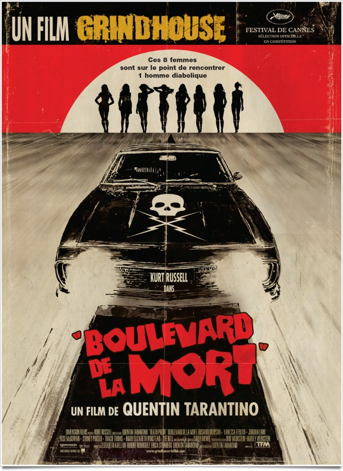
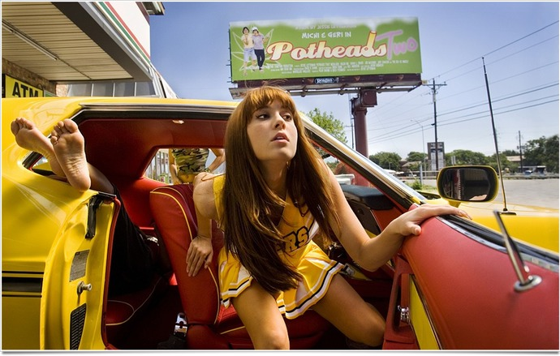
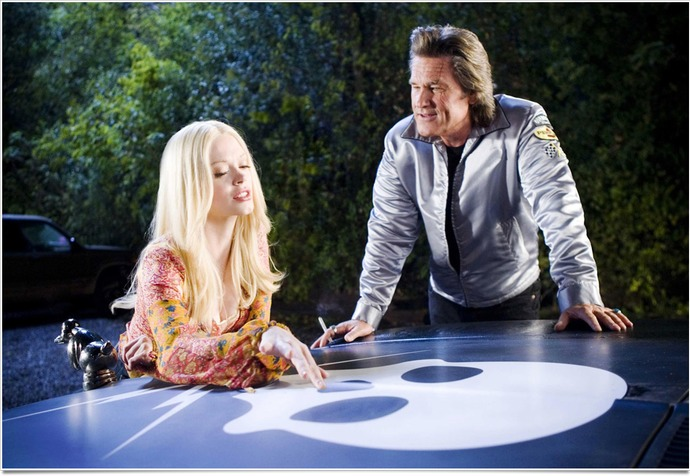

+++
type = "post"
titre = "<em>Boulevard de la Mort</em>, Quentin Tarantino"
title = "Boulevard de la Mort, Quentin Tarantino"
url = "/boulevard-de-la-mort-tarantino"
date = "2011-06-26T19:40:17"
Lastmod = "2014-02-18T14:34:24"
cover = "tarantino-death-proof.jpg"
categorie = [ "À voir" ]
tag = [ "Action", "Course", "Grindhouse", "Humour", "Thriller" ]
createur = [ "Quentin Tarantino" ]
acteur = [ "Kurt Russel", "Rosario Dawson", "Sydney Tamiia Poitier", "Zoe Bell" ]
annee = [ "2007" ]
weight = 2007
pays = [ "États-Unis" ]
original = "Grindhouse: Death Proof"

+++

Film boudé par le public comme par une partie de la critique à sa sortie, <em>Boulevard de la mort</em> est un hommage complet aux &laquo;&nbsp;<a href="http://fr.wikipedia.org/wiki/Film_d%27exploitation" target="_blank">films d&rsquo;exploitation</a>&nbsp;&raquo; qui ont fait florès aux États-Unis. Des films de série B produits à bas prix qui étaient projetés par paquets de deux ou trois dans les Grindhouse, cinémas de quartier spécialisés dans les films d&rsquo;exploitation. Quentin Tarantino est un cinéaste de l&rsquo;hommage et il est fasciné par ce cinéma au point de lui faire un homme en bonne et due forme. Aux États-Unis, <em>Boulevard de la mort</em> est sorti en deuxième partie d&rsquo;un film réalisé par Robert Rodriguez. En Europe, le film de Tarantino est sorti seul en salles, en version longue. Version longue et bavarde : si tous les films du cinéaste sont bavards, <em>Boulevard de la mort</em> est sans doute celui qui met le plus en avant les dialogues, sans autre justification que le plaisir du dialogue. L&rsquo;intérêt du film est là, dans les dialogues, et ils sont réjouissants.

« <em>Ces huit femmes sont sur le point de rencontrer un homme diabolique</em> » : l&rsquo;affiche résume en ces quelques mots l&rsquo;histoire complète de <em>Boulevard de la mort</em>. Le scénario du film tient en effet à peu de choses : on suit les pas de Stuntman Mike, cascadeur qui a connu son heure de gloire quand les films d&rsquo;action n&rsquo;utilisaient pas encore les effets numériques et détruisaient encore de vraies voitures. Stuntman Mike va rencontrer successivement quatre groupes de filles sur la route et il va tenter à chaque fois de provoquer l&rsquo;accident. <em>Boulevard de la mort</em> est un thriller sur un psychopathe tueur en série, sauf que ce tueur utilise sa voiture en guise d&rsquo;arme. Sa voiture est renforcée pour les casques, elle est indestructible (le &laquo;&nbsp;<em>death proof</em>&nbsp;&raquo; du titre original) et permet de survivre même aux chocs les plus terribles. Précisément au milieu du film, il rentre ainsi dans la voiture des quatre premières filles à plus de 300 km/h. Le choc ne laisse aucune survivante, mais il s&rsquo;en sort avec quelques blessures légères. Quatorze mois plus tard, ailleurs aux États-Unis, il tombe sur quatre autres ravissantes jeunes filles et décide de remettre ça. Sauf que cette fois, tout ne se passe pas comme prévu…

Des meurtres en série, des courses-poursuites folles… mais <em>Boulevard de la mort</em> est plus que cela. Quentin Tarantino a toujours fait des films bavards, des films où un dialogue peut constituer le point de tension le plus élevé, où le dialogue est un duel ou bien au contraire se laisser à écouter des échanges rapides. Pour son septième film, il libère son talent de scénariste et il écrit des dialogues époustouflants de vérité pour les deux quatuors de filles. Le plaisir qu&rsquo;il a eu à les écrire et à les filmer est contagieux : <em>Boulevard de la mort</em> plait d&rsquo;abord pour ses dialogues, souvent drôles, entre des femmes qui ne sont pas toujours tendres entre elles. Les actrices ont sans doute pu composer en partie librement leurs lignes de dialogues, mais elles sont toutes criantes de vérité. Ils n&rsquo;ont pas vraiment d&rsquo;objectifs et sont là pour eux-mêmes : ils ne font jamais avancer l&rsquo;action qui stagne dans chaque partie avant de rendre brusquement le dessus. Ils permettent au spectateur d&rsquo;entrer dans le quotidien des jeunes femmes, les entendre parler des hommes, raconter leurs aventures amoureuses ou sexuelles, se moquer les unes les autres, rire, etc. Des dialogues jouissifs qui n&rsquo;ont pas d&rsquo;autres raisons d&rsquo;être, en somme…

Dans les deux parties de son film, Quentin Tarantino suit le même schéma narratif : des dialogues, puis de l&rsquo;action. Si <em>Boulevard de la mort</em> est un film bavard, il sait aussi faire la part belle à deux scènes d&rsquo;action aussi impressionnantes l&rsquo;une que l&rsquo;autre, mais pas pour les mêmes raisons. C&rsquo;est que les deux parties ne sont pas équilibrées : la première se consacre essentiellement aux jeunes femmes pour se terminer brusquement avec un accident mortel ; la seconde laisse moins de temps aux dialogues, mais étend une course-poursuite très réussie. Dans les deux cas, Stuntman Mike provoque l&rsquo;action en poursuivant les jeunes femmes dans sa voiture capable de résister face à la mort. La première fois, il ne poursuit pas la voiture, mais fonce sur elle à toute allure. Il n&rsquo;y a pas de survivants et Quentin Tarantino s&rsquo;amuse à nous montrer la scène autant de fois que nécessaire pour que l&rsquo;on ne perde absolument rien des démembrements et autres corps éjectés du véhicule par l&rsquo;impact. La deuxième fois, le même Stuntman Mike poursuit la voiture avec trois filles à bord, dont une, cascadeuse, sur le capot. Il essaie de les faire sortir de route, mais quand il croit sa victoire complète, il se fait avoir par un pistolet. Alors que l&rsquo;on pensait le film terminé, la course reprend de plus belle, mais cette fois à l&rsquo;avantage de la gent féminine.

Quentin Tarantino a poussé l&rsquo;hommage très loin, bien plus loin que le concept de son film ou que son scénario, c&rsquo;est la forme elle-même qui s&rsquo;inspire des films de série B des années 1970. <em>Boulevard de la mort</em> date de 2007, mais son réalisateur met tous les moyens modernes en œuvre pour le vieillir. Plusieurs effets dans le film : la pellicule un peu abimée est rendue grâce à une image dégradée, l&rsquo;image passe aussi en noir et blanc sans raison au cours du film… L&rsquo;hommage ne s&rsquo;arrête pas à la dégradation de l&rsquo;image, effet qui peut paraître un peu puéril : plusieurs transitions exploitent ce filon en faisant comme si la bobine était coupée et qu&rsquo;il manquait un morceau. Cette astuce permet à Tarantino de justifier plusieurs ellipses et plonge son film dans une ambiance particulière, renforcée par le choix assumé de l&rsquo;hommage au <em>Grindhouse</em>. <em>Boulevard de la mort</em> commence ainsi avec un panneau indiquant qu&rsquo;il s&rsquo;agit du film principal de la soirée et tout est fait pour nous envoyer quarante ans en arrière, à l&rsquo;image des génériques très typés années 1970. Derrière l&rsquo;hommage appuyé et assumé au cinéma d&rsquo;exploitation américain, Quentin Tarantino utilise <em>Boulevard de la mort</em> pour quelques essais, comme dans tous ses films. La séquence en noir et blanc n&rsquo;est pas qu&rsquo;un artifice visant à nous faire croire que la pellicule est vieille, c&rsquo;est aussi l&rsquo;occasion de plans fixes qui sont par ailleurs plutôt rares dans le film. Les dialogues sont ainsi en général filmés avec une caméra très mobile qui peut tourner autour des protagonistes, ou se poser sur l&rsquo;un puis sur l&rsquo;autre. Parlons-en, des protagonistes : la brochette de filles rassemblée par Tarantino est haute en couleur et apporte beaucoup à <em>Boulevard de la mort</em> par leur fraicheur et leur sincérité. Kurt Russel, seul homme du film, brille aussi par sa noirceur assez terrifiante.

<em>Boulevard de la mort</em> n&rsquo;est sans doute pas le meilleur film de Quentin Tarantino, mais c&rsquo;est loin d&rsquo;être un mauvais film. Seule condition toutefois, accepter qu&rsquo;un long-métrage soit surtout intéressant pour des dialogues dont la gratuité n&rsquo;égale que la sincérité. <em>Boulevard de la mort</em> est un film gratuit qui ne dépasse pas nécessairement son statut d&rsquo;hommage, mais est-ce, après tout, un problème ? Le film est réjouissant et ce n&rsquo;est déjà pas mal…

<h3>Vous voulez m&rsquo;aider ?<a href="#footnote_0_4929" id="identifier_0_4929" class="footnote-link footnote-identifier-link" title="&Agrave; propos de la publicit&eacute;&hellip;">1</a></h3>
<ul>
<li><a href="http://www.amazon.fr/gp/product/B002QBWSH4/ref=as_li_ss_tl?ie=UTF8&tag=leblogdenic07-21&linkCode=as2&camp=1642&creative=19458&creativeASIN=B002QBWSH4">Acheter le film en Blu-Ray sur Amazon</a></li>
<li><a href="http://www.amazon.fr/gp/product/B001B84SI0/ref=as_li_ss_tl?ie=UTF8&tag=leblogdenic07-21&linkCode=as2&camp=1642&creative=19458&creativeASIN=B001B84SI0">Acheter le film en DVD sur Amazon</a></li>
</ul>

<ol class="footnotes"><li id="footnote_0_4929" class="footnote"><a href="/a-propos/publicite/">À propos de la publicité…</a> [<a href="#identifier_0_4929" class="footnote-link footnote-back-link">&#8617;</a>]</li></ol>
