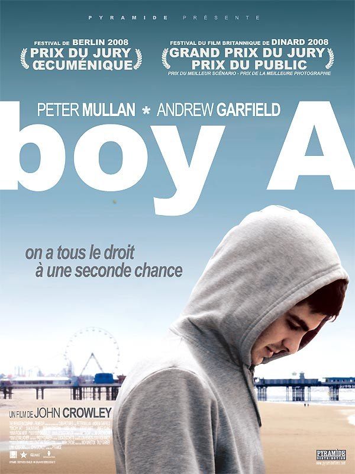

+++
type = "post"
titre = "Boy A : un droit à la seconde chance ?"
title = "Boy A : un droit à la seconde chance ?"
url = "/boy-a"
date = "2009-03-14T22:43:16"
Lastmod = "2012-04-12T13:58:18"
cover = "boy-a1.jpg"
categorie = [ "À voir" ]
tag = [ "Drame", "Prison", "Société" ]
createur = [ "John Crowley" ]
acteur = [ "Andrew Garfield", "Peter Mullan" ]
annee = [ "2009" ]
weight = 2009

+++

<em>Boy A</em> n&rsquo;est, certes, pas un très grand film, c&rsquo;est un film qui a des défauts agaçants parfois, mais qui, dans l&rsquo;ensemble, vaut la peine d&rsquo;être vu.

Ce film réalisé par John Crowley narre l&rsquo;histoire d&rsquo;un garçon emprisonné pour un crime odieux et qui sort de prison à 24 ans, après avoir passé toute son adolescence derrière les barreaux. Protégé par un tuteur, on lui offre une seconde chance : un nouveau nom et une nouvelle histoire pour que Eric, meurtrier haï par l&rsquo;Angleterre entière puisse devenir Jack Burridge, jeune homme tout à fait normal. Boy A est clairement un film à thèse visant à démontrer qu&rsquo;une seconde chance est impossible dans notre monde surmédiatisé : le passé finit par rattraper Jack et sans dévoiler la fin, on comprend qu&rsquo;elle n&rsquo;est pas très joyeuse (non, ils ne se marièrent pas et n&rsquo;eurent pas beaucoup d&rsquo;enfants).

L&rsquo;acteur principal, Andrew Gardield, est une révélation dans ce film auquel il apporte la majeure partie de son émotion et contribue grandement à sa réussite. Le rôle n&rsquo;était pas facile : Jack est brusquement plongé dans un monde qu&rsquo;il ignore complètement et qu&rsquo;il va apprendre à connaître sur le tas. Cette naïveté est à l&rsquo;origine de quelques scènes amusantes ou émouvantes, notamment autour de la question de la séduction.

Les meilleures scènes du film se présentent quand Jack est littéralement sidéré d&rsquo;entrevoir l&rsquo;espoir d&rsquo;une vraie seconde chance. Quand il fait ce qu&rsquo;il n&rsquo;avait jamais pu faire avant, comme cette soirée entre discothèques et bars où il semble découvrir la musique et la danse. Ou alors quand il choisit son nom, lors de la toute première scène du film, c&rsquo;est assez émouvant.

Les moins bonnes scènes du film sont clairement les flash-back. J&rsquo;ai craint le pire en voyant qu&rsquo;on allait nous montrer toute l&rsquo;histoire d&rsquo;avant le meurtre, mais heureusement, cela passe pas trop mal grâce à un usage efficace des ellipses narratives. Ainsi, on ne montre pas le meurtre proprement dit, heureusement, mais on nous fait comprendre qu&rsquo;il a été très violent et on en sait assez pour deviner ce qui s&rsquo;est passé. On évite également les scènes de prison et tous les flash-back restent suffisamment courts pour ne pas être pesants. Reste qu&rsquo;ils n&rsquo;étaient pas nécessaires, à mon avis : on sent la volonté du réalisateur de déresponsabiliser partiellement le héros, influencé par son ami qui serait, lui, vraiment mauvais. Néanmoins, je suis un peu injuste puisque lors de la scène du meurtre, il fait le choix de venir alors qu&rsquo;il a un cutter dans la main et sait très bien ce qui se passera, signant par là sa culpabilité.

La volonté, à plusieurs reprises, de présenter un jeune homme parfait pour bien mettre en valeur à quel point il a changé est aussi un peu lourde. Ainsi, fallait-il vraiment qu&rsquo;il sauve une petite fille, comme pour racheter la faute initiale (il s&rsquo;agissait aussi d&rsquo;une fille) ?

Néanmoins, malgré ces défauts parfois agaçants, le film n&rsquo;est pas mauvais. Le jeu d&rsquo;Andrew Gardield y contribue, je l&rsquo;ai dit, mais aussi celui de Peter Mullan avec son accent à couper au couteau (sous-titres indispensables, à moins de parfaitement maîtriser l&rsquo;accent populaire de Manchester). Le succès vient en fait de l&rsquo;omniprésence des émotions qui évite la sécheresse qu&rsquo;un film à thèse peut avoir. Par ailleurs, la démonstration ne m&rsquo;a jamais semblé insistante et on arrive même parfois à oublier le didactisme du film, ce qui n&rsquo;est pas aussi mal. La scène finale est peut-être un peu trop appuyée sur le plan émotionnel, mais passe aussi plutôt bien par l&rsquo;usage pour le coup intense des ellipses narratives, comme des flashs.

Le sujet du film est bien sûr passionnant et la violence des médias et de la société contre un ancien meurtrier est très bien rendue. Manifestement, dans notre société, on n&rsquo;a pas le droit à une seconde chance après un meurtre objectivement horrible. Le scénario a l&rsquo;intelligence de ne pas innocenter le héros, comme on l&rsquo;a vu, mais aussi de ne pas condamner la société et les médias : derrière son didactisme, je trouve que le film laisse respirer les spectateurs, n&rsquo;impose pas un message unique.

Un mot, pour finir, sur un aspect plus technique. <em>Boy A</em> n&rsquo;est pas un film d&rsquo;art et essai, nul doute dessus, mais il fait un usage constant et intéressant du net et du flou. Sur l&rsquo;image ci-dessus, on en voit un usage classique (premier plan vs arrière-plan, avec souvent un déplacement de la netteté de l&rsquo;un à l&rsquo;autre), mais ça n&rsquo;est pas le seul, sur certains plans c&rsquo;est plus audacieux.Toujours est-il que cet aspect m&rsquo;a frappé et plutôt bien plu sans, encore une fois, être particulièrement novateur et extraordinaire.

En définitive, je ne sais pas exactement pourquoi, mais j&rsquo;ai bien aimé <em>Boy A</em>. Sans doute que l&rsquo;intérêt pour le sujet a quelque peu effacé les défauts soulignés précédemment.  Toujours est-il que je recommande le film, contrairement aux <em><a href="http://www.lesinrocks.com/cine/cinema-article/article/boy-a/">Inrockuptibles</a></em> qui ont manifestement trouvé qu&rsquo;il ne valait pas mieux que 2/3 lignes de critique. <em><a href="http://www.telerama.fr/cinema/films/boy-a,360696,critique.php">Télérama</a></em> est plus mesuré même si pas vraiment enchanté non plus. Seul <a href="http://www.critikat.com/Boy-A.html">Critikat</a> semble me rejoindre&#8230;

<h3>Vous voulez m&rsquo;aider ?<a href="#footnote_0_1372" id="identifier_0_1372" class="footnote-link footnote-identifier-link" title="&Agrave; propos de la publicit&eacute;&hellip;">1</a></h3>
<ul>
<li><a href="http://www.amazon.fr/gp/product/B002IYLEZG/ref=as_li_ss_tl?ie=UTF8&#038;tag=leblogdenic07-21&#038;linkCode=as2&#038;camp=1642&#038;creative=19458&#038;creativeASIN=B002IYLEZG">Acheter le film en DVD sur Amazon</a></li>
</ul>

<ol class="footnotes"><li id="footnote_0_1372" class="footnote"><a href="http://voiretmanger.fr/a-propos/publicite/">À propos de la publicité…</a> [<a href="#identifier_0_1372" class="footnote-link footnote-back-link">&#8617;</a>]</li></ol>
