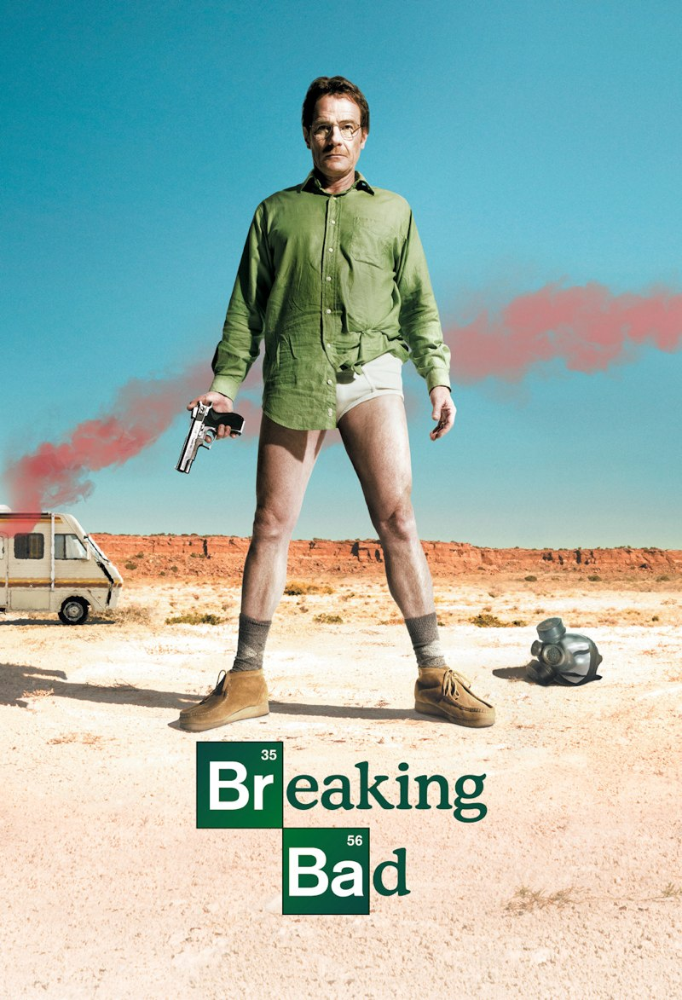
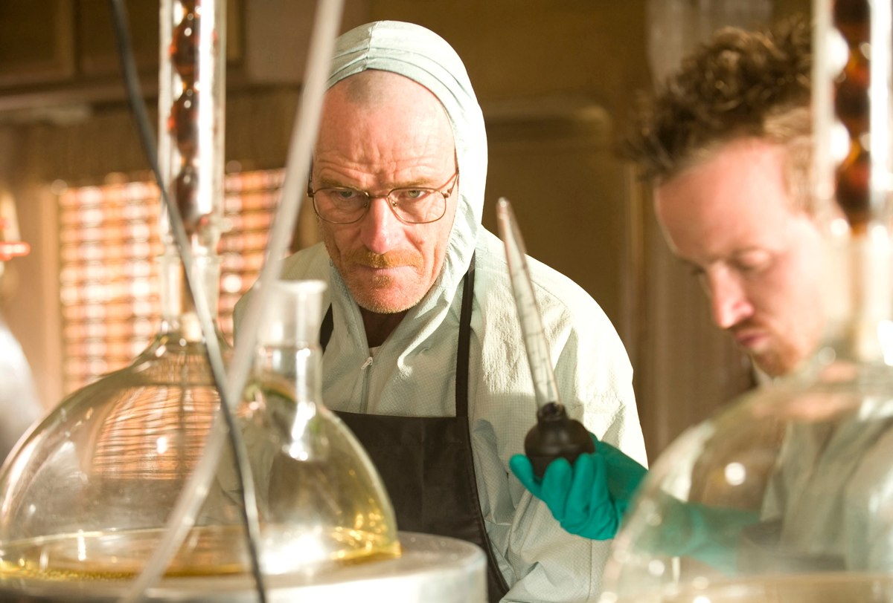
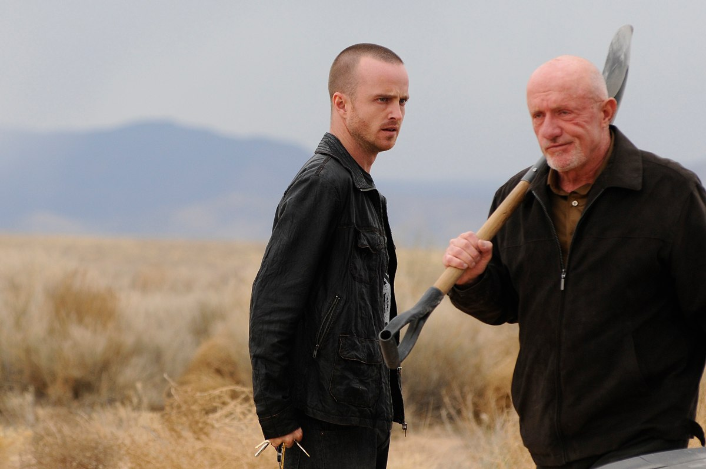
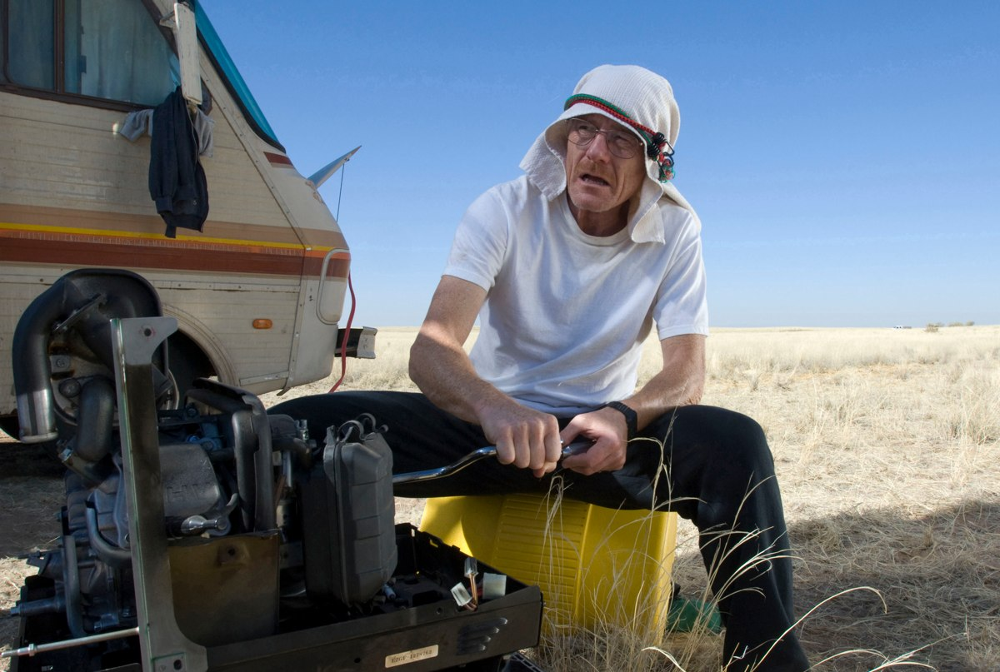
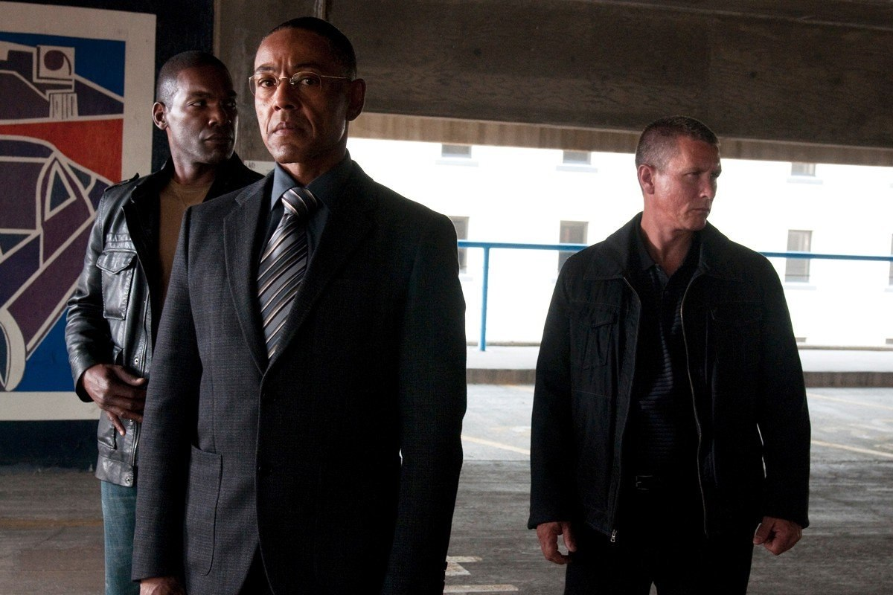

+++
type = "post"
titre = "<em>Breaking Bad</em>, Vince Gilligan (AMC)"
title = "Breaking Bad, Vince Gilligan (AMC)"
url = "/breaking-bad-gilligan"
date = "2012-06-24T08:15:38"
Lastmod = "2015-03-15T18:09:41"
cover = "breaking-bad-vince-gilligan.jpg"
categorie = [ "À voir" ]
tag = [ "Drame", "Drogue", "Famille", "Humour", "Mafia", "Maladie", "Série", "Thriller" ]
createur = [ "AMC", "Vince Gilligan" ]
acteur = [ "Aaron Paul", "Anna Gunn", "Betsy Brandt", "Bob Odenkirk", "Bryan Cranston", "Dean Norris", "Jonathan Banks", "RJ Mitte" ]
annee = [ "2008" ]
weight = 2008
pays = [ "États-Unis" ]

+++

Un professeur de chimie qui décide de fabriquer de la drogue après avoir appris qu&rsquo;il était atteint d&rsquo;un cancer en phase terminale. Il n&rsquo;y a que l&rsquo;univers des séries pour imaginer un tel scénario… C&rsquo;est en tout cas l&rsquo;étonnant point de départ de <em>Breaking Bad</em>, série américaine conçue par Vince Gilligan pour la chaîne AMC. Une idée originale et gonflée, mais le plus dur était de tenir. Alors que l&rsquo;histoire se terminera outre-Atlantique en 2013, les quatre premières saisons de <em>Breaking Bad</em> prouvent que les scénaristes américains ne manquent jamais d&rsquo;imagination… Une excellente série, à ne pas rater !

Un jour, Walter White apprend qu&rsquo;il est atteint d&rsquo;un cancer du poumon à un stade très avancé et qu&rsquo;il ne lui reste, au mieux, que quelques mois à vivre. Ce professeur de chimie dans un collège d&rsquo;Albuquerque, Nouveau-Mexique, est aussi le père d&rsquo;une petite famille tout à fait heureuse. Il aime tendrement Skyler, sa femme, qui est à nouveau enceinte et son fils, Walter Junior, un ado légèrement handicapé. La nouvelle est terrible, d&rsquo;autant que le cancer est à un stade trop avancé pour opérer. Le seul traitement possible, une chimiothérapie, coûte une fortune et Walt ne peut pas compter sur une sécurité sociale digne de ce nom pour le payer. C&rsquo;est pourquoi il préfère dans un premier temps ne rien dire, pour ne pas inquiéter sa famille.

Son beau-frère, Hank, appartient à la DEA, l&rsquo;équivalent américain des stups en France. Tous les jours, il poursuit et arrête tous ceux qui vivent du commerce de la drogue aux États-Unis et il raconte régulièrement à Walt que les sommes en jeu sont énormes. Ces récits donnent une idée au prof de chimie sans histoire, une idée audacieuse, un peu stupide même. Et s&rsquo;il mettait à profit ses connaissances en chimie pour… produire de la méthamphétamine, plus connue sous le petit nom de « meth ». Walter sait comment la fabriquer, c&rsquo;est son rayon, mais il ne sait absolument pas comment la vendre et c&rsquo;est pourquoi il retrouve Jesse Pinkman, l&rsquo;un de ses anciens élèves qui est aussi un petit dealer. Ensemble, ils vont produire et vendre suffisamment de drogue pour que les White aient de quoi subvenir à ses propres besoins après la mort de Walter. Du moins, c&rsquo;est l&rsquo;idée au départ… Cette association improbable signe le début d&rsquo;une longue aventure qui va immanquablement entraîner toute la famille, bien malgré elle.

<em>Breaking Bad</em>, littéralement « mal tourner ». Dès le titre, la série donne une idée assez précise de ce à quoi on doit s&rsquo;attendre. Walter White était un Américain lambda, un chimiste un peu raté qui a fini comme professeur dans un lycée alors que ses anciens camarades de promo sont devenus riches en travaillant dans le privé. La famille White n&rsquo;a pas beaucoup de moyens, à tel point qu&rsquo;elle ne peut pas se permettre de payer les frais d&rsquo;hospitalisation et de traitements de Walt. Si leur maison paraît assez confortable, leurs voitures — sans doute le marqueur social le plus important de tous — sont vieilles et surtout démodées. La <a href="http://fr.wikipedia.org/wiki/Pontiac_Aztek">Pontiac Aztek</a> de Walter en est le meilleur symbole : il roule dans l&rsquo;une des cinquante pires voitures de tous les temps d&rsquo;après le classement du magazine <em>Time</em> en 2007.

Son incursion dans l&rsquo;univers de la drogue va toutefois bouleverser cet équilibre et cette discrétion. La proximité de la mort transforme le personnage principal de <em>Breaking Bad</em> qui oublie ses bonnes manières et ses réserves pour laisser sa vraie personnalité s&rsquo;exprimer. Pour produire et vendre de la drogue, il doit fricoter avec une population douteuse autour de Jesse. Ce dernier est chargé des opérations les plus visibles, de l&rsquo;achat du matériel et des matières premières jusqu&rsquo;à la récupération du camping-car qui leur sert de laboratoire mobile dans les premiers temps. Il assiste aussi pendant les périodes de « cuisine », c&rsquo;est-à-dire quand ils produisent la drogue, mais c&rsquo;est surtout lui qui se charge ensuite de la distribuer. Au départ, Walter voulait se mouiller au minimum, mais on ne fréquente pas un tel milieu sans conséquence et les problèmes s&rsquo;accumulent vite. Dès les tout premiers épisodes, l&rsquo;équilibre que l&rsquo;on avait entraperçu dans le pilote vole en éclats et Walt tourne mal. Il ne le sait pas encore, mais le spectateur s&rsquo;en doute très vite, sa décision de produire de la drogue va avoir un impact certain sur ses proches.

L&rsquo;idée de départ de <em>Breaking Bad</em> est originale et vraiment bien trouvée, c&rsquo;est entendu. Reste qu&rsquo;une idée ne fait pas une série complète et les premiers épisodes imaginés par Vince Gilligan laissent un peu circonspect. Comment peut-on tenir cinq saisons avec un prof de chimie qui produit de la meth pour aider sa famille et financer sa chimiothérapie ? Les doutes se dissipent toutefois rapidement et <em>Breaking Bad</em> ne faiblit jamais, en tout cas pas jusqu&rsquo;à la quatrième saison. De manière assez classique dans les (bonnes) séries, l&rsquo;histoire gonfle progressivement à partir du point de départ. Walter et Jesse grimpent dans la hiérarchie de la distribution de drogues, leurs horizons s&rsquo;élargissent tandis que leurs choix ont des conséquences toujours plus graves sur leurs proches. Tout ceci n&rsquo;est pas extravagant et l&rsquo;on se surprend d&rsquo;ailleurs à avancer rapidement dans l&rsquo;histoire, sans sentir une marche forcée ou un effet de remplissage. Disons-le, les scénaristes de <em>Breaking Bad</em> ont fait un travail remarquable et la série fait partie des mieux écrites de ces dernières années.

Comme dans toutes les meilleures séries, le point le plus important est la crédibilité des personnages, principaux ou secondaires. <em>Breaking Bad</em> réussit justement à partir de caricatures parfois un peu grossières, mais qui s&rsquo;affinent au fil des épisodes et deviennent finalement des personnages tout à fait crédibles. L&rsquo;un des meilleurs exemples de cette évolution dans la série est sans doute Hank. Ce policier est l&rsquo;archétype du flic un peu beauf, qui ne prend jamais la peine de réfléchir, qui fait des vannes vaseuses, voire méchantes, à longueur de journée… bref un type pas très sympa. Sauf que c&rsquo;est systématiquement celui qui fait avancer les enquêtes et celui qui comprend tout avant les autres. Ce personnage assez insignifiant au début prend ainsi de plus en plus de place et s&rsquo;avère bien plus riche et intéressant que prévu, une belle prouesse de la part de la série qui concerne tous les rôles qui durent. Autour de Walter, Skyler ou Jesse sont ainsi particulièrement travaillés, pour ne citer qu&rsquo;eux : tous les personnages ont de la place pour s&rsquo;épanouir, jusqu&rsquo;aux seconds rôles les moins importants.

L&rsquo;autre point fort de <em>Breaking Bad</em> qui vient rapidement à l&rsquo;esprit est le mélange des genres. S&rsquo;il y a des séries très typées et axées sur un registre, les exemples de <em>24 heures chrono</em> ou de <a title="Deadwood, HBO" href="http://voiretmanger.fr/2010/05/10/deadwood-hbo/"><em>Deadwood</em></a> en sont représentatifs, celle-ci n&rsquo;adopte pas un ton très clair et préfère au contraire brouiller les cartes. L&rsquo;humour est présent, sous une forme assez noire puisqu&rsquo;il s&rsquo;agit quand même de l&rsquo;histoire d&rsquo;un homme atteint du cancer et de la mafia de la drogue. Le drame n&rsquo;est ainsi jamais loin et la série recense quelques morts parfois violentes ou spectaculaires. Le drame se fait aussi moral et la série évoque parfois l&rsquo;analyse des conséquences sur une famille au sens large des choix d&rsquo;un seul individu. La situation de Walt et de Jesse évolue et avec elle, les dangers qu&rsquo;ils affrontent. De nouveaux personnages entrent en scène et les péripéties attirent l&rsquo;histoire vers un genre plutôt qu&rsquo;un autre. <em>Breaking Bad</em> promet ainsi de ne pas lasser avec un schéma trop strict, même si le déroulement d&rsquo;un épisode est assez cadré avec notamment une brève introduction qui est souvent un flashback, parfois un flashforward, ou une scène un peu décalée.

La liberté formelle caractérise l&rsquo;univers de la série, surtout aux États-Unis, et <em>Breaking Bad</em> n&rsquo;y fait pas exception. Sans aller jusqu&rsquo;à l&rsquo;expérimental ou à l&rsquo;art et essai, les multiples réalisateurs qui sont passés à la réalisation ont su imprimer leurs marques. Certains s&rsquo;amusent ainsi avec les caméras, multipliant les angles originaux, d&rsquo;autres jouent sur des filtres, certains préfèrent un montage décalé… Là encore, la diversité est de mise avec quelques épisodes extrêmes, comme ce huis clos quasiment intégral pendant la troisième saison<a href="#fn-6858-1" rel="footnote">1</a>. La qualité est en tout cas toujours au rendez-vous et <em>Breaking Bad</em> le doit en grande partie à ses acteurs. Principaux, secondaires, voire simples apparitions, ils sont tous excellents et, c&rsquo;est là l&rsquo;essentiel, crédibles. Bryan Cranston est impressionnant dans le rôle principal et il parvient très bien à passer du prof de chimie un peu timide au producteur de drogue tendance bad boy. Autour de lui, Aaron Paul compose un Jesse plus subtil qu&rsquo;il n&rsquo;y paraissait, Anna Gunn est parfaite en mère de famille déterminée, Dean Norris n&rsquo;est pas en reste dans son rôle de policier bourru, mais il faut aussi noter la performance de Giancario Esposito, tout simplement épatante.

<em>Breaking Bad</em> construit une grande histoire à partir d&rsquo;une toute petite idée : il n&rsquo;y a pas meilleur moyen pour résumer le succès de cette série créée par Vince Gilligan. L&rsquo;histoire de Walter White est passionnante parce qu&rsquo;au fond, ce personnage qui n&rsquo;est censé produire de la drogue que pour la meilleure des raisons — sa propre survie et celle de sa famille — finit par y prendre goût. Walt tourne mal, comme le titre l&rsquo;indique bien, mais il prend beaucoup de plaisir à le faire et nous avec. Si vous aimez les séries originales et savoureuses, <em>Breaking Bad</em> mérite sans conteste votre attention !

<h3>Vous voulez m&rsquo;aider ?</h3>
<ul>
<li><a href="http://www.amazon.fr/gp/product/B0045KAYJ8/ref=as_li_ss_tl?ie=UTF8&amp;tag=leblogdenic07-21&amp;linkCode=as2&amp;camp=1642&amp;creative=19458&amp;creativeASIN=B0045KAYJ8">Acheter la première saison de <em>Breaking Bad</em> en DVD sur Amazon</a></li>
<li><a href="http://itunes.apple.com/fr/tv-season/breaking-bad-season-1/id291541205">Acheter la première saison de <em>Breaking Bad</em> sur l&rsquo;iTunes store</a></li>
</ul>
<ul>
<li><a href="http://www.amazon.fr/gp/product/B0045KAYJI/ref=as_li_ss_tl?ie=UTF8&amp;tag=leblogdenic07-21&amp;linkCode=as2&amp;camp=1642&amp;creative=19458&amp;creativeASIN=B0045KAYJI">Acheter la deuxième saison de <em>Breaking Bad</em> en DVD sur Amazon</a></li>
<li><a href="http://itunes.apple.com/fr/tv-season/breaking-bad-season-2/id380577840">Acheter la deuxième saison de <em>Breaking Bad</em> sur l&rsquo;iTunes store</a></li>
</ul>
<ul>
<li><a href="http://www.amazon.fr/gp/product/B005LF02Z2/ref=as_li_ss_tl?ie=UTF8&amp;tag=leblogdenic07-21&amp;linkCode=as2&amp;camp=1642&amp;creative=19458&amp;creativeASIN=B005LF02Z2">Acheter la troisième saison de <em>Breaking Bad</em> en DVD sur Amazon</a></li>
<li><a href="http://itunes.apple.com/fr/tv-season/breaking-bad-season-3/id380578643">Acheter la troisième saison de <em>Breaking Bad</em> sur l&rsquo;iTunes store</a></li>
</ul>
<ul>
<li><a href="http://itunes.apple.com/fr/tv-season/breaking-bad-season-4/id474602590">Acheter la quatrième saison de <em>Breaking Bad</em> sur l&rsquo;iTunes store</a></li>
</ul>

<ol>
<li id="fn-6858-1">
Un huis clos qui serait en fait justifié par un manque temporaire de moyen. Tourner dans un décor unique, c&rsquo;est effectivement une excellente méthode pour faire des économies…&#160;<a href="#fnref-6858-1" rev="footnote">&#8617;</a>
</li>
</ol>

