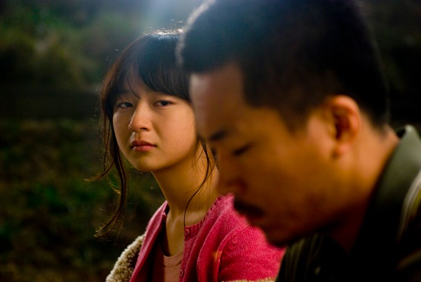

+++
titre = "Breathless, Yang Ik-June"
title = "Breathless, Yang Ik-June"
url = "/breathless-ik-june"
date = "2010-10-09T16:14:19"
Lastmod = "2012-05-14T10:16:54"
cover = "yang-ik-joon-breathless.jpg"
categorie = [ "À voir" ]
tag = [ "Drame", "Famille", "Mafia", "Société", "Violence" ]
createur = [ "Yang Ik-June" ]
acteur = [ "Yang Ik-June" ]
annee = [ "2010" ]
weight = 2010
pays = [ "Corée du Sud" ]

+++

<strong>À lire : Potemkine Films et Agnès B. DVD m&rsquo;a envoyé  <em>Breathless</em> pour en faire une critique. Je n’ai reçu aucun paiement pour cet article, et je ne pense pas que mon jugement a été influencé. Si cela vous dérange, votre navigateur Internet dispose d’une fonction « Fermer la fenêtre ». Sinon, je vous remercie pour votre confiance et vous propose de continuer votre lecture.</strong>

L&rsquo;affiche met d&rsquo;entrée dans l&rsquo;ambiance. <em>Breathless</em>, aucun rapport avec le <a href="http://voiretmanger.fr/2010/07/01/a-bout-de-souffle-godard/">classique</a> de Godard, est le premier film du Sud-Coréen Yang Ik-June et il a décidé de frapper fort pour son premier film. Attaquant de front un thème sous-jacent à tous les films de ce pays, la violence, <em>Breathless</em> coupe le souffle dès la première scène et ne lâche plus ensuite son spectateur. Une plongée, parfois éprouvante, dans la violence du quotidien en Corée du Sud.

<a href="http://www.allocine.fr/film/fichefilm_gen_cfilm=144345.html">

</a>

Sang-hoon est ce que l&rsquo;on pourrait appeler un caïd. Membre d&rsquo;une organisation mafieuse, il récolte de l&rsquo;argent auprès de familles endettées, de gré ou de force et souvent de force, on s&rsquo;en doute. C&rsquo;est un homme violent, qui ne sait pas s&rsquo;exprimer sans frapper, même doucement, ou sans insulter, même si ce n&rsquo;est pas toujours sincère. L&rsquo;origine de cette violence ne fait aucun doute, elle est née d&rsquo;une enfance difficile marquée par un père violent qui a tué sa petite sœur au cours d&rsquo;une dispute avec sa mère, cette dernière mourant d&rsquo;un accident de circulation juste après. Le père a passé 13 ans derrière les barreaux, mais cela ne suffit pas à Sang-hoon qui se sent incapable de lui pardonner. Au contraire même, il venge encore sa mère et sa sœur en rouant son père de coups et en traitant sa demi-sœur, née du père honni, comme une moins que rien. Un gars charmant donc, qui n&rsquo;hésite jamais à sortir les poings et à frapper fort tous ceux qui se trouvent sur sa route. Une rencontre fortuite avec Yeon-hee, une lycéenne à la vie tout aussi difficile et qui lui tient tête malgré les coups, va changer sa vie. Pour la première fois, la perspective de fonder une famille et de se poser s&rsquo;offre à lui. S&rsquo;il reste bourru, on sent une demande de sa part vers cette jeune fille, une demande qui n&rsquo;est même pas amoureuse ou sexuelle, mais plus simplement l&rsquo;envie d&rsquo;être ensemble, de partager des moments doux malgré les insultes régulières.

Mais <em>Breathless</em> n&rsquo;est pas le genre de film qui peut terminer en happy-end. C&rsquo;est un peu aussi la limite du genre : comme dans <em><a href="http://voiretmanger.fr/2010/08/25/submarino-vinterberg/">Submarino</a></em> sorti il y a quelques semaines, la noirceur est omniprésente et un peu envahissante, si bien que l&rsquo;on attend le retournement de situation ou le coup de marteau fatal. Il faut dire que le portrait de la société coréenne réalisé par Yang Ik-June n&rsquo;est pas très réjouissant. Des bandes armées s&rsquo;en prennent dans la rue, en plein jour et impunément à des femmes impuissantes. La police se fait rouer de coups dans la rue sans aucune suite judiciaire. La violence est dès lors partout. Elle prend forme au cœur des familles, entre frères et sœurs ou entre parents et enfants. À un moment, le héros dit que tous les pères sont des salauds dans ce pays, ce qui résume plutôt bien l&rsquo;ambiance du film. Tous les pères du film sont effectivement des sales types qui n&rsquo;hésitent pas à battre femmes et enfants ce qui conduit à une transmission de la violence à travers les générations. C&rsquo;est en effet une idée forte de <em>Breathless</em> : la contrainte sociale et familiale est une explication essentielle du comportement violent de Sang-hoon. Ik-June ne cherche pas à l&rsquo;excuser, son personnage n&rsquo;est d&rsquo;ailleurs pas du tout traité avec bienveillance, même si une possibilité de sortir de sa condition lui est offerte. En effet, si <em>Breathless</em> est globalement très noir et violent, il n&rsquo;est pas totalement désespéré et laisse entrevoir la possibilité d&rsquo;une rédemption pour son personnage principal. Le film se calme alors, fait un peu de place à de la musique et des sourires se forment sur les visages graves. La fin, en demi-teinte, est presque une fin heureuse au regard de toutes les horreurs qui ont précédé.

Yang Ik-June est au centre de son premier film qu&rsquo;il a écrit, réalisé et dont il assure le premier rôle. Sans en avoir la confirmation, on peut quand même émettre l&rsquo;hypothèse qu&rsquo;il a mis un peu de lui dans ce film, voire qu&rsquo;il est en partie autobiographique. Quoi qu&rsquo;il en soit, <em>Breathless</em> est marqué par une urgence qui se traduit notamment par un usage un peu abusif des mouvements de caméra sur l&rsquo;épaule. On sent que le réalisateur a voulu dénoncer certains problèmes de sa société, quitte à aller un peu fort dans la dénonciation : si le pays connaît certainement des problèmes de violence, on peine à croire que les forces de l&rsquo;ordre n&rsquo;aient vraiment aucun pouvoir, par exemple.

Premier film coup de poing, <em>Breathless</em> présente la société coréenne sous un mauvais jour. Violente et insoumise, elle règne sous le régime du plus fort et offre un terreau parfait pour que la violence perdure. Tableau à charge forcément un peu noirci, <em>Breathless</em> est parfois un peu éprouvant, mais offre à Yang Ik-June un premier film intéressant.

En guise de conclusion, un débat virtuel entre d&rsquo;une part <a href="http://www.filmosphere.com/2010/04/critique-breathless-2009/">Nicolas</a> qui a vraiment beaucoup aimé <em>Breathless</em> au point de parler de &laquo;&nbsp;grand cinéma », et de l&rsquo;autre <a href="http://www.toujoursraison.com/2010/04/breathless.html">Rob Gordon</a> qui, au contraire, n&rsquo;y voit qu&rsquo;un &laquo;&nbsp;<em>long chemin de croix simplement désagréable</em>.&nbsp;&raquo; Je me situerai entre les deux : je n&rsquo;ai pas détesté <em>Breathless</em>, loin de là, mais je ne dirai pas non plus qu&rsquo;il s&rsquo;agit d&rsquo;un grand film. Je suis par contre sans aucun doute curieux de voir la suite de la carrière de ce réalisateur…

<h3>Vous voulez m&rsquo;aider ?<a href="#footnote_0_4138" id="identifier_0_4138" class="footnote-link footnote-identifier-link" title="&Agrave; propos de la publicit&eacute;&hellip;">1</a></h3>
<ul>
<li><a href="http://www.amazon.fr/gp/product/B003Z421H8/ref=as_li_ss_tl?ie=UTF8&#038;tag=leblogdenic07-21&#038;linkCode=as2&#038;camp=1642&#038;creative=19458&#038;creativeASIN=B003Z421H8">Acheter le film en DVD sur Amazon</a></li>
</ul>

<ol class="footnotes"><li id="footnote_0_4138" class="footnote"><a href="http://voiretmanger.fr/soutien/">À propos de la publicité…</a> [<a href="#identifier_0_4138" class="footnote-link footnote-back-link">&#8617;</a>]</li></ol>
