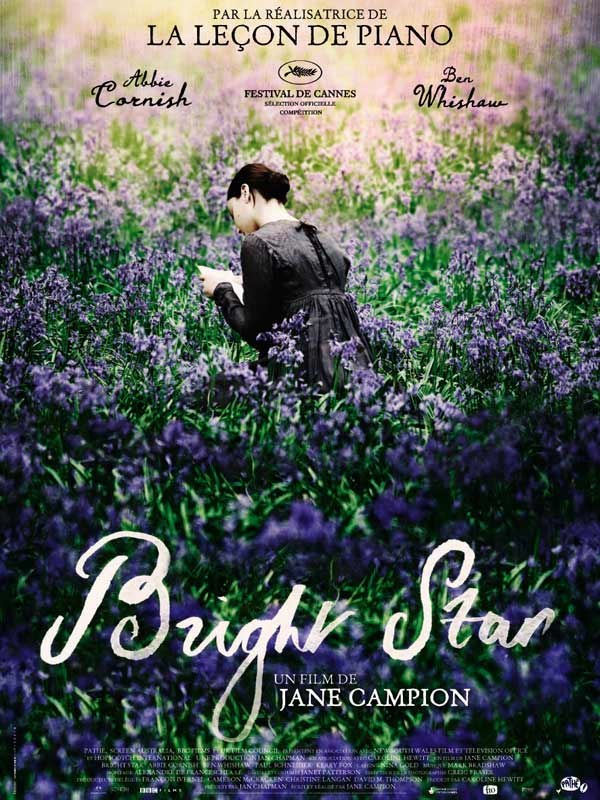
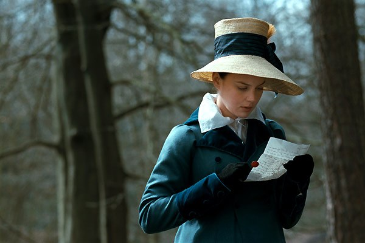
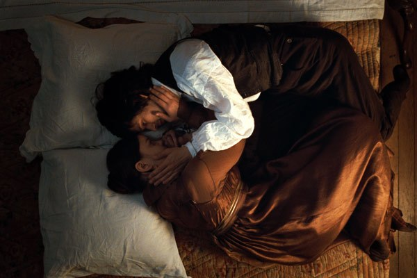
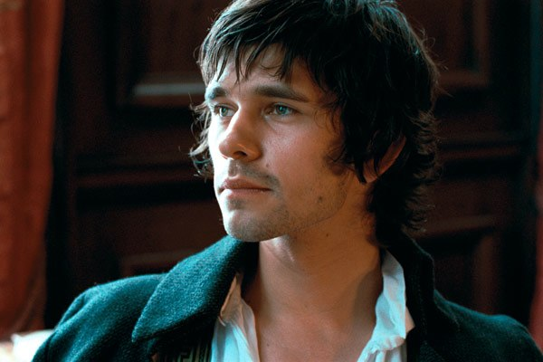

+++
type = "post"
titre = "<em>Bright Star</em>, Jane Campion"
title = "Bright Star, Jane Campion"
url = "/bright-star-campion"
date = "2010-01-17T00:18:27"
Lastmod = "2015-02-06T18:43:43"
cover = "bright_star_jane_campion.jpg"
categorie = [ "À voir" ]
tag = [ "John Keats", "Poésie", "Romance" ]
createur = [ "Jane Campion" ]
acteur = [ "Abbie Cornish", "Ben Whishaw", "Kerry Fox", "Paul Schneider" ]
annee = [ "2010" ]
weight = 2010
pays = [ "États-Unis" ]

+++

<em>Bright Star</em>, le dernier film de Jane Campion, raconte l&rsquo;amour fou, mais court, entre le célèbre poète anglais John Keats et Fanny Brawne, fille de bonne famille. Ce film met en scène l&rsquo;archétype de l&rsquo;amour romantique, impossible et malheureux, et aurait donc dû me déplaire. Contre toute attente, j&rsquo;ai été emporté par le film.

L&rsquo;histoire est tellement répandue, universelle même, qu&rsquo;il ne sert à rien de la détailler. Soit un beau jeune homme et une belle jeune femme, ils s&rsquo;aiment, mais ne peuvent se marier et à une époque où l&rsquo;amour hors mariage ne saurait être une option, leur amour tend forcément à l&rsquo;échec. Fanny Brawne est fille de bonne famille de la bourgeoisie victorienne et elle fréquente assidument les bals pour trouver un mari convenable. Mais quand elle rencontre le jeune poète John Keats, elle en tombe éperdument amoureuse, même si c&rsquo;est d&rsquo;abord l&rsquo;incompréhension face à sa poésie qui se manifeste. Si ce dernier ne s&rsquo;intéresse d&rsquo;abord pas du tout à cette jeune fille qui se vante d&rsquo;être à la mode et semble n&rsquo;avoir comme seul sujet de conversation que sa couture, il finit par se laisser convaincre et finalement, c&rsquo;est l&rsquo;amour passionnel et destructeur entre les deux êtres.

Bien sûr, il ne s&rsquo;agit que d&rsquo;un amour victorien, qui nous semble très chaste à l&rsquo;aune de nos propres mœurs. Tout au plus, les lèvres se croisent, mais cela n&rsquo;ira jamais au-delà. Et en fait, leur amour est déjà très libre pour l&rsquo;époque puisqu&rsquo;on laisse les deux tourtereaux à plusieurs reprises. Néanmoins, l&rsquo;amour reste platonique et s&rsquo;opère toujours par l&rsquo;intermédiaire de la poésie, puis de la maladie. Un amour qui reste insatisfait pour l&rsquo;éternité puisque John Keats meurt très jeune (25 ans), loin de l&rsquo;Angleterre pour essayer de guérir en s&rsquo;éloignant du climat humide qui règne outre-Manche.

Leur histoire a des allures de tragédie. Alors que la société avait fini par céder devant cet amour insistant et accepter le mariage, c&rsquo;est la maladie qui achève le poète. Le choc est si rude pour la jeune femme que, comme nous le fait comprendre un carton final, elle ne se remarie jamais et passe la fin de sa vie à errer sans fin là où elle se promenait avec son amour.

<em>Bright Star</em> n&rsquo;est pas simplement un drame amoureux, c&rsquo;est aussi un film sur un poète et sur sa poésie. John Keats est mal connu en France, mais en Angleterre c&rsquo;est une vraie star de la poésie, au niveau de Rimbaud pour donner une équivalence. Sa mort précoce a sans nul doute contribué à forger un mythe, mais c&rsquo;est quand même sa poésie qui reste aujourd&rsquo;hui. On le considère couramment comme le maître de la poésie romantique anglaise, tout simplement. Pour ma part, je l&rsquo;ai connu à travers le cycle <em>Hypérion</em>/<em>Endymion</em> de Dan Simmons, formidable Space Opera explicitement construit autour de l&rsquo;œuvre de ce poète. J&rsquo;attendais beaucoup de l&rsquo;aspect poétique du film et je n&rsquo;ai pas été déçu.

En effet, <em>Bright Star</em> laisse de la place à la poésie et c&rsquo;est même un des rares films qui fasse vraiment de la place à une œuvre poétique. La poésie n&rsquo;est jamais vraiment présentée en formation, filmer un homme gribouiller sur du papier n&rsquo;a qu&rsquo;in intérêt limité finalement, même si on voit quelques plans d&rsquo;écriture poétique. La poésie n&rsquo;apparaît pas vraiment à l&rsquo;écran, ou alors sous la forme de sous-titres, puisqu&rsquo;on l&rsquo;entend déclamée par le poète ou son entourage. Il ne s&rsquo;agit pas juste d&rsquo;un vers isolé, mais bien strophes entières qui sont ainsi récitées. Cela ajoute une force indéniable au film, comme si l&rsquo;on accédait à l&rsquo;inconscient de John Keats, les mots étant à ce jeu bien plus efficaces que toutes les images du monde. Le générique de fin se fait alors qu&rsquo;un poème est récité (dommage d&rsquo;ailleurs, on ne l&rsquo;entend pas alors que tout le monde sort de la salle) ce qui renforce le sentiment d&rsquo;un film non seulement sur la poésie, mais aussi poétique.

L&rsquo;image est toujours très belle chez Jane Campion. La nature est ici mise en avant, qu&rsquo;elle soit belle et fleurie en été, ou dangereuse et meurtrière en hiver. Une part importante du film se déroule en extérieur et les fleurs abondent plus que de raison dans cette campagne anglaise. Au-delà du réalisme qui importe peu ici, la nature est plutôt celle imaginée par le poète : belle, mais terrible à la fois. Il y a comme une sorte de lien organique entre le poète et la nature, comme l&rsquo;illustre bien le plan où John Keats s&rsquo;allonge sur la cime d&rsquo;un cerisier en fleurs. On peut aussi évoquer sa conscience très forte de sa mort à venir, ne laissant aucun espoir à sa bien-aimée et ne se trompant finalement pas.

<em>Bright Star</em> n&rsquo;est pas un film forcément simple d&rsquo;accès. Il faut accepter un rythme assez lent, un amour surtout contemplatif et une poésie très présente. Jane Campion filme ici l&rsquo;amour romantique par excellence dans l&rsquo;Angleterre de Jane Austen, mais ça n&rsquo;est en aucun cas un film niais, comme peuvent l&rsquo;être les adaptations des romans de cette dernière. C&rsquo;est au contraire un film très fort sur un amour qui l&rsquo;est tout autant et que la poésie de Keats sublime. Un très beau film, en somme.

Les avis sont pour ainsi dire partagés sur la toile. <a href="http://plan-c.over-blog.com/article-bright-star-etoile-frileuse--42697982.html">Certains</a> n&rsquo;ont vraiment pas aimé (y voyant du Jane Austen, justement), <a href="http://www.surlarouteducinema.com/archive/2010/01/08/bright-star-de-jane-campion.html">d&rsquo;autres</a> regrettent de n&rsquo;avoir pas aimé le film autant qu&rsquo;espéré. Heureusement, des avis très positifs se sont aussi exprimés et notamment la critique dithyrambique (et justifiée) de <a href="http://www.toujoursraison.com/2010/01/bright-star.html">Rob</a>, ou celle de <a href="http://www.critikat.com/Bright-Star.html">Critikat</a>.

<h3>Vous voulez m&rsquo;aider ?</h3>
<ul>
<li><a href="http://www.amazon.fr/gp/product/B0038ZGLWU/ref=as_li_ss_tl?ie=UTF8&amp;tag=leblogdenic07-21&amp;linkCode=as2&amp;camp=1642&amp;creative=19458&amp;creativeASIN=B0038ZGLWU">Acheter le film en Blu-Ray sur Amazon</a></li>
<li><a href="http://www.amazon.fr/gp/product/B0038ZGLWK/ref=as_li_ss_tl?ie=UTF8&amp;tag=leblogdenic07-21&amp;linkCode=as2&amp;camp=1642&amp;creative=19458&amp;creativeASIN=B0038ZGLWK">Acheter le film en DVD sur Amazon</a></li>
<li><a href="http://itunes.apple.com/fr/movie/bright-star/id373822773">Acheter ou louer le film sur l&rsquo;iTunes Store</a></li>
</ul>

