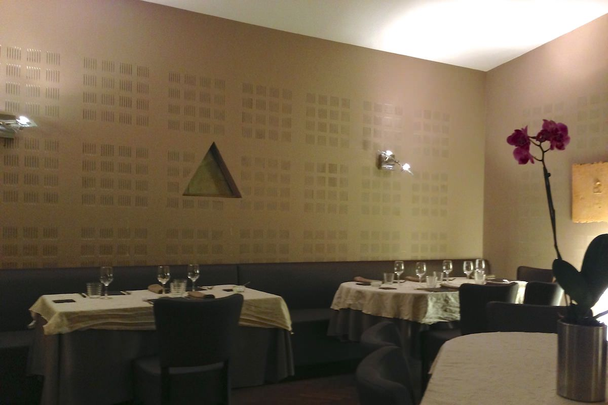
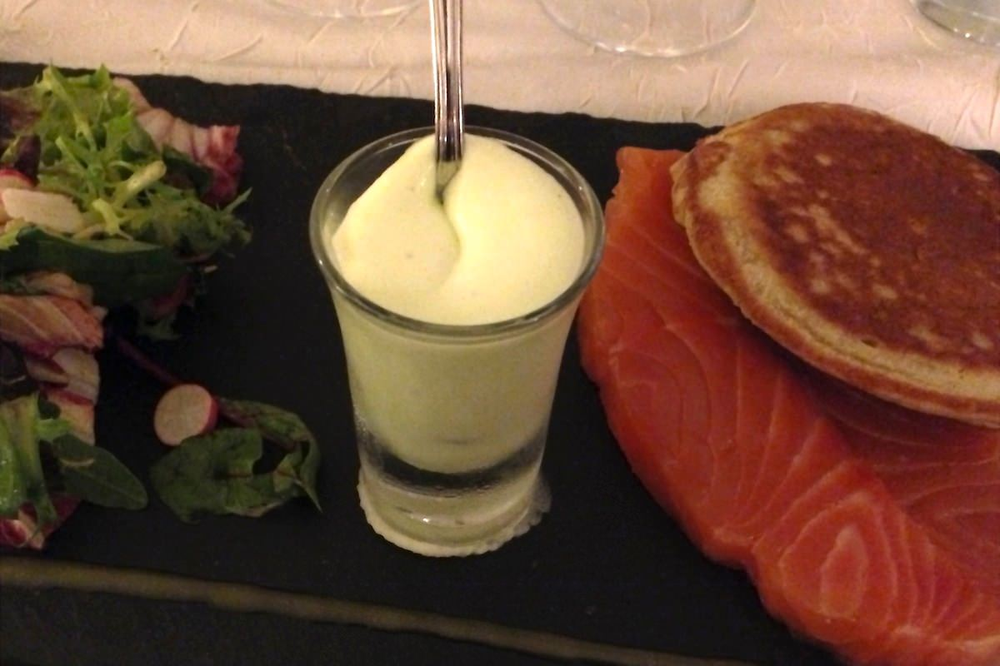
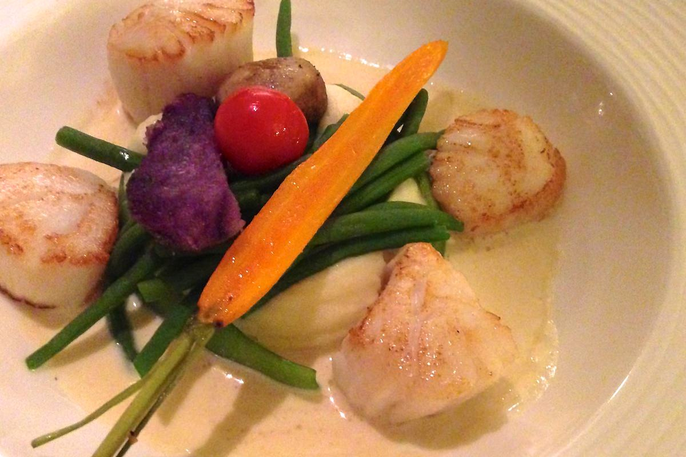
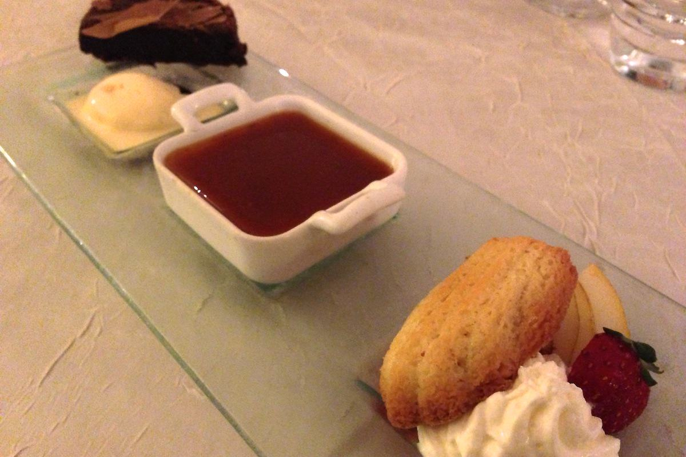

+++
type = "post"
titre = "La Brunoise à Villeurbanne"
title = "La Brunoise à Villeurbanne"
url = "/brunoise-villeurbanne"
date = "2012-09-22T23:27:51"
Lastmod = "2012-09-22T23:33:10"
cover = "la-brunoise-villeurbanne.jpg"
categorie = [ "À manger" ]
tag = [ "Cuisine française" ]

+++

Aux portes de Villeurbanne, à quelques pas de la place Charpennes, <strong><a href="http://www.labrunoise.fr">La Brunoise</a></strong> détonne au cœur d&rsquo;un quartier plutôt populaire. Ce restaurant à la façade moderne et discrète propose un cadre au calme, dans une ambiance cosy qui donne envie d&rsquo;entrer. À la clé, une cuisine assez simple, mais qui est aussi une valeur sûre qui ne décevra jamais. Une adresse à découvrir.

Passée la porte d&rsquo;entrée, <strong>La Brunoise</strong> propose une salle sans fioritures, mais particulièrement calme, surtout en début de service. La lumière tamisée, les tons beiges et les grandes plantes vertes qui occupent le centre de la pièce créent une ambiance zen qui tranche avec l&rsquo;extérieur, agité et bruyant. Si la salle devient plus bruyante en se remplissant au fil de la soirée, le restaurant parvient malgré tout à proposer un cadre reposant incontestablement bienvenu en ville. Ce samedi soir là, le restaurant n&rsquo;affiche pas complet, mais les tables sont essentiellement occupées par de discrets couples, mais un groupe inévitablement plus bruyant vient rompre en seconde partie de soirée le calme ambiant.

<strong>La Brunoise</strong> propose à sa carte deux menus qui ont retenu notre attention. Le premier, légèrement en dessous de 30 €, propose deux entrées et deux plats ; le second est plus généreux avec cinq ou six entrées et plats au choix. Les amateurs trouveront aussi des plats et entrées à la carte, mais ces menus sont sans conteste les plus intéressants. Pour 36 €, le chef propose des assiettes assez variées et des produits de qualité, même s&rsquo;il faut ajouter 5 € pour le foie gras ou pour les Saint-Jacques. Ajoutez un apéro ou un verre de vin à table, vous vous en tirerez pour une somme tout à fait raisonnable. Comme dans la décoration de la salle, cette adresse ne fait pas dans les fioritures et les dénominations complexes : les produits de base sont ici à l&rsquo;honneur et les associations assez convenues, à l&rsquo;image du magret de canard accompagné d&rsquo;une sauce au foie gras et de girolles.

Cette simplicité n&rsquo;est pas une tare, bien au contraire même. Si <strong>La Brunoise</strong> ne fait pas dans la cuisine expérimentale et les associations étranges, ses assiettes sont parfaitement bien composées et excellentes. Le saumon fumé maison est savoureux et l&rsquo;épaisse tranche qui est servie n&rsquo;a pas grand-chose à voir avec celui que l&rsquo;on trouve en supermarché, tandis que le blinis maison et la petite crème au Wasabi apportent l&rsquo;accompagnement qu&rsquo;il fallait. Le foie gras est aussi maison et les ravioles sont parfaitement cuites et astucieusement accompagnées de tuiles de comté qui relèvent le fromage qu&rsquo;elles contiennent. Les plats se sont révélés tout aussi savoureux. Les Saint-Jacques ne sont pas des pétoncles renommés comme c&rsquo;est trop souvent le cas, elles sont parfaitement cuites et la petite sauce au Condrieux relève leur goût subtil. Ce soir-là, la suggestion du jour était de la lotte dans un jus de crustacé, un poisson savoureux qui bénéficie encore d&rsquo;un traitement simple, mais terriblement efficace. <strong>La Brunoise</strong> ne laisse pas le choix sur le dessert, mais son trio est toujours une valeur sûre. On y trouve une crème à la vanille surmontée d&rsquo;un savoureux caramel au beurre salé, un moelleux au chocolat et une glace vanille maison, et un troisième dessert fruité qui dépend des saisons.

Une valeur sûre, c&rsquo;est ainsi que l&rsquo;on peut résumer d&rsquo;un mot <strong>La Brunoise</strong>. Inutile de chercher ici une cuisine inventive qui fera des étincelles — ce n&rsquo;est pas <a title="Eskis à Lyon" href="http://voiretmanger.fr/2012/01/21/eskis-lyon/"><em>l&rsquo;Eskis</em></a> —, mais les produits sont toujours d&rsquo;excellente qualité et tout est préparé sur place. Le cadre agréable, le service rapide et la carte de vins très complète ne gâchent rien… Seul regret, la carte change assez peu d&rsquo;une fois sur l&rsquo;autre. Ce manque de renouvellement limitera peut-être pour certains l&rsquo;envie de revenir à <strong>La Brunoise</strong>, mais il pourra aussi rassurer les autres qui seront sûrs de retrouver une cuisine de qualité. Une valeur sûre, en somme…

