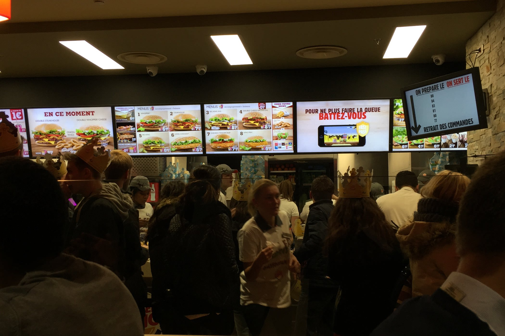
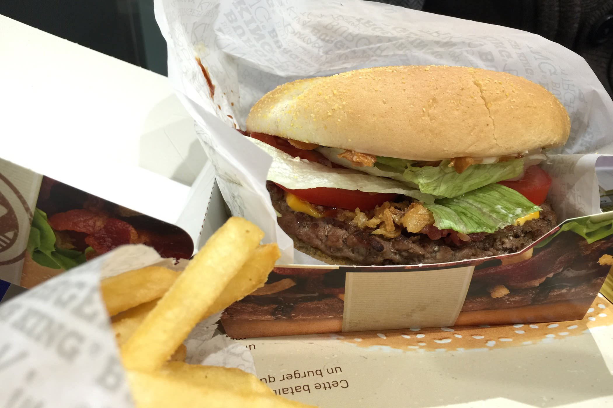
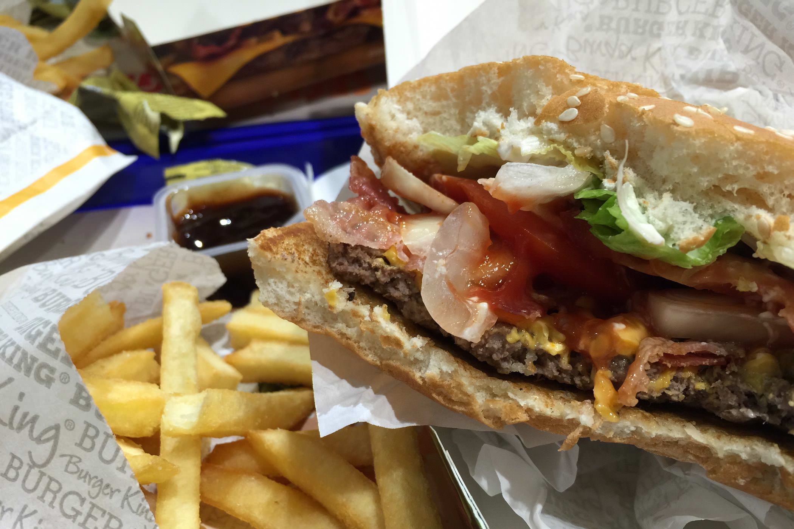

+++
type = "post"
titre = "Le Burger King à Lyon"
title = "Le Burger King à Lyon"
url = "/burger-king-lyon"
date = "2014-12-03T20:42:43"
Lastmod = "2014-12-06T16:45:06"
cover = "burger-king-lyon.jpg"
categorie = [ "À manger" ]
tag = [ "Fast-food", "Hamburger" ]

+++

Disparue du territoire français depuis 1997, la chaîne de restauration rapide <a href="http://www.burgerking.fr"><strong>Burger King</strong></a> a fait un retour remarqué depuis un an. Le fast-food de la gare Saint-Lazare n&rsquo;a pas désempli pendant des semaines et la firme américaine a accéléré depuis les ouvertures. Avec un sens du buzz particulièrement affuté et efficace, la chaîne a ouvert son dixième point de vente, cette fois à Lyon. L&rsquo;occasion de goûter le fameux <em>Whopper</em> et de comparer ce fast-food qui a tant de fans par rapport à la concurrence.

Le premier <strong>Burger King</strong> lyonnais a été installé à Confluence, au rez-de-chaussée du centre commercial ouvert depuis deux ans. De plein pied sur la rue, la boutique est assez petite et elle vient concurrencer directement le McDonald&rsquo;s situé deux étages plus haut. Inutile de s&rsquo;étendre sur l&rsquo;adresse en lui-même : c&rsquo;est un fast-food, avec son long comptoir coloré, ses quelques tables et l&rsquo;obligatoire odeur de frites… ou plutôt de viande grillée. C&rsquo;est en effet le point fort de cette chaîne, par rapport à ses concurrents : les steaks de bœuf qui constituent la base de tous les burgers sont grillés à la flamme. À l&rsquo;heure de la commande toutefois, on est en terrain connu : on choisit un menu avec l&rsquo;un des burgers proposés par <strong>Burger King</strong>, un accompagnement et une boisson. Les tarifs sont assez similaires à ceux d&rsquo;en face et la seule vraie différence, pour les habitués, sera la présence des <em>onion rings</em> en guise d&rsquo;accompagnements, en plus des traditionnels frites. Par rapport aux autres fast-food, on apprécie malgré tout les options proposées pour certains sandwiches. Votre <em>Whopper</em>, vous le voulez avec du bacon et du fromage ? Il suffit de demander !

On vient dans un fast-food pour manger des burgers, alors que valent ceux de <strong>Burger King</strong> ? Autant le dire d&rsquo;emblée : si vous attendiez le retour de la chaîne comme le messie, vous serez probablement déçus. Il y a bien quelques différences notables avec les McDonald&rsquo;s et autres Quick, mais on reste dans l&rsquo;univers du fast-food à l&rsquo;américaine et la différence n&rsquo;est pas aussi importante qu&rsquo;on pourrait le croire. En particulier, le fait que la viande soit grillée aux flammes se sent en bouche, mais ce n&rsquo;est pas une différence aussi nette qu&rsquo;on le penserait. De ce fait, le mythique <em>Whopper</em> (ci-dessous) pourrait décevoir : même avec les suppléments bacon et fromage, il reste un burger très classique, avec du ketchup, quelques légumes frais et un steak aussi fin qu&rsquo;ailleurs. Bien meilleur, le <em>Steakhouse</em> (ci-dessus) avec ses oignons frits qui ajoutent vraiment une plus-value : celui-ci est vraiment bon ! Les <em>onion rings</em>, spécialité américaine assez rare en France, étaient un peu décevants, en revanche les frites sont très réussies. Plus grosses qu&rsquo;en face, elles sont aussi mieux cuites et aussi bien croustillantes qu&rsquo;assaisonnées. Quant aux desserts, ils ne sont pas vraiment mieux que chez McDonald&rsquo;s et compagnie ; d&rsquo;ailleurs, la glace blanche sans saveur associée à des Kit Kat fonctionne moins bien que son équivalent avec du Daim ou des M&amp;M&rsquo;s.

<strong>Burger King</strong> mérite-t-il toute l&rsquo;attention collectée depuis l&rsquo;annonce de son retour en France ? Probablement pas, ce n&rsquo;est qu&rsquo;un burger, mais cela ne veut pas dire que soit une mauvaise adresse si on veut se faire un fast-food. À tarifs équivalents, la chaîne propose des sandwiches légèrement différents que chez ses concurrents, et sait même faire mieux sur certains points. En bref, ce sera certainement une valeur sûre quand on en trouvera partout, en attendant profitez-en si vous passez près de l&rsquo;une des dix adresses ouvertes ! Malheureusement, il faudra se passer, au moins pour le moment, des très impressionnantes formules américaines <a href="/wp-content/2014/12/burger-king-triple-whopper.jpg">à trois steaks</a><a href="#fn-12478-1" rel="footnote">1</a>…

<ol>
<li id="fn-12478-1">
Apparemment, on peut en fait prendre un burger avec trois steaks, moyennant une petite somme en plus. Merci au lecteur qui m&rsquo;a <a href="/burger-king-lyon/#comment-30249">corrigé</a>.&#160;<a href="#fnref-12478-1" rev="footnote">&#8617;</a>
</li>
</ol>

