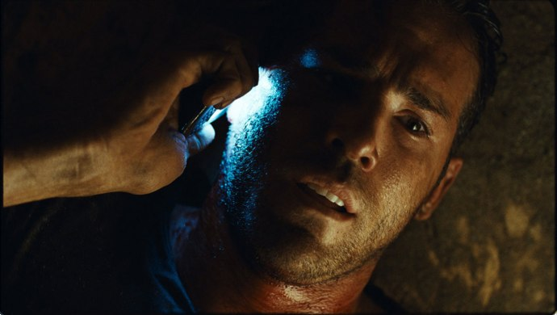
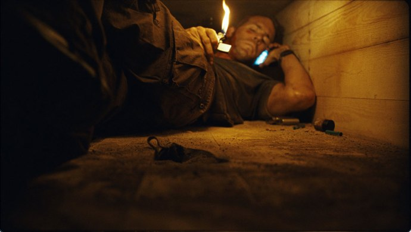

+++
titre = "<em>Buried</em>, Rodrigo Cortés"
title = "Buried, Rodrigo Cortés"
url = "/buried-cortes"
date = "2010-11-07T18:03:25"
Lastmod = "2015-03-13T23:47:03"
cover = "rodrigo-cortes-buried.jpg"
categorie = [ "À voir" ]
tag = [ "Expérience", "Guerre", "Huis clos", "Thriller", "Vite oublié" ]
createur = [ "Rodrigo Cortés" ]
acteur = [ "Ryan Reynolds" ]
annee = [ "2010" ]
weight = 2010
pays = [ "Espagne" ]

+++

Film concept par excellence, <em>Buried</em> plonge le spectateur dans un cercueil et n&rsquo;en sort jamais pendant les 90 minutes qu&rsquo;il dure. Tout l&rsquo;enjeu du film, comme l&rsquo;affiche l&rsquo;explicite immédiatement, c&rsquo;est de savoir si le héros va s&rsquo;en sortir et comment il va s&rsquo;en sortir. Un scénario aussi simple que peut l&rsquo;être l&rsquo;unique décor du film de Rodrigo Cortés, pour un résultat en demi-teinte. Si l&rsquo;expérience extrême tenue de bout en bout force le respect, on est plus sceptique sur l&rsquo;intérêt du film, au-delà de son statut d&rsquo;expérience cinématographique…

Le scénario peut se résumer à ces deux éléments : un homme et un cercueil. Quand le film ouvre, sur un écran noir, on n&rsquo;entend d&rsquo;abord que sa respiration haletante qui s&rsquo;accélère. L&rsquo;inquiétude est palpable, mais on ne sait pas tout de suite pourquoi. Un bruit de briquet annonce de la lumière : on découvre alors le personnage principal et unique du film, et son environnement unique, un cercueil. Paul, celui qui se trouve encore vivant dans ce cercueil, essaie d&rsquo;abord d&rsquo;ouvrir sa prison, mais bien vite il comprend qu&rsquo;il est enterré. Il travaille comme contractuel civil en Irak et il se souvient juste que son convoi a été attaqué par des Irakiens. Il réalise qu&rsquo;il a été enterré vivant comme otage : on lui a laissé un téléphone portable, de quoi boire, un briquet, une lampe et même un couteau. Ses ravisseurs ne tardent pas à l&rsquo;appeler et lui expliquent qu&rsquo;il sera libéré contre 5 millions de dollars. Commence alors pour lui une véritable course à la montre, l&rsquo;oxygène n&rsquo;étant pas illimité dans cet espace confiné, pour contacter les autorités américaines et tenter d&rsquo;organiser sa survie, mais aussi pour contacter sa famille aux États-Unis.

Le temps réel est un effet difficile à obtenir au cinéma, contrairement à la télévision qui a plus de moyens pour y parvenir (on pense ici évidemment à <em>24 heures chrono</em>), mais un effet extrêmement efficace. Il crée immédiatement un effet de réalisme indéniable et permet d&rsquo;impliquer les spectateurs plus fortement que n&rsquo;importe quel autre effet. <em>Buried</em> est presque en temps réel : on suit le personnage principal pendant le temps du film dans le cercueil. Presque, car contrairement à ce que vantent l&rsquo;affiche et le synopsis, il se déroule plus de 90 minutes dans l&rsquo;histoire. L&rsquo;effet est quand même présent et s&rsquo;avère plutôt efficace. On tremble avec Paul quand la batterie du portable descend d&rsquo;un cran, ou quand le sable commence à entrer dans le cercueil. Le film est néanmoins assez inégal : si le début est plutôt prenant, l&rsquo;effet de découverte jouant à plein, <em>Buried</em> patine assez vite et on sent souvent poindre l&rsquo;effet remplissage. Tenir 1h30 avec seulement un homme et un cercueil relevait de la gageure et certains rebondissements font vraiment forcés. On se demande bien comment ce serpent peut débarquer sans prévenir et se nicher dans l&rsquo;entrejambe du malheureux sans qu&rsquo;il ne s&rsquo;en aperçoive, par exemple. De manière générale, le film peine à être réaliste ou plutôt joue du réalisme comme cela l&rsquo;arrange. Qu&rsquo;un téléphone capte sous terre, soit, on peut imaginer qu&rsquo;il est enterré sous une fine couche ; mais il peut non seulement appeler partout dans le monde sans le moindre souci et envoyer des vidéos en quelques secondes, vidéos qui se retrouvent en une poignée de minutes sur YouTube parmi les plus vues. Notre héros s&rsquo;agite, se tourne et se retourne, il allume un grand feu de joie dans son cercueil… dont les réserves en oxygène semblent vraiment illimitées. On comprend que le réalisme absolu n&rsquo;aurait pas donné un film, Paul mourant dans les toutes premières minutes, mais c&rsquo;est un peu gênant de décrédibiliser ainsi l&rsquo;argument premier de <em>Buried</em>.

Rodrigo Cortés, conscient de la difficulté qu&rsquo;il y a de tenir un film complet avec un sujet aussi réduit, a ajouté une couche thématique à <em>Buried</em>. Si Paul a été enterré vivant, c&rsquo;est à cause d&rsquo;Irakiens en quête de vengeance après la disparition de leur monde détruit par la guerre. Autant le dire, la justification par la guerre en Irak n&rsquo;apporte vraiment rien au film, si ce n&rsquo;est qu&rsquo;elle permet de faire entrer le sable après un bombardement. C&rsquo;est néanmoins une thématique intéressante en soi qui fait quasiment de <em>Buried</em> un film à charge contre la guerre en Irak. Le contexte provient entièrement des multiples conversations téléphoniques entre Paul et des interlocuteurs extérieurs, que ce soit ses ravisseurs, sa femme ou même le FBI ou le Département d&rsquo;État américain. Le film dénonce d&rsquo;abord l&rsquo;administration et l&rsquo;armée américaines qui, sous couvert d&rsquo;intransigeance face au terrorisme, refusent en fait de faire le nécessaire pour sauver un citoyen américain. Le service chargé de sauver les otages a ainsi un palmarès déplorable de… zéro otage sauvé. Le constat est cruel, mais les otages ne valent pas la peine d&rsquo;être sauvés et la seule chose que l&rsquo;armée américaine sache faire est de bombarder le lieu supposé où se trouvent les preneurs d&rsquo;otages. Outre l&rsquo;armée américaine, Cortés dénonce dans son film les sociétés privées qui participent à la reconstruction du pays. Le héros de <em>Buried</em> travaille dans une de ces sociétés qui envoient des civils au cœur d&rsquo;un pays encore largement incontrôlable, sans protection suffisante et avec un soutien très relatif de l&rsquo;armée. Pis, quand cette société se préoccupe enfin du sort de son employé otage, c&rsquo;est pour lui annoncer qu&rsquo;il a été viré le matin même pour avoir entretenu une relation un peu trop proche avec une autre employée. Ayant été viré le matin, il n&rsquo;était techniquement plus employé de l&rsquo;entreprise au moment de la prise en otage et c&rsquo;est ce message horrible que lui annonce l&rsquo;entreprise au téléphone. Viré pour faute professionnelle, il n&rsquo;a le droit à aucune assistance pendant ou après la prise en otage. Cette logique froide où l&rsquo;humain n&rsquo;a aucune place fait froid dans le dos et se révèle extrêmement efficace.

Le choix extrême de <em>Buried</em> implique aussi quelques particularités sur la pellicule. Notons d&rsquo;abord que Cortés a tenu son pari et ne sort jamais la caméra du cercueil, même si l&rsquo;action se déroule souvent en-dehors. Il parvient par exemple à très bien rendre cette réalité extérieure, que ce soit par les appels de Paul, ou même directement pour la réalité de la guerre avec une séquence de bombardement assez éprouvante et bien fichue. Mais si la caméra ne sort jamais, elle n&rsquo;hésite pas à prendre quelques facilités avec les mathématiques et la géométrie. Ce cercueil paraît parfois bien grand, et les caméras s&rsquo;éloignent souvent plus que de raisons du corps du malheureux otage. Certes, le réalisme aurait été, là encore, particulièrement ennuyeux, mais cela semble souvent un peu facile. C&rsquo;est bien le problème de <em>Buried</em>, un peu pris au piège de son principe de base : réaliser un film de 1h30 avec seulement un gars dans un cercueil n&rsquo;est pas possible, en tout cas pour le grand public. Cortés a triché avec son idée de film, ce qui relativise quelque peu l&rsquo;intérêt de cette dernière. Cela dit, soyons francs, le réalisateur a réussi à faire un film uniquement dans un cercueil, ce qui est tout de même assez brillant. Le film doit également beaucoup à son unique acteur, Ryan Reynolds, plutôt convaincant dans ce rôle pas facile.

<em>Buried</em> pousse le concept du huis clos à l&rsquo;extrême, même pas une seule pièce comme cela est courant, mais un cercueil pour tout décor. Idée assez brillante sur le papier et enjeu énorme : comment tenir la durée d&rsquo;un film avec aussi peu de matière. Force est de reconnaître que Rodrigo Cortès s&rsquo;en sort plutôt bien et réussi à insuffler du rythme et même du suspense à son intrigue rachitique. Cette expérience ultime est intéressante en soi, mais elle constitue aussi la faiblesse du film qui ne vaut que pour son statut d&rsquo;expérience. Passé le temps de la découverte, <em>Buried</em> peine à totalement convaincre et on ressent assez vite l&rsquo;effet remplissage. Si vous n&rsquo;êtes pas trop claustrophobe, c&rsquo;est une expérience à tenter néanmoins !

Si j&rsquo;ai vu <em>Buried</em>, c&rsquo;est grâce à <a href="http://myscreens.fr/2010/cinema/buried-critique/">Fred</a> qui évoque un &laquo;&nbsp;<em>huis clos ultime, suffocant à souhait</em>&nbsp;&raquo; et <a href="http://www.plan-c.fr/article-critique-buried-de-rodrigo-cortes-57003774.html">Alexandre</a> qui a beaucoup apprécié l&rsquo;expérience claustrophobique teintée de dénonciation. <a href="http://www.toujoursraison.com/2010/10/buried.html">Rob Gordon</a>, par contre, ne trouve pas l&rsquo;idée de scénario convaincante une fois portée à l&rsquo;écran et je dois dire que je suis assez d&rsquo;accord avec lui. <a href="http://www.critikat.com/Buried.html">Critikat</a> trouve le film &laquo;&nbsp;<em>un peu gâché</em>&nbsp;&raquo; par l&rsquo;exercice de style gratuit proposé par Cortés, mais reconnaît aussi l&rsquo;intérêt du contexte et surtout l&rsquo;utilisation qui est faite du téléphone portable.

<h3>Vous voulez <a href="http://voiretmanger.fr/soutien/">m&rsquo;aider</a> ?</h3>
<ul>
<li><a href="http://www.amazon.fr/gp/product/B004FK2N7O/ref=as_li_ss_tl?ie=UTF8&amp;tag=leblogdenic07-21&amp;linkCode=as2&amp;camp=1642&amp;creative=19458&amp;creativeASIN=B004FK2N7O">Acheter le film en Blu-ray sur Amazon</a></li>
<li><a href="http://www.amazon.fr/gp/product/B004FK2MKW/ref=as_li_ss_tl?ie=UTF8&amp;tag=leblogdenic07-21&amp;linkCode=as2&amp;camp=1642&amp;creative=19458&amp;creativeASIN=B004FK2MKW">Acheter le film en DVD sur Amazon</a></li>
<li><a href="https://itunes.apple.com/fr/movie/buried/id478245172">Acheter ou louer le film sur l&rsquo;iTunes Store</a></li>
</ul>

