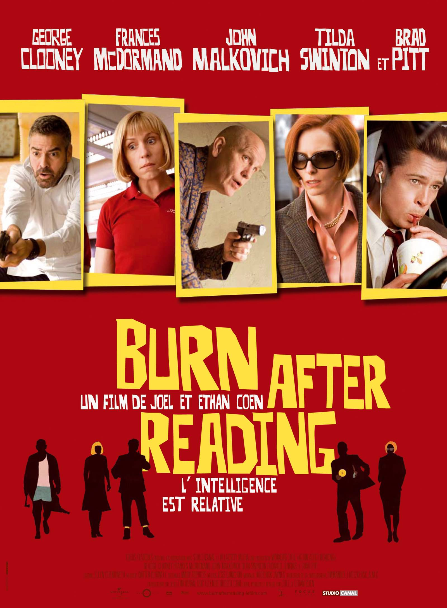
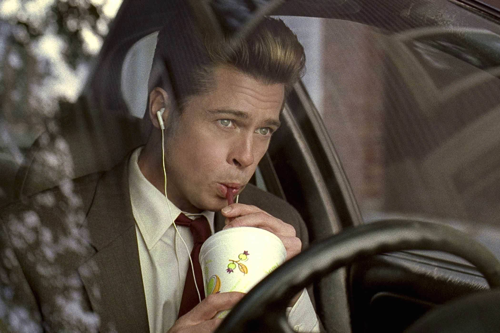

+++
titre = "<em>Burn After Reading</em>, Joel et Ethan Coen"
title = "Burn After Reading, Joel et Ethan Coen"
url = "/burn-after-reading-coen"
date = "2014-12-21T18:50:56"
Lastmod = "2014-12-21T18:53:01"
cover = "burn-after-reading-brad-pitt-coen.jpg"
categorie = [ "À voir" ]
tag = [ "Comédie", "Drame", "Espionnage", "Humour", "Parodie" ]
createur = [ "Joel et Ethan Coen" ]
acteur = [ "Brad Pitt", "Frances McDormand", "George Clooney", "John Malkovich", "Richard Jenkins", "Tilda Swinton" ]
annee = [ "2008" ]
weight = 2008
pays = [ "États-Unis", "France", "Grande-Bretagne" ]

+++

Quelques mois seulement après <a href="http://voiretmanger.fr/no-country-for-old-men-coen/" title="No Country for Old Men, Joel et Ethan Coen"><em>No Country for Old Men</em></a>, les deux frères Coen revenaient au cinéma avec un nouveau film, radicalement différent du précédent. Après l&rsquo;adaptation d&rsquo;un roman de Cormac McCarthy pour un film d&rsquo;une noirceur et d&rsquo;une violence rares, Joen et Ethan Coen ont imaginé un scénario de comédie. De fait, <em>Burn After Reading</em> est un long-métrage beaucoup plus léger, une parodie de film d&rsquo;espionnage construit autour d&rsquo;un scénario complètement dingue qui implique la CIA et une salle de gymnastique et surtout des personnages tous aussi cinglés les uns que les autres. Cette galerie de personnages ridicules est un délice et même si ce film n&rsquo;est pas aussi puissant que pouvait l&rsquo;être <em>No Country for Old Men</em>, il n&rsquo;en est pas moins réussi pour autant. Cette comédie n&rsquo;est pas aussi légère qu&rsquo;on pourrait le croire et ce qu&rsquo;elle dit de la CIA et plus largement de notre société est assez intéressant. <em>Burn After Reading</em> n&rsquo;est probablement pas le meilleur film du duo, mais c&rsquo;est un excellent divertissement, à (re)voir avec plaisir !

<em>Burn After Reading</em> ouvre exactement comme bon nombre de thrillers : on voit d&rsquo;abord le globe terrestre et un zoom nous amène directement au-dessus de Langley, en Virginie. L&rsquo;histoire commence ainsi au siège de la CIA et les deux réalisateurs font preuve d&rsquo;un sérieux absolu en filmant uniquement les pieds d&rsquo;un homme marchant dans les couloirs de l&rsquo;agence. La musique est là pour faire monter encore le suspense… et l&rsquo;ensemble sonne tout de suite un peu faux. Et pour cause : ce serait une erreur de prendre cette ouverture au pied de la lettre, Joel et Ethan Coen filment l&rsquo;ensemble avec tout le second degré nécessaire pour une parodie. Si ce n&rsquo;était pas clair dès ces premières secondes un peu trop intenses pour ne pas être ridicules, le spectateur le comprendra vite quand l&rsquo;histoire se mettra en place. On découvre tout d&rsquo;abord Osborne Cox, analyste pour la CIA « viré »<a href="#fn-12629-1" rel="footnote">1</a> dans la première scène pour ses problèmes d&rsquo;alcool. Quand il rentre chez lui, on apprend que son couple bat de l&rsquo;aile : Katie, sa femme, le trompe avec un autre homme et elle veut le quitter. Avant de demander le divorce, son avocat lui conseille de collecter des informations sur les comptes de son mari et elle grave ainsi un CD avec des données volées sur l&rsquo;ordinateur de l&rsquo;ex-agent de la CIA. C&rsquo;est ce CD qui enclenche une sorte de machine infernale au cœur de <em>Burn After Reading</em> : perdu par une assistante du cabinet d&rsquo;avocat, il se retrouve par le plus grand des hasards dans les mains de Linda et Chad, deux employés d&rsquo;une salle de gymnastique. Quand ils découvrent le contenu du CD, ils s&rsquo;imaginent déjà que le propriétaire des données va les récompenser d&rsquo;une somme rondelette en échange du CD : elle pourra alors se faire opérer pour changer complètement de corps, et lui… on ne sait pas trop quels sont ses objectifs, mais le simple fait d&rsquo;avoir affaire à un agent secret semble lui faire plaisir. Quels que soient leurs motifs, ils s&rsquo;embarquent dans une histoire totalement loufoque comme les frères Coen savent si bien les raconter. Plus elle avance et plus elle paraît dingue : à la fin, la CIA et la Russie sont associés à une série de meurtres que personne ne peut comprendre. Si ce n&rsquo;était pas clair qu&rsquo;il s&rsquo;agissait d&rsquo;une parodie au début, il n&rsquo;y a vraiment plus de doutes à la fin.

Joel et Ethan Coen sont connus pour leur humour noir qui apparaît partout, y compris dans leurs films les plus sérieux. Même <em>No Country for Old Men</em> n&rsquo;était pas épargné par cette sorte de contagion qui touche tout leur cinéma. Reste que <em>Burn After Reading</em> n&rsquo;est pas seulement parcouru de quelques touches humoristiques, c&rsquo;est une comédie dans son ensemble et elle est vraiment très drôle. Mais leur humour reste malgré tout subtile et il fonctionne en grande partie sur le principe de scènes absurdes, provoquées par des personnages complètement perdus, qui agissent sans savoir. Cette galerie de personnages est incontestablement le point fort du film, plus, au fond, que son intrigue alambiquée. Ils sont tous excellents, que ce soit l&rsquo;analyste de la CIA alcoolique et sujet à de fortes colères, les deux employés excités de la salle de sport, l&rsquo;amant qui multiplie les conquêtes tout en tenant à sa femme… Le scénario multiplie les scènes en jouant sur ces personnages et leurs relations, avec quelques moments de bravoure, d&rsquo;autant que <em>Burn After Reading</em> les place toujours dans des situations impossibles. Par certains aspects, le film ressemble à un jeu pour les deux frères Coen qui sont aussi derrière le scénario : rassemblez une bande d&rsquo;idiots dans une même histoire, mélangez bien et regardez ce qui en sort. Et ce qui sort, ce sont justement des situations improbables et souvent très drôles, portées par des acteurs tous excellents. Ils sont tous parfaits, mais on retiendra surtout le duo composé par Frances McDormand et Brad Pitt. La première est une habituée, elle a déjà travaillé dans six films de Joel et Ethan Coen, mais elle est toujours aussi hilarante dans ce rôle assez proche, par certains aspects, de celui qu&rsquo;elle interprétait déjà brillamment dans <a href="http://voiretmanger.fr/fargo-coen/" title="Fargo, Joel et Ethan Coen"><em>Fargo</em></a>. Le second est plus surprenant : on ne l&rsquo;attendait pas forcément dans ce rôle à contre-emploi. En incarnant ce type autour de la quarantaine, mais qui se comporte comme un ado, l&rsquo;acteur atteint un niveau époustouflant où l&rsquo;on ne l&rsquo;attendait pas. George Clooney est lui aussi excellent dans un rôle à contre-emploi et il est inutile de dire que Tilda Swinton et John Malkovich sont convaincants. C&rsquo;est incontestablement un beau casting qui a été réuni pour <em>Burn After Reading</em>.

Sorti la même année qu&rsquo;un chef-d&rsquo;œuvre, <em>Burn After Reading</em> n&rsquo;a probablement pas eu toute l&rsquo;attention qu&rsquo;il méritait. C&rsquo;est dommage, car le treizième long-métrage des frères Coen n&rsquo;est pas mauvais, loin de là. Certes, il est moins intense que son prédécesseur, mais il est très drôle et sa légèreté n&rsquo;est qu&rsquo;une façade. Au-delà de l&rsquo;idiotie de ses personnages principaux, la machine infernale qui est lancée par le scénario en dit long sur notre société. Et on peut ajouter que toutes les scènes au sein de la CIA, avec le directeur de l&rsquo;agence, sont aussi drôles qu&rsquo;elles sont inquiétantes. <em>Burn After Reading</em> est un excellent film et on aurait tort de passer à côté !

<h3>Vous voulez <a href="http://voiretmanger.fr/soutien/">m&rsquo;aider</a> ?</h3>
<ul>
<li><a href="http://www.amazon.fr/gp/product/B001W2Z0KU/ref=as_li_ss_tl?ie=UTF8&amp;tag=leblogdenic07-21&amp;linkCode=as2&amp;camp=1642&amp;creative=19458&amp;creativeASIN=B001W2Z0KU">Acheter le film en Blu-ray sur Amazon</a></li>
<li><a href="http://www.amazon.fr/gp/product/B001W2Z0JQ/ref=as_li_ss_tl?ie=UTF8&amp;tag=leblogdenic07-21&amp;linkCode=as2&amp;camp=1642&amp;creative=19458&amp;creativeASIN=B001W2Z0JQ">Acheter le film en DVD sur Amazon</a></li>
<li><a href="https://itunes.apple.com/fr/movie/burn-after-reading/id367216559">Acheter ou louer le film sur l&rsquo;iTunes Store</a></li>
<li><a href="http://www.netflix.com/WiMovie/70098606">Regarder le film sur Netflix</a></li>
</ul>

<ol>
<li id="fn-12629-1">
Viré n&rsquo;est pas le bon mot, mis au placard serait mieux. Mais qu&rsquo;importe, il démissionne dans la foulée.&#160;<a href="#fnref-12629-1" rev="footnote">&#8617;</a>
</li>
</ol>

