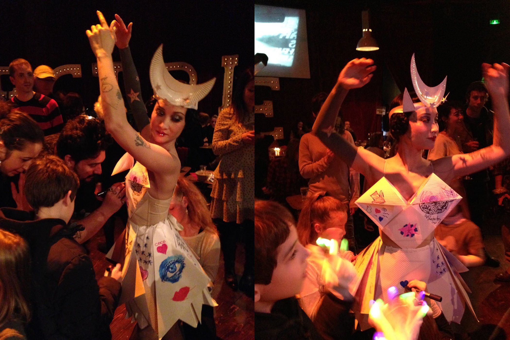

+++
type = "post"
titre = "Le Cabaret Électrique au Cirque Électrique"
title = "Le Cabaret Électrique au Cirque Électrique"
url = "/cabaret-electrique"
date = "2015-02-15T23:26:14"
Lastmod = "2015-02-15T23:37:02"
cover = "cabaret-electrique.jpg"
categorie = [ "À voir… en live" ]
tag = [ "Cabaret", "Cirque", "Spectacle" ]
lieu = [ "Cirque Électrique" ]

+++

Sous un chapiteau de cirque, autour d&rsquo;une piste de cirque, le <a href="http://cirque-electrique.fr/index.php/le-cirque-electrique/nos-creations/93-le-cabaret-electrique">Cabaret Électrique</a> fait aussi, comme son nom l&rsquo;indique bien, office de cabaret. On y mange, on y boit et on suit un spectacle qui est autant électrique qu&rsquo;éclectique. Un joyeux mélange qui ne brille pas par son professionnalisme, même si quelques numéros sont vraiment spectaculaires, mais plutôt par sa générosité. Un cirque modernisé, qui n&rsquo;est pas forcément à recommander aux enfants, mais qui est une vision intéressante de ce genre un peu désuet. À découvrir, jusqu&rsquo;à la fin du fois de mars à Paris, Porte des Lilas.

 
 
 
  
 
 
 

Dans ce Cabaret Électrique, il y a des numéros de cirque traditionnel, de l&rsquo;équilibriste qui tient sur un seul bras sur une tige au jongleur, en passant par le cerceau, mais en règle générale, chaque numéro est comme dynamité par une idée totalement absurde sur le papier. Par exemple, il y a bien un fil et un équilibriste, mais c&rsquo;est une moto qui roule dessus, et non simplement un homme. Et puis même les numéros les plus basiques sur le papier, comme le jongle de diabolo, sont rendus plus spectaculaires avec d&rsquo;excellentes idées, comme l&rsquo;utilisation d&rsquo;éléments lumineux dans le noir. C&rsquo;est parfois vraiment impressionnant, le clou du spectacle étant incontestablement cette construction astucieuse avec deux roues qui tournent autour d&rsquo;un même axe et avec deux personnes à l&rsquo;intérieur pour les faire tourner. Un numéro audacieux et réalisé sans aucun filet : autant dire que l&rsquo;on craint pour cet homme qui tourne les yeux bandés sur cette roue infernale.

 
 
 
  
 
 
 

Le Cabaret Électrique ne cherche pas la perfection formelle. Le jongleur lâche parfois ses batons enflammés, les équilibristes doivent parfois s&rsquo;y reprendre à plusieurs fois, bref, tout n&rsquo;est pas parfait, et c&rsquo;est très bien ainsi. L&rsquo;ambiance ici est plutôt à l&rsquo;improvisation et à la décontraction, avec une attitude assez légère par rapport à tous les numéros. L&rsquo;ambiance est aussi assez grivoise : en attendant le début du spectacle, les dessins de <a href="http://fr.wikipedia.org/wiki/Kiki_Picasso">Kiki Picasso</a> défilent sur les écrans, et on y voit, entre deux caricatures d&rsquo;hommes politiques, un sexe mordu, des pénétrations en gros plans et autres images sexuelles. C&rsquo;est un cirque, peut-être, mais c&rsquo;en est un où l&rsquo;on boit et où l&rsquo;on chante des chansons grivoises. Le présentateur a un accent parisien extrêmement travaillé et la musique, entièrement jouée en live, n&rsquo;a rien à voir avec la fanfare habituelle. Une batterie, une guitare, quelques claviers pour les effets, et on a de la musique rock, voire punk sur chaque numéro. L&rsquo;ensemble est redoutablement efficace et très plaisant. Même pour les numéros moins convaincants — une danseuse qui se jette sur du verre avant d&rsquo;éteindre un mégot sur ses lèvres… pourquoi ? —, la musique compense et on ne s&rsquo;ennuie jamais. Dommage que l&rsquo;entracte interrompe un petit peu trop l&rsquo;ambiance (surtout pour vendre des… préservatifs : ils ne mentent pas en distant que c&rsquo;était éclectique), mais la soirée reste réussie. Et puis on peut toujours dessiner la robe de la danseuse en attendant la reprise, c&rsquo;est aussi ça, le Cabaret Électrique.

Lancé à Bruxelles, passé à la Nouvelle-Orléans et à Shanghai, le Cabaret Électrique est un spectacle foutraque réjouissant. Si vous cherchez la performance pure, vous serez inévitablement déçu, mais ce spectacle simple et bon enfant est réjouissant. Difficile de ne pas s&rsquo;enthousiasmer pour ces numéros parfois osés et spectaculaires, parfois moins réussis, mais toujours sincères. Et pour les enfants, la compagnie propose aussi <a href="http://cirque-electrique.fr/index.php/le-cirque-electrique/nos-creations/81-les-creations-abadaba-le-retour-enfin-enfants-sortez-vos-parents">Abada</a>, un spectacle débarrassé de tous ce qui n&rsquo;est pas recommandé pour eux dans le Cabaret Électrique.

<em>Photos du Cirque Électrique, sauf la danseuse dessinée, photos de Patrick Furno</em>

