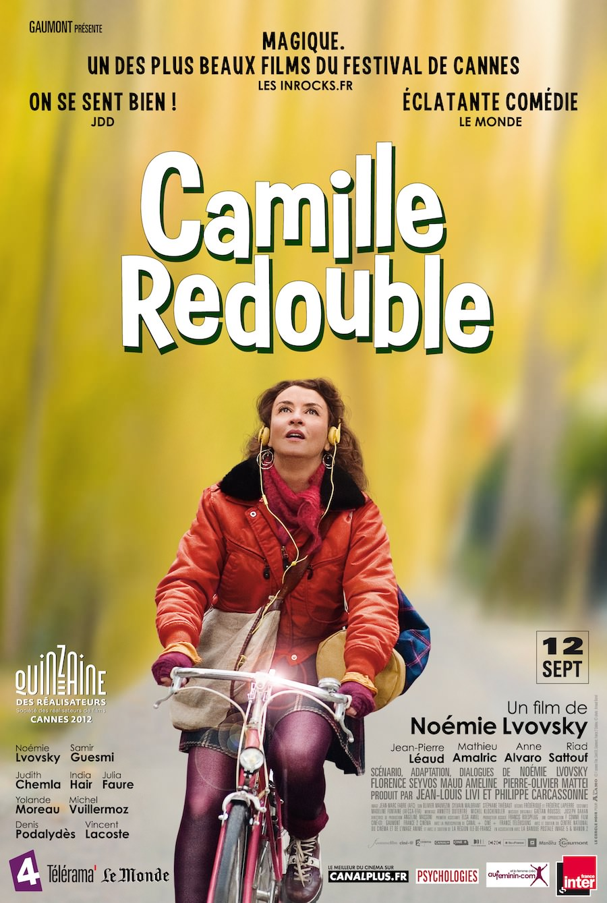
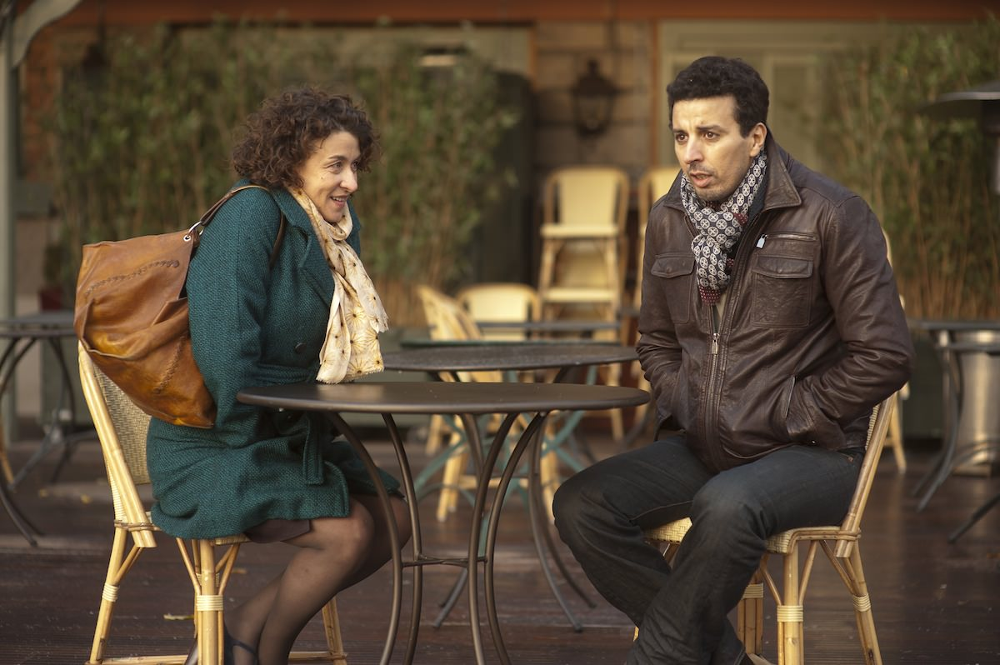
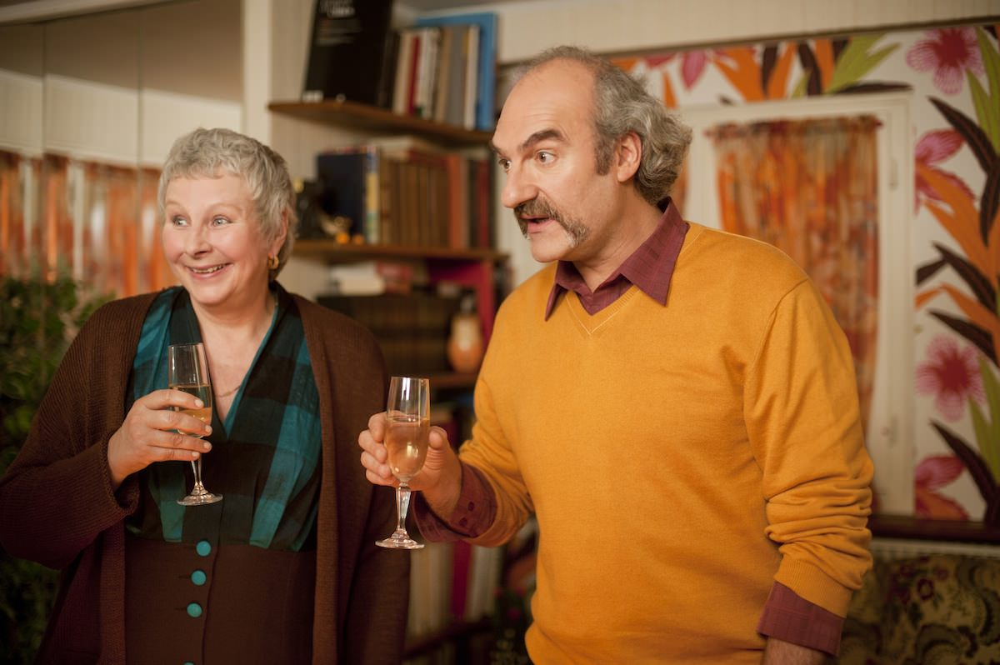

+++
type = "post"
titre = "Camille Redouble, Noémie Lvovsky"
title = "Camille Redouble, Noémie Lvovsky"
url = "/camille-redouble-lvovsky"
date = "2012-10-03T00:07:09"
Lastmod = "2013-01-25T14:35:43"
cover = "camille-redouble-lvovsky.jpg"
categorie = [ "À voir" ]
tag = [ "Adolescence", "Amour", "Comédie dramatique", "Famille", "Vie" ]
createur = [ "Noémie Lvovsky" ]
acteur = [ "Denis Podalydès", "Noémie Lvovsky", "Samir Guesmi", "Yolande Moreau" ]
annee = [ "2012" ]
weight = 2012
pays = [ "France" ]

+++

Pour son cinquième film derrière les caméras, Noémie Lvovsky a décidé de revivre ses 16 ans. <em>Camille Redouble</em> raconte l&rsquo;histoire étrange d&rsquo;une femme d&rsquo;une quarantaine d&rsquo;années qui retombe en pleine adolescence. Loin de donner dans le fantastique, la réalisatrice s&rsquo;attache plutôt aux souvenirs dans un film plein d&rsquo;émotions, toujours très juste et touchant. <em>Camille Redouble</em> fait du bien, mais pas d&rsquo;une façon niaise comme c&rsquo;est trop souvent le cas : un long-métrage à ne pas rater !

Camille est une actrice ratée. Elle enchaîne les petits rôles et les figurations, comme dans ce film d&rsquo;horreur où elle doit simplement jouer une femme endormie égorgée par un serial-killer. La quarantaine, elle en est instance de divorce avec l&rsquo;homme qu&rsquo;elle a épousé très jeune et elle noit son chagrin dans l&rsquo;alcool. Sa fille parvient difficilement à la maîtriser, mais elle réussit à la faire sortir en ce soir de réveillon et Camille se rend chez des amies qu&rsquo;elle n&rsquo;a pas vues depuis des années pour célébrer la nouvelle année. La soirée est largement arrosée et les verres s&rsquo;accumulent, trop même pour Camille qui s&rsquo;évanouit peu après minuit. Quand elle se réveille, elle se trouve dans un hôpital et ses deux parents, morts depuis plusieurs années, l&rsquo;attendent à son chevet. Alors qu&rsquo;elle a toute sa tête d&rsquo;une femme de 40 ans, Camille est remontée à ses 16 ans et doit revivre son adolescence. Quand son retour dans le passé commence, c&rsquo;est la rentrée au lycée et elle fait justement la rencontre d&rsquo;Éric, son futur mari…

<em>Camille Redouble</em> est construit sur une idée originale pour un long-métrage qui ne s&rsquo;apparente ni à la science-fiction, ni au fantastique. Le voyage temporel est un thème bien connu au cinéma, mais il ne s&rsquo;agit clairement pas de ça dans ce film. Noémie Lvovsky commence pourtant par instiller une ambiance fantastique diffuse, notamment avec son étrange personnage d&rsquo;horloger, si bien que l&rsquo;on pourrait croire par moment que son histoire tend dans cette direction. La réalité semble beaucoup plus simple dans un premier temps : Camille a trop bu, elle s&rsquo;évanouit, puis rêve qu&rsquo;elle est revenue à ses 16 ans. Une hypothèse parfaitement rationnelle que <em>Camille Redouble</em> vient évidemment remettre en cause en tissant des liens qui ne devraient pas être entre le présent du récit et le passé de son héroïne. Pendant le voyage temporel supposé, Camille sait ce qui se passera pendant la vingtaine d&rsquo;années suivantes, et elle essaie naturellement de tout faire pour modifier le futur. Elle sait par exemple que sa mère doit mourir quelques mois après d&rsquo;une rupture d&rsquo;anévrisme et elle parvient à l&rsquo;emmener faire un scanner. Elle sait aussi qu&rsquo;Éric voudra la quitter et cherche ainsi à tout faire pour éviter sa relation amoureuse avec le jeune homme. Noémie Lvovsky a la sagesse de ne jamais se lancer dans des explications rationnelles concernant le voyage dans le temps et les impacts qu&rsquo;il pourrait avoir sur le présent. <em>Camille Redouble</em> s&rsquo;avère ainsi beaucoup plus simple à comprendre, beaucoup plus proche du retour sur le passé proustien que de <em>Retour vers le futur</em>.

Noémie Lvovsky ne s&rsquo;intéresse pas vraiment au voyage dans le temps et à ses effets. Le sujet de <em>Camille Redouble</em> n&rsquo;est pas vraiment là, mais beaucoup plus sur les émotions suscitées par le retour dans le passé de son personnage principal. Camille regrette la mort de ses parents, survenue beaucoup trop tôt. Quand elle les revoit, avec sa conscience de femme adulte, l&rsquo;émotion est sensible, tout comme lorsqu&rsquo;elle découvre à nouveau pour la première fois Éric, celui qui était l&rsquo;homme de sa vie. Quelques plans suffisent alors à transmettre son émotion et tout le monde devrait s&rsquo;y retrouver, même ceux qui n&rsquo;ont pas du tout connu la période. La réalisatrice a un regard très nostalgique sur ces années 1980 et sur l&rsquo;adolescence, un regard assumé, même si <em>Camille Redouble</em> n&rsquo;est pas autobiographique. C&rsquo;est ce regard tendre qui fait la différence par rapport à tous ces films qui ont exploité la même idée de scénario : si le retour sur son passé n&rsquo;est pas une idée nouvelle au cinéma, loin de là, Noémie Lvovsky a une manière très personnelle de le traiter. Son regard est à la fois amusé et envieux. Le fait que Camille replonge en adolescence avec sa personnalité de quarantenaire crée nécessairement un décalage comique : bien plus mature que ses camarades, elle relativise les problèmes qui paraissent indépassables à cet âge et effraie les garçons avec une connaissance sexuelle hors norme. Il y a aussi de la nostalgie pour une époque de liberté incomparable où l&rsquo;on peut se lâcher et faire à peu près n&rsquo;importe quoi. <em>Camille Redouble</em> offre au total un cocktail d&rsquo;une efficacité remarquable et suscite, sans jamais la forcer, l&rsquo;émotion.

Il fallait une actrice hors pair pour interpréter Camille avec toute la sensibilité nécessaire et la réalisatrice a eu la bonne idée de se placer aussi devant la caméra. On sait que ce n&rsquo;est pas par vanité : Noémie Lvovksy a d&rsquo;abord cherché une autre actrice, avant de se laisser convaincre. Le succès de <em>Camille Redouble</em> tient d&rsquo;abord dans son jeu très naturel, très fin et surtout très impressionnant. Qu&rsquo;elle interprète très bien une femme d&rsquo;une quarantaine d&rsquo;années, soit ; qu&rsquo;elle interprète aussi bien une jeune adolescente de 16 ans avec son visage et surtout son corps de quarantenaire, c&rsquo;est une véritable prouesse. Loin des trucages complexes de <a title="L’étrange histoire de Benjamin Button, David Fincher" href="http://voiretmanger.fr/2009/02/17/etrange-histoire-de-benjamin-button-david-fincher/"><em>L’étrange histoire de Benjamin Button</em></a>, Noémie Lvovksy a décidé de faire confiance aux acteurs avec simplement un peu de maquillage et une coupe différente. Alors que tout semblait artificiel chez David Fincher, <em>Camille Redouble</em> parvient au contraire à une grande sincérité, une belle preuve du talent des acteurs et de la réalisatrice. Autour de cette dernière, les talents ne manquent pas de Yolande Moreau à Denis Podalydès, en passant par Samir Guesmi, ils sont tous très justes et touchants. La palme revient toutefois à Noémie Lvovksy, vraiment bluffante quand elle interprète la Camille adolescente, à tel point que l&rsquo;on oublie parfois qu&rsquo;elle a plus de 40 ans… La musique, composée en partie par Gaëtan Roussel et sélectionnée pour le reste dans le répertoire des années 1980, complète admirablement le tableau.

On sort de la salle heureux d&rsquo;avoir été plongés pendant près de deux heures dans l&rsquo;univers de Camille, adulte ou adolescente. Noémie Lvosvky a réussi à toucher ses spectateurs avec un film qui semble si personnel, autobiographique presque et <em>Camille Redouble</em> devrait plaire très largement et pas seulement à ceux qui ont eu 16 ans dans les années 1980. Le film se termine sans trop en dire, comme il faut, laissant au spectateur le soin éventuellement de compléter. Un très beau film, à ne surtout pas rater.

<h3>Vous voulez m&rsquo;aider ?<a href="#footnote_0_7522" id="identifier_0_7522" class="footnote-link footnote-identifier-link" title="&Agrave; propos de la publicit&eacute;&hellip;">1</a></h3>
<ul>
<li><a href="http://www.amazon.fr/gp/product/B00ABIPIZS/ref=as_li_ss_tl?ie=UTF8&#038;tag=leblogdenic07-21&#038;linkCode=as2&#038;camp=1642&#038;creative=19458&#038;creativeASIN=B00ABIPIZS">Acheter le film en Blu-Ray sur Amazon</a></li>
<li><a href="http://www.amazon.fr/gp/product/B00ABIPJE8/ref=as_li_ss_tl?ie=UTF8&#038;tag=leblogdenic07-21&#038;linkCode=as2&#038;camp=1642&#038;creative=19458&#038;creativeASIN=B00ABIPJE8">Acheter le film en DVD sur Amazon</a></li>
</ul>

<ol class="footnotes"><li id="footnote_0_7522" class="footnote"><a href="http://voiretmanger.fr/soutien/">À propos de la publicité…</a> [<a href="#identifier_0_7522" class="footnote-link footnote-back-link">&#8617;</a>]</li></ol>
