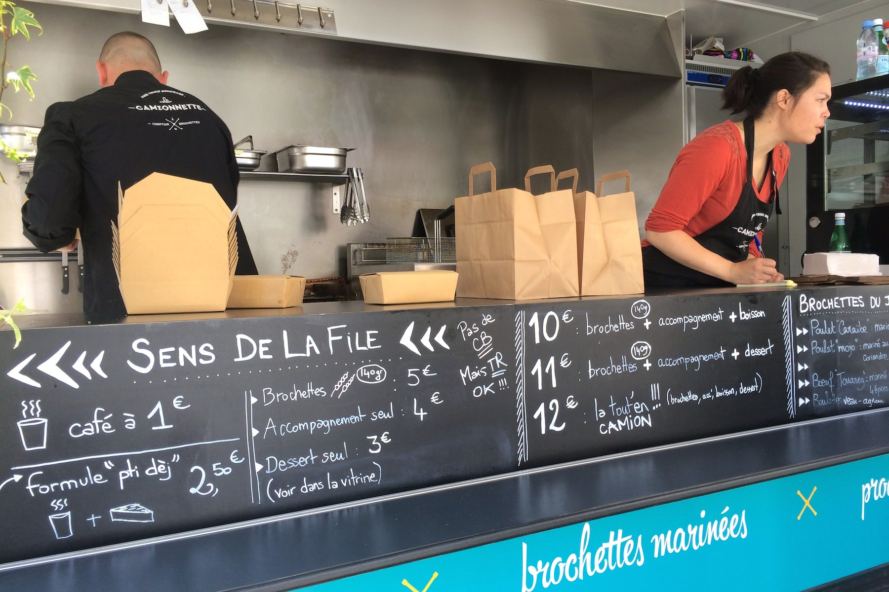
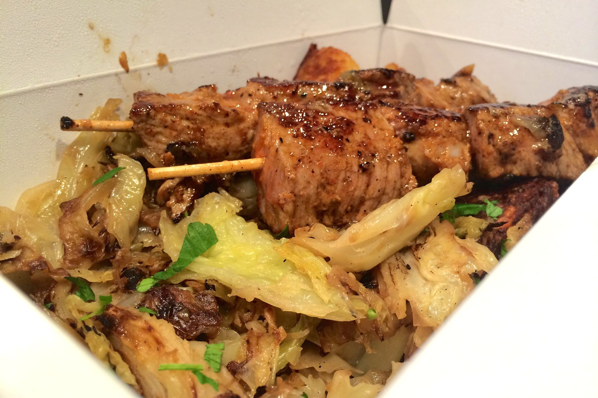
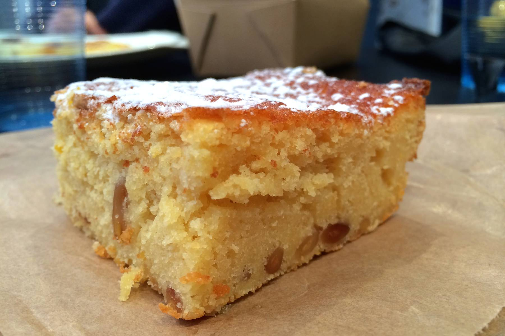

+++
titre = "La Camionnette à Lyon"
title = "La Camionnette à Lyon"
url = "/camionnette-lyon"
date = "2014-04-23T22:26:58"
Lastmod = "2014-04-23T22:54:54"
cover = "food-truck-la-camionette-lyon.jpg"
categorie = [ "À manger" ]
tag = [ "Brochettes", "Food Truck" ]

+++

Très populaires de l’autre côté de l’Atlantique, les « <em>Food Truck</em> » restent rares en France. C’est particulièrement vrai à Lyon, où la municipalité ne semble pas pressée d’autoriser ces petits camions qui proposent de la nourriture dans la rue et qui concurrencent les restaurants traditionnels. Parmi les pionniers du genre, on compte <a href="https://www.facebook.com/lacamionnettelovelyfoodtruck"><strong>La Camionnette</strong></a> qui cache derrière un nom assez banal un « comptoir à brochettes ». Tous les midis, on y mange des brochettes longuement marinées et cuites exactement comme il faut. Si vous cherchez un repas complet pour vos repas du midi, ne ratez pas ces excellentes brochettes !

Dans la camionnette verte bien visible de loin — c’est important sur un marché —, Cylia et Gaylord s’activent autour de leur fourneau. Le concept du mono-produit exige de ne servir que des brochettes, mais cette forme particulière laisse à <strong>La Camionnette</strong> toute latitude pour varier les plaisirs. Ainsi, le chef imagine des recettes différentes chaque jour et on a le choix entre trois à quatre brochettes différentes. Il y a du bœuf, du poulet ou encore de l’agneau, avec des épices, une marinade un peu sucrée… bref, il y a de quoi faire. Des menus accompagnent la brochette choisie d’un accompagnement qui change, là aussi très régulièrement. Une fois ce sera du boulgour avec quelques légumes. Un autre jour, du chou braisé accompagné de galettes de pomme de terre, ou bien encore des frites maison. Et pour compléter le tout, on peut opter pour un dessert qui est, lui aussi, maison. Au total, comptez une dizaine d’euros pour deux brochettes et l’accompagnement du jour, douze avec un dessert et une boisson. Un tarif raisonnable par rapport à un restaurant traditionnel, mais peut-être un peu élevé pour de la cuisine de rue.

Les brochettes sont préparées à l’avance, ce qui est nécessaire pour que les morceaux de viande s’imprègnent bien des épices et de la sauce qui les accompagne. En revanche, la cuisson se fait à la toute dernière minute, au moment de la commande, et c’est sans doute ce qui fait la différence. De fait, <strong>La Camionnette</strong> sert une viande vraiment excellente : le bœuf &laquo;&nbsp;touareg&nbsp;&raquo; par exemple est mariné avec du ras-el-hanout, du paprika et du quatre-épices, ce qui lui donne beaucoup de saveurs et une pointe orientale pas désagréable. Mais la vraie force de cette viande, c’est sa cuisson : loin de la brochette surcuite et sèche que l’on pouvait craindre, on a un bœuf encore rosé et juteux, un délice à manger. Ce n’est pas une exception : toutes les recettes essayées montrent que les assaisonnements sont précis et la cuisson rigoureuse, tout ce qu’il faut pour proposer des brochettes de qualité. Et le chef se permet même quelques originalités, à l’image de cette brochette de joues de porc au caramel parfaitement fondantes. Autant dire que la viande est à l’honneur dans cette camionnette, mais les accompagnements ne sont pas en reste. Assez simples en général, ils sont également cuits et assaisonnés avec précision et l’ensemble est très bon, tout comme les desserts maison qui vont souvent chercher leur inspiration outre-Atlantique et qui sont frais et réussis.

Difficile de bouder son plaisir : <strong>La Camionnette</strong> ne propose pas simplement des brochettes avec quelques carrés de viande, mais des brochettes marinées avec beaucoup de goût et surtout cuites à la perfection. L’ensemble est à la fois original et savoureux, si bien que l’on aimerait souvent en avoir un petit peu plus. Pour une bonne dizaine d’euros, on a un repas complet et très bon, une vraie réussite ! Si cette camionnette verte passe près de votre lieu de travail le midi, ne la ratez pas…

<em><strong>La Camionnette</strong> se déplace sur plusieurs marchés ou quartiers à Lyon et les alentours. Pour connaître les prochains lieux prévus, abonnez-vous à cette <a href="https://www.facebook.com/lacamionnettelovelyfoodtruck">page Facebook</a>. Même s’il y a parfois des imprévus, on les retrouve en général sur le marché Jean Macé les mercredis, et sur celui du quai Augagneur les samedis.</em>

