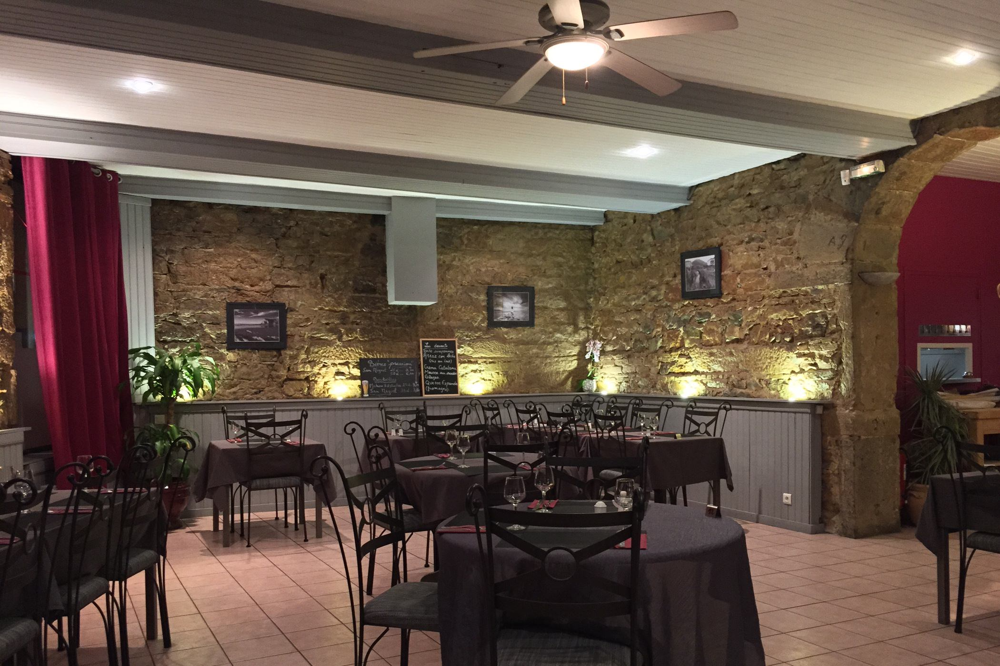
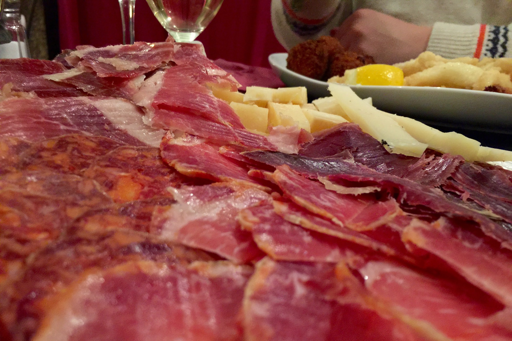
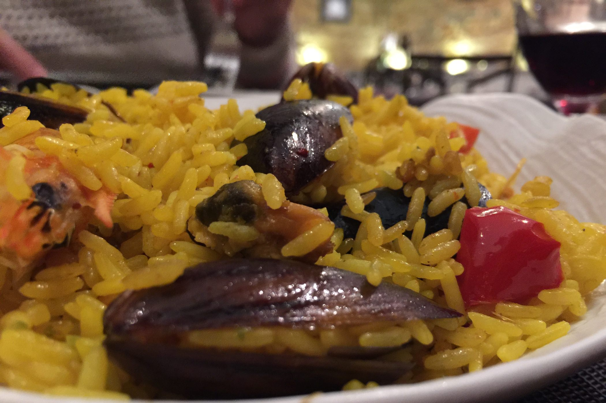
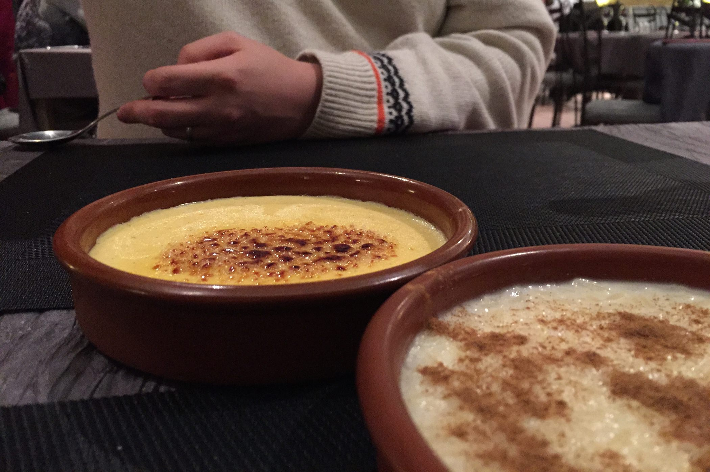

+++
titre = "Le Cantabria à Lyon"
title = "Le Cantabria à Lyon"
url = "/cantabria-lyon"
date = "2015-03-14T23:14:08"
Lastmod = "2015-03-30T11:25:28"
cover = "cantabria-lyon.jpg"
categorie = [ "À manger" ]
tag = [ "69009", "Charcuterie", "Cuisine espagnole", "Poisson" ]

+++

À deux pas de la place Valmy, au cœur du quartier Vaise, le <a href="http://cantabria.fr/index.html"><strong>Cantabria</strong></a> annonce la couleur dès son nom. Cette adresse menée par deux espagnols promet une plongée dans la gastronomie ibérique, avec un accent particulier porté sur la cuisine de la Cantabrie, cette région verte du nord de l&rsquo;Espagne. Une région spécialisée pour ses fromages et ses produits venus de la mer, mais ce restaurant qui vient à peine d&rsquo;ouvrir ne s&rsquo;y limite pas. La devanture qui annonce des tapas et en particulier les fameux <a href="http://fr.wikipedia.org/wiki/Pintxo"><em>Pintxos</em></a> &#8211; équivalent local de nos tartines — met l&rsquo;eau à la bouche. À l&rsquo;arrivée, c&rsquo;est pourtant une déception : les tapas sont parfaits, mais le reste ne suit pas, dommage.

La salle du restaurant est assez grande et les tables bien espacées, mais une trentaine de couverts peuvent être servis chaque soir. Les murs en pierre nue sont chaleureux, mais l&rsquo;ensemble n&rsquo;est peut-être pas aussi hispanique qu&rsquo;on pourrait l&rsquo;espérer. Les bars à tapas espagnols sont souvent beaucoup plus chargés et le bar à l&rsquo;entrée n&rsquo;appelle pas à la même convivialité, même si les pattes de jambon, bien visibles, promettent le meilleur. Le <strong>Cantabria</strong> a beau être un restaurant français, on sent le traditionnel décalage horaire ibérique dès que l&rsquo;on passe la porte. Un samedi soir, les lieux étaient encore totalement vides à 20 h et il faut attendre une bonne heure pour que la salle se remplisse et s&rsquo;anime enfin. Quoi qu&rsquo;il en soit, on s&rsquo;attable avec <a href="http://voiretmanger.fr/wp-content/2015/03/cantabria-carte.jpeg">une carte</a> assez limitée, mais qui met en avant des produits tous faits maison. Seules les glaces, en dessert, ne sont pas faites sur place, d&rsquo;après ce que revendique le restaurant, un excellent point. Côté tarifs, c&rsquo;est assez raisonnable si l&rsquo;on s&rsquo;en tient aux menus avec, le soir, deux propositions à 22 ou 30 € pour trois assiettes dans les deux cas. Comme souvent, les tapas et autres produits pour apéritifs feront vite monter la note : une vingtaine d&rsquo;euros pour de la charcuterie et du fromage, 15 € pour quelques fritures, 17 € pour les <em>pintxos</em>… Pour arroser le tout, des vins espagnols bien entendu, mais malheureusement ceux proposés en verre sont vraiment bas de gamme et ils ne permettent pas vraiment de gouter la richesse viticole de l&rsquo;Espagne.

Première mauvaise surprise, aucune tartine traditionnelle au programme ce soir-là. La serveuse nous annonce même qu&rsquo;ils vont être retirés définitivement de la carte, ce qui paraît très étrange pour un produit aussi phare. Sans compter qu&rsquo;on les retrouve partout sur la devanture : si on vient pour eux, on en sera pour ses frais. Qu&rsquo;à cela ne tienne, nous nous reportons sur un assortiment de fritures d&rsquo;un côté et un plateau de charcuterie et de fromages de l&rsquo;autre. Ces deux assiettes sont excellentes, avec des produits de qualité exceptionnelle et en quantité plus que généreuse. Les fritures font la part belle au poulpe et le crustacé est non seulement frais comme il se doit, mais en plus cuit à la perfection. Résultat, il est tendre et goûteux, et la fine couche de friture apporte ce qu&rsquo;il faut de croustillant : avec l&rsquo;aïoli léger servi en même temps, c&rsquo;est un délice. À côté, on a aussi des croquettes de jambon et des moules farcies qui sont manifestement faites sur place, et qui sont également très bonnes. L&rsquo;assiette de charcuterie n&rsquo;est pas en reste : le jambon ibérique qui trône sur le bar est servi en quantité généreuse, mais il y a aussi du chorizo, du lomo et du bœuf séché, sans oublier le <em>manchego</em>. L&rsquo;ensemble est excellent, ce sont des produits de qualité, qui viennent sans aucun doute directement de la péninsule et cela se sent. On a envie de tout finir tellement c&rsquo;est bon, mais le patron est trop généreux et on doit en laisser, à regret.

Avec un tel début, le <strong>Cantabria</strong> a placé la barre très haut et même si on n&rsquo;a déjà plus très faim, on attend la suite avec impatience. Et là, c&rsquo;est la catastrophe ! Les « <em>chipirones en su tinta</em> », des petits calamars cuits dans l&rsquo;encre de seiche, ressemblent à ce que l&rsquo;on a en boîte de conserve, le côté frais et évidemment fait maison des calamars fris de l&rsquo;entrée a totalement disparu. Et que dire du riz blanc qui les accompagne, si ce n&rsquo;est que l&rsquo;on dirait un riz précuit, sec et sans saveur. C&rsquo;est encore pire pour la paella : non seulement la carte promet une version mixte, logique pour une recette cantabraise, alors que l&rsquo;on a finalement que des fruits de mer. Passons, ce ne serait pas si grave si les produits en question étaient bons, mais ce n&rsquo;est absolument pas le cas. Crevette et moules sont beaucoup trop cuits et pâteuses, comme si elles sortaient directement du congélateur. Quant au riz, il est bien jaune, mais c&rsquo;est la seule caractéristique reconnaissable de la paella. Pour le reste, il est sec et manque de cuisson. L&rsquo;ensemble est trop salé et… mauvais, tout simplement : on dirait une paella de cantine, mais absolument pas un plat mijoté par un vrai espagnol. Le patron, bien espagnol lui, devrait avoir honte de servir un plat aussi médiocre. Hélas, les desserts ne relèvent pas le niveau : la crème catalane n&rsquo;a de catalane que le nom, mais cette crème brulée est plutôt convaincante. En revanche, le riz au lait est fait avec le même riz que les plats et ce dessert manque cruellement de gourmandise ; ce n&rsquo;est pas la cannelle (trop) abondante qui vient le sauver.

Quelle déception ! Le <strong>Cantabria</strong> propose des produits d&rsquo;excellente qualité pour l&rsquo;apéro, mais passée l&rsquo;heure des tapas, la cuisine ne suit pas. Les plats espagnols traditionnels ne sont pas cuisinés, on dirait un assemblage de produits pour le coup tout à fait communs, à tel point que l&rsquo;on se demande bien comment on peut parler de cuisine faite maison. L&rsquo;adresse reste intéressante pour ses tapas, mais mieux vaut éviter d&rsquo;aller au-delà, malheureusement…

