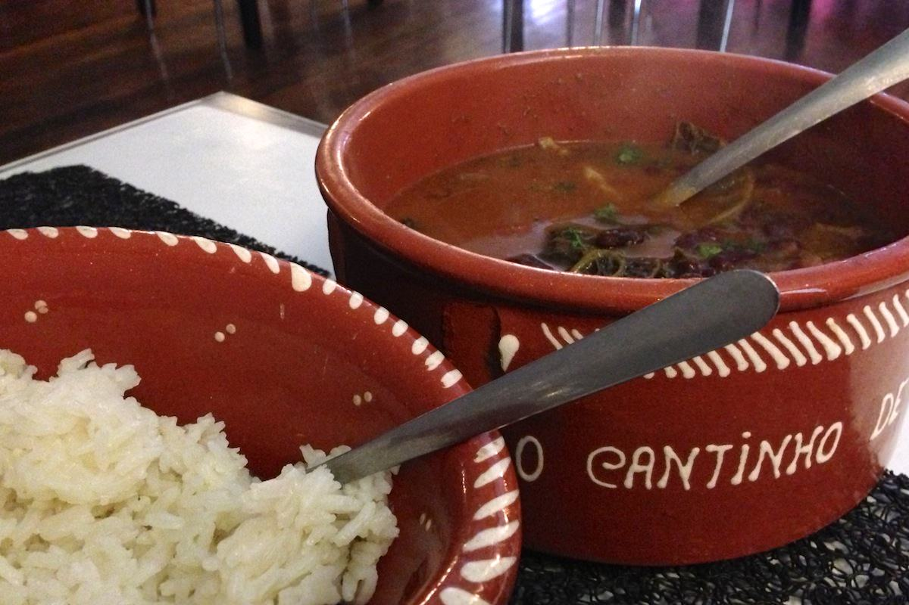
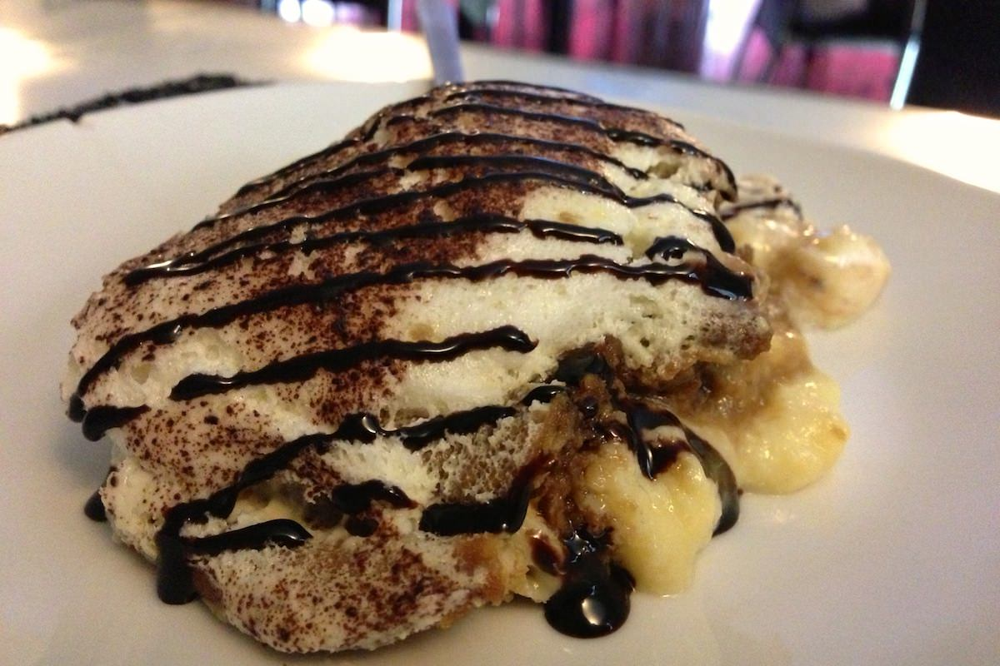

+++
titre = "O Cantinho de Portugal à Lyon"
title = "O Cantinho de Portugal à Lyon"
url = "/cantinho-portugal-lyon"
date = "2013-02-27T20:05:18"
Lastmod = "2013-02-27T20:11:08"
cover = "cantinho-portugal-lyon.jpg"
categorie = [ "À manger" ]
tag = [ "Cantine", "Cuisine portugaise", "Cuisine régionale" ]

+++

<a href="http://www.lyonresto.com/restaurant-Lyon/restaurant-O-Cantinho-de-Portugal-Lyon/restaurant-O-Cantinho-de-Portugal-Lyon-7513.html"><strong>O Cantinho de Portugal</strong></a> annonce la couleur par son nom. Cette cantine située dans une petite rue du septième arrondissement lyonnais propose une cuisine portugaise et même exclusivement portugaise. Des plats traditionnels que l’on ne connaît pas forcément et qui sont souvent excellents : cette adresse permet de les découvrir à petit prix. Si vous cherchez un restaurant portugais à Lyon, c’est un lieu à retenir.

On peut facilement passer à côté d’<strong>O Cantinho de Portugal</strong>. Malgré ses stores (très) rouges, sa devanture reste discrète et évoque plus un bar qu’un restaurant. Il ne s’agit pas d’un restaurant gastronomique étoilé et on n’attend pas autre chose que cet aperçu qui rassure tous ceux qui viennent chercher de la vraie cuisine portugaise. À l’intérieur, on a d’ailleurs un peu l’impression de changer de pays. Les habitués parlent portugais avec les serveurs et on verra bien vite que la carte est, elle aussi, très portugaise, même si elle est traduite en français. Au rez-de-chaussée, une dizaine de tables à côté d’un bar tout en bois plutôt élégant ; en haut, une salle un peu plus grande, mais aussi plus sombre, à côté de la cuisine. Ce n’est pas un grand restaurant, mais il peut y avoir un peu de monde, avec une ambiance qui n’a rien d’intimiste. Le côté cantine est sensible, même si les couverts et la vaisselle sont de bonne qualité : ici, le côté pratique et convivial est mis en avant. Rien à redire, si ce n’est les travaux dans l’immeuble d’à côté qui faisaient beaucoup de bruit ce jour-là — un midi en semaine — et surtout les odeurs de la cuisine un peu trop présentes en salle. Rien de rédhibitoire toutefois, mais autant le savoir : vous ne viendrez pas ici pour un diner en amoureux, en tout cas pas le midi. Le serveur très sympathique et qui prend le temps d’expliquer sa cuisine aux néophytes est en revanche très agréable.

Sans surprise, la carte regorge de plats portugais plus ou moins connus. Si les acras de morue sont un grand classique, les noms en portugais de certains plats et desserts le sont moins. On attaque avec un trio de beignets avec, outre l’incontournable acra, un beignet de viande et un autre de fruit de mer. Dans l’assiette, on a en fait un cromesqui avec sa coque croustillante assez fine. L’ensemble est bon et très bon marché, une constante à l’<strong>O Cantinho de Portugal</strong>. Côté plats, nous nous sommes laissés convaincre par le plat du jour, un plat mystérieux, mais vraiment excellent. Le <a href="http://elsinha.canalblog.com/archives/2006/11/14/3167064.html"><em>Feijoada à transmontana</em></a> nous a été présenté comme une sorte de cassoulet à base de haricots rouges. Apporté dans un plat en grès à se partager, ce plat mêle des morceaux de porc si bien cuits qu’ils en deviennent fondants, des morceaux de saucisse, des haricots rouges et du chou avec une bonne dose de sauce bien goûteuse. Le tout est accompagné de riz et c’est un plat extrêmement copieux : le serveur nous précise en posant les deux cocottes que l’on pourra en demander à nouveau s’il en manque, mais nous avons été loin de le finir en mangeant déjà plus que de raison… Pour 11 € par personne, c’est un rapport qualité/prix imbattable et cette cuisine familiale était vraiment excellente. Nous savions que l’un des desserts portugais à la carte était un incontournable et malgré ce plat bien copieux, nous nous sommes laissés tenter par le <a href="http://so-delicioso.blogspot.fr/2011/02/bolo-de-bolacha.html"><em>Bolo de bolacha</em></a>. D’aspect, ce dessert ressemble au tiramisu italien, mais il n’a pas du tout le même goût. À l’intérieur, on trouve une mousse, des biscuits trempés, mais aussi une sorte de crème pâtissière. Difficile de savoir ce qu’il y avait exactement dedans, d’autant que la part n’est pas élégante dans l’assiette, mais c’était tout simplement succulent. À ce stade, on n’a plus faim du tout, mais on en demanderait bien une autre part…

On ne vient pas à l’<strong>O Cantinho de Portugal</strong> pour déguster des plats compliqués, encore moins pour faire un régime, mais si vous cherchez à découvrir la cuisine portugaise, c’est une excellente adresse. Les plats servis sans chichi sont vraiment savoureux et la note n’est pas exagérée, bien au contraire, avec des plats qui n’atteignent pas les 15 €. Une belle découverte…

