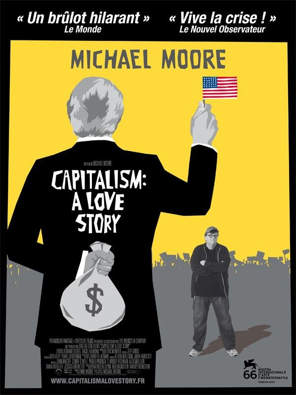

+++
type = "post"
titre = "Capitalism : A Love Story, Michael Moore"
title = "Capitalism : A Love Story, Michael Moore"
url = "/capitalism-love-story-moore"
date = "2009-11-29T01:23:36"
Lastmod = "2013-04-01T09:58:35"
cover = "capitalism-a-love-story-michael-moore1.jpg"
categorie = [ "À voir" ]
tag = [ "Crise", "Documentaire", "Économie", "Pamphlet", "Société" ]
annee = [ "2009" ]
weight = 2009
pays = [ "États-Unis" ]

+++

Après la politique de Bush et le système de santé, Michael Moore revient, cette fois pour s&rsquo;attaquer à rien de moins que le capitalisme. <em>Capitalism : A Love Story</em> est un pamphlet contre les dérives du système, contre les banques qui ont profité de la crise pour s&rsquo;enrichir encore plus, et en faveur de tous les pauvres qui ont tout perdu. Un pamphlet efficace, même si les ficelles du système Moore sont de plus en plus visibles.

Michael Moore ne pouvait guère ignorer la crise financière. Après tout, il a commencé sa carrière de cinéaste sur les ruines encore fumantes de General Motors à Flint avec <em>Roger et moi</em>. Depuis, très régulièrement, il a sorti de nouveaux &laquo;&nbsp;documentaires&nbsp;&raquo; s&rsquo;attaquant à un point précis des États-Unis, que ce soit le port des armes (<em>Bowling For Columbine</em>), le système de santé (<em>Sicko</em>) ou encore l&rsquo;administration Bush (<em>Fahrenheit 9/11</em>).

Michael Moore n&rsquo;a eu de cesse, au fil de ses films, d&rsquo;affiner un style bien à lui basé sur un personnage qu&rsquo;il interprète lui-même et qui serait un peu un Candide des temps modernes. Refusant les problèmes sans agir, il se mouille, va sur le terrain et interroge les responsables ou expérimente lui-même ce qu&rsquo;il dénonce (séquence culte de <em>Bowling For Columbine</em> où il obtenait un fusil en échange de l&rsquo;ouverture d&rsquo;un compte en banque). Le tout avec une naïveté aussi drôle qu&rsquo;efficace sur le plan de l&rsquo;argumentation.

Cette recette est évidemment présente dans son dernier film qui s&rsquo;attaque rien de moins qu&rsquo;au capitalisme. Programme chargé et d&rsquo;actualité en ces temps de crises financières, alors que Dubai, symbole suprême du capitalisme financier qui s&rsquo;auto-entretient, vacille. Michael Moore nous raconte ainsi l&rsquo;histoire de la crise, à partir de la dérégulation des années Reagan jusqu&rsquo;au plan Paulson, tout en ponctuant son récit d&rsquo;exemples concrets d&rsquo;entubage en règle des Américains moyens par les banques.

On n&rsquo;apprend peu de choses que l&rsquo;on ne sache déjà, même si on découvre avec horreur, mais aussi fascination, les idées toujours plus folles que les entreprises et banques ont mis en place pour gagner toujours plus d&rsquo;argent. Ainsi, l&rsquo;idée de souscrire une assurance vie aux dépens de ses employés, et espérer leur mort puisqu&rsquo;ils rapportent alors plus morts que vivants est quand même assez terrifiante et géniale dans le genre. L&rsquo;idée aussi de refinancer une maison acquise depuis 20 ans pour finalement endetter totalement les occupants et les expulser de chez eux est aussi une idée totalement folle, très shadok dans l&rsquo;esprit, mais qui a fonctionné dans des millions de cas. Le décryptage du plan Paulson, qui a permis aux banques américaines d&rsquo;obtenir 700 milliards de dollars sans avoir à rendre de compte, est assez brillant. Michael Moore montre bien comment les lobbys ont orchestré l&rsquo;affaire et manipulé le Congrès à deux semaines des élections, jouant de la psychose ambiante et s&rsquo;aidant des médias. C&rsquo;est un plan machiavélique au possible, mais brillant et très bien expliqué.

<em>Capitalism : A Love Story</em> n&rsquo;est pas un documentaire qu&rsquo;on se le dise. C&rsquo;est un pamphlet et même un acte de candidature si l&rsquo;on en croit l&rsquo;appel final à l&rsquo;action. Un pamphlet qui n&rsquo;a qu&rsquo;un objectif unique : faire comprendre aux Américains moyens que le capitalisme n&rsquo;est pas le système idéal qu&rsquo;il faut revenir à plus de démocratie et agir contre les banques et plus largement les grandes entreprises américaines. C&rsquo;est parce que c&rsquo;est un pamphlet et non un documentaire que le film se permet des amalgames au kilomètre, se permet de lier des images qui n&rsquo;ont rien à voir entre elles pour passer un message. Tous les moyens sont bons, et s&rsquo;il faut au passage mettre en scène ses interventions, Michael Moore n&rsquo;hésitera pas à la faire.

Peut-être est-ce que l&rsquo;on se lasse, à force, de ce système bien rodé déjà. Toujours est-il que je trouve les effets Moore de plus en plus visibles, ce qui leur fait perdre au passage toute efficacité. Quand il s&rsquo;attarde sur les larmes des Américains moyens avec des violons larmoyants (surtout pour le plan du garçon quand le père lit sa lettre d&rsquo;amour à son ancienne femme), quand il rapproche l&rsquo;Empire romain décadent et les États-Unis ou au contraire les années 1950 et actuelles, quand il dit que l&rsquo;Europe est bien meilleure, bref quand il grossit tellement le message que l&rsquo;on ne peut plus le suivre, Michael Moore faiblit. Ses commentaires appliqués aux images d&rsquo;archives semblent aussi beaucoup trop exagérés pour être pris vraiment au sérieux.

Étonnamment, il est beaucoup plus efficace quand il se fait Robin des Bois des temps modernes, allant chercher avec un sac et un camion de convoyeur de fond l&rsquo;argent du plan Paulson auprès des banques, quand il entoure Wall Street d&rsquo;un bandeau &laquo;&nbsp;Scene Crime&nbsp;&raquo; ou quand il cherche à arrêter les dirigeants des banques pour vol des Américains. Bien sûr, ces scènes sont écrites et artificielles, mais elles sont à la fois drôles et très efficaces. On retrouve alors le Michael Moore des débuts, quand il allait interviewer un responsable de General Motors au culot. À sa décharge, il est aujourd&rsquo;hui trop connu pour pouvoir encore jouer ce rôle et ça n&rsquo;est pas vraiment de sa faute si les agents de sécurité le repèrent à des kilomètres et le virent sans avoir eu le temps de poser la moindre question.

Si Michael Moore peut agacer en Europe, si ses films semblent démagos, c&rsquo;est parce que nous ne sommes pas concernés par son travail. Il s&rsquo;agit de pamphlets à destination des Américains, et uniquement à leur destination. Vu sous cet angle, <em>Capitalism : A Love Story</em> est sans conteste une réussite. Le message est très clair et sans ambiguïté et sera compris par tous. Le réalisateur veut inciter à la résistance du peuple contre le capitalisme jugé, d&rsquo;après l&rsquo;Église catholique qui ne manque pas ici de se ridiculiser, comme étant le Mal à détruire. C&rsquo;est naïf, c&rsquo;est démagogique (il s&rsquo;inclut constamment par le &laquo;&nbsp;nous&nbsp;&raquo; avec les pauvres Américains&#8230; mais bien sûr&#8230;), mais c&rsquo;est aussi Michael Moore et je pense qu&rsquo;on ne peut pas lui enlever la sincérité.

Rob a <a href="http://www.toujoursraison.com/2009/11/capitalism-love-story.html">un avis plus tranché</a>, fustigeant notamment, avec raison d&rsquo;ailleurs, le &laquo;&nbsp;c&rsquo;était mieux avant&nbsp;&raquo; constant dans le film. Nicolas <a href="http://cinema-ici-ailleurs.over-blog.com/article-capitalism-a-love-story-2009-39703382.html">a bien aimé</a> et pour être franc, je suis d&rsquo;accord avec lui en fait. Un film de Michael Moore reste efficace, mais à titre purement personnel, je préfère son cousin autrichien Wagenhoffer. L&rsquo;objectif et le public ne sont pas les mêmes&#8230;

Sinon, dans le genre pamphlet du pamphlet, je recommande <a href="http://www.critikat.com/Capitalism-A-Love-Story.html">la critique de Critikat</a>&#8230;

<h3>Vous voulez m&rsquo;aider ?<a href="#footnote_0_2143" id="identifier_0_2143" class="footnote-link footnote-identifier-link" title="&Agrave; propos de la publicit&eacute;&hellip;">1</a></h3>
<ul>
<li><a href="http://www.amazon.fr/gp/product/B0030Y11O2/ref=as_li_ss_tl?ie=UTF8&tag=leblogdenic07-21&linkCode=as2&camp=1642&creative=19458&creativeASIN=B0030Y11O2">Acheter le film en Blu-Ray sur Amazon</a></li>
<li><a href="http://www.amazon.fr/gp/product/B003162RZG/ref=as_li_ss_tl?ie=UTF8&tag=leblogdenic07-21&linkCode=as2&camp=1642&creative=19458&creativeASIN=B003162RZG">Acheter le film en DVD sur Amazon</a></li>
<li><a href="http://itunes.apple.com/fr/movie/capitalism-a-love-story/id368868952">Acheter le film sur l&rsquo;iTunes Store</a></li>
</ul>

<ol class="footnotes"><li id="footnote_0_2143" class="footnote"><a href="http://voiretmanger.fr/a-propos/publicite/">À propos de la publicité…</a> [<a href="#identifier_0_2143" class="footnote-link footnote-back-link">&#8617;</a>]</li></ol>
