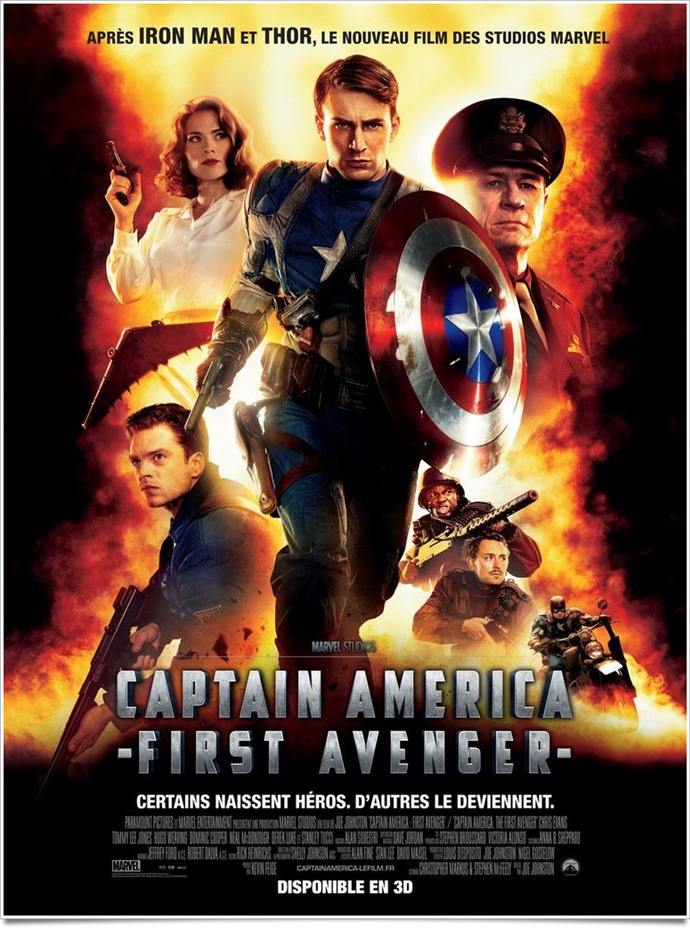
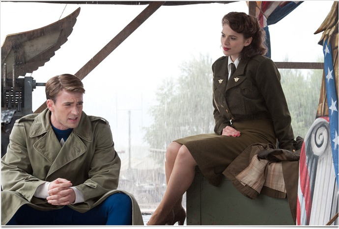
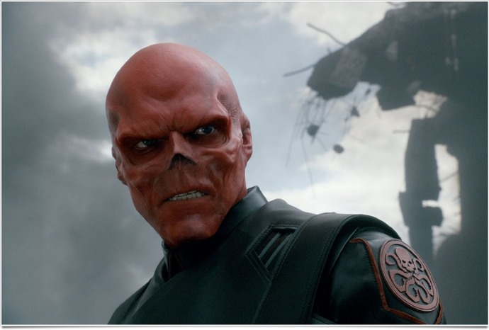

+++
type = "post"
titre = "<em>Captain America : First Avenger</em>, Joe Johnston"
title = "Captain America : First Avenger, Joe Johnston"
url = "/captain-america-first-avenger-johnston"
date = "2011-08-20T02:33:45"
Lastmod = "2015-05-06T11:39:15"
cover = "captain-america-first-avenger-johnston.jpg"
categorie = [ "À voir" ]
tag = [ "Avengers", "Blockbuster", "Comics", "Guerre", "Superhéros", "Vite oublié" ]
createur = [ "Joe Johnston" ]
acteur = [ "Chris Evans", "Hayley Atwell", "Sebastian Stan", "Tommy Lee Jones" ]
annee = [ "2011" ]
weight = 2011
saga = [ "Avengers", "Captain America" ]
pays = [ "États-Unis" ]
original = "Captain America: The First Avenger"

+++

Les <a href="http://voiretmanger.fr/tag/avengers/">Avengers</a>, groupe mythique de superhéros Marvel… Le studio prépare patiemment le débarquement de ce groupe sur grand écran, en mai 2012. Les vengeurs ont d&rsquo;abord avancé masqués, mais le groupe se forme peu à peu autour de la figure de Nick Fury qui est apparue furtivement pendant les deux <em>Iron Man</em> ou récemment dans <em><a href="http://voiretmanger.fr/2011/04/30/thor-branagh/">Thor</a></em>. Avec <em>Captain America : First Avenger</em>, ils s&rsquo;avancent néanmoins à visage découvert. Le film de Joe Johnston est le premier à être relié aussi clairement au groupe de superhéros, avec cette fois l&rsquo;introduction du plus américain d&rsquo;entre eux. Contrairement à la plupart des adaptations de comics récentes, <em>Captain America : First Avenger</em> est une adaptation à l&rsquo;ancienne, très premier degré. Les fans du comics apprécieront certainement, mais le film s&rsquo;avère finalement assez décevant, même si le grand spectacle du blockbuster estival est assuré.

« <em>Certains naissent héros. D&rsquo;autres le deviennent</em>. » scande l&rsquo;affiche. De fait, <em>Captain America : First Avenger</em> raconte la naissance d&rsquo;un superhéros qui ne nait pas avec ses superpouvoirs (Superman, Thor) mais qui le devient, non pas à la faveur d&rsquo;un hasard (Spiderman) ou de sa richesse (Iron Man, Batman), mais… grâce à l&rsquo;armée américaine. New York, début des années 1940 : Steve Rogers rêve de partir sur le front européen défendre son pays, mais il est systématiquement refusé. Trop petit et chétif, asmathique, il est bien trop fragile pour servir sous le drapeau, mais le jeune homme s&rsquo;entête. Il finit par croiser la route d&rsquo;un programme expérimental qui vise à fournir à l&rsquo;armée américaine des super soldats capables d&rsquo;inverser le cours de la guerre. Steve est le premier à faire l&rsquo;expérience du programme qui s&rsquo;avère parfaitement réussi : il devient un géant extrêmement musclé, incapable de tomber malade et résistant à tous les coups. Expérience réussie, mais son concepteur meurt alors et Steve est le seul super soldat du pays. Plutôt que de l&rsquo;envoyer au front, l&rsquo;armée décide de le garder pour en faire un symbole et inciter les Américains à financer l&rsquo;effort de guerre, jusqu&rsquo;au jour où il décide d&rsquo;abandonner la propagande et agir. Il faut dire que la menace pèse : Hydra, division nazie dédiée aux recherches sur les sciences obscures et dirigée par un savant fou, menace de faire exploser les États-Unis, rien que ça…

<em>Captain America : First Avenger</em> est le récit de la formation d&rsquo;un superhéros et la structure du film est assez classique. On découvre d&rsquo;abord le Steve chétif, mais bagarreur qui ne lâche jamais et entend tout faire pour servir son pays. Viennent ensuite la transformation et les premiers exploits du superhéros, jusqu&rsquo;à la consécration. Là où le film devient plus intéressant, c&rsquo;est justement parce que le passage du looser au superhéros n&rsquo;est pas des plus ordinaires. Steve ne devient pas un superhéros du jour au lendemain, mais il devient Captain America, personnage de propagande utilisé par l&rsquo;armée américaine pour inciter les gens à payer. Juste après la transformation, Steve n&rsquo;est pas envoyé au front, il est même rejeté comme un malpropre par son officier et au contraire accueilli les bras ouverts par les politiciens qui voient immédiatement le potentiel à en tirer. Joe Johnston a fait le choix de mettre l&rsquo;accent sur cette étape intermédiaire où Captain America fait le clown sur scène, un moment crucial quand il doit se confronter à la réalité du front. Nonobstant cette originalité, le film retrouve le rythme habituel des films de superhéros. Engagé par l&rsquo;armée, Steve garde son uniforme de propagande et en fait un uniforme de superhéros, avec notamment son fameux bouclier capable de résister à toutes les balles. <em>Captain America : First Avenger</em> enchaîne les exploits qui mènent jusqu&rsquo;à l&rsquo;affrontement final avec le boss de fin, en l&rsquo;occurrence Red Skull, un méchant assez impressionnant à voir.

<em>Captain America : First Avenger</em> ne cherche pas l&rsquo;originalité à tout prix, mais c&rsquo;est après tout le cas de toutes les adaptations de comics, ou presque. Le choix plus marqué et original de Joe Johnston est plutôt de faire une adaptation à l&rsquo;ancienne, loin du réalisme qui a prévalu ces dernières années et qui a cumulé dans les deux <em>Batman</em> de Christopher Nolan. <em>Captain America : First Avenger</em> est au contraire un film très premier degré où le superhéros arrive, casse tout sur son passage et sauve le monde, point final. Ici, nulle trace d&rsquo;état d&rsquo;âme, nul questionnement sur les motivations du superhéros : Captain America est un personnage plutôt monolithique capable uniquement de faire le bien et de sauver les États-Unis. Le film n&rsquo;est sans doute pas entièrement responsable de ce manque d&rsquo;épaisseur, le personnage est certainement ainsi dans l&rsquo;œuvre originale de Marvel, mais reste que Captain America est certainement un des superhéros les moins passionnants de ces dernières années. <em>Captain America : First Avenger</em> est à l&rsquo;image de son héros, assez monolithique. L&rsquo;univers des années 1940 est plutôt bien retranscrit, la patine d&rsquo;un film tendance old-school est assez réussie, mais le film peine à vraiment soulever l&rsquo;enthousiasme de ses spectateurs. La faute à un récit trop linéaire sans doute, mais aussi à un méchant bien trop caricatural et simpliste pour intéresser, même si on retrouve le thème bien connu de la connexion entre héros et méchant. L&rsquo;idée de réécrire l&rsquo;histoire avec des superhéros est bonne et elle fonctionnait pleinement dans <em><a href="http://voiretmanger.fr/2011/06/02/x-men-commencement-vaughn/">X-Men : Le commencement</a></em>, mais il s&rsquo;agissait alors de petites touches. Ici, le méchant est censé se dresser contre Hitler et s&rsquo;en prendre aux États-Unis, sans que le dictateur allemand n&rsquo;essaie de l&rsquo;en empêcher : c&rsquo;est tout de même un peu gros. L&rsquo;action avance aussi trop simplement, rien ne peut arriver à Captain America qui n&rsquo;est jamais mis sérieusement en défaut et qui se contente d&rsquo;avancer presque mécaniquement…

<em>Captain America : First Avenger</em> n&rsquo;est pas sans défaut, on vient de le voir, mais il serait faux d&rsquo;affirmer que le film est un échec complet. Joe Johnston parvient sans problème à assurer le spectacle de circonstance pour un blockbuster estival. Les séquences explosives ne manquent pas à l&rsquo;appel et elles sont réussies. La 3D est globalement inutile et elle nuit à la netteté de l&rsquo;image et à la vivacité des couleurs, mais le film reste malgré tout prenant et bien rythmé. On ne voit pas le temps passer et le spectacle est agréable, quoiqu&rsquo;assez fade. Chris Evans n&rsquo;est pas mauvais, mais son rôle n&rsquo;est pas très difficile non plus et on notera que la bande originale est composée de titres écrits pour le film qui s&rsquo;avèrent plutôt réussis. Bref, le spectacle est au rendez-vous, mais c&rsquo;est quand même bien le moins que l&rsquo;on est en droit d&rsquo;attendre d&rsquo;une adaptation de comics.

L&rsquo;arrivée des Avengers se prépare et il fallait bien évoquer Captain America, le premier superhéros créé par Marvel, tout de même. Malheureusement, le résultat n&rsquo;est pas aussi passionnant que prévu, la faute sans doute à un personnage trop monolithique et trop sûr de lui. <em>Captain America : First Avenger</em> est un comics à l&rsquo;ancienne et si les fans s&rsquo;y retrouveront sans doute, les autres regretteront peut-être le réalisme ou la complexité des bonnes adaptations récentes de comics. Espérons que le film des <a href="http://voiretmanger.fr/avengers-whedon/"><em>Avengers</em></a> sera, lui, à la hauteur de nos attentes… Restez d&rsquo;ailleurs bien jusqu&rsquo;à la toute fin, vous aurez droit à un avant-goût après le générique.

<h3>Vous voulez m&rsquo;aider ?</h3>
<ul>
<li><a href="http://www.amazon.fr/gp/product/B005GYJPZ6/ref=as_li_ss_tl?ie=UTF8&tag=leblogdenic07-21&linkCode=as2&camp=1642&creative=19458&creativeASIN=B005GYJPZ6">Acheter le film en Blu-Ray et DVD sur Amazon</a></li>
<li><a href="http://www.amazon.fr/gp/product/B005GYJPYW/ref=as_li_ss_tl?ie=UTF8&tag=leblogdenic07-21&linkCode=as2&camp=1642&creative=19458&creativeASIN=B005GYJPYW">Acheter le film en DVD sur Amazon</a></li>
<li><a href="http://itunes.apple.com/fr/movie/captain-america-first-avenger/id463702483">Acheter ou louer le film sur l&rsquo;iTunes Store</a></li>
</ul>

