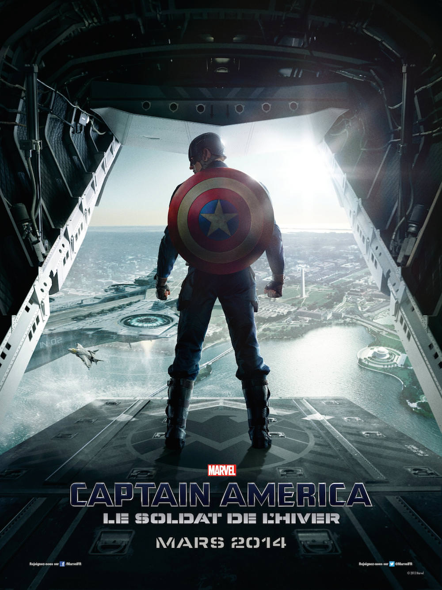
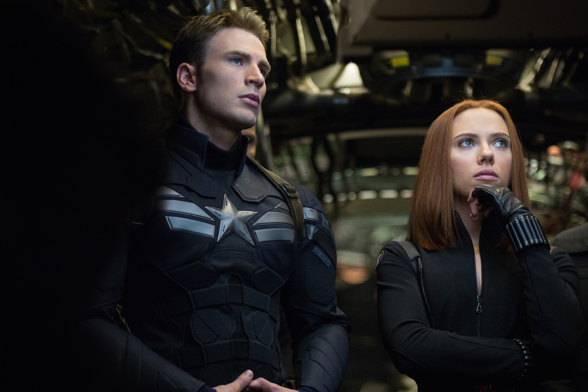
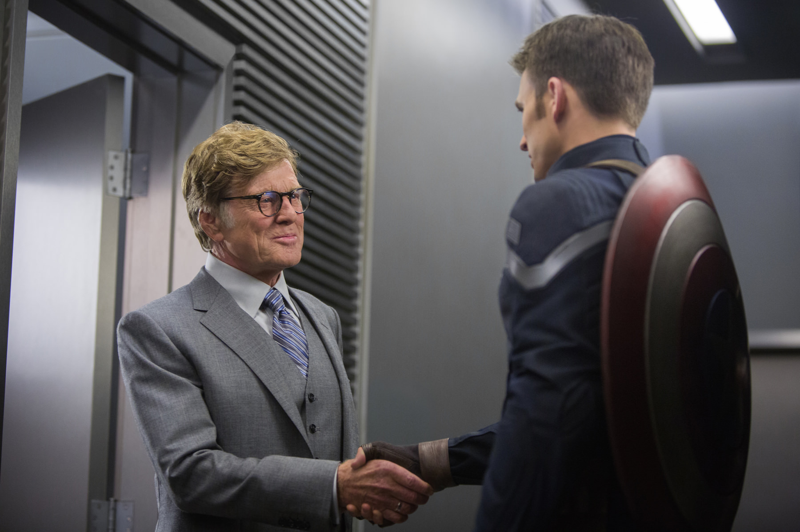

+++
titre = "<em>Captain America : Le Soldat de l&rsquo;hiver</em>, Anthony et Joe Russo"
title = "Captain America : Le Soldat de l'hiver, Anthony et Joe Russo"
url = "/captain-america-soldat-hiver-russo"
date = "2014-03-30T15:56:03"
Lastmod = "2015-04-26T16:22:44"
cover = "captain-america-soldat-hiver-anthony-joe-russo.jpg"
categorie = [ "À voir" ]
tag = [ "Action", "Adaptation bande-dessinée", "Avengers", "Blockbuster", "Comics", "Sorties du mois", "Superhéros" ]
createur = [ "Anthony et Joe Russo" ]
acteur = [ "Anthony Mackie", "Chris Evans", "Samuel L Jackson", "Scarlett Johansson", "Sebastian Stan" ]
annee = [ "2014" ]
weight = 2014
saga = [ "Avengers", "Captain America" ]
pays = [ "États-Unis" ]
original = "Captain America: The Winter Soldier"

+++

Dans la grande famille des <em>Avengers</em>, Captain America est le premier superhéros, mais le dernier à avoir bénéficié d’une adaptation au cinéma <a href="http://voiretmanger.fr/saga/avengers/">dans la saga</a>. Sorti en 2011, <a href="http://voiretmanger.fr/captain-america-first-avenger-johnston/" title="Captain America : First Avenger, Joe Johnston"><em>Captain America : First Avenger</em></a> préparait le terrain pour <a href="http://voiretmanger.fr/avengers-whedon/" title="Avengers, Joss Whedon"><em>Avengers</em></a>, le premier film qui réunissait tous les superhéros Marvel. Depuis, les studios préparent activement la suite qui sortira en 2015 avec <a href="http://voiretmanger.fr/iron-man-3-black/" title="Iron Man 3, Shane Black"><em>Iron Man 3</em></a>, <a href="http://voiretmanger.fr/thor-le-monde-des-tenebres-taylor/" title="Thor : Le Monde des Ténèbres, Alan Taylor"><em>Thor : Le Monde des Ténèbres</em></a> et maintenant un nouveau volet centré sur Captain America. Le premier long-métrage était décevant et Joe Johnston n’a pas été reconduit pour cette suite. Les producteurs ont fait appel à Anthony et Joe Russo, plutôt connus jusque-là pour leurs comédies. Un changement qui ne doit rien au hasard et de fait, <em>Captain America : Le Soldat de l’hiver</em> est plus léger que son prédécesseur, tout en se construisant sur une histoire plus noire. Le divertissement est au rendez-vous dans ce blockbuster explosif comme Marvel sait si bien les faire et l’histoire ajoute une pièce à l’édifice <em>Avengers</em> avec une idée intéressante et bien menée. Un bon film de superhéros, à ne pas rater si vous aimez le genre.

Petit rappel des faits. Dans <em>Captain America : First Avenger</em>, on revenait sur la naissance de Captain America, alias Steve Rogers, un soldat assez mauvais qui a été transformé par une opération chimique en un super soldat quasiment indestructible. C’était pendant la Seconde Guerre mondiale et le film montrait comment, chétif, il n’avait aucune chance pour combattre le nazisme, sa seule obsession du moment, jusqu’au jour où un mystérieux docteur lui administre un sérum qui décuple ses forces. À partir de là, il devient un soldat extrêmement puissant capable de résister face aux hordes nazies et surtout à l’Hydra, organisation bien plus terrible que le régime nazi et c’est au cours de son combat contre elle qu’il tombe finalement dans les eaux arctiques. Dans <em>Avengers</em>, on retrouvait le personnage à notre époque contemporaine, décongelé par le SHIELD pour rejoindre les autres superhéros et combattre les vilains d’alors. Jusque-là, ce personnage se distingue de tous les autres imaginés par Marvel par son intégrité. Alors qu’Iron Man par exemple agit d’abord par intérêt personnel, ce superhéros ne veut qu’une chose : défendre les États-Unis — et donc le monde — contre le mal, d’où qu’il vienne. C’est ce qui faisait que le premier long-métrage de sa saga était aussi peu intéressant : ce Captain America manquait de profondeur et d’humanité. La leçon a été retenue manifestement et la version proposée par les frères Russo est bien différente. Imaginant une conspiration interne au SHIELD, <em>Captain America : Le Soldat de l’hiver</em> fait du superhéros l’ennemi à abattre. L’idée n’est pas nouvelle et Christopher Nolan, pour rester dans les comics, l’a très bien exploitée dans sa <a href="http://voiretmanger.fr/saga/batman-christopher-nolan/">trilogie <em>Batman</em></a>, mais il faut reconnaître qu’elle fonctionne très bien. Le ton est nécessairement plus noir, mais ce qui est intéressant, c’est que le superhéros autrefois si monolithique doute, et devient ainsi plus riche. À partir du moment où l’organisation pour laquelle on se bat depuis toujours devient son ennemi, que faire ? La complexité sied bien au personnage — ainsi qu&rsquo;à son interprète, même si Chris Evans reste un acteur assez transparent — et ce nouveau volet dans ses aventures est sans conteste plus intéressant, pour cette raison.

On disait en préambule que <em>Captain America : Le Soldat de l’hiver</em> était plus léger, et c’est bien aussi le cas. Comment concilier cette légèreté avec la noirceur que l’on évoquait précédemment ? Comme sur la <a href="http://voiretmanger.fr/saga/iron-man/">saga <em>Iron Man</em></a>, Anthony et Joe Russo ont compris que ces superhéros largement irréalistes avaient besoin d’une dose de second degré qui crée une distance salutaire et évite de tomber dans le ridicule, ou le kitsch. Même si ce long-métrage ne fait pas aussi bien que d’autres adaptations Marvel, il fait de gros progrès par rapport à son prédécesseur et s’en tire plutôt bien. On pourrait évoquer l’attaque menée contre Nick Fury, le patron du SHIELD, et le rôle de sa voiture, mais le second degré provient surtout du personnage de Natasha Romanoff, plus connue sous le surnom de Veuve noire. On a découvert ce personnage dans <a href="http://voiretmanger.fr/iron-man-2-favreau/" title="Iron Man 2, Jon Favreau"><em>Iron Man 2</em></a>, mais elle a surtout joué un rôle dans la saga dans <em>Avengers</em> et elle prend ici encore plus de place. À tel point d’ailleurs que si le long-métrage ne met en avant que Captain America, il partage l’affiche avec la Veuve Noire qui est presque aussi présente à l’écran et dans le scénario. Avec son idée de caser le superhéros, elle ajoute la touche décontractée et plaisante qui manquait au premier film et elle est pour beaucoup dans la réussite de ce volet — saluons au passage la très bonne performance de Scarlett Johansson. Une réussite que l’on doit aussi à la réalisation naturellement, avec de l’action digne des meilleurs blockbusters du moment. Même si <em>Captain America : Le Soldat de l’hiver</em> souffre aussi des travers de l’époque — une 3D largement inutile qui assombrit l’image et une action souvent trop rapide, d’autant plus qu’elle est moins nette à cause des lunettes 3D —, le film est spectaculaire et prenant. On ne s’ennuie jamais, l’intrigue est suffisamment dense pour échapper à toute impression de remplissage, mais sans aller dans l’excès inverse. Quand on sort de la salle, au bout de deux bonnes heures<a href="#fn-11449-1" rel="footnote">1</a>, on n’a qu’une envie : voir la suite. Reste maintenant à espérer que Marvel saura garder ce bon niveau pour <em>Avengers: Age of Ultron</em>…

Comme dans la première phase de la saga, <em>Captain America : Le Soldat de l’hiver</em> recentre le débat autour du groupe de superhéros qui est au cœur des enjeux ici. Alors qu’<em>Iron Man 3</em> semblait partir sur de nouvelles bases, on revient ici directement avec le SHIELD et l’intrigue avance avec une place particulière pour les seconds rôles habituels, Nick Fury et Natasha en tête. Anthony et Joe Russo semblent avoir pris beaucoup de plaisir à adapter les comics et cela se voit. Sans être un grand film, <em>Captain America : Le Soldat de l’hiver</em> fournit un grand spectacle de qualité et le film a le mérite d’entretenir la saga <em>Avengers</em> avec de nouveaux éléments qui viennent la renouveler. Un bon blockbuster, parfait pour les amateurs de superhéros !

<h3>Vous voulez <a href="http://voiretmanger.fr/soutien/">m&rsquo;aider</a> ?</h3>
<ul>
<li><a href="http://www.amazon.fr/gp/product/B00J8Q93PK/ref=as_li_ss_tl?ie=UTF8&amp;tag=leblogdenic07-21&amp;linkCode=as2&amp;camp=1642&amp;creative=19458&amp;creativeASIN=B00J8Q93PK">Acheter le film en Blu-ray sur Amazon</a></li>
<li><a href="http://www.amazon.fr/gp/product/B00J8Q92BA/ref=as_li_ss_tl?ie=UTF8&amp;tag=leblogdenic07-21&amp;linkCode=as2&amp;camp=1642&amp;creative=19458&amp;creativeASIN=B00J8Q92BA">Acheter le film en DVD sur Amazon</a></li>
<li><a href="https://itunes.apple.com/fr/movie/captain-america-le-soldat/id843248057">Acheter ou louer le film sur l&rsquo;iTunes Store</a></li>
</ul>

<ol>
<li id="fn-11449-1">
Il faut rester jusqu’à la toute fin du générique, naturellement, même si la première scène au milieu est la seule vraiment importante, si vous êtes pressé.&#160;<a href="#fnref-11449-1" rev="footnote">&#8617;</a>
</li>
</ol>

