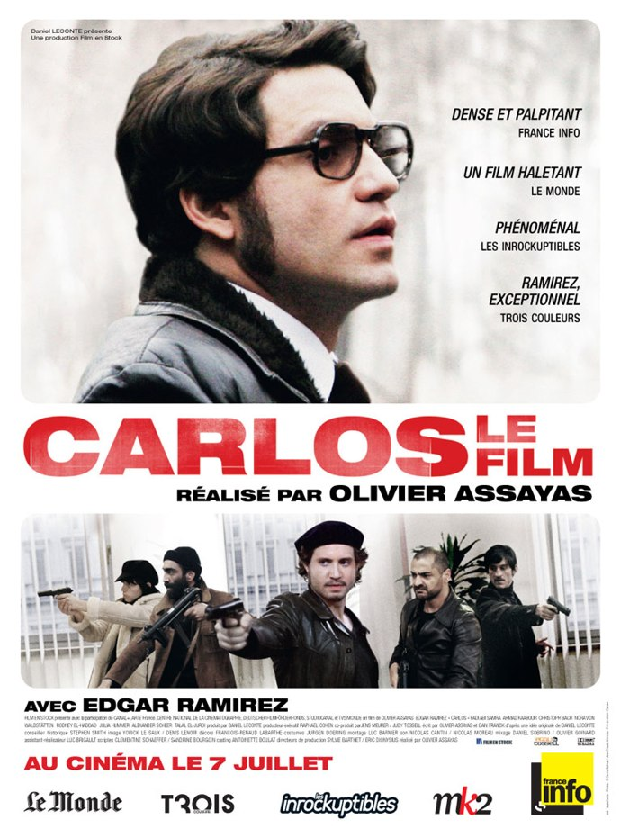
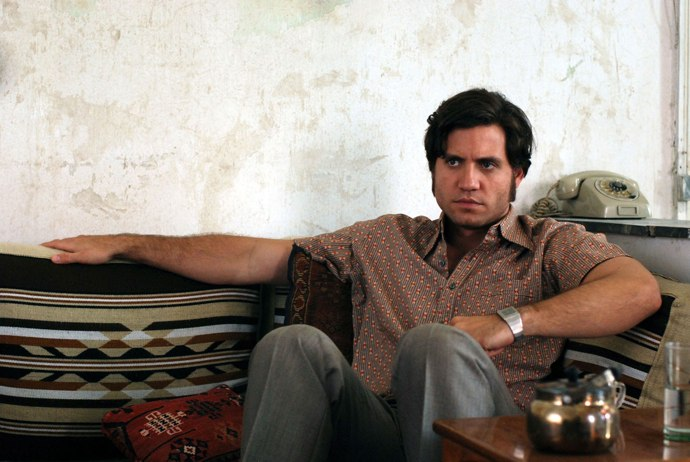
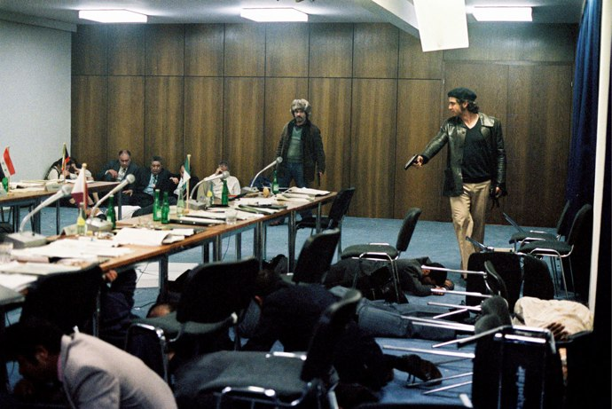

+++
type = "post"
titre = "Carlos, Olivier Assayas"
title = "Carlos, Olivier Assayas"
url = "/carlos-assayas"
date = "2010-07-14T20:59:45"
Lastmod = "2013-04-06T10:33:44"
cover = "carlos-olivier-assayas.jpg"
categorie = [ "À voir" ]
tag = [ "Action", "Biopic", "Espionnage", "Histoire", "Société", "Terrorisme" ]
createur = [ "Olivier Assayas" ]
acteur = [ "Edgar Ramirez" ]
annee = [ "2010" ]
weight = 2010
pays = [ "France" ]

+++

Carlos, légende du terrorisme international qui a sévi au cours des années 1970 et 1980. Le cinéma s&rsquo;intéresse depuis sa naissance aux hors-la-loi, souvent mafieux, mais les terroristes semblent avoir la côte. Olivier Assayas a ainsi consacré un énorme biopic à la vie de ce terroriste charismatique. <em>Carlos</em> fut d&rsquo;abord une petite série télévisée de plus de 5 heures, avant de se voir réduite en une version cinéma de 2h40, quand même. Le résultat est plutôt convaincant, malgré quelques longueurs.

Le film commence dans les années 1970, à Paris. Un homme sort dans la rue pour prendre sa voiture, mais prend le soin auparavant d&rsquo;ouvrir le capot et regarder sous les roues. Pas suffisant manifestement, puisque sa voiture explose au moment de démarrer. <em>Carlos</em> met ainsi d&rsquo;emblée dans l&rsquo;ambiance de terrorisme qui régnait à l&rsquo;époque : tout le film sera ainsi parcouru d&rsquo;attentats divers, de l&rsquo;assassinat à domicile jusqu&rsquo;à la prise d&rsquo;otages en avion. Au centre des attentats comme de l&rsquo;image, Carlos bien sûr, de son vrai nom <a href="http://fr.wikipedia.org/wiki/Ilich_Ram%C3%ADrez_Sánchez">Ilich Ramírez Sánchez</a>. Vénézuélien d&rsquo;origine, il entre dans le FLFP (Front de Libération de la Palestine) et devient alors Carlos, bras droit du responsable européen du mouvement. S&rsquo;enchainent alors des opérations toujours plus grandes jusqu&rsquo;à la <a href="http://fr.wikipedia.org/wiki/Prise_d%27otages_du_siège_de_l%27OPEP_à_Vienne">prise en otage</a> de tous les membres de l&rsquo;OPEP fin 1975 qui lui vaut d&rsquo;être écarté du FLFP. Il poursuit alors ses activités terroristes de son côté, avec le soutien plus ou moins explicite des puissances d&rsquo;alors, les États arabes eux-mêmes soutenus par l&rsquo;URSS. Les années 1980 sont pour lui le signe d&rsquo;un long déclin, jusqu&rsquo;à la chute du Mur en 1989 et l&rsquo;émergence d&rsquo;un nouveau monde où il n&rsquo;a pas de place. Il tient encore quelques années avant d&rsquo;être rattrapé par la justice française qui le condamne en 1997 à la prison à perpétuité pour l&rsquo;assassinat de trois policiers en 1975. Il n&rsquo;a jamais eu à rendre de compte pour tous ses actes terroristes, ce qui de toute manière ne changerait pas grand-chose, la peine de mort étant interdite en France.

Olivier Assayas a ainsi pris le parti de raconter la vie de Carlos, toute sa vie. Le cinéaste ignore quasiment tout ce qui se déroule avant son entrée au FLFP et c&rsquo;est une excellente idée, même si je ne doute pas un instant qu&rsquo;Ilich ait connu une enfance passionnante. Par contre, il a tenu à parler de l&rsquo;ensemble de la vie du terroriste jusqu&rsquo;à son retour en France au milieu des années 1990. Cela veut dire à la fois ses débuts, son apogée puis son déclin. Ce déclin justement est passionnant : on voit comment une ancienne star médiatique finit moins que rien, obligé de mendier pour des protections et finalement enlevé comme dans un mauvais roman d&rsquo;aventures par les services secrets français alors qu&rsquo;il sortait de l&rsquo;hôpital où il se faisait liposuscer… La partie glorieuse intéresse plutôt sur le plan factuel, avec des reconstitutions de qualité, mais elle est plus classique. <em>Carlos</em> a beaucoup de choses à dire, et le film commence d&rsquo;ailleurs sur un rythme effréné où les scènes s&rsquo;enchaînent à toute allure, sans laisser le temps de digérer. C&rsquo;est certainement là qu&rsquo;Assayas a réalisé le plus de coupes pour la version cinéma, mais je trouve le résultat réussi. Certes, il doit nous manquer des éléments contextuels ou simplement des explications : parfois, on ne sait pas comment ou pourquoi on passe d&rsquo;un lieu à un autre, d&rsquo;une action à une autre. Mais j&rsquo;aime cette rapidité et ce doute : <em>Carlos</em> donne un sentiment d&rsquo;urgence permanente qui résume bien l&rsquo;état d&rsquo;esprit de l&rsquo;homme, et sans doute aussi du mouvement. Le film ralentit sur la dernière partie, qui offre du coup quelques longueurs alors que c&rsquo;est celle qui est la plus intéressante. Je ne sais pas si Assayas aurait pu plus couper sans nuire à la compréhension de l&rsquo;ensemble, je pense surtout que c&rsquo;est le genre du <a href="/tag/biopic/">biopic</a> qui pose problème. Un film ne suffit pas à concentrer la vie d&rsquo;un homme et mieux vaut se limiter à une courte période.

Contrepartie de cette recherche d&rsquo;exhaustivité, <em>Carlos</em> est un film riche en enseignements (et très bien documenté apparemment). Au-delà de l&rsquo;histoire personnelle de ce terroriste, c&rsquo;est l&rsquo;occasion de découvrir une époque bien différente de la nôtre. Une époque où le terrorisme est encore artisanal et localisé : on ne s&rsquo;en prend pas aveuglément à des civils, on vise une ou plusieurs personnes précisément. On se rend aussi compte à quel point le terrorisme est devenu un phénomène quasiment &laquo;&nbsp;normal&nbsp;&raquo; aujourd&rsquo;hui : cela se voit notamment dans l&rsquo;inadéquation de la réponse étatique aux terroristes. Carlos et sa bande ont réussi à entrer dans l&rsquo;OPEP sans être surveillés (ou fouillé) et ont pris en otage sans aucun problème une vingtaine de hauts dignitaires d&rsquo;autant d&rsquo;États dans le monde. Le tout avec quatre ou cinq personnes et quelques mitraillettes, mais c&rsquo;est bien tout. Ils ont ensuite exigé et obtenu un car pour se rendre à l&rsquo;aéroport et partir à bord d&rsquo;un avion civil vers la destination de leur choix. Quand on voit l&rsquo;action, on se dit qu&rsquo;aujourd&rsquo;hui les États auraient une large palette d&rsquo;options pour répondre, tant les preneurs d&rsquo;otages sont amateurs. C&rsquo;est aussi une époque de petits mouvements contestataires répartis dans tout le monde occidental qui luttent contre le capitalisme ou l&rsquo;impérialisme américain et peuvent du coup travailler au sein d&rsquo;une organisation pro-palestienne. Ils avaient le sentiment qu&rsquo;en aidant la cause palestienne, ils se battaient <em>in fine</em> contre le capitalisme, ce qui est très mignon. Le film met en avant les révolutionnaires allemands qui ont apparemment beaucoup aidé ce terrorisme international assez mal défini, car très divers justement.

<em>Carlos</em> est aussi, comme son titre l&rsquo;indique, un film sur un homme. Un homme intelligent, multilingue et qui a un succès fou auprès des femmes. C&rsquo;est aussi un homme à l&rsquo;égo surdimensionné qui croit toujours être essentiel aux mouvements auquel il participe. Une séquence résume terriblement bien cet égocentrisme exacerbé, quand on le voit sortir nu de la douche, se rendre devant un miroir où il prend le soin de se regarder et de se caresser les bijoux de famille. On sent comme une admiration folle pour ce qu&rsquo;il est et on comprend alors mieux que la chute a dû être forte quand on lui fait comprendre qu&rsquo;il ne sert plus à rien. À plusieurs reprises il tente de se justifier, de valoriser ses atouts, de se rendre indispensable. Quand il est rejeté, il se protège immédiatement en affirmant que celui qui l&rsquo;a rejeté est un imbécile. Derrière la carapace du beau latino, on sent poindre les faiblesses et on voit bien que rien ne lui plait plus que de lire son nom dans les journaux, ou de se faire photographier par une armée de journalistes. On lui rétorque à un moment qu&rsquo;il ne s&rsquo;est jamais battu pour la cause, mais uniquement pour sa propre gloire : c&rsquo;est tout à fait cela qu&rsquo;Olivier Assayas a montré dans <em>Carlos</em>. On comprend aisément ce qui a motivé le cinéaste, c&rsquo;est un personnage effectivement fascinant. Il faut d&rsquo;ailleurs reconnaître que l&rsquo;excellente performance d&rsquo;Edgar Ramirez contribue pour beaucoup dans le succès de <em>Carlos</em>.

Je n&rsquo;étais pas tellement motivé à l&rsquo;idée de voir la réduction d&rsquo;une série télévisée, mais <em>Carlos</em> ne souffre pas trop de cette origine télévisuelle. Le film, jusqu&rsquo;au format d&rsquo;image, est plus proche des toiles blanches que des tubes cathodiques<a href="#footnote_0_3641" id="identifier_0_3641" class="footnote-link footnote-identifier-link" title="Oui, je sais, les tubes cathodiques sont de l&rsquo;histoire ancienne. Mais bon, les images litt&eacute;raires restent manifestement plus longtemps que les objets&hellip;">1</a>. La réalisation est très bonne, efficace et rythmée, au moins au début et on ne passe globalement pas un mauvais moment. Je trouve simplement dommage d&rsquo;avoir voulu tout dire dans un film : Assayas aurait sans doute mieux fait de choisir une partie plus réduite de la vie de Carlos. C&rsquo;est un bon biopic, à défaut d&rsquo;être un grand film.

Je comprends donc difficilement l&rsquo;enthousiasme généralisé qui semble avoir saisi la critique, que ce soit <em><a href="http://www.critikat.com/Carlos.html">Critikat</a></em>, <em><a href="http://www.telerama.fr/cinema/films/carlos-le-film,410540,critique.php">Télérama</a></em> ou les <a href="http://www.lesinrocks.com/cine/cinema-article/t/46522/date/2010-07-02/article/carlos-le-film/"><em>Inrocks</em></a>. Le film a manifestement été boudé de la blogosphère…

<h3>Vous voulez m&rsquo;aider ?<a href="#footnote_1_3641" id="identifier_1_3641" class="footnote-link footnote-identifier-link" title="&Agrave; propos de la publicit&eacute;&hellip;">2</a></h3>
<ul>
<li><a href="http://www.amazon.fr/gp/product/B0042ZUNNI/ref=as_li_ss_tl?ie=UTF8&tag=leblogdenic07-21&linkCode=as2&camp=1642&creative=19458&creativeASIN=B0042ZUNNI">Acheter le film en DVD sur Amazon</a></li>
<li><a href="http://www.amazon.fr/gp/product/B003BQROG8/ref=as_li_ss_tl?ie=UTF8&tag=leblogdenic07-21&linkCode=as2&camp=1642&creative=19458&creativeASIN=B003BQROG8">Acheter la série <em>Carlos</em> en DVD sur Amazon</a></li>
<li><a href="https://itunes.apple.com/fr/movie/carlos/id404324938">Acheter ou louer le film sur l&rsquo;iTunes Store</a></li>
</ul>

<ol class="footnotes"><li id="footnote_0_3641" class="footnote">Oui, je sais, les tubes cathodiques sont de l&rsquo;histoire ancienne. Mais bon, les images littéraires restent manifestement plus longtemps que les objets… [<a href="#identifier_0_3641" class="footnote-link footnote-back-link">&#8617;</a>]</li><li id="footnote_1_3641" class="footnote"><a href="/soutien/">À propos de la publicité…</a> [<a href="#identifier_1_3641" class="footnote-link footnote-back-link">&#8617;</a>]</li></ol>
