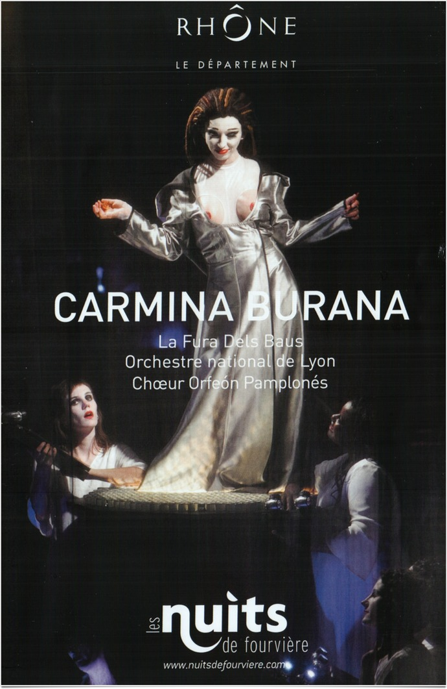
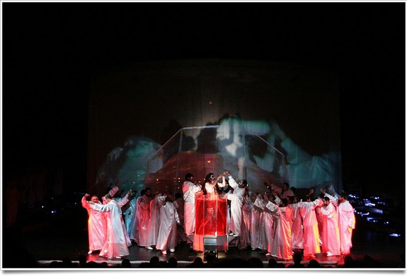

+++
titre = "Carmina Burana, Carl Orff (Théâtre de Fourvière, 8 juin 2011)"
title = "Carmina Burana, Carl Orff (Théâtre de Fourvière, 8 juin 2011)"
url = "/carmina-burana-orff-fourviere-juin-2011"
date = "2011-07-09T13:05:21"
Lastmod = "2011-07-09T13:11:10"
cover = "festival-fourviere-carmina-burana.jpg"
categorie = [ "À voir… en live" ]
tag = [ "Classique", "Concert", "Opéra" ]
createur = [ "Carl Orff" ]
annee = [ "2011" ]
weight = 2011
metteur = [ "La Fura Dels Baus" ]
lieu = [ "Théâtre de Fourvière" ]
chef = [ "Ernest Martinez Izquierdo" ]

+++

Tous les ans, le théâtre antique de Fourvière, surplombant la ville de Lyon, accueille un festival de spectacles variés en plein air. On y trouve aussi bien du théâtre, des concerts modernes et classiques. Ce soir, <em>Carmina Burana</em>, le chef-d&rsquo;œuvre de Carl Orff était au programme dans le théâtre romain. Cette œuvre assez brève ne m&rsquo;était pas inconnue, bien au contraire. Mon tout premier concert était pour <em>Carmina Burana</em> et je connais l&rsquo;œuvre par cœur… ce qui ne m&rsquo;a pas empêché d&rsquo;être surpris par une mise en scène complexe mêlant images projetées et danse alors que j&rsquo;avais toujours connu une configuration simple orchestre et chœur. Une bonne surprise.

<em>Carmina Burana</em> a été composée par Carl Orff au milieu des années 1930. C&rsquo;est donc une musique récente, mais inspirée par des textes anciens puisqu&rsquo;il s&rsquo;agit de la mise en musique de poèmes médiévaux. Cette œuvre est profane : même si la musique classique a souvent accompagné des chants religieux, ça n&rsquo;a pas toujours été le cas et le livret de <em>Carmina Burana</em> est au contraire plutôt osé. On y parle de vin, mais aussi de sexe, comme la mise en scène de La Fura Del Baus n&rsquo;a pas manqué de le rappeler. La compagnie a choisi de mettre en scène les cantates d’Off, un choix devenu assez rare aujourd&rsquo;hui, mais qui s’avère en fait être plus respectueux de l’esprit de l’œuvre. Le titre complet de <em>Carmina Burana</em> signifie en effet en français « Poèmes de Beuren : Chansons profanes pour chanteurs et chœurs devant être chantées avec instruments et images magiques ». Les images magiques du titres devaient déjà à l’époque renvoyer au cinéma et cette version de 2011 exploite toutes les technologies les plus modernes pour retrouver l’esprit de magie souhaité par l’auteur.

Le dispositif scénique est ainsi assez complexe. La scène est divisée en quatre parties : au centre, un grand cylindre de toile blanche qui sert autant aux projections qu’aux danses et autres jeux des solistes notamment. De part et d’autres de cette zone, les chœurs divisés en deux groupes distincts (hommes et femmes), entièrement vêtus de blanc et munis de partitions qui les éclairent aussi. Au fond de la scène, l’orchestre au grand complet et son chef. Par la disposition, ce <em>Carmina Burana</em> se rapproche de l’opéra. L’orchestre n’est pas mis en avant, il accompagne un dispositif visuel complexe avec même un peu de machineries, comme à l’opéra. Autre point commun, la division de l’œuvre en sections et les passages avec uniquement des solistes qui se font ici aussi acteurs, qu’ils soient perchés au-dessus de la scène, plongés dans un bac d’un liquide rouge, toujours avec des costumes colorés et vifs. À plusieurs reprises, tout ou partie du chœur sort des rangs pour accompagner l’histoire, danser ou accompagner les solistes. Même si elle n’est pas toujours très explicite, l’histoire est toujours présente et la compagnie a fait un bel effort pour l’expliciter, à tel point que l’on regrette l’absence de sous-titres qui auraient pu en faciliter la compréhension.

<iframe src="http://www.youtube.com/embed/S3QgrUdm8So" frameborder="0" width="690" height="547"></iframe>

Le spectacle est plus proche de l’esprit original de l’œuvre, mais il pourrait aussi décevoir ce qui viennent d’abord écouter <em>Carmina Burana</em>. L’orchestre est logiquement un peu en retrait, simplement parce qu’on ne le voit pas, logé derrière le décor à défaut d’être dans la traditionnelle fosse. La musique composée par Carl Orff est très simple et assez entêtante. D’une grande efficacité, elle se construit beaucoup sur les rythmes qui sont variés et elle ne provoque jamais l’ennui. La version créée par La Fura Dels Baus la met un peu à l’arrière-plan et pas seulement sur la scène : en choisissant d’ajouter des images, elle distrait un peu le spectateur qui peut par moment plus regarder qu’écouter. Ce n’est pas vraiment un reproche, les images sont en général assez belles (à quelques rares exceptions un peu kitsch près), les solistes font participer les premiers rangs en les aspergeant copieusement d’eau, ils se déplacent parmi le public… bref on ne s’ennuie vraiment pas.

Un petit regret, mais sans doute était-il inévitable : le son était amplifié. La musique de Carl Orff dégage une puissance rare, surtout dans son fameux « <em>O Fortuna</em> » qui ouvre et ferme l’œuvre, et elle ne nécessite pas nécessairement d’amplification. Le théâtre de Fourvière, théâtre antique à l’origine, dispose d’une bonne acoustique, mais il est vrai aussi que certains passages de l’œuvre sont très faibles et l’amplification était peut-être nécessaire. On aurait néanmoins apprécié un meilleur respect de la spatialisation sonore naturelle de la mise en scène. Les chœurs étaient bien divisés en deux blocs et ils échangent quelques passages pendant <em>Carmina Burana</em>. Cet effet stéréo était sérieusement limité par un mixage un peu trop mono. Cela étant dit, l’amplification était plutôt bien réalisée dans l’ensemble, même si on entendait les pages se tourner et les archets taper autre chose que les cordes.

<em>Carmina Burana</em> était une œuvre prévue pour la scène et pour des mises en scène complexes avec projection d’images. La version de La Fura Dels Baus respecte cette volonté originelle dans une version riche en couleurs et en images. La mise en scène est bien pensée et originale, l’œuvre toujours aussi plaisante à écouter et le spectacle très agréable. La Fura Dels Baus tourne avec depuis quelques années, c’était une première en France, mais si vous avez l’occasion de le voir, c’est à ne pas rater.

