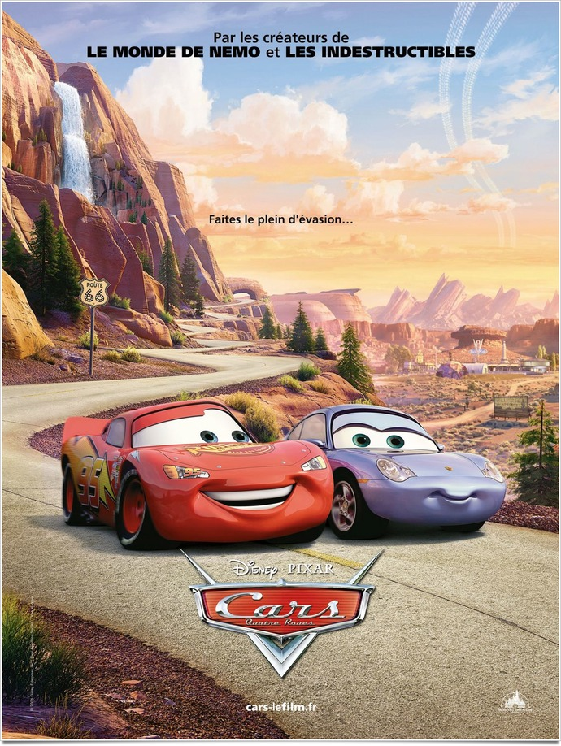
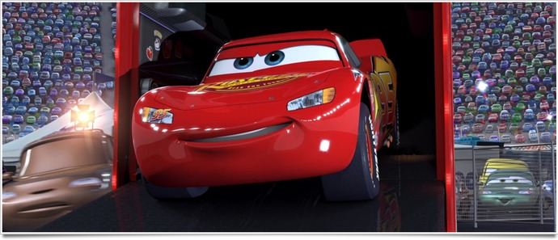
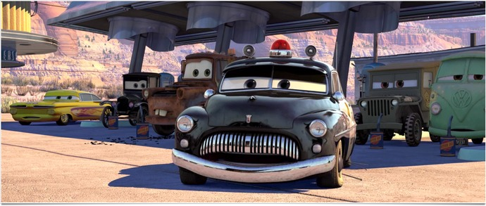

+++
type = "post"
titre = "<em>Cars</em>, John Lasseter"
title = "Cars, John Lasseter"
url = "/cars-lasseter"
date = "2011-07-25T22:14:07"
Lastmod = "2014-10-05T17:42:16"
cover = "cars-pixar-2006.jpg"
categorie = [ "À voir" ]
tag = [ "Amour", "Animation", "Blockbuster", "Course" ]
createur = [ "John Lasseter", "Pixar" ]
annee = [ "2006" ]
weight = 2006
pays = [ "États-Unis" ]

+++

Les studios Pixar semblent s&rsquo;être donnés un objectif fou : faire des films sans être humains, mais où l&rsquo;on oublie vite qu&rsquo;il n&rsquo;y a pas d&rsquo;humains. Le premier <em>Cars</em>, septième film des studios sorti en 2006, pousse peut-être cet objectif le plus loin possible. Comme son nom l&rsquo;indique, le film ne met en scène que… des voitures. Des voitures dotées d&rsquo;un visage, certes, mais des voitures quand même. Un pari fou, qui s&rsquo;avère payant pour un film qui parvient à susciter l&rsquo;émotion et à plaire.

Le film ouvre sur une piste de course. Un circuit bien rond, plusieurs centaines de tours à effectuer, des dizaines de voitures : il s&rsquo;agit de courses de <a href="http://fr.wikipedia.org/wiki/Nascar">NASCAR</a> qui n&rsquo;ont jamais vraiment dépassé les frontières américaines. Parmi ces voitures, l&rsquo;une brille de mille feux. Flash MCQueen est la star de la compétition, une jeune voiture de course sortie de nulle part en passe de gagner la course. Flash est un peu prétentieux, il pense pouvoir s&rsquo;en sortir sans l&rsquo;aide de personne et refuse toute aide de son équipe technique. À moins d&rsquo;un tour de l&rsquo;arrivée, alors qu&rsquo;il mène largement la course, ses deux pneus arrière explosent et il se traine lamentablement jusqu&rsquo;à l&rsquo;arrivée. Par un étonnant concours de circonstances, la course a trois gagnants qui devront se départager lors d&rsquo;une nouvelle course à l&rsquo;autre bout du pays. Flash veut être sûr d&rsquo;arriver le premier et il presse son camion de rouler nuit et jour. Là encore, ce qui devait arriver arriva : le camion s&rsquo;endort et Flash se retrouve au milieu de nulle part, dans un bled paumé sur le bord de la mythique Route 66. Bloqué pour effectuer des travaux publics dans cette ville désertée, il finit par apprendre à connaître ses habitants et à changer d&rsquo;avis sur l&rsquo;importance de la course.

C&rsquo;est dans les vieilles soupières qu&rsquo;on fait les meilleures soupes : <em>Cars</em> exploite un schéma narratif extrêmement bien connu, celui du roman d&rsquo;apprentissage. Jeune homme imbu de lui-même, hautain et déplaisant, Flash McQueen va apprendre à se calmer et va ressortir enrichi et apaisé de sa pause campagnarde, loin des pistes de course. L&rsquo;apprentissage sera aussi technique, la jeune voiture apprenant à mieux maîtriser sa course. C&rsquo;est aussi et surtout l&rsquo;occasion d&rsquo;un apprentissage amoureux puisqu&rsquo;il rencontre dans cette bourgade une charmante Porsche qui ne va pas le laisser indifférent. D&rsquo;abord drogué par la vitesse et la performance, Flash se laisse finalement adoucir par les vastes paysages américains. Car si <em>Cars</em> exploite des recettes scénaristiques qui ont fait leur preuve et vise ainsi l&rsquo;universel, c&rsquo;est aussi un film très américain. C&rsquo;est peut-être même le Pixar le plus américain : les courses du NASCAR, le grand Ouest américain, les références innombrables au mythe américain et à l&rsquo;<em>American Dream</em> : tout, dans <em>Cars</em>, respire les États-Unis. C&rsquo;est un hymne américain, mais à une époque disparue. <em>Cars</em> est aussi un film très nostalgique, un film qui regrette une époque disparue. Les années 1960, avant l&rsquo;invention des autoroutes, quand on avait encore le temps d&rsquo;admirer le paysage, s&rsquo;arrêter dans les villes et motels, profiter de la vie. Le film dénonce au contraire un monde surmédicalisé, stressé ou l&rsquo;on ne prend pas le temps de profiter. Un message récurrent dans les Pixar, mais rarement de manière aussi explicite.

La plus belle performance de <em>Cars</em> est sans doute de réussir à nous faire oublier que l&rsquo;on regarde un film plein de voitures. Les voitures ici ont tous les attributs normaux des voitures, elles doivent passer à la pompe régulièrement, changer leurs pneus, leur moteur rugit, elles ont des phares et des klaxons… Par rapport aux voitures que l&rsquo;on est amené à croiser, la seule différence se situe dans le pare-brise, ici remplacé par une paire d&rsquo;yeux, et par la bouche située sur l&rsquo;avant. Ces deux attributs permettent d&rsquo;humaniser les voitures, suffisamment en tout cas pour oublier totalement qu&rsquo;il ne s&rsquo;agit que de voitures. Les équipes de Pixar ont fait un gros travail pour distinguer les différentes voitures et leur donner une personnalité. Quelques touches suffisent, au-delà du modèle et de sa couleur : un sourire, un regard même, des dents un peu trop en avant, autant de caractéristiques qui différencient les voitures et leur offrent vraiment une personnalité. L&rsquo;effet était connu avec les animaux, mais c&rsquo;est plus étonnant avec des voitures et l&rsquo;effet réussi. Dans <em>Cars</em>, Pixar parvient à réaliser ce pari un peu fou : faire un film avec uniquement des voitures, mais où l&rsquo;on ne voit que des êtres vivants.

Sur le plan technique, <em>Cars</em> représentait un nouveau bond en avant pour les films d&rsquo;animation. Si la technique permet désormais à Pixar comme à d&rsquo;autres studios d&rsquo;atteindre un effet photoréaliste parfaitement maîtrisé, la situation était plus complexe en 2006 et Pixar prouvait encore une fois sa maîtrise technique. Avant l&rsquo;avènement de la 3D, l&rsquo;animation reste assez sobre et ne balance pas des pneus dans la tête des spectateurs à longueur du film. Sobriété et efficacité, l&rsquo;animation est ici toujours au service de l&rsquo;histoire et jamais l&rsquo;inverse. La patte Disney est bien visible dans certains choix, notamment en ce qui concerne la manière de représenter les voitures, mais <em>Cars</em> reste un film équilibré qui donnera autant aux parents qu&rsquo;à leurs enfants.

<em>Cars</em> n&rsquo;est pas le Pixar qui a emporté la plus large adhésion du public, au moins de ce côté-ci de l&rsquo;Atlantique. Était-ce un film trop résolument américain ? Possible, mais cette histoire de voitures s&rsquo;avère pourtant aussi universel que tous les autres films de Pixar. Sans tomber dans le mièvre, l&rsquo;histoire s&rsquo;avère néanmoins très optimiste et un pamphlet vif contre une certaine modernité et en faveur d&rsquo;idées écologiques. En attendant de savoir si la suite continuera la série de succès de Pixar ou signera le premier échec du studio, <em>Cars</em> mérite d&rsquo;être (re)vu, en famille ou pas.

<h3>Vous voulez m&rsquo;aider ?<a href="#footnote_0_4978" id="identifier_0_4978" class="footnote-link footnote-identifier-link" title="&Agrave; propos de la publicit&eacute;&hellip;">1</a></h3>
<ul>
<li><a href="http://www.amazon.fr/gp/product/B000PIU296/ref=as_li_ss_tl?ie=UTF8&#038;tag=leblogdenic07-21&#038;linkCode=as2&#038;camp=1642&#038;creative=19458&#038;creativeASIN=B000PIU296">Acheter le film en Blu-Ray sur Amazon</a></li>
<li><a href="http://www.amazon.fr/gp/product/B000H0MK2O/ref=as_li_ss_tl?ie=UTF8&#038;tag=leblogdenic07-21&#038;linkCode=as2&#038;camp=1642&#038;creative=19458&#038;creativeASIN=B000H0MK2O">Acheter le film en DVD sur Amazon</a></li>
<li><a href="https://itunes.apple.com/fr/movie/cars-quatre-roues/id369136395">Acheter ou louer le film sur l&rsquo;iTunes Store</a></li>
</ul>

<ol class="footnotes"><li id="footnote_0_4978" class="footnote"><a href="http://voiretmanger.fr/soutien/">À propos de la publicité…</a> [<a href="#identifier_0_4978" class="footnote-link footnote-back-link">&#8617;</a>]</li></ol>
