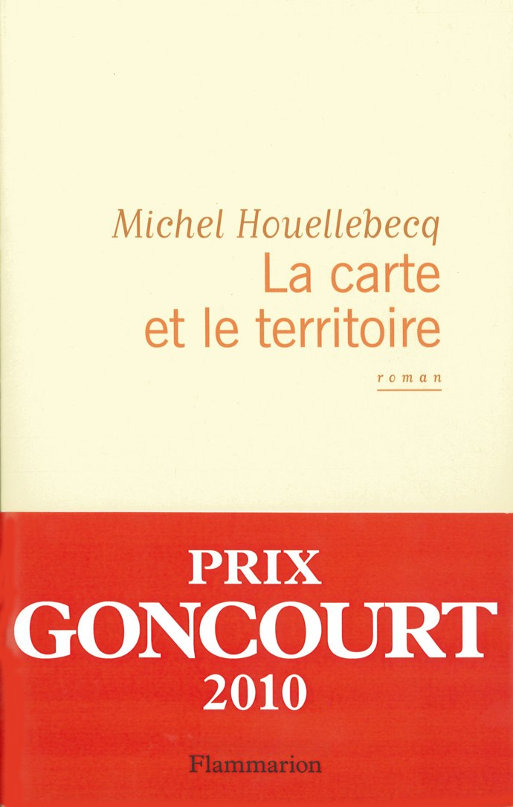
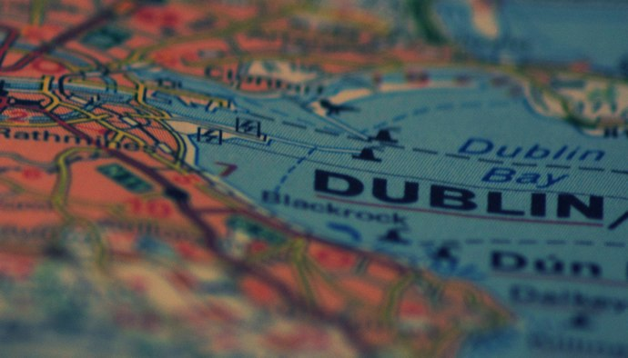

+++
titre = "La carte et le territoire, Michel Houellebecq"
title = "La carte et le territoire, Michel Houellebecq"
url = "/carte-territoire-houellebecq"
date = "2011-02-10T00:48:07"
Lastmod = "2012-07-11T08:42:08"
cover = "carte-ign-extrait.jpg"
categorie = [ "À lire" ]
tag = [ "Art", "Autobiographie", "Écrivain", "Roman", "Société" ]
createur = [ "Michel Houellebecq" ]
annee = [ "2010" ]
weight = 2010
pays = [ "France" ]

+++

Je connaissais Michel Houellebecq, évidemment, qui ne connaît pas Michel Houellebecq ? Écrivain français aussi sulfureux qu&rsquo;il a connu un brillant succès public à défaut d&rsquo;être toujours critique, c&rsquo;est un de ces auteurs contemporains qui comptent aujourd&rsquo;hui en France. Mais je n&rsquo;avais jamais <em>lu</em> Michel Houellebecq, auteur que je jugeai de manière un peu complaisante sans grand intérêt, un auteur polémique que je pouvais bien me passer de lire. Mais voilà qu&rsquo;on m&rsquo;offre à Noël, études de géographie obligent, <em>La carte et le territoire</em>, dernier roman de Michel Houellebecq couronné du très fameux Prix Goncourt. J&rsquo;avais déjà été attiré par des critiques dithyrambiques, notamment au <a href="http://sites.radiofrance.fr/franceinter/em/lemasqueetlaplume/">Masque</a>, et je dois dire que je n&rsquo;ai pas été déçu de ma lecture. <em>La carte et le territoire</em> est un roman prenant, intrigant… réussi en un mot.

<em>La carte et le territoire</em> suit la vie et l&rsquo;œuvre de Jed Martin, artiste français qui vit dans un futur proche. Un artiste incapable d&rsquo;avoir une vie sociale digne de ce nom, mais qui se révèle être un excellent artiste. Il commence en photographiant des objets du quotidien, objets apparemment insignifiants, mais auxquels il ajoute le regard de l&rsquo;artiste. Après cette série et après sa sortie des Beaux-Arts, Jed change de sujet et commence à photographier des cartes Michelin en choisissant des parties qu&rsquo;il juge plus intéressantes ou belles. Cette série de cartes lui vaut la reconnaissance du milieu artistique et le début de sa fortune suite à un partenariat avec l&rsquo;entreprise clermontoise. C&rsquo;est le nom de l&rsquo;exposition qui clôt son travail qui donne son nom au roman : &laquo;&nbsp;La carte est plus intéressante que le territoire&nbsp;&raquo;. Son succès est énorme, mais cet artiste d&rsquo;humeur toujours changeante arrête la photographie pour se consacrer alors à un tout autre art, la peinture. Il commence une autre série de 65 toiles qui lui valût une fortune énorme. Cette &laquo;&nbsp;série des métiers&nbsp;&raquo; représente des hommes et femmes dans leur environnement de travail grâce à une peinture très précise et réaliste, finalement assez proche de la photographie. Ces tableaux se sont arrachés après l&rsquo;unique exposition réalisée par Jed Martin : il a eu la bonne idée de représenter des gens connus, des hommes d&rsquo;affaire notamment qui ont acheté des fortunes ces tableaux qui s&rsquo;échangent vite à plusieurs millions d&rsquo;euros.

Le roman de Michel Houellebecq est un roman sur l&rsquo;art aujourd&rsquo;hui. <em>La carte et le territoire</em> dresse le portrait d&rsquo;un artiste et interroge par ce portrait le statut de l&rsquo;art, son rôle dans la société et la place réservée à l&rsquo;artiste. Le romancier reprend l&rsquo;image connue de l&rsquo;artiste maudit isolé du reste de la société, incapable de s&rsquo;y lier, un peu autiste et capricieux. Un portrait peu flatteur qui vaut autant pour Jed Martin que pour Michel Houellebecq lui-même. Parmi les personnes peintes par l&rsquo;artiste, il y a aussi l&rsquo;auteur qui, dans le roman, écrit aussi le catalogue de l&rsquo;exposition. <em>La carte et le territoire</em> est ainsi un roman à connotation autobiographique où l&rsquo;auteur se représente dans sa maison irlandaise puis dans la campagne française. Deux artistes très différents par certains aspects — un photographe/peintre et un écrivain, un artiste en voie de connaître le succès et un artiste déjà connu… —, mais finalement très proches par le caractère asocial bourru. Au-delà de l&rsquo;artiste un peu maudit, <em>La carte et le territoire</em> offre un aperçu bien peu reluisant du monde artistique. On ne sait pas exactement quand se déroule l&rsquo;action, mais on sent qu&rsquo;elle pourrait être strictement contemporaine. L&rsquo;histoire du roman, c&rsquo;est finalement l&rsquo;ascension irrésistible d&rsquo;un artiste qui se trouve en correspondance avec les attentes du monde de l&rsquo;art à un moment donné. Il a du talent, certes, mais l&rsquo;auteur n&rsquo;en fait jamais un génie, plutôt un bosseur qui a de bonnes idées au bon moment. Son succès est terrifiant de ridicule tellement il s&rsquo;avère rapide et monstrueux : brusquement en vue, l&rsquo;œuvre de Jed Martins se monnaye à plusieurs millions par toile. Des sommes totalement folles qui ne veulent plus rien dire et qui sont critiquées par le roman, même si ce n&rsquo;est jamais explicite.

<em>© romsbanjo @ <a href="http://www.flickr.com/photos/romsbanjo/5186341323/">FlickR</a></em>

Au-delà du monde de l&rsquo;art, <em>La carte et le territoire</em> est un roman centré sur Michel Houellebecq, sans pour autant être vraiment qualifiable d&rsquo;autobiographique. Le Michel Houellebecq du roman n&rsquo;est pas vraiment le même que l&rsquo;écrivain, ne serait-ce que parce que le romancier fait mourir son double dans une mort d&rsquo;ailleurs atroce. Quand un romancier se met en scène dans un roman, il est toujours intéressant d&rsquo;observer le regard porté sur lui-même. On ne peut pas dire que Michel Houellebecq soit très tendre avec lui-même, bien au contraire. Le portrait qu&rsquo;il propose dans son roman est celui d&rsquo;un misanthrope alcoolique et lunatique, un type pas commode qui s&rsquo;est retiré loin d&rsquo;un monde qui l&rsquo;a beaucoup rejeté et qu&rsquo;il rejette désormais. On croit sentir les aigreurs du vrai romancier contre la critique ou plus largement l&rsquo;intelligentsia plus ou moins parisienne. Tant de noirceur est troublante, on finirait par oublier que le romancier se décrit lui-même. C&rsquo;est, bien sûr, de l&rsquo;autodérision : quand un commissaire entend le nom de Michel Houellebecq, il ignore jusqu&rsquo;à son existence, comme s&rsquo;il n&rsquo;était qu&rsquo;un petit écrivain insignifiant. S&rsquo;il y a sans doute une stratégie pour retourner le portrait négatif et nous attendrir (ce qui fonctionne assez bien), on est tout de même frappé par la noirceur d&rsquo;un portrait finalement assez émouvant. Michel Houellebecq ne se réduit pas à son personnage dans <em>La carte et le territoire</em> : Jed Martin, c&rsquo;est un peu lui aussi, peut-être même est-ce l&rsquo;artiste qu&rsquo;il aurait voulu être. À moins que ce ne soit la reconnaissance critique du peintre que jalouse l&rsquo;écrivain, ou encore sa fortune. Le roman ne permet bien sûr pas de répondre, mais les liens entre Houellebecq et le peintre semblent évidents.

Si <em>La carte et le territoire</em> n&rsquo;a pas connu les polémiques précédentes sur le fond, ce nouveau roman étant débarrassé d&rsquo;aspects polémiques qui avaient alimenté les écrits précédents de l&rsquo;auteur, il n&rsquo;a pas évité toute polémique avec <a href="http://fr.wikipedia.org/wiki/La_Carte_et_le_Territoire#Le_roman_et_Wikip.C3.A9dia">l&rsquo;affaire Wikipedia</a>. Michel Houellebecq a en effet repris <a href="http://www.slate.fr/story/26745/wikipedia-plagiat-michel-houellebecq-carte-territoire">quasiment mot pour mot</a> des extraits de l&rsquo;encyclopédie participative sans la citer, ce qui n&rsquo;est pas autorisé par la licence d&rsquo;utilisation de Wikipedia. Pendant quelque temps, <em>La carte et le territoire</em> a été proposé en téléchargement libre sur Internet en vertu de ce non-respect, mais la maison d&rsquo;édition a rapidement rappelé les principes du droit d&rsquo;auteur. La polémique me paraît bien peu intéressante, mais ce qui l&rsquo;est beaucoup plus est la présence d&rsquo;extraits de Wikipedia, ainsi qu&rsquo;une notice extraite du site du ministère de l&rsquo;Intérieur. Ces extraits tranchent très nettement avec le style de l&rsquo;écrivain et créent une rupture dans le texte. Michel Houellebecq cherche ainsi une forme d&rsquo;objectivité, sans doute pour s&rsquo;en moquer, ou en moins la remettre en cause. L&rsquo;effet est en tout cas intéressant, même si je dois dire que ces extraits sont plutôt lus en diagonale…

Le prix Goncourt 2010 est en fait plus complexe qu&rsquo;il n&rsquo;y paraît et sous des dehors de récits simples et linéaires, <em>La carte et le territoire</em> s&rsquo;avère en fait plus retors, sans être pour autant compliqué. Aux deux tiers du roman environ commence une troisième partie totalement différente des deux précédentes. Elle change sur le plan formel puisqu&rsquo;une sorte de récit policier s&rsquo;ouvre alors autour de la mort de Michel Houellebecq et de la recherche du meurtrier, puisque c&rsquo;est d&rsquo;un meurtre qu&rsquo;il s&rsquo;agit. À ce changement de ton s&rsquo;ajoute un changement de narrateur : alors que l&rsquo;on suivait jusque-là Jed Martin, cette partie suit l&rsquo;enquête du commissaire Jasselin, un policier fatigué, proche de la retraite et qui ne comprend rien à l&rsquo;art. Le roman quitte alors assez brusquement l&rsquo;univers artistique et emprunte celui des enquêtes, avec médecins légistes et palais de justice à la clé. Jed Martin n&rsquo;est pas oublié puisqu&rsquo;il participe à l&rsquo;enquête, mais il n&rsquo;est plus au centre de la narration alors qu&rsquo;il ne produit plus d&rsquo;œuvre d&rsquo;art. Ce récit enchâssé dans le récit de la vie de Jed Martin, ce dernier reprenant <em>in fine</em> le devant de la scène, constitue un vrai élément de surprise et apporte une touche macabre, mais aussi dynamisante, au roman. Il faut néanmoins reconnaître que l&rsquo;enquête policière n&rsquo;est pas la partie la plus intéressante du roman : sans être honteuse, elle se révèle un peu bancale et moins réussie que la partie artistique, comme si la mort du romancier dans le récit se ressentait sur le récit lui-même.

<em>La carte et le territoire</em> est néanmoins un roman riche et passionnant. Michel Houellebecq y évoque l&rsquo;univers artistique contemporain, mais fait aussi un autoportrait sarcastique et noir assez réjouissant. À n&rsquo;en pas douter, on  affaire ici à un grand écrivain contemporain et je m&rsquo;en mords les doigts de l&rsquo;avoir boudé jusqu&rsquo;à aujourd&rsquo;hui. Heureusement qu&rsquo;il n&rsquo;est jamais trop tard pour découvrir une œuvre…

<em>Image de couverture : © romsbanjo @ <a href="http://www.flickr.com/photos/romsbanjo/5186935170/">FlickR</a></em>

<h3>Vous voulez m&rsquo;aider ?<a href="#footnote_0_4606" id="identifier_0_4606" class="footnote-link footnote-identifier-link" title="&Agrave; propos de la publicit&eacute;&hellip;">1</a></h3>
<ul>
<li><a href="http://www.amazon.fr/gp/product/2081246333/ref=as_li_ss_tl?ie=UTF8&#038;tag=leblogdenic07-21&#038;linkCode=as2&#038;camp=1642&#038;creative=19458&#038;creativeASIN=2081246333">Acheter le livre sur Amazon</a></li>
<li><a href="http://www.amazon.fr/gp/product/2290032034/ref=as_li_ss_tl?ie=UTF8&#038;tag=leblogdenic07-21&#038;linkCode=as2&#038;camp=1642&#038;creative=19458&#038;creativeASIN=2290032034">Acheter le livre en poche sur Amazon</a></li>
<li><a href="http://itunes.apple.com/fr/book/la-carte-et-le-territoire/id461102404?mt=11">Télécharger le livre sur l&rsquo;iBookstore</a> (<a href="http://www.amazon.fr/gp/product/B005PKSJO4/ref=as_li_ss_tl?ie=UTF8&#038;tag=leblogdenic07-21&#038;linkCode=as2&#038;camp=1642&#038;creative=19458&#038;creativeASIN=B005PKSJO4">format Kindle</a>)</li>
</ul>

<ol class="footnotes"><li id="footnote_0_4606" class="footnote"><a href="http://voiretmanger.fr/soutien/">À propos de la publicité…</a> [<a href="#identifier_0_4606" class="footnote-link footnote-back-link">&#8617;</a>]</li></ol>
