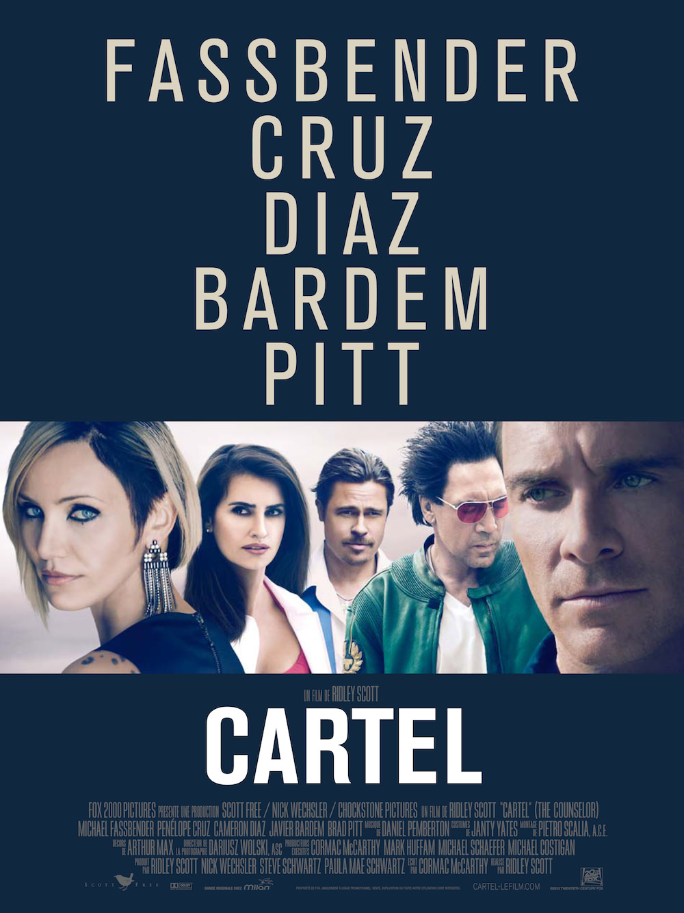
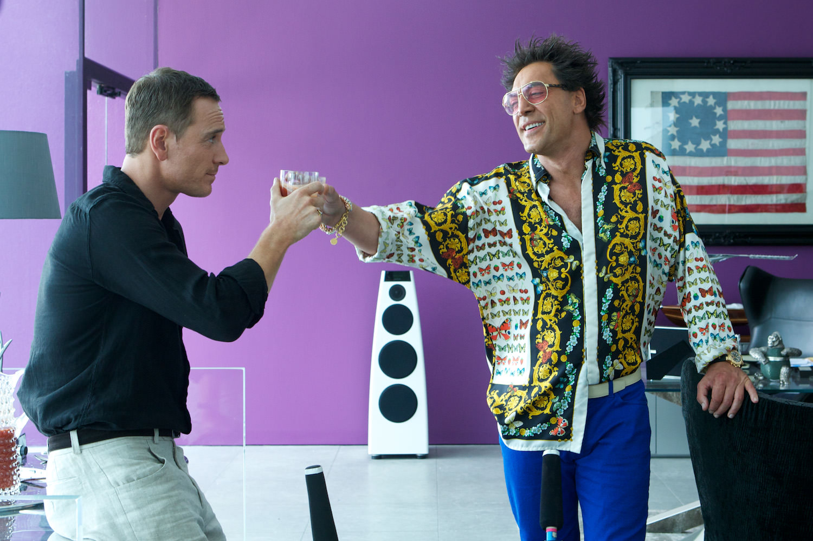

+++
titre = "<em>Cartel</em>, Ridley Scott"
title = "Cartel, Ridley Scott"
url = "/cartel-scott"
date = "2013-11-14T00:04:39"
Lastmod = "2014-09-30T18:21:25"
cover = "cartel-scott-cameron-diaz.jpg"
categorie = [ "À voir" ]
tag = [ "Argent", "Drogue", "Mafia", "Mort", "Société", "Thriller" ]
createur = [ "Ridley Scott" ]
acteur = [ "Brad Pitt", "Bruno Ganz", "Cameron Diaz", "Javier Bardem", "Michael Fassbender", "Penélope Cruz" ]
annee = [ "2013" ]
weight = 2013
pays = [ "États-Unis" ]
original = "The Counselor"

+++

Cormac McCarthy est un romancier américain qui est devenu très célèbre grâce au cinéma. Avec <a href="http://voiretmanger.fr/la-route-hillcoat/" title="La Route, John Hillcoat"><em>La Route</em></a> et surtout <a href="http://voiretmanger.fr/no-country-for-old-men-coen/" title="No Country for Old Men, Joel et Ethan Coen"><em>No Country for Old Men</em></a>, deux de ses romans ont créé d’excellents films qui lui ont permis de se faire un nom auprès du grand public, comme à Hollywood. Plutôt que de simplement voir ses œuvres adaptées, l’auteur a décidé d’écrire lui-même un film. <em>Cartel</em> est ainsi non pas une adaptation, mais un scénario original rédigé par McCarthy lui-même. En soi, le projet était déjà extrêmement intéressant, mais ajoutant à cela une belle brochette de stars et <a href="http://voiretmanger.fr/createur/ridley-scott/">Ridley Scott</a> à la réalisation, on espérait beaucoup de ce long-métrage. Le résultat est… surprenant : on attendait un film de genre bien ficelé, mais <em>Cartel</em> n’est pas un thriller facile à classer. C’est un film très bavard bien loin du blockbuster attendu, mais ce n’est pas un défaut, au contraire. À condition de se laisser porter par son récit pas toujours très clair, la dernière réalisation de Ridley Scott est une très bonne surprise, à découvrir.

L’affiche de <em>Cartel</em> en dit beaucoup sur le défilé de stars concentré dans un seul film. Le nom du réalisateur est à peine lisible, alors que l’on a cinq noms d’acteurs et uniquement leurs visages en guise d’illustration. Michael Fassbender, Penelope Cruz, Cameron Diaz, Javier Bardem et Brad Pitt : des monstres du cinéma contemporain et ils se partagent tous l’affiche, dans ce qui s’apparente d’emblée à une sorte de film choral un peu fourre-tout. De fait, le scénario imaginé par Cormac McCarthy prend un malin plaisir à éviter les lignes droites et le long-métrage nous plonge dès les toutes premières minutes dans un tourbillon qui commence par dérouter. On ne sait pas, dans un premier temps, qui est qui et qui fait quoi, mais on comprend assez vite que l’on suit principalement un avocat qui n’est jamais nommé autrement que par « <em>Counselor</em> » par tous les autres personnages. Un peu véreux, cet avocat traite avec des gens pas toujours nets depuis quelques années. C’est ainsi qu’il s’est approché de la mafia de la drogue, par le biais d’un client, Reiner. Bon vivant, il possède plusieurs clubs, mais sa richesse qu’il exhibe fièrement vient surtout du trafic de drogue en provenance du Mexique. On ne sait pas pourquoi exactement, mais cet avocat qui fait office de personnage principal a besoin d’argent quand <em>Cartel</em> commence. De beaucoup d’argent : il se tourne alors vers son client et demande à participer à une opération. Cela tombe bien, une grosse livraison de drogue est prévue au début du film : il y en a pour 20 millions en tout et notre avocat espère en tirer un morceau. Malheureusement, les choses ne se passent pas comme prévu et la drogue est mystérieusement subtilisée pendant le transport. Le scénario imagine un malheureux concours de circonstances qui condamne l’avocat et Ridley Scott lance alors une course contre la montre entre le cartel et l’avocat qui a touché à quelque chose qui le dépasse.

Déroutant. C’est bien le meilleur qualificatif pour décrire <em>Cartel</em>, non pas que le film soit incompréhensible, mais il n’adopte pas les méthodes de narration traditionnelles. Très éloigné en cela du blockbuster traditionnel, le long-métrage ne donne que très peu d’explications et préfère faire confiance à l’intelligence du spectateur. C’est trop rare pour ne pas être noté : on a ici les informations les plus importantes et on comprend à peu près ce qui se passe, mais il faut être attentif et il faut accepter de ne pas tout comprendre. Fidèle à son écriture romanesque, Cormac McCarthy est avare en détails et privilégie une écriture sèche, sans artifice. Ainsi, les personnages et la mise en scène expliquent souvent la majorité de ce qu&rsquo;il faut savoir et Ridley Scott a pris un grand soin à ne pas en rajouter, pour un résultat assez froid, presque conceptuel. Les spectateurs venus voir des stars et du grand spectacle seront incontestablement déçus par ce long-métrage assez lent et quasiment dénué d’action, mais qui fait plutôt la part belle aux dialogues. Dans le déferlement de personnages que l’on décrivait plus haut, ce qui frappe en effet est la domination des dialogues sur l’action. <em>Cartel</em> est un film extrêmement bavard, avec une majorité de séquences à deux qui se succèdent pendant près de deux heures. Cela pourrait être ennuyeux, mais les dialogues de Cormac McCarthy sont d’un si bon niveau que l’on voudrait que le film s’étale encore un pour en entendre plus. Très bien écrits, ils en disent énormément sur les personnages et jouent souvent des tours : Reiner, interprété par un Javier Bardem en grande forme, tient un discours machiste assez caricatural qui fait penser dans un premier temps que c’est lui qui contrôle, alors qu’il n’est qu’un pantin. À la fin, le discours se fait plus philosophique et confine au ridicule, mais n’est-ce pas un moyen de moquer la vision de ces personnages qui ne sont, au fond, que des pions sur un échiquier qui les dépasse ? Sans en dévoiler trop sur l’intrigue, on peut dire qu’il y a un sens du tragique dans <em>Cartel</em> et que l’on sent très vite que les choses ne peuvent se passer autrement que mal. Les explosions de violence, aussi brutales que spectaculaires, apportent dès lors un contrepoint passionnant aux dialogues qui semblent bien vains en comparaison.

Rares sont les films où le scénariste a tant d’importance qu’on aurait tendance à lui attribuer le mérite, plus qu’au réalisateur lui-même, de la réussite. <em>Cartel</em> en fait peut-être partie : de l’organisation du récit au soin apporté aux dialogues, en passant par l’absence écrasante de tout espoir, tout respire ici Cormac McCarthy. Le romancier ne pouvait pas se contenter d’un thriller un peu paresseux et il signe avec Ridley Scott un film vraiment surprenant, qui s’apparente à un banal thriller, mais qui plonge le spectateur dans un tourbillon de personnages et de dialogues sans lui donner toutes les clés. <em>Cartel</em> peut être frustrant, on peut le trouver confus, mais cette œuvre complexe, certes, est une vraie réussite pour peu que l’on soit attentif et que l’on accepte de ne pas tout comprendre. C’est un objectif qui mérite d’être salué et encouragé…

<h3>Vous voulez <a href="http://voiretmanger.fr/soutien/">m&rsquo;aider</a> ?</h3>
<ul>
<li><a href="http://www.amazon.fr/gp/product/B00GP0DRG8/ref=as_li_ss_tl?ie=UTF8&amp;tag=leblogdenic07-21&amp;linkCode=as2&amp;camp=1642&amp;creative=19458&amp;creativeASIN=B00GP0DRG8">Acheter le film en Blu-ray sur Amazon</a></li>
<li><a href="http://www.amazon.fr/gp/product/B00GP0DQUK/ref=as_li_ss_tl?ie=UTF8&amp;tag=leblogdenic07-21&amp;linkCode=as2&amp;camp=1642&amp;creative=19458&amp;creativeASIN=B00GP0DQUK">Acheter le film en DVD sur Amazon</a></li>
<li><a href="https://itunes.apple.com/fr/movie/cartel/id783466888">Acheter ou louer le film sur l&rsquo;iTunes Store</a></li>
</ul>

