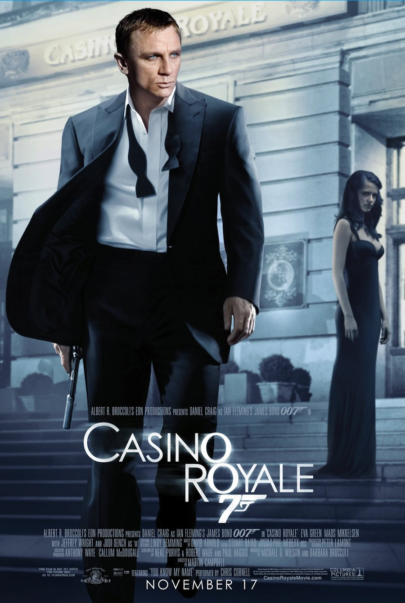
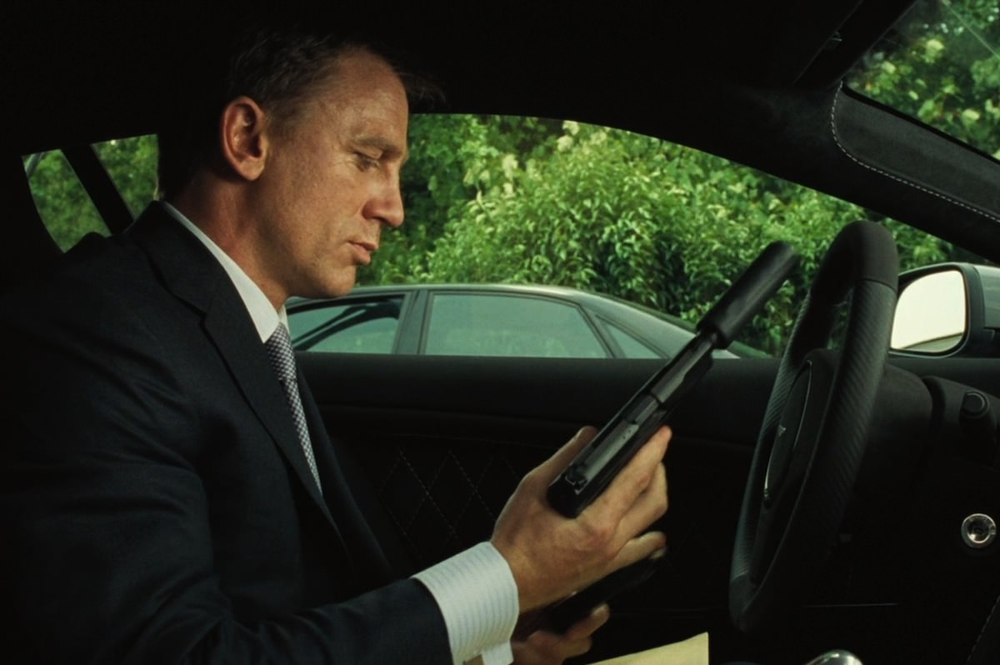
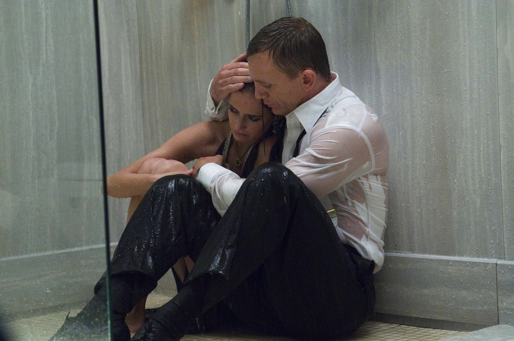

+++
type = "post"
titre = "<em>Casino Royale</em>, Martin Campbell"
title = "Casino Royale, Martin Campbell"
url = "/casino-royale-campbell"
date = "2012-11-18T08:43:40"
Lastmod = "2014-09-21T10:11:08"
cover = "james-bond-casino-royale-mads-mikkelsen.jpg"
categorie = [ "À voir" ]
tag = [ "Blockbuster", "Espionnage", "James Bond", "Poker", "Reboot", "Violence" ]
createur = [ "Martin Campbell" ]
acteur = [ "Daniel Craig", "Eva Green", "Judi Dench", "Mads Mikkelsen" ]
annee = [ "2006" ]
weight = 2006
saga = [ "James Bond" ]
pays = [ "États-Unis", "République Tchèque" ]

+++

Quand <em>Casino Royale</em> sort sur les grands écrans en 2006, la franchise James Bond n&rsquo;est pas au meilleur de sa forme. Emportée par Pierce Brosnan sur les derniers épisodes, elle a atteint des sommets en matière de classe et d&rsquo;humour à la britannique, mais la formule peine à se renouveler et la saga a perdu de sa magie. Il est temps de renouveler l&rsquo;espion le plus connu du cinéma et cela passe cette fois non seulement par un nouvel acteur — Daniel Craig qui ne pourrait être plus différent de son prédécesseur —, mais aussi et surtout par une nouvelle formule. Pour son vint-et-unième film, la saga <em>James Bond</em> s&rsquo;offre un nouveau départ, un retour aux sources du personnage. Un pari osé qui s&rsquo;avère payant : <em>Casino Royale</em> impose un virage salutaire pour la saga, une réussite totale.

Tout bon <em>James Bond</em> commence par une séquence d&rsquo;ouverture qui précède le générique et qui en met souvent plein la vue, une façon de plonger d&rsquo;emblée le spectateur dans l&rsquo;ambiance. Celle de <em>Casino Royale</em> surprend d&rsquo;abord… par l&rsquo;emploi du noir et blanc. Il s&rsquo;agit en fait d&rsquo;un flashback : James Bond n&rsquo;est pas encore 007, c&rsquo;est un jeune agent en formation qui a hâte d&rsquo;enfin devenir pleinement un agent secret au service du MI6. Sa formation achevée avec la mort d&rsquo;un agent corrompu, il est envoyé par son agence pour sa première mission : suivre les traces d&rsquo;un fabricant de bombe lié à Le Chiffre, banquier qui stocke et utilise l&rsquo;argent de criminels dans le monde entier. La traque de cet homme se passe mal et 007 finit par le tuer devant les caméras d&rsquo;une ambassade, une faute professionnelle grave qui contraint M d&rsquo;envoyer sa nouvelle recrue en vacances. James Bond part effectivement au Bahamas, mais c&rsquo;est pour mieux suivre la piste de Le Chiffre et il remonte ainsi sa trace, tout en perturbant ses plans financiers. Ruiné, Le Chiffre doit à tout prix se refaire sur le plan financier et il participe pour cela à une partie de pokers réservés aux millionnaires. C&rsquo;est autour de cette table de jeu au Monténégro que le combat entre les deux hommes va se poursuivre…

Tous les ingrédients de la saga <em>James Bond</em> sont bien là, mais rien ne se passe comme prévu dans <em>Casino Royale</em>. Martin Campbell connaît bien la licence, puisqu&rsquo;il a déjà réalisé <a href="http://voiretmanger.fr/2012/11/25/goldeneye-campbell/" title="GoldenEye, Martin Campbell"><em>GoldenEye</em></a> sorti une dizaine d&rsquo;années auparavant. Dans ce nouvel opus, il semble tout faire pour détourner les codes de la saga et de son personnage principal. C&rsquo;est la première fois, dans la saga &laquo;&nbsp;officielle&nbsp;&raquo;, que James Bond n&rsquo;est pas 007, du moins pas au départ ; il manque aussi des personnages emblématiques : si M est bien présent, le maître des gadgets Q et la secrétaire Moneypenny ne font pas d&rsquo;apparition, pas plus d&rsquo;ailleurs que les gadgets pourtant si typiques de la saga. <em>Casino Royale</em> cherche plus de simplicité, tant pour son héros, plus brut, que pour les astuces de scénario que constituaient souvent les gadgets. Dans la voiture de James Bond, une Aston Martin évidemment, on trouve ainsi deux caches, le premier pour le flingue et le second avec un pacemaker, mais aucune arme d&rsquo;aucune sorte, encore moins un siège éjectable. Martin Campbell détourne jusqu&rsquo;aux symboles et joue de nos attentes : quand le héros commande une vodka-martini et que le serveur lui demande s&rsquo;il la préfère au shaker ou à la cuillère, James Bond répond un « <em>qu&rsquo;est-ce que j&rsquo;en ai à foutre ?</em> » qui correspond si peu au personnage que l&rsquo;on connaît. Dans la série des détournements, on peut aussi évoquer l&rsquo;Aston Martin DB5 qui symbolise à elle seule la série et qui n&rsquo;a qu&rsquo;un rôle minimal et encore, après avoir été gagnée au jeu. De manière plus profonde, <em>Casino Royale</em> change de registre avec une violence beaucoup plus crue et un réalisme que l&rsquo;on n&rsquo;a jamais vu dans la saga. Le héros prend de vrais coups, il en donne aussi quelques-uns et on est bien loin des combats presque polis des <em>James Bond</em> de la grande époque. L&rsquo;influence de films à succès récents, à commencer par la trilogie <em>Jason Bourne</em>, est ici palpable.

<em>Casino Royale</em> est un reboot, c&rsquo;est-à-dire un nouveau départ pour la série et surtout une nouvelle naissance pour l&rsquo;agent 007. Symbole fort : le film se termine sur la fameuse phrase « <em>My name is Bond, James Bond.</em> » qui résume à elle seule le personnage. Pendant cette séquence finale, le personnage agit enfin comme l&rsquo;agent que l&rsquo;on connaît, comme s&rsquo;il venait de naître. Dans cette optique, le film de Martin Campbell apparaît comme la naissance de 007, depuis ses débuts en formation dans le prologue jusqu&rsquo;à la scène de clôture où il a atteint la sagesse et le cynisme nécessaires. Entre temps, il a découvert les difficultés du métier et assassiné beaucoup plus de monde que nécessaire, il a aussi trouvé et perdu l&rsquo;amour, une étape sans aucun doute décisive dans sa formation. Le cinéaste a bien réussi à rendre son côté voyou au départ, un aspect qui tranche avec ce que l&rsquo;on avait l&rsquo;habitude de voir dans les <em>James Bond</em>, mais qui est assez fidèle au personnage imaginé par Ian Flemming. L&rsquo;agent est un orphelin qui a une revanche à prendre sur le monde : très musclé, très sec, il est une boule de nerf et une tête brulée qui n&rsquo;hésite jamais à bondir, quitte à faire les mauvais choix. Sa ténacité lui permet malgré tout de suivre correctement sa piste et de remonter jusqu&rsquo;au méchant, sans l&rsquo;aide du MI6 qui est retenu par des obligations politiques — une idée que l&rsquo;on retrouve d&rsquo;ailleurs dans le récent <a href="http://voiretmanger.fr/2012/10/27/skyfall-mendes/" title="Skyfall, Sam Mendes - À voir et à manger"><em>Skyfall</em></a>. <em>Casino Royale</em> est, pour ces raisons, un épisode plus violent que la moyenne, mais le paradoxe est que le combat se déroule surtout autour d&rsquo;une table de poker. Martin Campbell a su entretenir le suspense le temps d&rsquo;une longue partie de poker qui met en avant les qualités de l&rsquo;agent secret, mais aussi ses défaillances : là encore, le personnage que l&rsquo;on connaît bien n&rsquo;est pas encore tout à fait formé, il apprend de ses erreurs.

Faire appel à Martin Campbell pour relancer la saga <em>James Bond</em> n&rsquo;était pas un choix anodin. Ce cinéaste a pour ainsi dire l&rsquo;habitude de ce genre de tâche, puisque c&rsquo;est déjà lui qui avait offert à la série un nouveau souffle avec <em>GoldenEye</em>, en 1995. Même si les deux films sont très différents, on retrouve malgré tout de nombreux points communs, à commencer par un renouvellement des équipes qui était alors encore plus profond. <em>Casino Royale</em> introduit un nouveau James Bond, avec l&rsquo;arrivée de Daniel Craig, mais il conserve le même M — l&rsquo;excellente Judi Dench — et efface tous les autres personnages secondaires, ou presque. Le choix de l&rsquo;acteur britannique dans le rôle titre est assez courageux : le pari était de choisir un acteur totalement différent de Pierce Brosnan qui le précédait, mais aussi différent de tous les James Bond précédents. Très musclé et blond aux yeux bleus, il incarne parfaitement un petit voyou, à des années-lumières du dandy chic que l&rsquo;on avait l&rsquo;habitude de voir. Dans <em>Casino Royale</em>, l&rsquo;agent montre ses muscles et les utilise de manière outrancière, alors qu&rsquo;il avait plutôt tendance à faire preuve de discrétion et de tact jusqu&rsquo;alors. Le personnage est aussi globalement dénué de l&rsquo;humour <em>so british</em>, tandis qu&rsquo;il n&rsquo;est pas encore un homme à femmes. Toutes ces différences s&rsquo;intègrent parfaitement au scénario que Martin Campbell met très bien en scène, même s&rsquo;il faut noter une baisse de rythme assez nette après la partie de poker. Que l&rsquo;on se rassure, le blockbuster est bien au rendez-vous et il est de qualité, un point qu&rsquo;oublie malheureusement les producteurs avec son successeur, le décevant <a href="http://voiretmanger.fr/2008/10/31/james-bond-quantum-of-solace/" title="James Bond, Quantum of Solace - À voir et à manger"><em>Quantum of Solace</em></a>.

Relancer la franchise <em>James Bond</em> n&rsquo;était pas chose aisée, mais Martin Campbell s&rsquo;en sort remarquablement bien. Avec <em>Casino Royale</em>, il a réussi à imposer un nouveau héros, beaucoup plus réaliste et moins emprunté que ses prédécesseurs. On perd au passage quelques éléments caractéristiques de la saga, comme les gadgets ou l&rsquo;humour, certes, mais c&rsquo;est pour mieux les retrouver dans <em>Skyfall</em>. Cet épisode purifié était sans doute nécessaire pour donner à 007 et à ses aventures toutes leurs chances… Mission réussie en tout cas pour ce vint-et-unième épisode !

<strong>James Bond reviendra dans… <a href="http://voiretmanger.fr/2008/10/31/james-bond-quantum-of-solace/" title="James Bond, Quantum of Solace"><em>Quantum of Solace</em></a></strong>

<h3>Vous voulez m&rsquo;aider ?<a href="#footnote_0_7729" id="identifier_0_7729" class="footnote-link footnote-identifier-link" title="&Agrave; propos de la publicit&eacute;&hellip;">1</a></h3>
<ul>
<li><a href="http://www.amazon.fr/gp/product/B000NO28KS/ref=as_li_ss_tl?ie=UTF8&#038;tag=leblogdenic07-21&#038;linkCode=as2&#038;camp=1642&#038;creative=19458&#038;creativeASIN=B000NO28KS">Acheter le film en Blu-Ray sur Amazon</a></li>
<li><a href="http://www.amazon.fr/gp/product/B000NPDMVG/ref=as_li_ss_tl?ie=UTF8&#038;tag=leblogdenic07-21&#038;linkCode=as2&#038;camp=1642&#038;creative=19458&#038;creativeASIN=B000NPDMVG">Acheter le film en DVD sur Amazon</a></li>
<li><a href="https://itunes.apple.com/fr/movie/casino-royale-2006/id561902712">Acheter ou louer le film sur l&rsquo;iTunes Store</a></li>
</ul>
<ul>
<li><a href="http://www.amazon.fr/gp/product/B006VCDMQU/ref=as_li_ss_tl?ie=UTF8&#038;tag=leblogdenic07-21&#038;linkCode=as2&#038;camp=1642&#038;creative=19458&#038;creativeASIN=B006VCDMQU">Acheter le coffret <em>James Bond</em> en Blu-Ray sur Amazon</a></li>
<li><a href="http://www.amazon.fr/gp/product/B006VCDMD8/ref=as_li_ss_tl?ie=UTF8&#038;tag=leblogdenic07-21&#038;linkCode=as2&#038;camp=1642&#038;creative=19458&#038;creativeASIN=B006VCDMD8">Acheter le coffret <em>James Bond</em> en DVD sur Amazon</a></li>
</ul>

<ol class="footnotes"><li id="footnote_0_7729" class="footnote"><a href="http://voiretmanger.fr/soutien/">À propos de la publicité…</a> [<a href="#identifier_0_7729" class="footnote-link footnote-back-link">&#8617;</a>]</li></ol>
