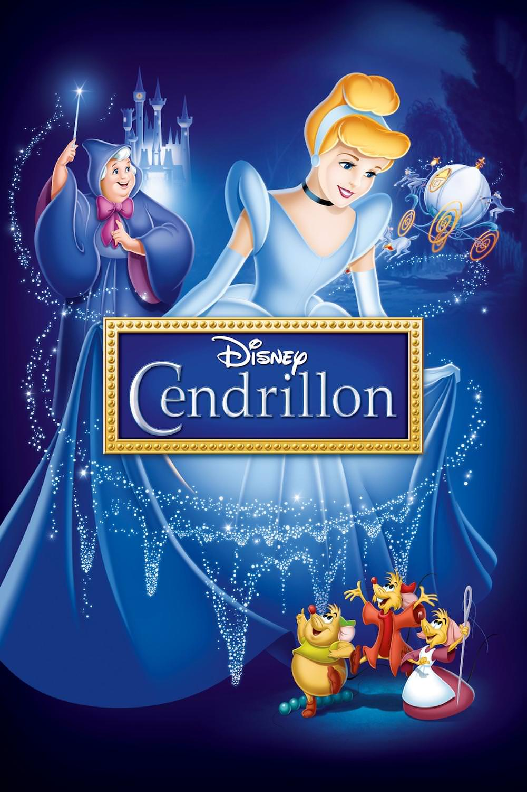
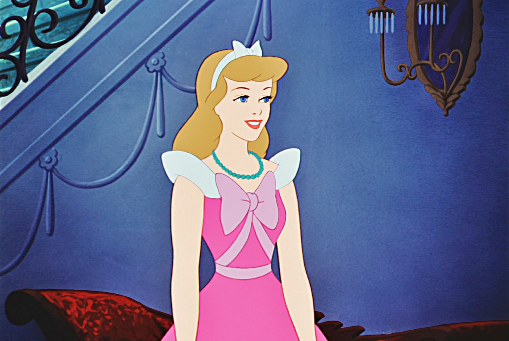
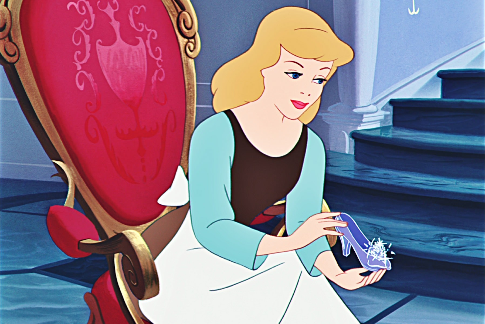

+++
type = "post"
titre = "<em>Cendrillon</em>, Clyde Geronimi, Wilfred Jackson et Hamilton Luske"
title = "Cendrillon, Clyde Geronimi, Wilfred Jackson et Hamilton Luske"
url = "/cendrillon-geronimi-jackson-luske"
date = "2014-02-12T12:35:27"
Lastmod = "2014-02-12T12:42:49"
cover = "cendrillon-walt-disney.jpg"
categorie = [ "À voir" ]
tag = [ "Amour", "Animation", "Animaux", "Conte", "Fantastique", "Princesse", "Romance" ]
createur = [ "Clyde Geronimi", "Hamilton Luske", "Walt Disney", "Wilfred Jackson" ]
annee = [ "1950" ]
weight = 1950
saga = [ "Classiques d'animation Disney" ]
pays = [ "États-Unis" ]
original = "Cinderella"

+++

Depuis la sortie de <a href="http://voiretmanger.fr/bambi-hand/" title="Bambi, David Hand"><em>Bambi</em></a>, Walt Disney et son studio n’ont plus signé aucun long-métrage. Pendant sept ans, ils enchaînent les projets mineurs, des films qui ne sont que des compilations de petits courts-métrages rarement réussis, même s’ils offrent souvent un terrain d’expérimentation intéressant pour les animateurs et les scénaristes du studio. Autant dire que le retour au long-métrage avec <em>Cendrillon</em> était attendu : après des années difficiles liées aux échecs commerciaux de ses premiers films, puis de la Seconde Guerre mondiale qui le prive de la moitié de ses revenus, le studio peut enfin se concentrer à nouveau sur de gros projets. Les points communs avec <a href="http://voiretmanger.fr/blanche-neige-sept-nains-hand/" title="Blanche-Neige et les sept nains, David Hand"><em>Blanche-Neige et les sept nains</em></a> ne manquent pas et ce film s’ajoute à la légende ces <a href="http://voiretmanger.fr/saga/classiques-danimation-disney/">classiques Disney</a>. Cette histoire de princesse et de son prince charmant n’est sans doute pas très originale, mais elle reste indémodable. Un vrai classique !

L’idée d’adapter <em>Cendrillon ou la Petite Pantoufle de verre</em>, conte du XVIe siècle signé Charles Perrault, est sans doute parmi les premiers projets du studio Disney. Les histoires européennes fascinent Walt Disney et c’est à nouveau vers l’Europe et vers ce classique de la littérature revisité au XIXe siècle par les frères Grimm qu’il se tourne logiquement. L’histoire est connue : Cendrillon est une jeune femme maltraitée par sa belle-mère depuis la mort de son père, mais elle rencontre à un bal le prince du coin et c’est le coup de foudre. Une base qui rappelle assez celle de <em>Blanche-Neige et les sept nains</em> et liens que l’on peut esquisser entre les deux films ne doivent sans doute rien au hasard. Les deux personnages principaux sont deux princesses maltraitées au début et qui trouvent leur voie grâce à l’amour. Dans les deux films, des personnages secondaires atypiques — ici des nains, là des souris et des oiseaux — viennent aider la princesse. Une belle-mère est à l’origine des maux des deux princesses et le fantastique est au rendez-vous, qu’il soit positif — la magie de la marraine dans <em>Cendrillon</em> — ou négatif — la sorcellerie de la reine dans <em>Blanche-Neige et les sept nains</em>. On sent bien que Clyde Geronimi, Wilfred Jackson et Hamilton Luske, les trois réalisateurs qui signent le long-métrage, ont eu comme consigne de relancer le studio avec un projet à l’ancienne, loin des expérimentations des années 1940. Projet réussi avec ce long-métrage riche en couleurs, enjoué et effrayant à la fois et surtout qui met en scène l’archétype même de la princesse.

Le personnage a sans doute un peu vieilli et la passivité totale de Cendrillon surprend sûrement les enfants aujourd’hui. Pourtant, <em>Cendrillon</em> fait partie de ces classiques Disney qui n’ont pas si mal vieilli dans l’ensemble, peut-être à cause du manque de moyens pour réaliser le film. Les studios sortent difficilement de plusieurs années de crise et ce douzième classique d’animation doit renflouer les caisses et rembourser les banques. L’idée de ressortir un long-métrage participe à ce projet plus global, mais encore faut-il limiter au maximum les coûts de production pour augmenter les chances de rentabiliser le projet au plus vite. Le scénario a ainsi subi de nombreux ajustements par rapport aux contes originaux, en particulier pour réduire les dépenses. Certaines scènes ont été supprimées, d’autres totalement réécrites, à l’image de la conception de la robe qui devait mettre en scène l’héroïne, mais qui a été finalement confiée aux animaux, moins complexes et donc moins chers à animer. On pourrait reprocher à <em>Cendrillon</em> son style simplifié par rapport aux premiers longs-métrages du studio. Il est vrai que comparé à la richesse d’un <a href="http://voiretmanger.fr/pinocchio-luske-sharpsteen/" title="Pinocchio, Hamilton Luske et Ben Sharpsteen"><em>Pinocchio</em></a>, ce nouveau film semble bien pauvre, en particulier dans ses décors. Rétrospectivement, c’est sans doute ce qui permet à <em>Cendrillon</em> de ne pas vieillir et cette simplicité est aujourd’hui considérée comme un avantage. Au-delà du style, le film pose les bases d’une mécanique bien huilée depuis. Les premiers longs-métrages du studio ont tous leurs particularités, mais celui-ci ouvre une nouvelle page de l’histoire Disney avec des films plus proches les uns des autres. Les personnages secondaires comiques, la place du fantastique, celle de l’amour… autant d’éléments qui paraissent clichés aujourd’hui, mais qui étaient novateurs à l’époque. À bien des égards, le long-métrage est un laboratoire d’idées déterminant pour les années qui suivent…

Réalisé pour coûter le moins et rapporter le plus possible, <em>Cendrillon</em> ne souffre aucunement de cette origine purement financière. Le douzième classique du studio est une œuvre indémodable, l’archétype du film de princesses de Disney et Clyde Geronimi, Wilfred Jackson et Hamilton Luske réalisent, sans doute sans le savoir, un film culte pour des générations et des générations. <em>Cendrillon</em> se revoit aujourd’hui avec plaisir, surtout pour les petits, mais aussi pour les grands…

<h3>Vous voulez m’aider ?<a href="#footnote_0_11148" id="identifier_0_11148" class="footnote-link footnote-identifier-link" title="&Agrave; propos de la publicit&eacute;&hellip;">1</a></h3>
<ul>
<li><a href="http://www.amazon.fr/gp/product/B008F91XAE/ref=as_li_ss_tl?ie=UTF8&tag=leblogdenic07-21&linkCode=as2&camp=1642&creative=19458&creativeASIN=B008F91XAE">Acheter le film en Blu-Ray sur Amazon</a></li>
<li><a href="http://www.amazon.fr/gp/product/B008F91X3G/ref=as_li_ss_tl?ie=UTF8&tag=leblogdenic07-21&linkCode=as2&camp=1642&creative=19458&creativeASIN=B008F91X3G">Acheter le film en DVD sur Amazon</a></li>
<li><a href="https://itunes.apple.com/fr/movie/cendrillon/id548934486">Acheter ou louer le film sur l’iTunes Store</a></li>
</ul>

<ol class="footnotes"><li id="footnote_0_11148" class="footnote"><a href="http://voiretmanger.fr/soutien/">À propos de la publicité…</a> [<a href="#identifier_0_11148" class="footnote-link footnote-back-link">&#8617;</a>]</li></ol>
