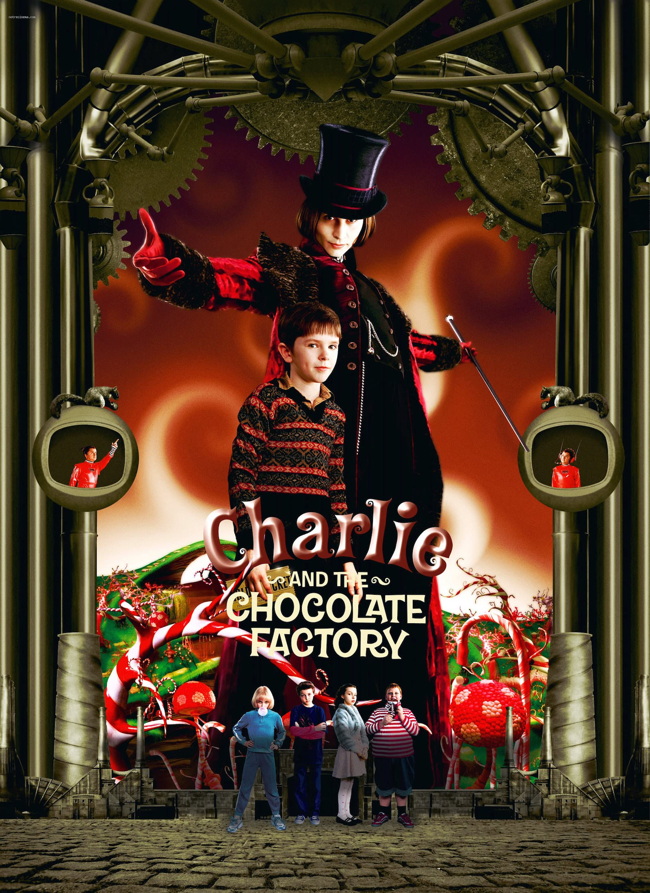
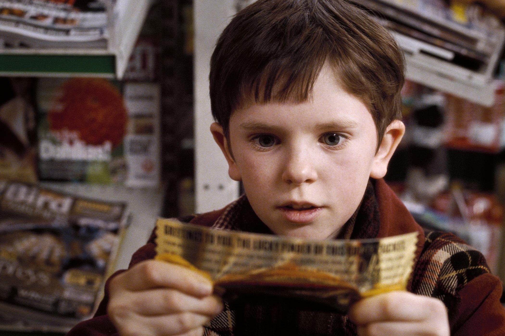
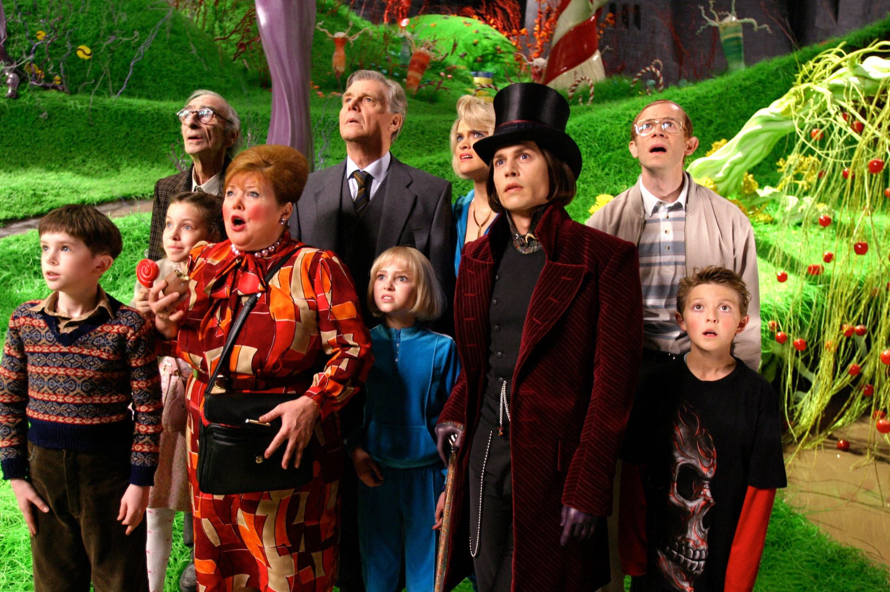

+++
titre = "<em>Charlie et la chocolaterie</em>, Tim Burton"
title = "Charlie et la chocolaterie, Tim Burton"
url = "/charlie-chocolaterie-burton"
date = "2015-01-01T19:26:17"
Lastmod = "2015-01-01T19:30:15"
cover = "charlie-et-la-chocolatrie-johnny-depp.jpg"
categorie = [ "À voir" ]
tag = [ "Adaptation littéraire", "Blockbuster", "Chocolat", "Comédie musicale", "Conte", "Enfance", "Fantastique" ]
createur = [ "Tim Burton" ]
acteur = [ "David Kelly", "Freddie Highmore", "Helena Bonham Carter", "Johnny Depp", "Noah Taylor" ]
annee = [ "2005" ]
weight = 2005
pays = [ "États-Unis" ]
original = "Charlie and the Chocolate Factory"

+++

Qui, mieux que Tim Burton, pourrait traduire l&rsquo;univers coloré de Roald Dahl au cinéma ? Le cinéaste a d&rsquo;ailleurs l&rsquo;idée d&rsquo;adapter <em>Charlie et la chocolaterie</em> dès les années 1980, mais l&rsquo;auteur encore vivant refuse toute nouvelle adaptation après un film sorti en 1971 et manifestement assez mauvais. À sa mort, le projet revient et le succès de Tim Burton aidant, il obtient les droits sur le roman. Son adaptation est à la fois très fidèle à l&rsquo;esprit de l&rsquo;œuvre originale et en même temps très « burtonienne » : on sent dès les premiers plans que les deux univers étaient faits pour se rencontrer, ce qui explique probablement le succès de <em>Charlie à la chocolaterie</em>. De fait, cette comédie partiellement musicale pour les enfants est une réussite, un enchantement visuel qui a permis au réalisateur de s&rsquo;exprimer pleinement et une belle histoire qui ravira les enfants et plaira à leurs parents.

Willy Wonka est le chocolatier le plus inventif et le plus riche de la planète, mais depuis plusieurs années, il vit reclus derrière les très hauts murs de son usine. Plus personne n&rsquo;y travaille et on ne sait pas très bien comment, au juste, sortent les chocolats vendus dans le monde entier. <em>Charlie et la chocolaterie</em> commence alors que le chocolatier annonce avoir placé cinq billets dans cinq plaquettes de ses chocolats. Les enfants qui trouvent ces billets gagnent le droit de visiter l&rsquo;usine pendant toute une journée. Roland Dahl met en scène un petit garçon qui vit à deux pas de l&rsquo;usine et qui est aussi pauvre que Willy Wonka est riche. Il vit avec ses deux parents et ses quatre grand-parents dans une maison qui tient à peine debout et la famille a du mal à vivre au quotidien. Mais évidemment, comme on peut s&rsquo;en douter, c&rsquo;est lui, Charlie, qui gagnera l&rsquo;un des cinq tickets et pourra ainsi réaliser son rêve. Tim Burton suit fidèlement cette histoire, mais on sent dès les premiers plans qu&rsquo;il impose sa patte. C&rsquo;est tout particulièrement visible pour la maison justement, qui est si mal fichue que c&rsquo;est encore un miracle qu&rsquo;elle tienne debout. Cette maison, c&rsquo;est du Burton tout craché, sans compter que la mère de famille est interprétée par Helena Bonham Carter, une habituée. On se sent en terrain connu, ce qui n&rsquo;empêche pas <em>Charlie et la chocolaterie</em> de rester très fidèle à l&rsquo;œuvre originale. Le scénario ménage bien deux ou trois changements — l&rsquo;un des gamins qui gagne un ticket n&rsquo;est plus fan de films violents, mais de jeux vidéo par exemple —, mais dans l&rsquo;ensemble on retrouve le roman original. Ce qui n&rsquo;est pas plus mal : l&rsquo;œuvre qui a servi de base reste toujours aussi bonne et le long-métrage la retranscrit bien, notamment sa magie, mais pas seulement. La critique contre les autres enfants et parents reste assez acerbe et on sent bien que Tim Burton ne s&rsquo;est pas fait prier pour grossir le trait contre ces représentants de la consommation à outrance ou de l&rsquo;<em>American Way of Life</em>.

Dans <em>Charlie et la chocolaterie</em>, le vrai sujet du film se fait attendre. Pendant un bon moment en effet, on ne voit que la famille de Charlie et sa misère, mais ni Willy Wonka, ni la chocolaterie. Un effet d&rsquo;attente qui renforce l&rsquo;effet de surprise quand on découvre enfin le chocolatier et son usine : Tim Burton a bien su monter le suspense, jusqu&rsquo;à l&rsquo;entrée dans la chocolaterie et surtout l&rsquo;entrée de son propriétaire. Johnny Depp, un autre habitué des films du réalisateur, incarne à merveille Willy Wonka et cette découverte réussie, quand on entre enfin dans la chocolaterie, lui doit énormément. Plus encore que chez Roald Dahl, cette relecture insiste sur le côté un peu fou de Willy Wonka et l&rsquo;acteur excelle pour montrer ce grain de folie de bon nombre de ses personnages. Une fois à l&rsquo;intérieur de l&rsquo;usine, <em>Charlie et la chocolaterie</em> nous fait découvrir un univers à la fois magique et complètement fou. Exploitant au maximum le cinéma à l&rsquo;ancienne, Tim Burton a recréé la chocolaterie dans des décors immenses, avec des centaines de milliers de litres pour recréer la rivière de chocolat par exemple et cet effort paye. Une dizaine d&rsquo;années après sa sortie, le film n&rsquo;a pas pris une ride et on reste toujours aussi émerveillé par l&rsquo;herbe vert pomme de la première scène et par tous les autres décors imaginés par le cinéaste. Le côté magique est bien présent et il plaira incontestablement aux enfants, mais <em>Charlie et la chocolaterie</em> n&rsquo;est pas seulement un conte mignon, c&rsquo;est aussi une fable inquiétante. À la manière d&rsquo;un <a href="http://fr.wikipedia.org/wiki/Slasher"><em>slasher</em></a>, le scénario « élimine » chaque enfant, l&rsquo;un après l&rsquo;autre et les réactions de Willy Wonka ne sont en aucun cas celles d&rsquo;un bon père. D&rsquo;ailleurs, le côté paternel du personnage a complètement disparu et on a plus affaire à un excentrique télé qu&rsquo;à quelqu&rsquo;un à qui confierait son enfant. Les plus jeunes passeront peut-être à côté de son dédain pour les enfants invités, tout comme ils ne comprendront pas probablement pas les quelques références qui émaillent le film (la plus évidente étant la scène de la télévision qui évoque <a href="http://voiretmanger.fr/2001-odyssee-espace-kubrick/" title="2001 : l’odyssée de l’espace, Stanley Kubrick"><em>2001 : l’odyssée de l’espace</em></a>), mais ce n&rsquo;est pas grave.

Quand on regarde <em>Charlie et la chocolaterie</em>, le lien entre Roald Dahl et le cinéaste paraît évident. Tim Burton a développé au fil des années un univers souvent teinté de fantastique, souvent bariolé et qui convient parfaitement pour adapter le conte original. De ce fait, le film est très réussi et même s&rsquo;il est d&rsquo;abord pour les enfants, il plaira également à toutes les générations. On peut être émerveillé par les décors colorés vraiment bien réalisés, on peut s&rsquo;inquiéter face à ce Willy Wonka plein de mystères… quel que soit le niveau de lecture, <em>Charlie et la chocolaterie</em> reste un très bon film, à (re)voir en famille !

<h3>Vous voulez <a href="http://voiretmanger.fr/soutien/">m&rsquo;aider</a> ?</h3>
<ul>
<li><a href="http://www.amazon.fr/gp/product/B001VIRLKW/ref=as_li_ss_tl?ie=UTF8&amp;tag=leblogdenic07-21&amp;linkCode=as2&amp;camp=1642&amp;creative=19458&amp;creativeASIN=B001VIRLKW">Acheter le film en Blu-ray sur Amazon</a></li>
<li><a href="http://www.amazon.fr/gp/product/B000CD9U4M/ref=as_li_ss_tl?ie=UTF8&amp;tag=leblogdenic07-21&amp;linkCode=as2&amp;camp=1642&amp;creative=19458&amp;creativeASIN=B000CD9U4M">Acheter le film en DVD sur Amazon</a></li>
<li><a href="https://itunes.apple.com/fr/movie/charlie-et-la-chocolaterie/id366613931">Acheter ou louer le film sur l&rsquo;iTunes Store</a></li>
<li><a href="http://www.netflix.com/WiMovie/70021648">Regarder le film sur Netflix</a></li>
</ul>

