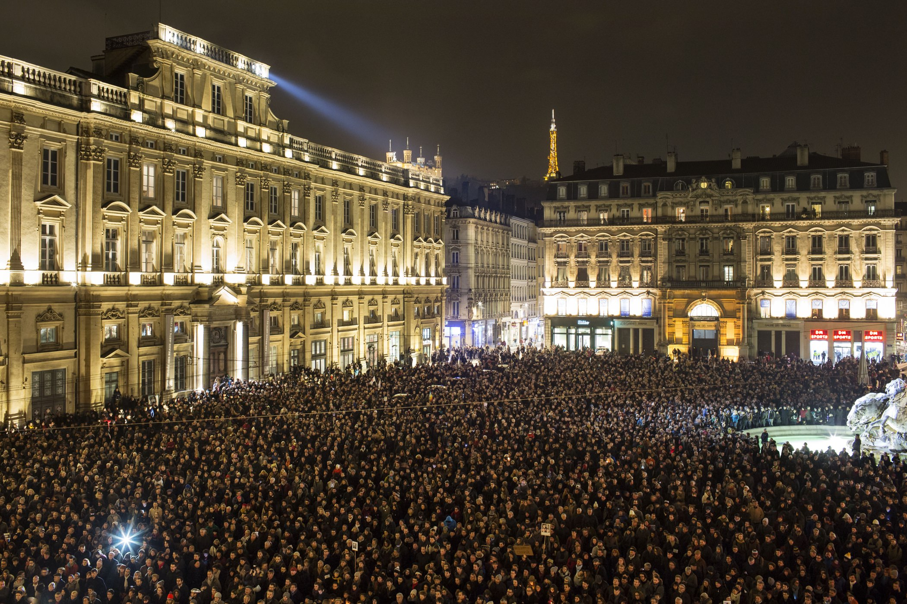
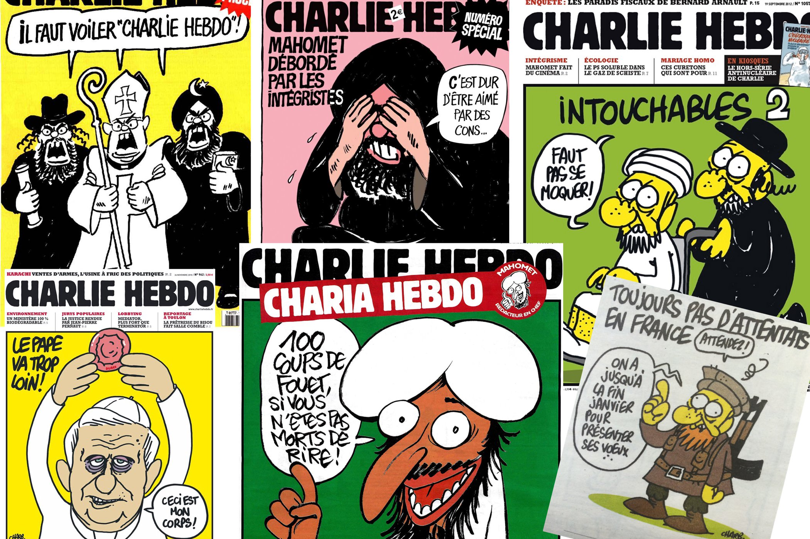

+++
titre = "Je suis Charlie"
title = "Je suis Charlie"
url = "/charlie"
date = "2015-01-08T08:02:36"
Lastmod = "2015-01-18T10:33:04"
cover = "je-suis-charlie.jpg"
categorie = [ "En bref" ]
tag = [ "Caricature", "Journalisme", "Liberté", "Presse", "Société", "Terrorisme" ]

+++

Je me rappelle encore très bien du 11 septembre 2001. J&rsquo;avais 14 ans et à cette époque où l&rsquo;internet dans la poche n&rsquo;était encore qu&rsquo;un rêve de science-fiction, je n&rsquo;avais rien su avant de rentrer après les cours, en fin d&rsquo;après-midi. Je me souviens parfaitement avoir appris la nouvelle sur la radio et avoir allumé la télévision pour mettre des images sur une idée incompréhensible. J&rsquo;étais seul à la maison et j&rsquo;ai regardé les images tourner en boucle pendant un long moment, sans trop savoir comment réagir. Je me souviendrai certainement aussi bien du 7 janvier 2015. L&rsquo;attaque contre la rédaction de <em>Charlie Hebdo</em> qui a fait une dizaine de morts et plusieurs blessés n&rsquo;est pas aussi spectaculaire, elle n&rsquo;en est pas moins grave. À l&rsquo;heure de Twitter et de l&rsquo;information en direct, j&rsquo;ai eu les informations au fur et à mesure qu&rsquo;elles étaient diffusées en boucle sur les réseaux sociaux, souvent fausses. Impossible malgré tout de quitter le flux des yeux, de ne pas regarder ce qui s&rsquo;était passé, de mettre des images à nouveau.

J&rsquo;ai longuement hésité à publier un article ici, comme j&rsquo;ai longtemps hésité de reprendre sur Twitter le fameux slogan « <em>Je suis Charlie</em> ». Je serais hypocrite de dire que j&rsquo;ai toujours lu et soutenu <em>Charlie Hebdo</em>, cela ne saurait être plus faux. J&rsquo;adore l&rsquo;humour corrosif, j&rsquo;ai toujours été convaincu avec Desproges que l&rsquo;on pouvait rire de tout à condition de bien choisir son entourage, mais je n&rsquo;ai jamais vraiment apprécié l&rsquo;humour de ce journal. Son racisme, sa misogynie et ses blagues souvent très crues ne me plaisent pas et je n&rsquo;ai jamais acheté un de leurs exemplaires. Qu&rsquo;importe, la liberté de la presse n&rsquo;est pas négociable et je suis tout également convaincu avec Voltaire qu&rsquo;il faut se battre pour que toutes les idées et toutes les opinions aient droit de cité. Je veux que ce journal, ou qu&rsquo;un autre, se moque des religions, de toutes les religions d&rsquo;ailleurs, comme il doit pouvoir se moquer des politiques ou de tout autre sujet. Et je veux aussi que sur mon blog personnel, ou même dans le cadre de mon travail, je puisse écrire et publier ce que je veux sans être inquiété. C&rsquo;est pourquoi je le revendique moi aussi : oui, je suis Charlie. Ce n&rsquo;est pas un soutien idéologique, mais un soutien tout court : on peut être en désaccord avec le journal, mais la liberté de <em>Charlie Hebdo</em> ne doit pas être négociable.

Il y aura probablement un avant et un après 7 janvier 2015, comme il y a eu un avant et un après 11 septembre. Les réactions dans le monde entier sont d&rsquo;ailleurs réconfortantes : il y a eu des rassemblements spontanés le soir-même partout en France (à Lyon sur la photo), mais aussi dans le monde. Les politiques les plus importants de tous les pays ont marqué leur soutien. Les journalistes également, en France et dans le monde, ont affiché leur soutien avec souvent des <a href="https://twitter.com/elisathevenet/status/552970203580366848">unes adaptées</a> pour tous ceux qui impriment encore. Une belle unanimité qui fait chaud au cœur, mais qui ne doit pas disparaître aussi vite qu&rsquo;elle est apparue. Espérons que <a href="https://twitter.com/n_andrieux/status/553059405294358528">tous ces morts</a> servent au moins à faire de la liberté de la presse une réalité un petit peu plus tangible, non pas en France où c&rsquo;est déjà le cas, mais dans tous les pays où elle n&rsquo;est qu&rsquo;un rêve pour le moment.

<em>Image couverture : AFP / Armend Nimani | Rassemblement lyonnais : AP Photo/Laurent Cipriani</em>

