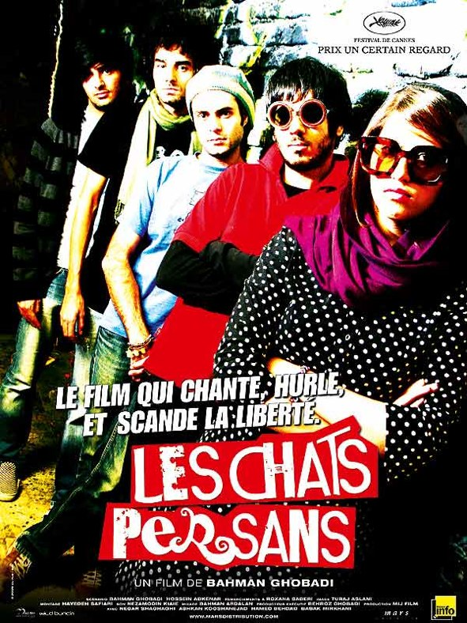
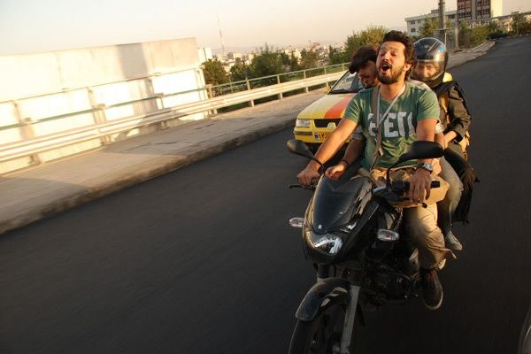
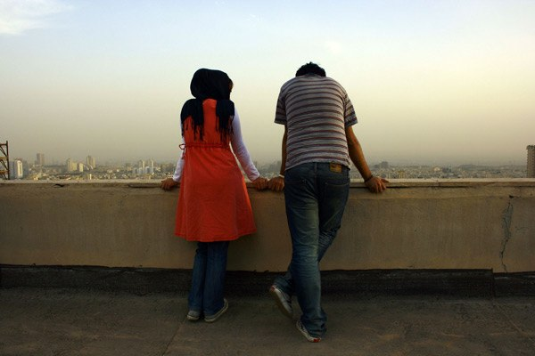
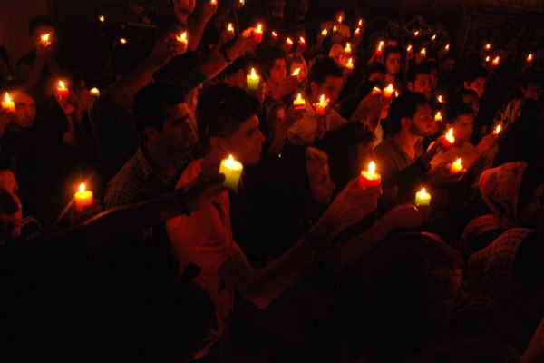

+++
type = "post"
titre = "Les chats persans, Bahman Ghobadi"
title = "Les chats persans, Bahman Ghobadi"
url = "/chats-persans-ghobadi"
date = "2010-01-02T23:20:37"
Lastmod = "2010-01-31T15:43:10"
cover = "les-chats-persans-bahman-ghobadi.jpg"
categorie = [ "À voir" ]
tag = [ "Documentaire", "Musique", "Politique", "Société" ]
createur = [ "Bahman Ghobadi" ]
annee = [ "2009" ]
weight = 2009

+++

Le régime iranien interdit toute musique qui ne respecterait pas la charia, la loi coranique. Autrement dit, toutes les musiques &laquo;&nbsp;modernes&nbsp;&raquo; qui ne glorifieraient pas Allah voire, mieux, le régime. <em>Les chats persans</em>, dernier film de Bahman Ghobadi propose, à travers un voyage dans les rues de Téhéran, un panorama des musiques clandestines de la capitale tout en dénonçant le régime. Intéressant, tant sur le fond que sur la forme.

Le film suit l&rsquo;histoire de deux jeunes Iraniens, Negar et Ashkan. Ils forment un duo et cherchent à monter un groupe de musique et jouer en Angleterre, et même dans toute l&rsquo;Europe. On les suit ainsi dans leurs pérégrinations à travers la capitale iranienne, à la recherche d&rsquo;un batteur et d&rsquo;un bassiste prêts à jouer avec eux. La musique étant interdite par le régime, on suit les deux de cave en cave, ou parfois sur les toits, dans quelques mètres carrés capitonnés au maximum pour éviter de se faire dénoncer par les voisins. Le cas échéant, la police débarque, emmène tout le monde et demande de fortes amendes, voire souvent de la prison et/ou des coups de fouet. Le problème central restant celui des visas, puisqu&rsquo;il n&rsquo;est pas question d&rsquo;en obtenir par des voies officielles. Mais si un visa afghan ne coûte que 5 €, les équivalents européen ou pire, américain, sont beaucoup plus coûteux (12 000 $ pour les États-Unis) et difficiles à obtenir…

Bahman Ghobadi cherche bien sûr, avec <em>Les chats persans</em>, à dénoncer un régime hypocrite, censé condamner toutes les œuvres qui ne respecteraient pas scrupuleusement le Coran et la charia. Évidemment, il ne s&rsquo;agit pas de limites explicitement définies dans un cadre de loi, même bien plus d&rsquo;un jugement de valeur laissé au bon vouloir de juges pas vraiment ouvert au progressisme moral, on s&rsquo;en doute. Voilà qui rappelle franchement les jugements pour atteintes aux bonnes mœurs qu&rsquo;a connu la France tout au long du XIXe siècle. Sauf que l&rsquo;on est bien en 2009…

<em>Les chats persans</em> pointe donc du doigt ce régime, avec à la clé l&rsquo;une des scènes les plus amusantes du film où, devant le juge, le condamné jure sur la tête de sa mère qu&rsquo;il n&rsquo;a jamais goûté une seule fois à l&rsquo;alcool et que les films américains sont totalement respectueux de la charia. Néanmoins, le film n&rsquo;est pas un pamphlet politique, il est bien plus complexe et passionnant. Son statut est déjà étonnant. Ça n&rsquo;est pas un documentaire, puisque la majeure partie des scènes du film ont été tournées pour le film. Néanmoins, il ne contient aucun acteur professionnel et les différentes personnes qui interviennent jouent dans leur propre rôle. Ainsi, Negar et Ashkan sont vraiment deux jeunes artistes iraniens et tous ceux qui les entourent jouent bien de la musique dans le Téhéran underground d&rsquo;aujourd&rsquo;hui.

Le film laisse néanmoins une part importante de doute quant à la distinction entre réalité et fiction. Ainsi, on ne sait pas ce qu&rsquo;il se passe vraiment à la fin du film, puisque ce qui est montré est impossible techniquement. S&rsquo;agit-il alors d&rsquo;un fantasme ? D&rsquo;une manifestation du désespoir des jeunes iraniens aujourd&rsquo;hui ? <em>Les chats persans</em> ne donne pas vraiment de réponse, et c&rsquo;est d&rsquo;ailleurs sans doute aussi bien. Le réalisateur semble ainsi insister, il ne s&rsquo;agit pas d&rsquo;un documentaire.

Cela n&rsquo;empêche pas, on l&rsquo;a dit, de présenter le Téhéran musical underground. Le panorama est saisissant : les endroits sont vraiment extraordinaires, qu&rsquo;il s&rsquo;agisse du fin fond d&rsquo;une cave ou au contraire d&rsquo;une grange isolée de tout où seules les vaches sont perturbées par le doux son du métal qui sort des amplis. Ici, on se sert de boites d&rsquo;œufs en guise d&rsquo;isolants phoniques ; là, on utilise des bougies plutôt que d&rsquo;allumer les lumières, ou alors on attend patiemment que le voisin sorte avant de commencer. Dans notre monde occidental où la musique est omniprésente et évidente, on a du mal à se rendre compte que la musique peut être interdite, traquée. Pour satisfaire leur passion, ces jeunes doivent faire face à une adversité totale et ruser de stratagèmes pour réussir ne serait-ce qu&rsquo;à répéter. Les concerts sont aussi rares que les arrestations fréquentes, et bien souvent la musique ne sort pas d&rsquo;un cercle très restreint. Elle n&rsquo;est jamais enregistrée, et jamais jouée en public : en quelque sorte, elle n&rsquo;est que virtuelle.

Dès lors, il n&rsquo;est pas difficile de comprendre que l&rsquo;on ne connaît absolument rien de la musique iranienne d&rsquo;aujourd&rsquo;hui. À cet égard, le film intéresse par le panorama complet qu&rsquo;il en offre, de la musique traditionnelle au rap iranien, en passant par le pop-rock (nommé &laquo;&nbsp;Indie-rock&nbsp;&raquo; sur place) et le métal. Des styles très différents, des paroles souvent engagées et un résultat qui semble fort intéressant, qui mériterait en tout cas d&rsquo;être découvert. Las, la chape de plomb qu&rsquo;impose le régime islamiste rend l&rsquo;opération difficile, mais on peut espérer que le film fera bouger un peu les choses.

<em>Les chats persans</em> est donc un film plus riche qu&rsquo;il pouvait y sembler. Filmé avec les vraies personnes et non des acteurs et racontant une histoire vraie, il ne s&rsquo;agit pour autant pas d&rsquo;un documentaire. On pourrait d&rsquo;ailleurs évoquer un style cinématographique très marqué, trop peut-être, ou en tout cas un peu trop systématique, mais intéressant. Bahman Ghobadi va jusqu&rsquo;à réaliser des clips pour les titres que l&rsquo;on entend, à partir d&rsquo;un patchwork d&rsquo;images cette fois de la ville et de ses habitants. C&rsquo;est parfois très bien vu, mais c&rsquo;est aussi l&rsquo;occasion de scènes, disons&#8230; fort ridicules avec coucher de soleil et tout et tout.

Les avis sont globalement positifs chez les blogueurs : <a href="http://www.toujoursraison.com/2009/12/les-chats-persans.html">trois étoiles chez Rob</a>, <a href="http://www.surlarouteducinema.com/archive/2009/12/26/les-chats-persans-de-bahman-gobadi.html">autant chez Pascale</a>. <em><a href="http://www.critikat.com/Les-Chats-persans.html">Critikat</a></em> est plutôt content, mais regrette que l&rsquo;image et la musique ne soient pas vraiment associées, ou pas idéalement. Il est vrai que l&rsquo;on aimerait entendre plus de musique, mais il est tout aussi vrai que le film a été réalisé très rapidement (17 jours de tournage) et clandestinement. Difficile, dans ces conditions, d&rsquo;en vouloir à Bahman Ghobadi&#8230;

