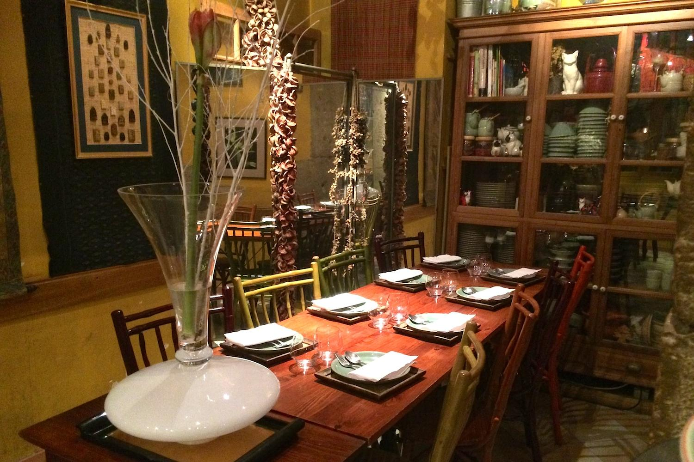
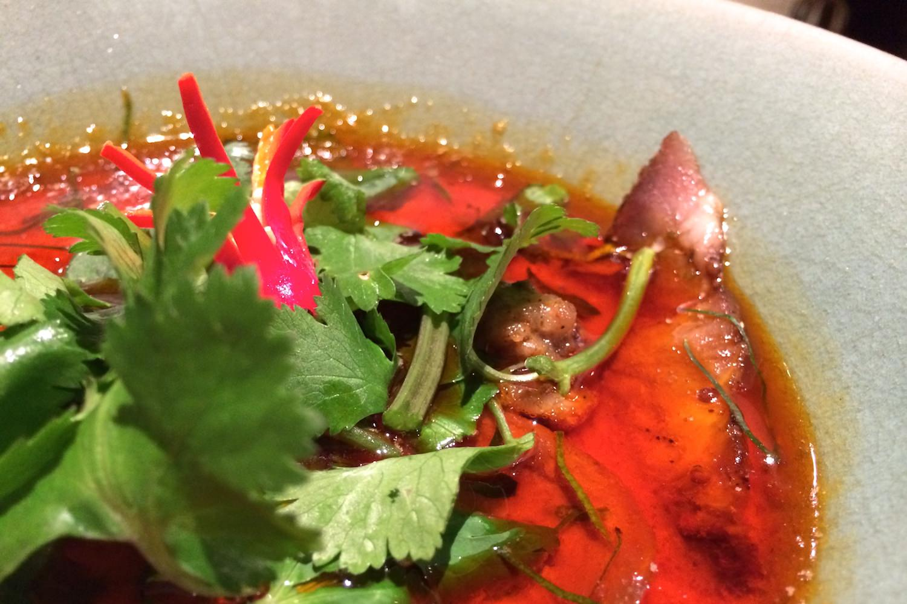
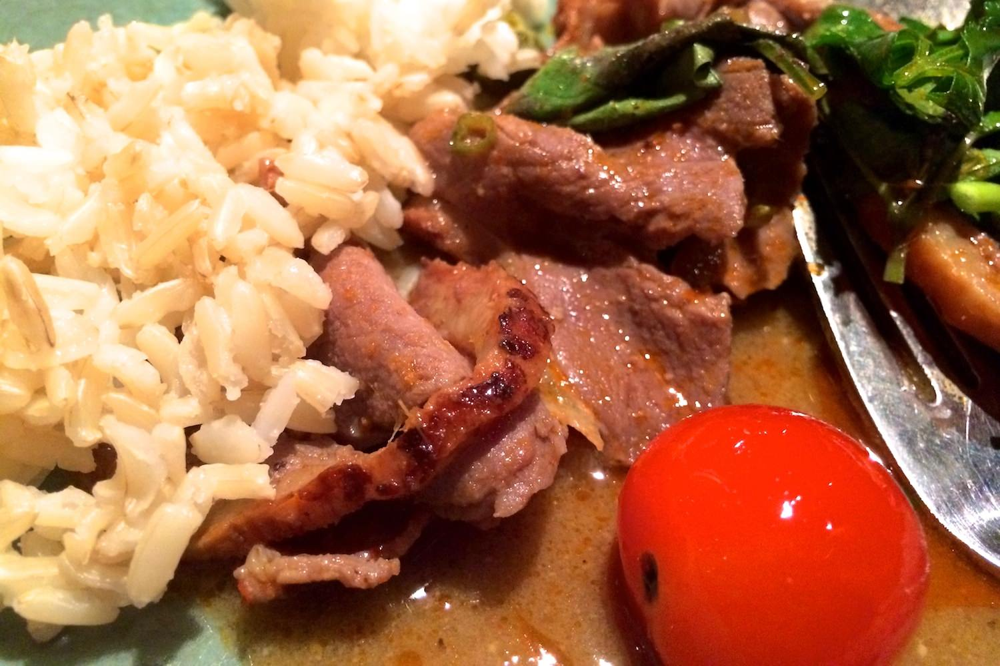
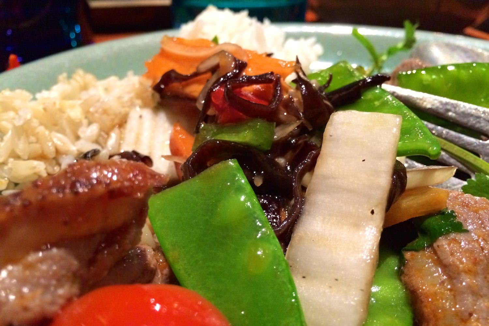

+++
titre = "Les Chats Siamois à Lyon"
title = "Les Chats Siamois à Lyon"
url = "/chats-siamois-lyon"
date = "2013-12-15T00:27:11"
Lastmod = "2013-12-15T00:34:06"
cover = "les-chiats-siamois-lyon.jpg"
categorie = [ "À manger" ]
tag = [ "Cuisine thaïlandaise" ]

+++

À deux pas de l’Opéra de Lyon, juste sous la station Croix-Paquet, <a href="http://www.lyonresto.com/restaurant-Lyon/restaurant-Les-Chats-Siamois-Lyon/restaurant-Les-Chats-Siamois-Lyon-89.html"><strong>Les Chats Siamois</strong></a> propose une cuisine thaïlandaise traditionnelle au cœur d’un quartier typiquement lyonnais. Un pari audacieux pour cette toute petite adresse qui n’entend pas réinventer ce qui se fait en Thaïlande en ajoutant à cette cuisine asiatique le savoir-faire français, mais qui propose plutôt des plats que l’on ne connaît pas forcément. Un pari intéressant, pour un résultat réussi : on passe une bonne soirée et on mange très bien des plats cuisinés avec beaucoup de finesse. Une très belle expérience…

La petite rue des feuillants qui héberge <strong>Les Chats Siamois</strong> ne manque pas de restaurants et celui-ci ne se distingue guère de ses voisins. La devanture quelconque n’attire pas l’œil, même si on distingue à travers les vitres une décoration assez éloignée des traditions lyonnaises. De fait, la salle est beaucoup plus originale avec sa décoration asiatique très réussie : sous le plafond aux poutres apparentes typique de ce quartier des Pentes, de longs éléments en bois suspendus ; sur les murs, des toiles tendues avec des représentations asiatiques. Une alliance parfaite d’un immeuble traditionnel lyonnais et de la décoration que l’on retrouverait bien dans un restaurant typique de Thaïlande. La salle est assez de petite taille et même si les tables sont rapprochées, l’ambiance était plutôt cosy ce samedi soir là et séparer les deux tables de groupes par une cloison en partie ouverte est incontestablement une bonne idée. Pour vous recevoir, deux serveurs qui n’ont rien de Thaïlandais, mais c’est côté cuisine que l’on attend l’authenticité.

La <a href="http://voiretmanger.fr/wp-content/2013/12/chats-siamois-carte.jpg">carte</a> déjà nous fait voyager : extrêmement simple, elle ne liste aucun menu, mais une liste d’une douzaine de plats sans même distinguer les entrées des plats ou des desserts. Avant cela, en guise d’explications, un mot du chef qui indique que le restaurant suit les habitudes thaïlandaises : on commande un plat par personne et la tablée partage tout. Il y a bien des plats froids qui pourraient faire office d’entrée, mais vous choisissez simplement ce qui vous fait envie et le chef s’occupera du reste. Cette promesse est alléchante et les curieux apprécieront sans doute cette liste de plats tous plus inconnus les uns que les autres. On reconnaît des noms de produits, mais la plupart des intitulés nécessitent l’intervention de l’un des deux serveurs. <strong>Le Chat Siamois</strong> propose surtout des viandes, mais fait une belle place aux gambas et autres produits de la mer, même si la prometteuse « Ruche de fruits de mer » déçoit par la présence de panga d’élevage<a href="#footnote_0_10724" id="identifier_0_10724" class="footnote-link footnote-identifier-link" title="Un poisson vietnamien, donc pour l&rsquo;origine g&eacute;ographique on &eacute;tait plut&ocirc;t bien, mais un poisson controvers&eacute; par ses m&eacute;thodes d&rsquo;&eacute;levage et qui n&rsquo;a aucun int&eacute;r&ecirc;t sur le plan gustatif. On a de tr&egrave;s bons produits en France et ce choix ressemble &agrave; une &eacute;conomie de bout de chandelle assez scandaleuse &eacute;tant donn&eacute;s les tarifs de l&rsquo;&eacute;tablissement&hellip;">1</a>. Nous nous orientons plutôt vers des viandes en choisissant, un peu au hasard, le « Pa-Neang de porc boisé » que le serveur nous présente comme un curry doux et le « Canard en rouille siamoise ». Côté prix, l’adresse n’est pas exactement donnée, puisqu’il faut compter une trentaine d’euros pour chaque plat. Faute de menu, on hésitera à prendre plusieurs éléments différents, mais en même temps, les portions généreuses n’incitent pas à le faire.

Comme annoncé par le menu, nos plats n’arrivent pas servis dans des assiettes, mais sous la forme de deux pots à se partager. À côté, un bol de riz et un autre de légumes croquants sautés pour toute la table et chacun se sert comme il souhaite. Les deux choix de ce soir-là étaient finalement assez proches d’aspect, même si en bouche le goût était très différent. Ces deux viandes en sauce étaient cuisinées avec une maîtrise impeccable des saveurs et un équilibre parfait entre la douceur d’une sauce sucrée et le piment qui reste léger pour ne pas emporter dès la première bouchée, mais qui est bien marqué. Le riz éponge l’excellente sauce, la coriandre en abondance apporte la fraicheur nécessaire et même si ces plats étaient un peu gras, difficile de ne pas se laisser séduire par la finesse des saveurs. Les légumes ajoutent du croquant, le riz est parfaitement cuit et disponible à volonté… on termine les deux plats commandés avec un peu de difficulté et il ne nous viendrait pas à l’idée de commander un dessert. Cela tombe bien, la cuisine thaïlandaise n’est pas connue pour ce point, même s’il paraît que le moelleux au chocolat pimenté proposé par <strong>Les Chats Siamois</strong> est excellent. Il faudra donc y retourner avec un plus gros appétit pour le vérifier ! La Thaïlande n’est pas non plus connue pour ses vins et la carte laisse d’ailleurs à désirer sur ce point avec deux trois références qui semblent un peu jetées au hasard et seulement deux vins au verre. Fort heureusement, le Viognier choisi pour cette soirée était non seulement bon, mais aussi bon marché.

On connaît bien la cuisine japonaise, celle de Chine et aussi du Vietnam, moins la cuisine thaïlandaise qui semble plus populaire dans les pays anglo-saxons. Une soirée chez <strong>Les Chats Siamois</strong> prouve bien que c’est une cuisine qui mériterait à être connue. Simple, mais très raffinée, elle fait un excellent usage des épices et la démonstration fournie par cette adresse est convaincante. Si l’accueil et le service ne sont pas toujours parfaits, c’est ce qui vient des cuisines qui compte et sur ce point, il n’y a rien à redire, même si ce n’est pas forcément très bon marché.

<ol class="footnotes"><li id="footnote_0_10724" class="footnote">Un poisson vietnamien, donc pour l’origine géographique on était plutôt bien, mais un <a href="http://www.asef-asso.fr/mon-alimentation/assiettes-dangereuses/1417-le-panga-un-poisson-pourri">poisson controversé</a> par ses méthodes d’élevage et qui n’a aucun intérêt sur le plan gustatif. On a de très bons produits en France et ce choix ressemble à une économie de bout de chandelle assez scandaleuse étant donnés les tarifs de l’établissement… [<a href="#identifier_0_10724" class="footnote-link footnote-back-link">&#8617;</a>]</li></ol>
