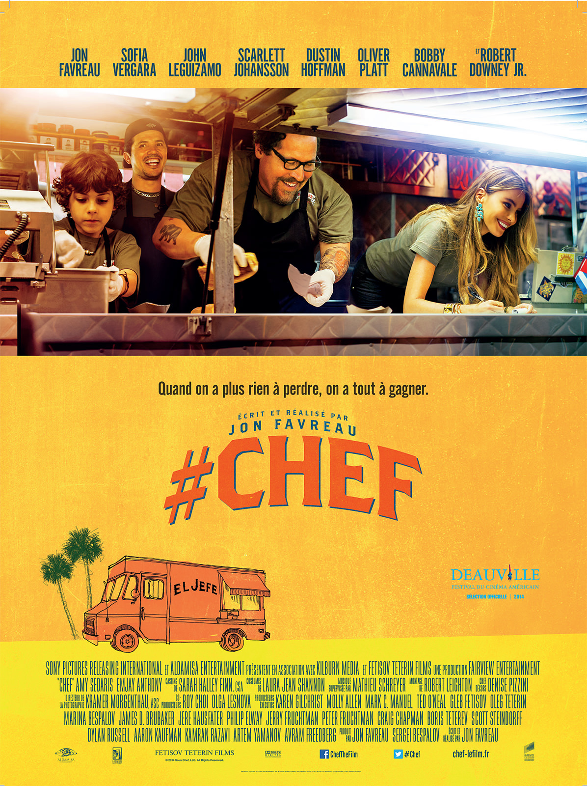
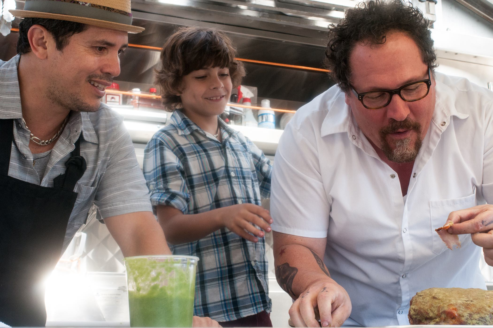

+++
titre = "<em>#Chef</em>, Jon Favreau"
title = "#Chef, Jon Favreau"
url = "/chef-favreau"
date = "2015-03-22T00:54:27"
Lastmod = "2015-03-22T01:03:34"
cover = "chef-jon-favreau.jpg"
categorie = [ "À voir" ]
tag = [ "Comédie", "Cuisine", "Famille", "Feel Good Movie", "Food Truck", "Metafilm" ]
createur = [ "Jon Favreau" ]
acteur = [ "Bobby Cannavale", "Dustin Hoffman", "Emjay Anthony", "John Leguizamo", "Jon Favreau", "Oliver Platt", "Robert Downey Jr", "Scarlett Johansson", "Sofia Vergara" ]
annee = [ "2014" ]
weight = 2014
pays = [ "États-Unis" ]
original = "Chef"

+++

Jon Favreau s&rsquo;est fait plaisir avec <em>#Chef</em>. Après plusieurs grosses productions hollywoodiennes pas toujours réussies d&rsquo;<a href="http://voiretmanger.fr/iron-man-favreau/" title="Iron Man, Jon Favreau"><em>Iron Man</em></a> à <a href="http://voiretmanger.fr/cowboys-envahisseurs-favreau/" title="Cowboys &amp; envahisseurs, Jon Favreau"><em>Cowboys &amp; envahisseurs</em></a>, l&rsquo;acteur s&rsquo;est offert le rôle de ses rêves dans son propre film. Non content de réaliser ce « petit » long-métrage indépendant, il l&rsquo;a aussi écrit et choisi un sujet qui lui tenait à cœur : la cuisine. Jon Favreau a fait appel à ses amis acteurs pour constituer un casting plein de seconds rôles assurés par des stars et il se donne le rôle principal, avec un personnage qui, en plus, lui ressemble vraiment. À la clé, <em>#Chef</em> est un <em>feel-good movie</em> très classique sur la forme et sans véritable surprise côté scénario, mais qui fonctionne aussi parfaitement. Un long-métrage mineur, très plaisant et qui donne faim.

Comme Jon Favreau, le réalisateur, Jon Favreau, l&rsquo;acteur, interprète dans <em>#Chef</em> l&rsquo;histoire d&rsquo;un homme au sommet de sa gloire qui plaque tout pour un projet beaucoup plus modeste. La différence, naturellement, c&rsquo;est que le cinéaste est censé avoir choisi son film sans l&rsquo;énorme budget habituel, tandis que Carl Casper est viré du restaurant qui l&rsquo;employait. Reconnu par ses pairs très jeune, ce chef s&rsquo;ennuie depuis plusieurs années à son travail. En cause, son patron qui l&rsquo;oblige à reproduire inlassablement les mêmes plats et le même menu inspiré par la cuisine française, là où il veut changer constamment et chercher du côté de la cuisine cubaine qui l&rsquo;inspire beaucoup plus. Face à un critique qui le démolit, le chef n&rsquo;a pas vraiment d&rsquo;autre choix que de se remettre en cause et il accepte, à contrecœur, de travailler à son compte, mais dans un <em>food truck</em>, ces camions qui servent de la cuisine dans la rue et qui sont si populaires aux États-Unis. Un changement de carrière radical, mais qui le rend extrêmement heureux et lui offre un nouveau tremplin : le succès est au rendez-vous et, on s&rsquo;en doute bien, tout est bien qui finira bien. L&rsquo;histoire n&rsquo;a pas vraiment d&rsquo;importance à dire vrai, elle est assez convenue et ce n&rsquo;est pas forcément une critique.

Jon Favreau maîtrise bien son scénario et il réussit parfaitement à transmettre les émotions désirées. La relation entre le chef et son fils est parfaitement rendue par exemple et le désir du père de transmettre son savoir est même assez touchant. <em>#Chef</em> excelle par ailleurs dès qu&rsquo;il s&rsquo;agit de cuisine : les plats préparés sont magnifiques à l&rsquo;écran et on salive vite quand on voit de la nourriture. C&rsquo;est beau et c&rsquo;est appétissant : de ce côté, il n&rsquo;y a rien à redire. L&rsquo;élément le plus faible du film, c&rsquo;est peut-être son obsession des réseaux sociaux, astucieusement rendue par le titre français qui ajoute le fameux hashtag de Twitter. Jon Favreau donne un peu le sentiment d&rsquo;avoir tout juste découvert internet au moment où il a écrit le scénario et le film est plein de références aux réseaux sociaux du moment, de Twitter à Vine en passant par Facebook. Entre leur omniprésente et les explications techniques souvent un peu trop exhaustives, on sent que le cinéaste a voulu bien faire, mais c&rsquo;est aussi la certitude que le film ne vieillira pas très bien.

<em>#Chef</em> n&rsquo;est pas un chef-d&rsquo;œuvre, ni même un grand film, mais cela n&rsquo;a jamais été sa prétention. On sent bien que Jon Favreau a voulu faire un film de cuisine et c&rsquo;est un projet qui, non seulement, lui tient à cœur, mais qui est aussi visiblement très personnel. La démarche est touchante et le résultat final réjouissant. Dans le genre du <em>feel good movie</em>, c&rsquo;est une réussite : on regarde <em>#Chef</em> avec le sourire et c&rsquo;est bien tout ce qu&rsquo;on lui demandait, au fond.

<h3>Vous voulez <a href="http://voiretmanger.fr/soutien/">m&rsquo;aider</a> ?</h3>
<ul>
<li><a href="http://www.amazon.fr/gp/product/B00P1GET0A/ref=as_li_ss_tl?ie=UTF8&amp;tag=leblogdenic07-21&amp;linkCode=as2&amp;camp=1642&amp;creative=19458&amp;creativeASIN=B00P1GET0A">Acheter le film en Blu-ray sur Amazon</a></li>
<li><a href="http://www.amazon.fr/gp/product/B00P1GEPFY/ref=as_li_ss_tl?ie=UTF8&amp;tag=leblogdenic07-21&amp;linkCode=as2&amp;camp=1642&amp;creative=19458&amp;creativeASIN=B00P1GEPFY">Acheter le film en DVD sur Amazon</a></li>
<li><a href="https://itunes.apple.com/fr/movie/chef/id932737252">Acheter ou louer le film sur l&rsquo;iTunes Store</a></li>
</ul>

