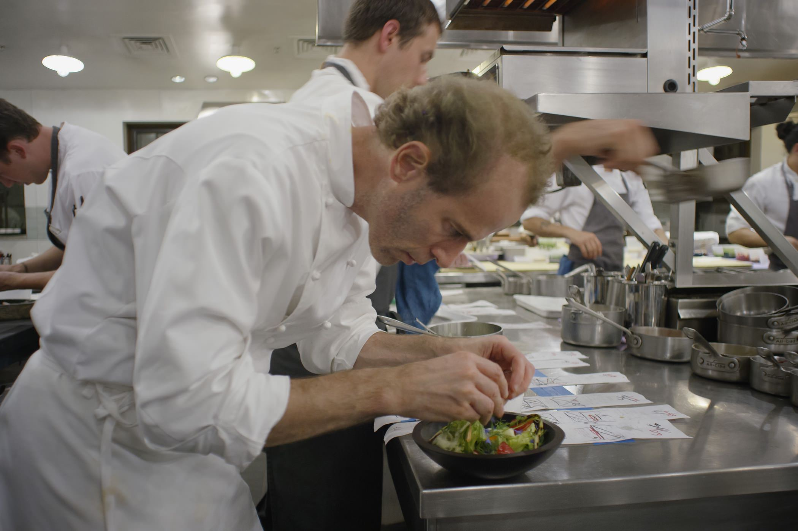
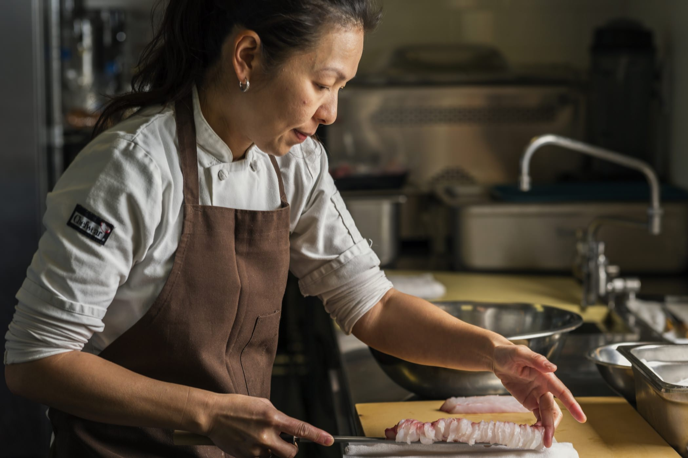

+++
type = "post"
titre = "<em>Chef&rsquo;s Table</em>, David Gelb (Netflix)"
title = "Chef's Table, David Gelb (Netflix)"
url = "/chef-table-gelb-netflix"
date = "2015-05-03T10:43:49"
Lastmod = "2015-05-03T10:47:19"
cover = "chefs-table-oops-I-drop-the-lemon-tart.jpg"
categorie = [ "À voir" ]
tag = [ "Cuisine", "Documentaire", "Série" ]
createur = [ "David Gelb" ]
annee = [ "2015" ]
weight = 2015
pays = [ "États-Unis" ]

+++

Si vous aimez la (bonne) cuisine, vous éprouvez peut-être comme l&rsquo;auteur de ces lignes une fascination pour la plus grande gastronomie et les chefs qui l&rsquo;incarnent. Et c&rsquo;est justement le pari de <em>Chef&rsquo;s Table</em>, une série de documentaires portée par Netflix : chaque épisode est consacré à un grand chef, quelque part dans le monde et à sa cuisine, ses méthodes, son cadre de vie et de travail, mais aussi son intimité. David Gelb veut offrir une plongée dans la tête de ces restaurateurs qui multiplient les étoiles au <em>Guide Michelin</em> et qui cherchent toujours inlassablement à se surpasser. Portée par une réalisation sans faille et des images splendides, la première saison de <em>Chef&rsquo;s Table</em> dresse six portraits très différents, pas tous aussi passionnants, mais l&rsquo;ensemble mérite le détour.

<iframe class="aligncenter" src="https://www.youtube.com/embed/qKqj85oo2wI" frameborder="0" allowfullscreen></iframe>

Six épisodes et six chefs : tel est le principe de cette première saison. David Gelb, qui s&rsquo;était déjà fait reconnaître pour le documentaire <a href="http://www.netflix.com/WiMovie/70181716"><em>Jiro Dreams of Sushi</em></a> sur Jiro Oni, maître du sushi de 85 ans qui officie dans un minuscule restaurant à Tokyo, n&rsquo;a pas restreint son choix de restaurants à sa ville de New-York. Il n&rsquo;y a ainsi qu&rsquo;un seul chef new-yorkais, Dan Barber du <a href="https://www.bluehillfarm.com/dine/new-york">Blue Hill Farm</a> (première photo). Niki Nakayama est l&rsquo;autre chef américain, mais elle propose une cuisine japonaise modernisée au <a href="http://www.n-naka.com">N/Naka</a>, à Los Angeles (deuxième photo). Il y a aussi un Italien avec Massimo Bottura de l&rsquo;<a href="http://www.osteriafrancescana.it/index.php">Osteria Francescana</a> à Modène, un Australien avec Ben Shewry de l&rsquo;<a href="http://www.attica.com.au/#!home">Attica</a> à Melbourne, un Suédois avec Magnus Nilsson en charge de <a href="http://favikenmagasinet.se">Fäviken</a> perdu au milieu de nulle part, et enfin un Argentin avec Francis Mallmann qui est, entre autres choses, propriétaire du <a href="http://www.restaurantepatagoniasur.com">Patagonia Sur</a> à Buenos Aires. Une jolie collection qui exclut totalement la France, du moins en apparence, car tous ont eu un lien, à un moment ou à un autre, avec l&rsquo;Hexagone. Cette sélection représente un instantané forcément partiel, mais déjà très intéressant, de la cuisine contemporaine et on peut saluer l&rsquo;effort de <em>Chef&rsquo;s Table</em> qui va chercher des profils vraiment très divers.

David Gelb a créé la série et réalisé le premier épisode, celui consacré à Massimo Bottura, mais <em>Chef&rsquo;s Table</em> fait appel à des réalisateurs différents pour la suite. Malgré tout, l&rsquo;ensemble est extrêmement cohérent, grâce à quelques choix techniques très visibles. L&rsquo;image est toujours soignée, avec des plans souvent sublimes, qu&rsquo;il s&rsquo;agisse de nourriture — certaines assiettes donnent envie de lécher l&rsquo;écran… — ou de paysages. La photographie a le chic pour magnifier ces images et on est très loin de l&rsquo;esthétique froide de certains documentaires. Ici, on est plus dans l&rsquo;esprit du cinéma, avec un traitement presque poétique qui est vraiment plaisant. On pourrait critiquer une tendance un peu trop forte à utiliser les ralentis à tout bout de champ, mais force est de constater que le résultat est souvent sublime, tout simplement. Chaque épisode nous parle d&rsquo;un chef, de son parcours, son restaurant et quelques-uns de ses plats signatures. On les voit ainsi travailler au quotidien et réaliser leurs assiettes mythiques, dont la fameuse « <a href="http://www.epicurious.com/recipes/food/views/oops-i-dropped-the-lemon-tart-51198010"><em>Oops I dropped the Lemon tart</em></a> » de Massimo Bottura, un dessert né d&rsquo;un accident survenu en cuisine et qui est désormais méticuleusement reconstitué pour chaque assiette (en tête de l&rsquo;article). Malheureusement, <em>Chef&rsquo;s Table</em> ne parle pas vraiment de cuisine et c&rsquo;est peut-être le plus gros reproche qu&rsquo;on peut lui faire. On ne sait pas comment telle ou telle assiette a été réalisée, on ne sait même pas toujours ce qui la compose. De ce fait, David Gelb n&rsquo;a pas signé un documentaire sur la cuisine à proprement parler, mais plutôt sur les cuisiniers. Chaque épisode tente, avec plus ou moins de succès, de cerner la personnalité de son sujet.

Parfois, <em>Chef&rsquo;s Table</em> y parvient complètement et certains épisodes sont vraiment excellents, en particulier celui sur Niki Nakayama qui dresse un portrait très juste et passionnant. D&rsquo;autres fois, c&rsquo;est un peu moins réussi : celui de Ben Shewry nous parle plus de sa famille et de l&rsquo;équipe de basket de son fils, alors qu&rsquo;on aimerait en savoir beaucoup plus sur sa cuisine et ses expérimentations, chaque mardi. Quant au portrait de Massimo Bottura, il est un petit peu trop lisse pour ne pas paraître suspect. Celui de Dan Barber est plus réussi et le segment sur Francis Mallmann est vraiment fascinant. Dans l&rsquo;ensemble, David Gelb a signé une série de haute volée sur le plan technique et qui parvient toujours à intéresser. <em>Chef&rsquo;s Table</em> présente des chefs très différents, mais avec des points communs fascinants. La quête d&rsquo;excellence, la volonté constante de se surpasser, l&rsquo;envie de prouver au monde sa réussite, mais aussi un certain isolement. Peut-on réussir dans ce domaine sans perdre sa famille ? Chaque cuisiner a une réponse différente à cette question, mais si David Gelb parvient à nous donner faim avec sa série, il ne devrait pas créer beaucoup de vocations.

<h3>Vous voulez <a href="/soutien/">m&rsquo;aider</a> ?</h3>
<ul>
<li><a href="http://www.netflix.com/WiMovie/80007945?trkid=50263268">Regarder le film sur Netflix</a></li>
</ul>

