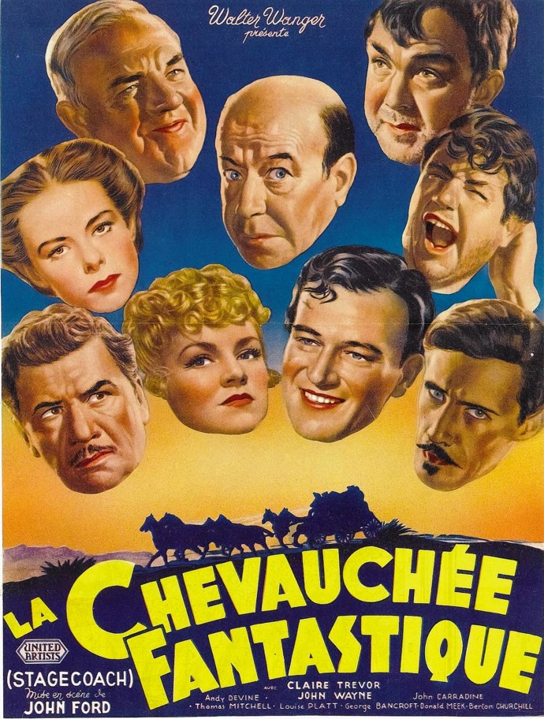
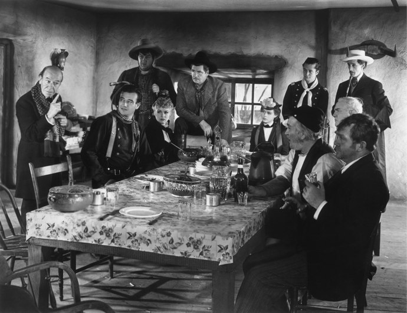
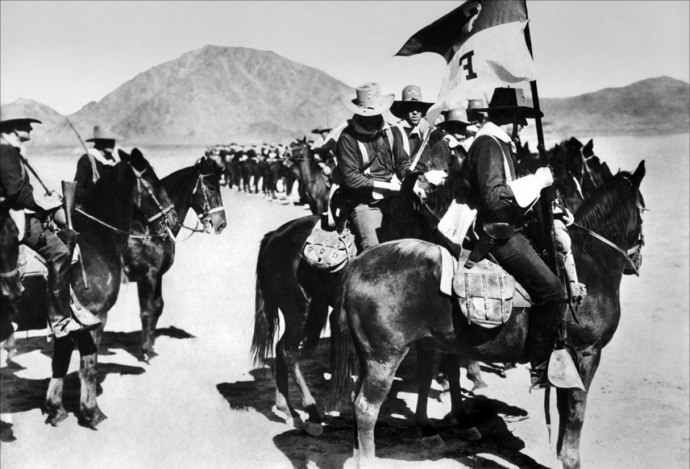

+++
type = "post"
titre = "La chevauchée fantastique, John Ford"
title = "La chevauchée fantastique, John Ford"
url = "/cheuvauchee-fantastique-ford"
date = "2010-07-20T00:03:44"
Lastmod = "2012-12-27T17:08:09"
cover = "la-chevauchee-fantastique-ford.jpg"
categorie = [ "À voir" ]
tag = [ "Cinéma classique", "Histoire", "Noir et blanc", "Société", "Western" ]
createur = [ "John Ford" ]
acteur = [ "John Wayne" ]
annee = [ "1939" ]
weight = 1939
pays = [ "États-Unis" ]

+++

<em>La chevauchée fantastique</em> fait partie de ces films mythiques qui ont définitivement changé le septième art. John Ford, réalisateur alors déjà bien connu pour de nombreux films réalisés depuis 1917, revient au western avec ce film. Le genre est alors passé de mode et relégué à la série B, mais cette chevauchée dans les vastes plaines américaines redonne durablement ses lettres de noblesse au genre. <em>La chevauchée fantastique</em> ou la naissance d&rsquo;un genre en même temps que d&rsquo;une nation. Passionnant.

Le scénario de <em>La chevauchée fantastique</em> paraîtrait aujourd&rsquo;hui bien peu original, mais ce serait oublier qu&rsquo;à l&rsquo;époque où il sort, à la fin des années 1930, les grands westerns que l&rsquo;on connaît si bien aujourd&rsquo;hui ne sont même pas encore dans la tête des plus rêveurs. Le film suit un fil narratif assez simple puisqu&rsquo;il se concentre sur une diligence et ses occupants. Cette diligence doit parcourir une certaine distance, que l&rsquo;on imagine assez courte, des États-Unis, quelque part entre le Kansas et l&rsquo;Arizona, à la fin du XIXe siècle. Ce trajet normalement sans risque est mis en péril par le terrible Géronimo, dont le seul nom suffit à susciter la terreur même auprès des hommes les plus courageux. Les Apaches sont en ordre de bataille et ils sont très craint par tous les habitants de ces contrées encore sauvages. Pourtant, la diligence emporte sept hommes et deux femmes qui doivent absolument se rendre dans la ville d&rsquo;arrivée. Leurs motifs sont plus ou moins défendables, de la jeune femme qui veut rejoindre son époux, au banquier qui cherche à partir discrètement avec le contenu du coffre, en passant par le bandit qui veut se venger ou par un docteur ivrogne qui fuit une ville où il a été rejeté. Tous vont faire le trajet, subir l&rsquo;inévitable attaque des Indiens et coexister bon gré mal gré au cours de cette frénétique chevauchée.

<em>La chevauchée fantastique</em> concentre tous les attributs traditionnels du western, au point de représenter à lui tout seul le western traditionnel. Tous les ingrédients sont en effet réunis. Les grands espaces américains bien sûr, symbolisés ici par les célèbres paysages de <a href="http://www.flickr.com/search/?q=monument%20valley&amp;w=all">Monument Valley</a> qui sont devenus des lieux communs du genre, mais qui sont exploités ici pour la première fois au cinéma. Il y a aussi la diligence, caractéristique à elle seule du genre du western bien qu&rsquo;elle ait été exploitée en de bien d&rsquo;autres endroits du monde et à de bien d&rsquo;autres époques. C&rsquo;est l&rsquo;archétype de la diligence avec son attelage de six chevaux changés à chaque relais, ses deux conducteurs, le porte-bagages au-dessus, les passagers tassés à l&rsquo;intérieur. Il y a le shérif et la cavalerie, les deux inévitables symboles de l&rsquo;État à une époque où ce dernier était encore très faible, justement. En face, il y a le bandit, au grand cœur forcément, qui se positionne au milieu de la route pour arrêter la diligence et les Indiens, terribles et sans merci, dont on ne verra jamais que les attaques. Il y a également la putain, les jeux, le whisky, un duel… : il ne manque absolument rien au décorum attendu du western dans <em>La chevauchée fantastique</em>. Ce serait terriblement anachronique d&rsquo;y voir des clichés, puisque John Ford construit ce qui deviendra des clichés par ce film. Ce n&rsquo;est sans doute pas le seul, mais il joue un rôle clé dans ce processus.

Comme tant de films, <em>La chevauchée fantastique</em> est également un formidable miroir de la société américaine de l&rsquo;époque, ou plutôt du mythe originel des États-Unis. Cette diligence qui court dans les vastes plaines américaines sans que l&rsquo;on sache très bien pourquoi, au fond, est une métaphore de la conquête des États-Unis. Une conquête réalisée par des individus venus d&rsquo;horizons divers, souvent pas très bien famés (l&rsquo;Europe s&rsquo;est beaucoup débarrassée des catégories qu&rsquo;elle ne voulait plus dans les Nouveaux-Mondes) et qui ont appris à vivre ensemble. Le fameux <em>melting pot</em> de Ford, l&rsquo;autre, n&rsquo;est rien d&rsquo;autre que cela : la constitution d&rsquo;une société à partir d&rsquo;hommes et de femmes venus de tous bords et réunis par une seule chose, l&rsquo;envie de vivre sur un immense territoire. Les motivations de la conquête ne sont pas mieux connues que celles qui poussent cette diligence à avancer vers le danger : le goût du risque et de l&rsquo;aventure, sans doute, les intérêts personnels indéniablement, la promesse également de pouvoir tout recommencer à zéro et effacer son origine sociale douteuse (la prostituée qui se marrie avec un bandit et s&rsquo;installent dans un ranch, c&rsquo;est peut-être le début d&rsquo;une ascension sociale comme la société américaine a toujours su proposer). Une société toujours marquée par ses tensions entre la vieille Europe (qui serait représentée ici par la femme enceinte qui refuse de manger à la même table qu&rsquo;une prostituée) et une société libérée où l&rsquo;on peut même fumer en présence d&rsquo;une femme. Cette conquête s&rsquo;est faite au détriment des populations autochtones, les Indiens évidemment et ce n&rsquo;est pas pour rien que le western classique oppose systématiquement Indiens et Blancs, toujours en faveur de ces derniers. L&rsquo;Indien est le parfait représentant de l&rsquo;Autre, l&rsquo;étranger que l&rsquo;on rejette et que l&rsquo;on ignore complètement : dans <em>La chevauchée fantastique</em> comme dans tant d&rsquo;autres westerns, un bon Indien est un Indien mort.

John Ford réalise avec ce western un film d&rsquo;action qui a beaucoup impressionné ses contemporains. Là encore, le film paraît bien faiblard à nos yeux habitués à coups de films de Michael Bay<a href="#footnote_0_3682" id="identifier_0_3682" class="footnote-link footnote-identifier-link" title="Ou autre&hellip; C&rsquo;&eacute;tait totalement gratuit, mais il repr&eacute;sente sans doute le paroxysme d&rsquo;un cin&eacute;ma incapable de faire des plans stables pendant plus d&rsquo;une demi-seconde&hellip;">1</a>, mais l&rsquo;action est explosive en 1939. Le clou du spectacle est évidemment l&rsquo;attaque des Indiens et la lutte acharnée entre une poignée d&rsquo;hommes et des hordes apparemment infinies d&rsquo;Indiens. Ça canarde dans tous les sens, la caméra glisse entre les cavaliers et la diligence tandis que le réalisateur multiplie les points de vue internes qui offrent une plus grande sensation de vitesse. L&rsquo;ensemble, soutenu, voire souligné par une musique énergique, tantôt martiale, tantôt joyeuse, offre un véritable suspense, même si l&rsquo;issue du combat ne fait pas l&rsquo;ombre d&rsquo;un doute. Quand tout semble perdu, la fameuse trompette de la cavalerie retentit et sauve <em>in extremis</em> la troupe. <em>La chevauchée fantastique</em> est également servi par un noir et blanc très contrasté et très beau.

Les classiques du cinéma sont intéressants, non pas tant en raison de leur statut de classiques qui, en soi, n&rsquo;a qu&rsquo;un piètre intérêt, mais plutôt en raison de leur rôle sur le septième art. Regarder <em>La chevauchée fantastique</em>, c&rsquo;est avoir un bon aperçu d&rsquo;une des sources du mythe western qui n&rsquo;est pas né avec Sergio Leone et Ennio Morricone. Bien avant eux, John Ford pose les bases du genre en même temps qu&rsquo;il contribue à construire le mythe du Far West et de la construction américaine. Passionnant, vous dis-je.

<h3>Vous voulez m&rsquo;aider ?<a href="#footnote_1_3682" id="identifier_1_3682" class="footnote-link footnote-identifier-link" title="&Agrave; propos de la publicit&eacute;&hellip;">2</a></h3>
<ul>
<li><a href="http://www.amazon.fr/gp/product/B000NQR7A2/ref=as_li_ss_tl?ie=UTF8&tag=leblogdenic07-21&linkCode=as2&camp=1642&creative=19458&creativeASIN=B000NQR7A2">Acheter le film en DVD sur Amazon</a></li>
</ul>

<ol class="footnotes"><li id="footnote_0_3682" class="footnote">Ou autre… C&rsquo;était totalement gratuit, mais il représente sans doute le paroxysme d&rsquo;un cinéma incapable de faire des plans stables pendant plus d&rsquo;une demi-seconde… [<a href="#identifier_0_3682" class="footnote-link footnote-back-link">&#8617;</a>]</li><li id="footnote_1_3682" class="footnote"><a href="http://voiretmanger.fr/soutien/">À propos de la publicité…</a> [<a href="#identifier_1_3682" class="footnote-link footnote-back-link">&#8617;</a>]</li></ol>
