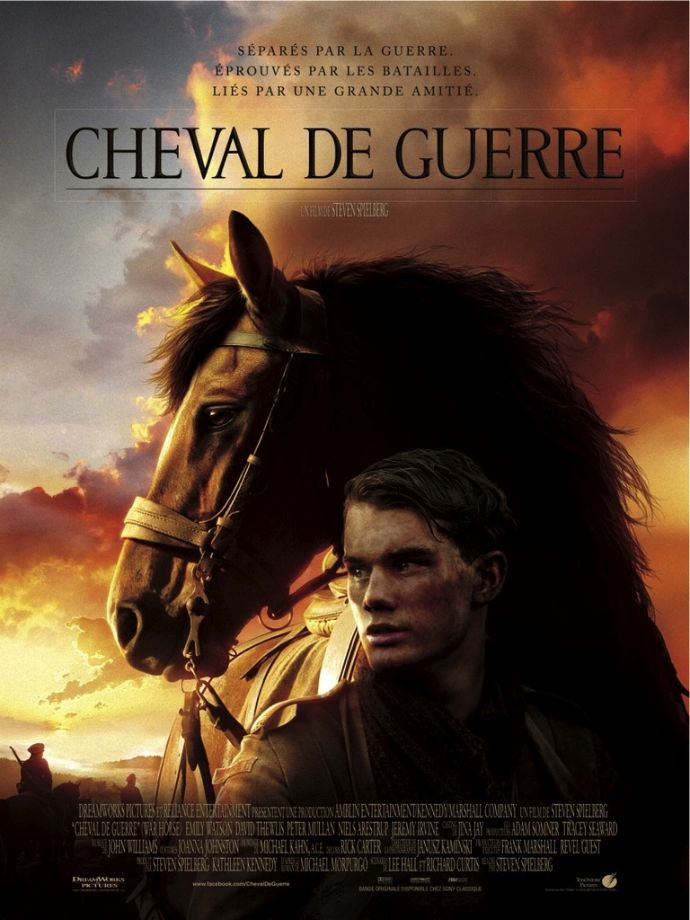
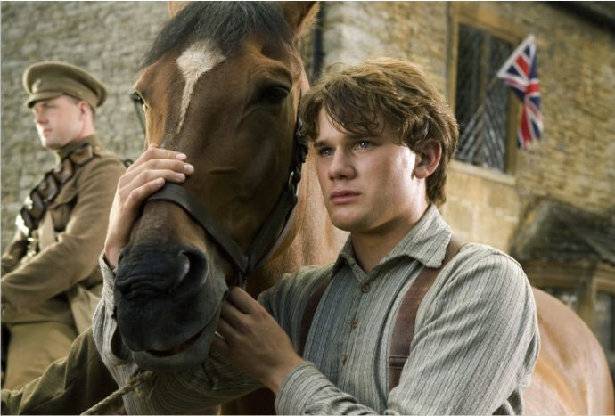
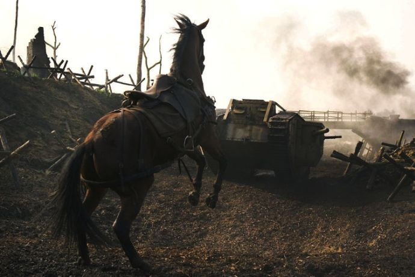

+++
titre = "<em>Cheval de Guerre</em>, Steven Spielberg"
title = "Cheval de Guerre, Steven Spielberg"
url = "/cheval-guerre-spielberg"
date = "2012-02-25T18:34:55"
Lastmod = "2014-11-09T17:00:48"
cover = "cheval-de-guerre.jpg"
categorie = [ "À voir" ]
tag = [ "Animaux", "Blockbuster", "Drame", "Fresque", "Guerre", "Histoire", "Vite oublié" ]
createur = [ "Steven Spielberg" ]
acteur = [ "David Thewlis", "Jeremy Irvine", "Niels Arestrup", "Peter Mullan" ]
annee = [ "2012" ]
weight = 2012
pays = [ "États-Unis" ]
original = "War Horse"

+++

Ce n&rsquo;est que quelques mois seulement après <a href="http://voiretmanger.fr/2011/10/28/aventures-tintin-secret-licorne-spielberg/"><em>Les Aventures de Tintin : Le Secret de la Licorne</em></a> que sort le nouveau film de Steven Spielberg. Changement complet d&rsquo;ambiance puisqu&rsquo;après un film d&rsquo;animation inspiré par une bande dessinée, le cinéaste se penche sur la Première Guerre mondiale dans <em>Cheval de Guerre</em>. Son titre ne laisse aucune place au doute : il sera question de guerre et de cheval dans le vingt-sixième long-métrage de Steven Spielberg. Un angle intéressant, mais qui sombre vite dans la caricature élémentaire qui bloque vite toute émotion, dommage…

Albert est un jeune garçon de la province de Devon, en Grande-Bretagne. En ce début des années 1910, il mène une vie paisible, mais difficile, avec ses deux parents qui louent leur ferme à un riche propriétaire. Son père hait profondément son propriétaire et une vente aux enchères pour un cheval est l&rsquo;occasion pour lui de le battre. Il emporte finalement le cheval, mais il ne s&rsquo;agit pas d&rsquo;un animal de ferme suffisamment fort pour retourner la terre, mais plutôt un cheval de course. Albert connait bien ce très beau cheval, il a assisté à sa naissance et a déjà tenté à plusieurs reprises de le dresser, sans succès. Son arrivée dans la famille l&rsquo;emplit de joie et il dresse alors ce cheval, nommé Joey. Entre le jeune homme et la bête, une véritable amitié nait vite, mais la guerre arrive encore plus vite. Endetté, menacé de devoir quitter sa ferme, le père d&rsquo;Albert est contraint de vendre le cheval, au grand dam du garçon. Joey part en France se battre dans une guerre dont il est totalement étranger et Albert promet de le retrouver, coûte que coûte…

La Première Guerre mondiale vue par le prisme d&rsquo;un cheval et de l&rsquo;amitié portée à son jeune maître. Angle original pour ce <em>Cheval de Guerre</em> qui entend ainsi rappeler que cette terrible guerre qui a mis toute l&rsquo;Europe à feu et à sang a aussi tué des millions d&rsquo;animaux, chevaux en tête. Il est vrai que l&rsquo;on a parfois tendance à oublier les chevaux dans ce conflit qui a tué environ neuf millions de personnes en Europe. De nombreux chevaux ont effectivement participé à la guerre, le plus souvent comme moyens de transport pour déplacer une armée encore largement à pied. Les véhicules motorisés sont rares, on commence juste à mettre au point les tanks, mais les pièces d&rsquo;artillerie et toute l&rsquo;intendance est sont toujours déplacées à l&rsquo;ancienne, avec des chevaux. La Première Guerre mondiale est ainsi un pivot entre les guerres napoléoniennes et les conflits modernes et les différentes armées impliquées ont toujours un corps de cavalerie conséquent. Comme Steven Spielberg le montre bien, la guerre commence effectivement avec des charges de cavalerie qui s&rsquo;avèrent totalement dépassées. Au passage, des milliers d&rsquo;animaux sont morts pendant ces attaques au sabre qui ne pouvaient pas grand-chose contre des mitrailleuses lourdes.

L&rsquo;idée n&rsquo;était pas mauvaise, mais <em>Cheval de Guerre</em> tombe malheureusement dans le travers opposé. À trop vouloir célébrer la mémoire des chevaux, Steven Spielberg oublie les pertes humaines. Sa guerre n&rsquo;est qu&rsquo;une caricature grossière du conflit et à part une scène ou deux dans les tranchées, elle sonne dans l&rsquo;ensemble faux et passe globalement à côté de la réalité historique. <em>Cheval de Guerre</em> se concentre en fait sur un seul cheval, celui d&rsquo;Albert. Ce choix permet au film de résumer la guerre à une série de vignettes : les premières attaques de la cavalerie, le transport des blessés ou de l&rsquo;artillerie en arrière du front de bataille et puis les tranchées. Entre ces différents épisodes de guerre, Joey aura droit à une petite pause à l&rsquo;arrière, dans une ferme française où une petite fille veillera sur lui. Alors qu&rsquo;il avait réussi à représenter avec une époustouflante fidélité le débarquement de 1942 dans <em><a href="http://voiretmanger.fr/2011/11/26/il-faut-sauver-le-soldat-ryan-spielberg/">Il faut sauver le soldat Ryan</a></em>, Steven Spielberg passe à côté de son sujet dans <em>Cheval de Guerre</em>. On ne croit jamais aux évènements et les ficelles qui tiennent le film sont bien trop grosses pour laisser au récit une once de crédibilité. Joey est toujours au bon endroit, au bon moment, il survit miraculeusement dans toutes les situations et parvient même temporairement à arrêter la guerre dans les tranchées. Le spectateur est prié d&rsquo;éprouver pour ce cheval des émotions aussi fortes que s&rsquo;il s&rsquo;était agi d&rsquo;un homme. Le pari est gonflé et fonctionne presque par moment, mais le problème reste le même : <em>Cheval de Guerre</em> manque sérieusement de crédibilité, et le scénario n&rsquo;est pas le seul en cause.

Steven Spielberg aime les fresques historiques, cela se sent avec ce <em>Cheval de Guerre</em>. On ne demandait qu&rsquo;à se laisser emporter, mais le cinéaste en a malheureusement fait beaucoup trop. Par manque de confiance dans son projet peut-être, il souligne et surligne tout pour que le spectateur ne rate jamais le message, ni l&rsquo;émotion. Les personnages sont tous des caricatures, le père est alcoolique, mais c&rsquo;est un héros de guerre courageux ; le propriétaire est un sale capitaliste qui veut de l&rsquo;argent ; Albert a forcément un grand cœur… Les décors subissent le même traitement : cette ferme du Devon respire le carton-pâte et les décors peints à plein nez, à l&rsquo;heure du numérique c&rsquo;est même plutôt moche. Steven Spielberg multiplie les plans symboliques, à l&rsquo;image de celui sur le portail de la ferme qui sera évidemment le lieu du happy-end. Reconnaissons que le réalisateur a le sens du récit et que <em>Cheval de Guerre</em> est rythmé et ne rend pas ses 2h30 trop pénibles, même si l&rsquo;ensemble reste assez indigeste. Au rang des coupables, citons la bande originale composée par John Williams qui assène au spectateur les émotions à ressentir. Steven Spielberg n&rsquo;avait manifestement pas confiance en son cheval, il rajoute systématiquement une musique qui se veut lyrique, mais qui est surtout lourde et, là encore, très caricaturale. Loin de susciter l&rsquo;émotion attendue, elle a plutôt tendance à agacer.

L&rsquo;autre gros point noir de <em>Cheval de Guerre</em> est la langue. Pour les pires raisons qui soient, Steven Spielberg a choisi de tourner son film entièrement en anglais, alors qu&rsquo;il se déroule essentiellement en France, et souvent du côté allemand. Le spectateur ne peut que se raccrocher aux horribles accents des acteurs pour deviner s&rsquo;il s&rsquo;agit d&rsquo;un Français ou d&rsquo;un Allemand, mais c&rsquo;est globalement impossible. On ne sait du coup jamais qui est qui dans cette guerre qui semble opposer les mêmes figurants dans une masse diffuse. C&rsquo;est quand un soldat britannique fait remarquer à un soldat allemand qu&rsquo;il parle bien anglais que toute la stupidité de ce choix ressort. <em>Cheval de Guerre</em> aurait indéniablement gagné en crédibilité avec la présence de trois langues, quitte à les doubler pour les spectateurs américains…

<em>Cheval de Guerre</em> peut plaire, mais il y a une condition <em>sine qua non</em> : il faudra adhérer au parti-pris du film et éprouver quelque chose pour Joey, le véritable héros. Sans cela, le dernier film de Steven Spielberg ressemble à une Première Guerre mondiale caricaturée, façon le conflit pour les nuls. Le scénario est bien trop téléphoné et les émotions bien trop suggérées par une musique bien trop caricaturale pour réussir à plaire. Je dois être sans cœur, mais ce cheval m&rsquo;a laissé plutôt de marbre et <em>Cheval de Guerre</em> entre directement dans la catégorie <a href="http://voiretmanger.fr/tag/vite-oublie/nicolinux.fr/tag/vite-oublie/">des vite oubliés</a>…

<h3>Vous voulez m&rsquo;aider ?</h3>
<ul>
<li><a href="http://www.amazon.fr/gp/product/B006ZH3CYS/ref=as_li_ss_tl?ie=UTF8&#038;tag=leblogdenic07-21&#038;linkCode=as2&#038;camp=1642&#038;creative=19458&#038;creativeASIN=B006ZH3CYS">Acheter le film en Blu-Ray sur Amazon</a></li>
<li><a href="http://www.amazon.fr/gp/product/B006ZH3C84/ref=as_li_ss_tl?ie=UTF8&#038;tag=leblogdenic07-21&#038;linkCode=as2&#038;camp=1642&#038;creative=19458&#038;creativeASIN=B006ZH3C84">Acheter le film en DVD sur Amazon</a></li>
<li><a href="http://itunes.apple.com/fr/movie/cheval-de-guerre/id512193103">Acheter ou louer le film sur l&rsquo;iTunes Store</a></li>
</ul>

