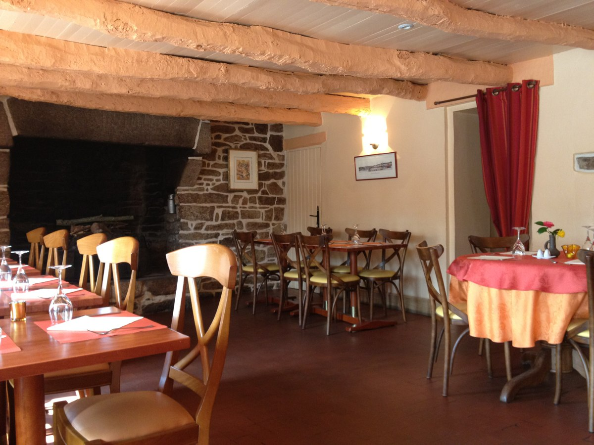
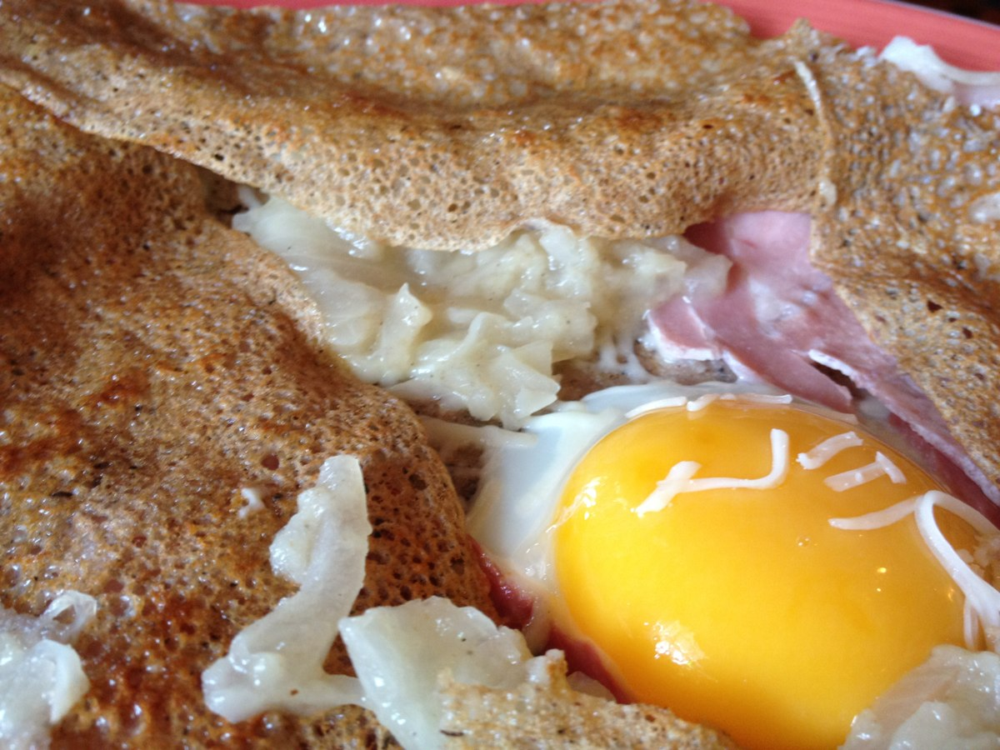
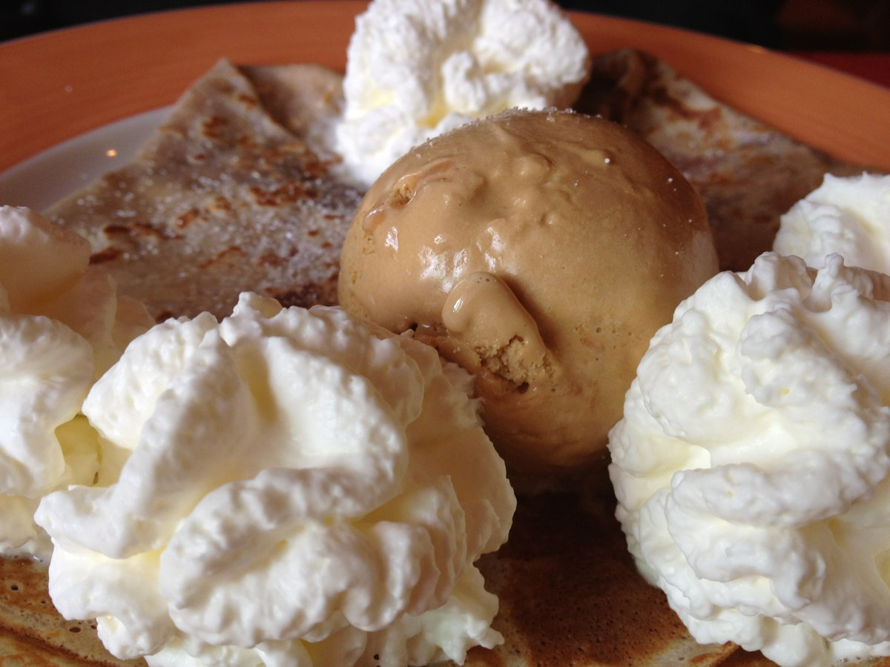

+++
type = "post"
titre = "Chez Angèle à Riec-sur-Belon"
title = "Chez Angèle à Riec-sur-Belon"
url = "/chez-angele-riec-sur-belon"
date = "2012-03-22T01:06:47"
Lastmod = "2013-02-16T22:26:30"
cover = "chez-angele-creperie-riec-sur-belon.jpg"
categorie = [ "À manger" ]
tag = [ "Bretagne", "Crêperie", "Cuisine française", "Cuisine régionale" ]

+++

Les crêperies ne manquent pas en Bretagne, même si elles ont envahi la France entière avec plus ou moins de succès d&rsquo;ailleurs. Reste que le principe vient de la péninsule bretonne et c&rsquo;est bien ici que l&rsquo;on retrouve les meilleures crêpes et galettes, à la fois simples et savoureuses. Loin des recettes d&rsquo;une complexité infinie que l&rsquo;on trouve parfois dans certaines crêperies parisiennes, les meilleures adresses s&rsquo;en tiennent à rassembler dans la pâte de leurs galettes quelques ingrédients de base. Une méthode rustique et efficace, à l&rsquo;image de la devanture de <strong><a title="" href="http://www.creperie-chezangele.fr/" target="_self">Chez Angèle</a></strong> à Riec-sur-Belon, à quelques kilomètres au sud de Pont-Aven.

Cette crêperie est assez isolée dans le bocage breton si typique. En retrait par rapport à Pont-Aven et son flot de touristes chaque été, <strong>Chez Angèle </strong>prend place dans une charmante et également typique demeure en pierre. Son toit de chaume renforce encore l&rsquo;aspect rétro du lieu et l&rsquo;ensemble est vraiment engageant. À l&rsquo;intérieur, la grande cheminée et les poutres apparentes sont dans le ton pour une décoration rustique à l&rsquo;ancienne, même si la peinture saumon choisie pour les murs sans pierres et les poutres dénature un peu l&rsquo;ensemble. La salle reste agréable et elle doit sûrement être très chaleureuse les soirs d&rsquo;hiver. Ce jour-la, un midi en semaine et hors saison, la crêperie était bien vide : un seul autre couple, de retraités cette fois, s&rsquo;est joint à nous. Heureusement, le patron n&rsquo;était pas trop présent et nous a laissé manger tranquillement, non sans nous donner un petit conseil touristique en partant.

La carte de <strong>Chez Angèle </strong>est assez classique, l&rsquo;originalité n&rsquo;étant de toute manière pas ce que l&rsquo;on recherche dans une crêperie de l&rsquo;arrière-breton. Au programme, toute la gamme de galettes de blé noir et de crêpes au froment pour les desserts. Vous aurez le choix sans surprise entre des galettes extrêmement simples, avec seulement un ingrédient ou deux et des spécialités plus complètes. Si la galette aux saint-jacques détonne dans la carte par son tarif, la super complète qui ajoute aux trois ingrédients de base de la complète (œufs, jambon et fromage) des champignons et de la sauce tomate est délicieuse. Le principe est toujours le même : quelques ingrédients simples, mais de qualité et toujours bien cuisinés. Les champignons par exemple sont frais et simplement accompagnés de crème, une recette de base qui fonctionne parfaitement. La crêperie à aussi fait le choix de produits locaux de qualité, à l&rsquo;image du miel de bruyère de la pointe du Raz ou de l&rsquo;andouille qui vient d&rsquo;un producteur local et qui, si l&rsquo;on en croit nos voisins de table, est succulente.

La présentation traditionnelle des galettes, œuf miroir avec le jaune au centre, est bien respectée <strong>Chez Angèle</strong>. La pâte est bien fine et la garniture mesurée comme c&rsquo;est souvent le cas en Bretagne. Les galettes sont vraiment bonnes, mais un bon repas se termine nécessairement par une bonne crêpe sucrée. Là encore, la carte est classique et on y trouve tout, de l&rsquo;indépassable beurre-sucre aux crêpes avec boules de glace ou autres alcools flambés. Quelques spécialités également dont une excellente aux pommes et caramel au beurre salé maison, mais il ne faut pas s&rsquo;attendre à beaucoup d&rsquo;originalité. L&rsquo;efficacité est au rendez-vous, même si les desserts se sont avérés un peu plus décevants par rapport aux galettes salées. La pâte est également fine, mais un peu sèche et plutôt craquante : elle manque singulièrement de beurre au moment de la cuisson. Au rang des déconvenues, le chocolat n&rsquo;était pas très bon, mais le caramel maison compensait amplement.

Les desserts ne nous ont pas autant satisfaits que les galettes salées. Pas de quoi gâcher la bonne impression générale de cette adresse toutefois. <strong>Chez Angèle </strong>reste une très bonne crêperie dans les environs de Pont-Aven. On trouve mieux sur le plan gustatif — <a href="/2013/02/16/talisman-pont-aven/" title="Le Talisman à Pont-Aven"><strong>Le Talisman</strong></a> reste la valeur sûre des environs<strong> </strong>—, mais le charme de la vieille demeure bretonne avec son toit de chaume compense et <strong>Chez Angèle </strong>a l&rsquo;avantage d&rsquo;être un peu isolée des touristes et relativement au calme.

