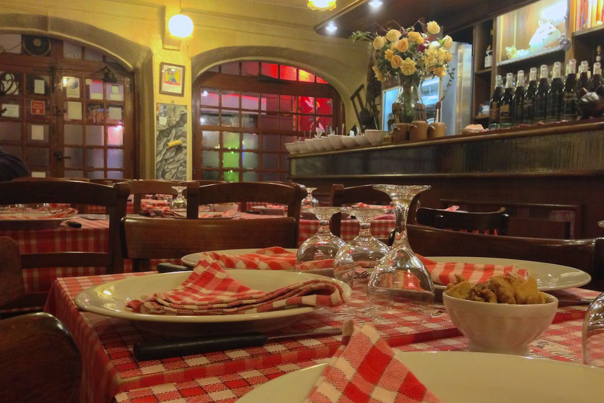
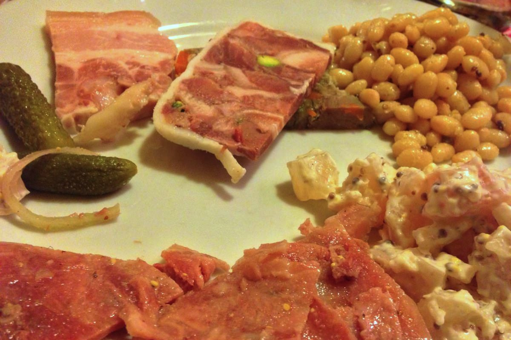
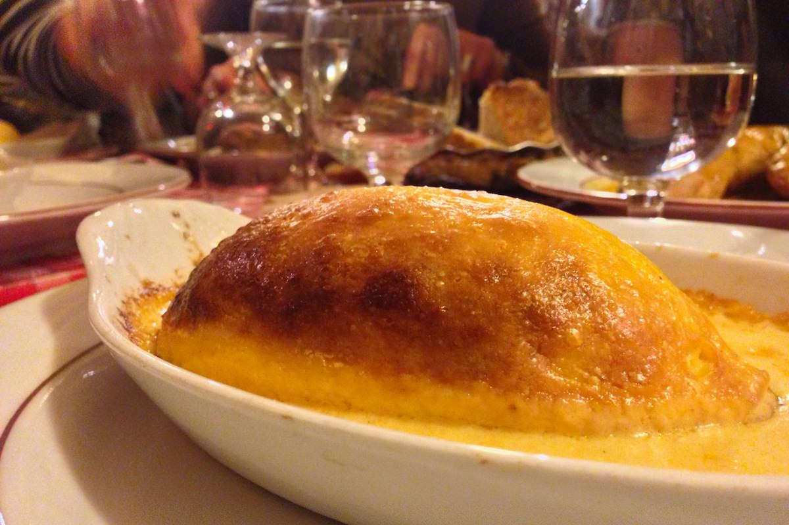
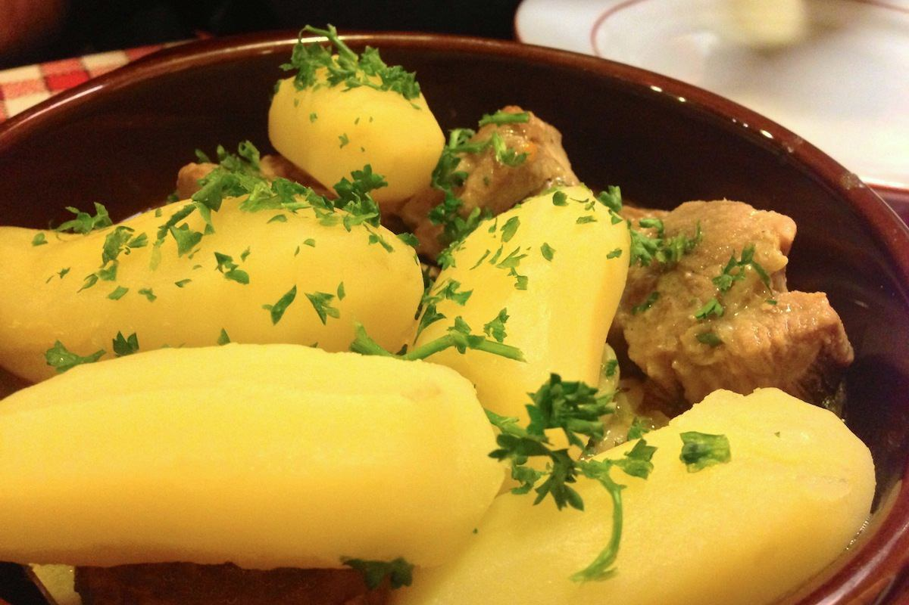

+++
type = "post"
titre = "Chez Paul à Lyon"
title = "Chez Paul à Lyon"
url = "/chez-paul-lyon"
date = "2012-11-21T00:46:45"
Lastmod = "2012-11-21T09:22:58"
cover = "bouchon-chez-paul.jpg"
categorie = [ "À manger" ]
tag = [ "Bouchon lyonnais", "Cuisine française", "Cuisine traditionnelle" ]

+++

Si vous cherchez un bouchon lyonnais typique, voici la bonne adresse. À deux pas de la place des Terreaux, au cœur du Lyon historique, <a href="http://www.chezpaul.fr/index.html"><strong>Chez Paul</strong></a> offre tout ce qu’un bon bouchon peut offrir, des nappes à carreaux à la nourriture généreuse où les abats trouvent une bonne place. Une adresse à tester pour découvrir le bouton typique, mais à réserver aux groupes et aux froides soirées hivernales…

« <em>Déconseillé aux amoureux !</em> » : le site officiel du restaurant affiche fièrement cette indication que l’on ne prendra pas à la légère. Et pour cause, derrière les vitres pleines de recommandations de guides touristiques ou culinaires, la salle de <strong>Chez Paul</strong> est aussi petite que les tables sont nombreuses. Loin d’une disposition classique de restaurant avec des petites tables, souvent pour deux convives, ce bouchon a opté pour des alignements de tables, façon cantine. Ne vous laissez pas tromper, l’adresse n’accueille pas que des groupes : si vous venez à deux, vous serez placé en enfilade sur une table, à côté d’un autre couple ou d’un groupe de dix personnes. Ce dispositif très chaleureux doit faciliter les rencontres dans certains cas, mais il n’est pas très heureux quand on vient pour discuter. Mieux vaut en définitive réserver une table de 15 et occuper ainsi une bonne partie du restaurant… On l’aura compris, <strong>Chez Paul</strong> n’offre pas une ambiance particulièrement intimiste et le volume sonore était assez élevé pour une salle totalement pleine, une surprise en ce mardi soir. 

Quand on entre <strong>Chez Paul</strong>, les saladiers pleins sur le comptoir du bar étonnent autant que l’exiguïté de la salle. À l’intérieur, on repère en passant des salades de lentille, de betterave, des harengs à l’huile ou encore des charcuteries pas toujours bien déterminées. Et pour cause, la grande variété des plats à la carte n’est pas le fort de cette adresse. Tous les bouchons de Lyon proposent grosso modo la même carte composée des mêmes plats, mais <strong>Chez Paul</strong> a poussé le concept assez loin. Il n’y a aucun plat à la carte et un menu unique qui propose des entrées, un plat, un fromage et des desserts. Dans le lot, vous ne choisirez que le plat, tout le reste est systématiquement servi. Pour 26 € par personne, le rapport quantité/prix est imbattable avec pas moins de sept saladiers en guise d’entrée, des plats généreux, du fromage blanc ou un demi-saint-marcellin et trois desserts non pas au choix, mais tous servis à table. Ajoutez à cela un pichet de vin — là encore, il ne faut pas s’attendre à une carte fournie, le serveur ne proposait que trois vins rouges, dont l’incontournable Beaujolais nouveau — et vous aurez un repas (très) généreux. Dommage toutefois que les vins proposés se soient avérés si décevants : le Beaujolais 2012 nous a semblé très bon à côté d’un terriblement médiocre Côte du Rhône. Un comble pour un bouchon !

La quantité est au rendez-vous, mais qu’en est-il de la qualité ? Dans la capitale de la gastronomie traditionnelle, les attrape-touristes déguisés en bouchons se sont inévitablement multipliés et il n’est pas rare de mal tomber. <strong>Chez Paul</strong>, on a choisi de respecter scrupuleusement la tradition et de proposer une cuisine modeste, mais faite maison et de qualité. Les plats servis n’ont aucune ambition gastronomique, ce serait tout à fait déplacé dans un tel cadre. Ils sont en revanche préparés sur place et se sont avérés parfois succulents. Les dix plats proposés sont tous des classiques incontournables à Lyon, des tabliers de sapeur au saucisson chaud, en passant par la quenelle de brochet ou l’andouillette. Dans le lot, les quenelles se sont avérées vraiment succulentes : bien gonflées, elles étaient savoureuses et sentaient bon le fait sur place. La blanquette de veau était elle aussi très bonne, quoique moins spectaculaire, avec une recette fidèle à la virgule à la tradition. 

La générosité est le maitre mot de <strong>Chez Paul</strong> et cela se voit dans les quantités proposées. Les plats sont proposés dans un seul récipient si plusieurs personnes à table ont choisi le même et les entrées sont servies dans d’énormes saladiers qui contiennent bien plus que ce que la tablée entière pourrait avaler. De fait, ils servent non pas à une table, mais au restaurant entier et il ne faut pas rater leur passage en table, sous peine de ne pas en avoir. Nous avons eu le temps de goûter à tout, avec des résultats variables : la salade de betteraves était excellente, celle de pieds de veau beaucoup moins convaincante. La possibilité de goûter à tout et de piocher reste en tout cas très agréable et on la retrouve au dessert. Ce soir-là, nous avions un excellent flan aux œufs, des pruneaux au vin et une compote de pommes un peu décevante, mais les papilles de la tablée n’en ont eu que pour le flan. Servi dans un énorme plat avec une généreuse dose de caramel, ce dessert était simple, mais très réussi, à l’image de <strong>Chez Paul</strong> donc.

Manger <strong>Chez Paul</strong>, c’est d’abord un mode de vie, une certaine conception de la restauration. Ici, on partage tout, la table et les plats, dans une ambiance qui est effectivement assez conviviale, mais aussi très bruyante. N’y venez pas pour un diner aux chandelles avec votre amoureux(se), vous seriez très déçu. Pour découvrir un bouchon à l’ancienne, c’est en revanche une bonne idée… à faire au moins une fois. À la longue, la cuisine jamais renouvelée de <strong>Chez Paul</strong> risque toutefois de lasser bien rapidement.

