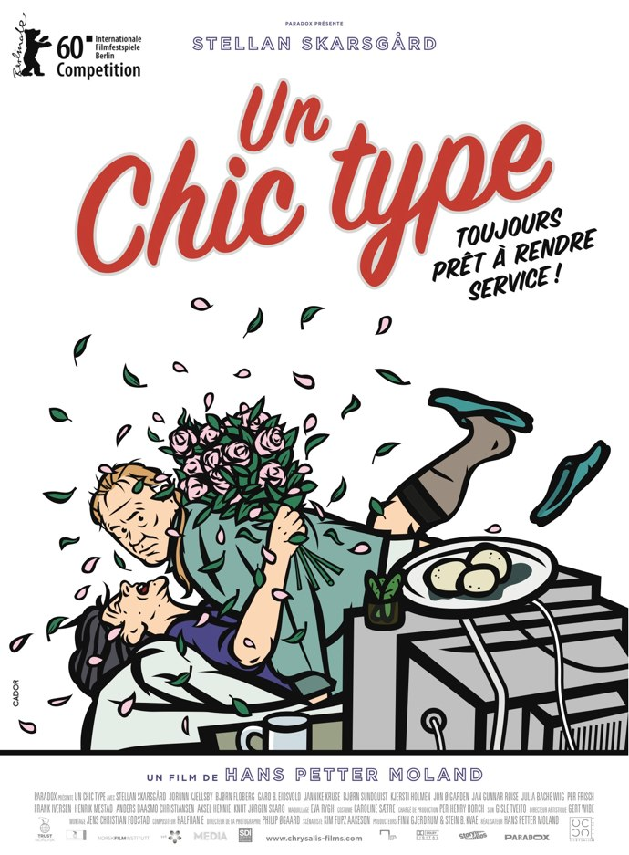
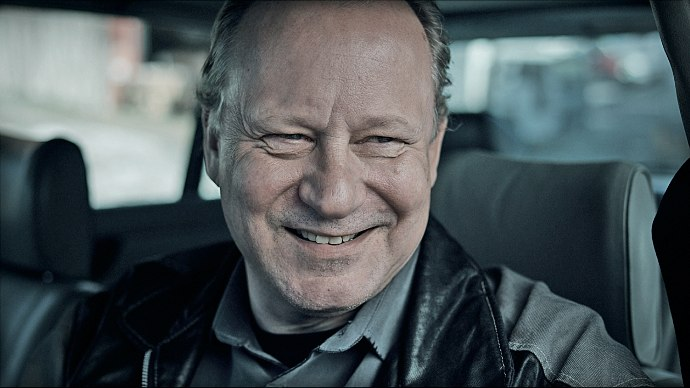
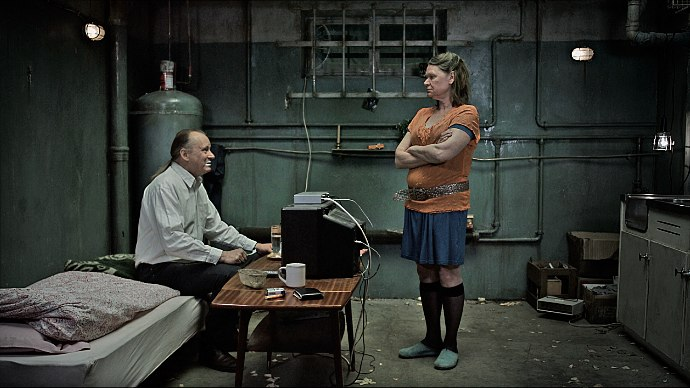

+++
type = "post"
titre = "Un chic type, Hans Petter Moland"
title = "Un chic type, Hans Petter Moland"
url = "/chic-type-moland"
date = "2010-12-18T00:06:08"
Lastmod = "2012-07-23T08:49:55"
cover = "un-chic-type-molland.jpg"
categorie = [ "À voir" ]
tag = [ "Arcs 2010", "Festival", "Humour", "Prison", "Société", "Vite oublié" ]
createur = [ "Hans Petter Moland" ]
acteur = [ "Stellan Skarsgard" ]
annee = [ "2011" ]
weight = 2011

+++

La rédemption est-elle possible après un séjour en prison ? C&rsquo;est en quelque sorte la question posée par <em>Un chic type</em>, comédie mélancolique norvégienne et dernier film de Hans Petter Moland. Pour répondre à cette question difficile, le film suit Ulrik, le chic type du titre. À travers ses hésitations se lit la difficile réinsertion d&rsquo;un homme qui a passé plus de temps entre les murs d&rsquo;une prison qu&rsquo;à l&rsquo;extérieur. Intéressant à défaut d&rsquo;être toujours drôle, <em>Un chic type</em> se regarde avec plaisir.

Ulrik sort de prison après 12 ans passés entre les murs pour un meurtre. On ne sait pas trop qui il a tué, ou pourquoi il a tué, mais cela n&rsquo;a pas tellement d&rsquo;importance. C&rsquo;était un malfrat, homme à tout faire de Jensen, un caïd local et à ce titre il s&rsquo;exécute, sans réfléchir, sans forcément non plus avoir de raisons de le faire. Au fond, il n&rsquo;est pas méchant, il n&rsquo;a simplement pas la force de choisir seul, d&rsquo;avancer sans une aide dans la vie et il se trouve que l&rsquo;aide vient du caïd en question. Quand il sort de prison, c&rsquo;est aussi vers ce dernier qu&rsquo;il se tourne tout naturellement, sans forcément chercher les ennuis, mais simplement parce qu&rsquo;il n&rsquo;a personne d&rsquo;autre vers qui se tourner. Sa femme l&rsquo;a plus ou moins quitté et son fils ignore jusqu&rsquo;à son existence. Jensen lui trouve un toit et un boulot, et il pousse Ulrik à se venger de celui qui, 12 ans plus tôt, l&rsquo;a dénoncé. Ulrik n&rsquo;est pas très motivé, mais tout l&rsquo;enjeu du film est de savoir s&rsquo;il va rester un chic type, ou non…

<em>Un chic type</em> n&rsquo;entre pas vraiment dans la catégorie des <a href="/tag/prison">films de prison</a>, puisque son héros en sort immédiatement. La première image correspond d&rsquo;ailleurs à sa sortie avec d&rsquo;emblée la caméra pointée sur l&rsquo;enjeu majeur du film : une réinsertion est-elle possible après 12 ans passés derrière les barreaux ? Ulrik ne veut pas sortir de prison, on le sent mal à l&rsquo;aise avec ce monde extérieur qu&rsquo;il semble ne plus connaître. Disons-le, Ulrik est totalement déphasé et il finit dans le bar qu&rsquo;il devait fréquenter régulièrement avant son emprisonnement. Très vite, il tombe sur Jensen, son &laquo;&nbsp;boss&nbsp;&raquo; qui, comme il le dit très explicitement lui-même, s&rsquo;est occupé de la femme et du fils d&rsquo;Ulrik pendant sa période en prison. Il entend bien maintenant se faire rembourser et il incite très fortement son homme de main à tuer celui qui l&rsquo;a dénoncé. Pas l&rsquo;idéal quand on sort de prison et que l&rsquo;on cherche à éviter d&rsquo;y retourner. Le problème d&rsquo;Ulrik, c&rsquo;est qu&rsquo;il n&rsquo;a manifestement jamais rien décidé par lui-même et qu&rsquo;il n&rsquo;est pas prêt à commencer. Dès lors, si Jensen lui dit de faire quelque chose, il s&rsquo;exécute… mais par deux fois il ne parvient pas à liquider l&rsquo;homme en question. A-t-il changé ? Le film offre une réponse très jolie que je ne voudrais pas dévoiler ici, mais qui fait pencher définitivement le film du côté de la comédie.

Qui dit comédie dit humour. <em>Un chic type</em> en est bien sûr doté, d&rsquo;un humour que l&rsquo;on qualifiera peut-être de norvégien tant il est particulier (il pourrait tout aussi bien n&rsquo;être que &laquo;&nbsp;Molandien&nbsp;&raquo;). C&rsquo;est un humour noir, assez cru, le plus souvent  aussi un humour pince-sans-rire à l&rsquo;anglaise. On rit rarement à gorge déployée dans le film de Hans Petter Moland, on sourit plus souvent à l&rsquo;absurdité de certaines situations ou au caractère délirant de certains personnages. Ulrik, par son inadaptation au monde, est parfois le moteur de l&rsquo;humour dans le film, notamment dans sa relation avec les femmes, mais aussi avec son fils. Mais l&rsquo;humour provient essentiellement des personnages secondaires qui gravitent autour de lui. Il y a Jensen et Rolf, le second étant toujours brimé par le premier. Il y a aussi Sven, le garagiste qui fait régulièrement des monologues pour donner son point de vue sur le monde. Il y a surtout la sœur de Jensen, une femme d&rsquo;âge mûr acariâtre qui se laisse peu à peu séduire par le charme d&rsquo;Ulrik, toujours prompt à la complimenter sur ses talents de cuisinière. L&rsquo;évolution se voit dans ses vêtements : partant d&rsquo;un tablier de travail absolument pas féminin, elle raccourcit peu à peu les vêtements et laisse voir de plus en plus de surface de sa peau. Le plus amusant est bien sûr sa relation au sexe : elle s&rsquo;allonge sur le lit, écarte les jambes et attend qu&rsquo;Ulrik, docile, la fasse hurler de plaisir (elle en appelle alors à Jésus-Christ en personne) avant de le congédier d&rsquo;une petite tape sur le dos. Le geste ne dure pas plus de trente secondes et il est vrai que cette scène, qui se répète tout au long du film, est assez drôle. Reste que, dans l&rsquo;ensemble, <em>Un chic type</em> n&rsquo;est pas une comédie extrêmement drôle et la mélancolie n&rsquo;est jamais très loin. Et puis le film montre avant tout des <em>losers</em> un peu paumés, un peu décalés dans la vie qui suscitent autant le rire que la pitié.

Le dernier film de Hans Petter Moland reste formellement assez classique. On notera tout de même une photographie toujours assez froide qui s&rsquo;accorde bien avec le ciel norvégien, souvent gris. Les couleurs ne sont jamais vraiment vives, tandis que les personnages font souvent la gueule, surtout pour Ulrik, très bien interprété par Stellan Skarsgard, star dans son pays et au-delà (pensez donc, il a joué dans <em>Pirate des Caraïbes 3</em>…). Cette dominance du gris et du mauvais temps fait un contraste saisissant avec la bande originale du film, composée de morceaux originaux très enjoués, mélange de jazz, rock ou encore musiques cubaines. L&rsquo;effet obtenu est réussi et contribue sans nul doute au ton décalé d&rsquo;<em>Un chic type</em>. C&rsquo;est plaisant.

S&rsquo;il est difficile d&rsquo;évoquer une comédie à la norvégienne sans craindre d&rsquo;entrer immédiatement dans le cliché douteux à l&rsquo;image de la comédie à la française qui ne veut pas forcément dire grand-chose, force est de constater que le dernier film de Hans Petter Moland est différent de ce que l&rsquo;on a l&rsquo;habitude de voir en France. <em>Un chic type</em> est une comédie décalée à l&rsquo;humour noir mélancolique assez réussi, quoique pas forcément hilarant. Ce portrait de losers attachants est plaisant et si le film ne restera pas dans les annales de l&rsquo;histoire du cinéma, il se regarde avec plaisir.

<h3>Vous voulez m&rsquo;aider ?<a href="#footnote_0_4368" id="identifier_0_4368" class="footnote-link footnote-identifier-link" title="&Agrave; propos de la publicit&eacute;&hellip;">1</a></h3>
<ul>
<li><a href="http://www.amazon.fr/gp/product/B005C3S4GW/ref=as_li_ss_tl?ie=UTF8&tag=leblogdenic07-21&linkCode=as2&camp=1642&creative=19458&creativeASIN=B005C3S4GW">Acheter le film en DVD sur Amazon</a></li>
</ul>

<ol class="footnotes"><li id="footnote_0_4368" class="footnote"><a href="/soutien/">À propos de la publicité…</a> [<a href="#identifier_0_4368" class="footnote-link footnote-back-link">&#8617;</a>]</li></ol>
