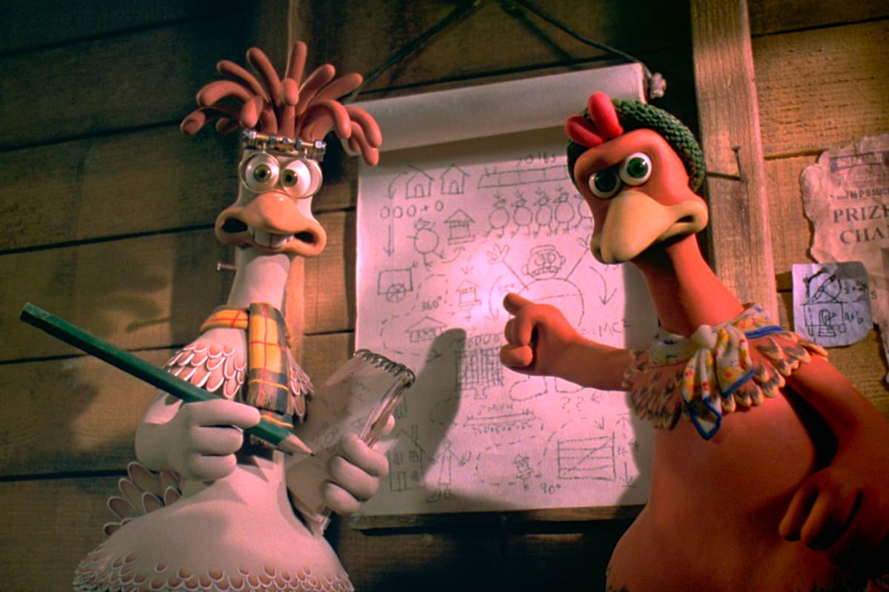

+++
type = "post"
titre = "<em>Chicken Run</em>, Peter Lord et Nick Park"
title = "Chicken Run, Peter Lord et Nick Park"
url = "/chicken-run-lord-park"
date = "2013-04-02T19:55:24"
Lastmod = "2015-04-03T21:06:07"
cover = "chicken-run-peter-lord-nick-park.jpg"
categorie = [ "À voir" ]
tag = [ "Animation", "Animaux", "Évasion", "Humour", "Prison" ]
createur = [ "Aardman Animations", "Nick Park", "Peter Lord" ]
annee = [ "2000" ]
weight = 2000
pays = [ "États-Unis", "France" ]

+++

Le studio Aardman Animations s’est fait un nom et une réputation avec la série des courts-métrages <em>Wallace &amp; Groomit</em>. Quand <em>Chicken Run</em> sort sur les écrans en 2000, c’est de loin le plus gros projet de ce studio qui s’est spécialisé dans l’animation image par image en utilisant la page à modeler pour façonner ses personnages. Aux petits films d’une vingtaine de minute succède un long-métrage de près d’une heure trente réalisé par Peter Lord et Nick Park. <em>Chicken Run</em> est ainsi nécessairement bien loin de l’ambiance des épisodes de <em>Wallace &amp; Groomit</em>, mais ses concepteurs ont réussi à conserver l’esprit si particulier de leurs réalisations précédentes. Ce premier long-métrage est très drôle, une vraie réussite qui n’a pas pris une ride !

<em>Chicken Run</em> raconte l’histoire d’une basse-cour, mais pas de n’importe quelle basse-cour. La ferme Tweedy dans l’Angleterre des années 1950 ressemble plus à une prison qu’à une ferme paisible où les animaux vaquent joyeusement à leur occupation. Les poules sont enfermées dans un campement entouré de barbelés et elles doivent pondre tous les jours dans leurs petites cabanes en bois qui sont autant de baraquements. Elles mènent surtout une vie difficile, tyrannisées par le fermier et surtout la fermière, la terrifiante Mrs Tweedy qui ne regarde qu’une seule chose : le rendement. Si une poule ne produit pas assez, elle est immédiatement exécutée et sert de repas le soir même. À partir de cette situation de départ parfaitement résumée pendant ses premières minutes, <em>Chicken Run</em> déroule un scénario de film d’évasion. Avec <em>La Grande Évasion</em> dans le viseur, Peter Lord et Nick Park ont mis au point un scénario rythmé autour d’une poule qui a décidé de tout mettre en œuvre pour sortir. Ginger n’est pas comme les autres poules, elle ne se résigne pas à finir dans cette prison et espère sortir à tout prix, pour découvrir ce qu’il y a derrière la colonne qu’elle aperçoit à travers les grillages. Sortir n’est pourtant pas facile, comme le montre cette hilarante série de tentatives infructueuses qui ouvre le film. Cette séquence permet aussi d’apprivoiser le style si particulier du studio. L’utilisation de la pâte à modeler donne aux personnages, tandis que les décors réels ajoutent une épaisseur bien éloignée de bon nombre de films d’animation numériques. On ne cherche pas le réalisme ici et ce n’est pas plus mal…

D’emblée, <em>Chicken Run</em> donne le ton : c’est drôle, très drôle même, mais c’est surtout imaginé comme si Ginger n’était pas une poule. Le procédé est classique dans l’animation, mais il a rarement été aussi bien mis en place que dans <em>Chicken Run</em>. Peter Lord et Nick Park mettent en scène des poules pour mieux parler de nous et cette basse-cour est logiquement une représentation imagée d’une prison, ou plutôt d’un camp de concentration. À cet égard, la machine infernale commandée par Mrs Tweedy et qui transforme une poule en tourte au poulet est évocatrice. Cette industrialisation qui débarque au milieu d’une campagne jusque-là largement traditionnelle évoque les travers de l’industrialisation, mais aussi des images de destruction que l’on a pu voir dans les camps mis en place pendant la Seconde Guerre mondiale. La présence dans <em>Chicken Run</em> d’un coq qui a connu la Première Guerre mondiale et la <em>Royal Air Force</em> apparaît également comme un rappel de ce contexte historique et ancre ce long-métrage dans une réalité historique bien sombre. Si Peter Lord et Nick Park visent les enfants avec ce premier film sorti au cinéma, ils parlent ainsi également à leurs parents qui verront autre chose qu’une histoire simplement amusante de poules qui construisent un avion pour sortir de leur enclos. Au fond, <em>Chicken Run</em> raconte une histoire terriblement humaine avec cette évasion menée par Ginger, une seule poule qui décide qu’une autre vie est possible et qui essaye de convaincre les autres poules, beaucoup moins actives. L’intrigue est enrichie par l’introduction d’un personnage supplémentaire, Rocky, un coq censé savoir voler et qui doit enseigner l’art de voler aux poules. Un personnage comique qui enrichit encore l’humour du film, mais un personnage aussi touchant dans <em>Chicken Run</em> qui parvient à ménager une place à une histoire d’amour qui, contre toute attente, fonctionne assez bien. Le film reste d’abord une comédie, mais la force des productions d’Aardman Animations est de ménager une certaine émotion et celle-ci ne fait pas exception.

Visant plus explicitement les plus jeunes que dans <a href="http://voiretmanger.fr/2012/04/10/pirates-bons-rien-mauvais-tout-lord/" title="Les Pirates ! Bons à rien, Mauvais en tout, Peter Lord - À voir et à manger"><em>Les Pirates ! Bons à rien</em></a>, la dernière production d’Aardman Animations réalisée par Peter Lord seul, <em>Chicken Run</em> réussit à trouver un difficile équilibre. Le long-métrage plait aux enfants qui s’amusent devant cette histoire d’évasion amusante et bien menée, mais aussi aux adultes qui trouveront des allusions autant à d’autres œuvres qu’à l’histoire. Peter Lord et Nick Park ont réussi avec <em>Chicken Run</em> à trouver le ton juste pour succéder à <em>Wallace &amp; Groomit</em>, c’est peut-être même le meilleur long-métrage de leur studio. À voir et à revoir…

<h3>Vous voulez m’aider ?</h3>
<ul>
<li><a href="http://www.amazon.fr/gp/product/B008FP0WS2/ref=as_li_ss_tl?ie=UTF8&tag=leblogdenic07-21&linkCode=as2&camp=1642&creative=19458&creativeASIN=B008FP0WS2">Acheter le film en Blu-Ray sur Amazon</a></li>
<li><a href="http://www.amazon.fr/gp/product/B00005J5B4/ref=as_li_ss_tl?ie=UTF8&tag=leblogdenic07-21&linkCode=as2&camp=1642&creative=19458&creativeASIN=B00005J5B4">Acheter le film en DVD sur Amazon</a></li>
<li><a href="https://itunes.apple.com/fr/movie/chicken-run/id377911715">Acheter ou louer le film sur l’iTunes Store</a></li>
</ul>

