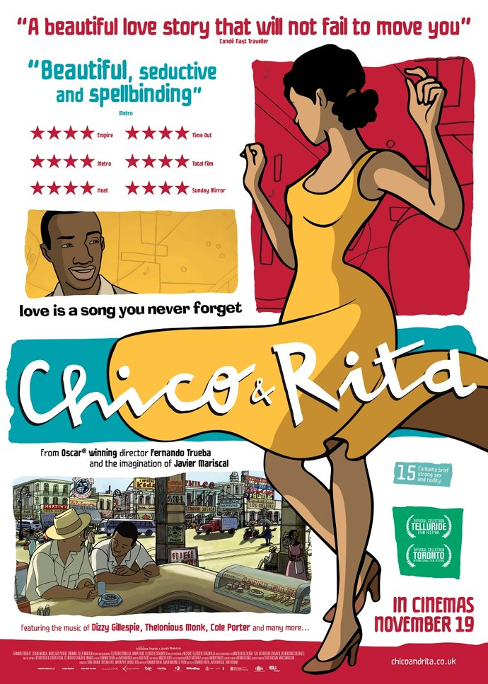
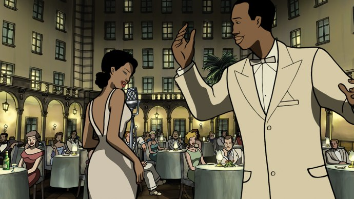
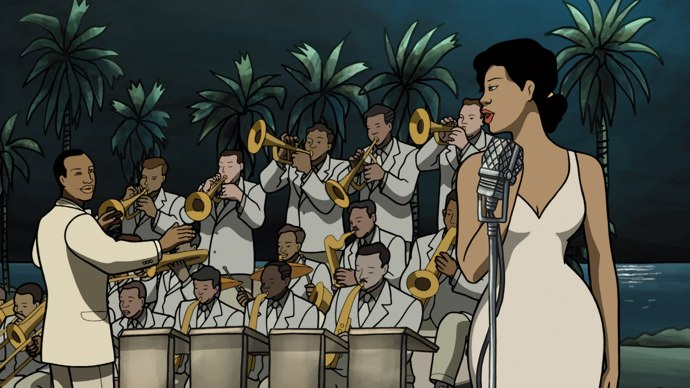

+++
titre = "Chico et Rita, Fernando Trueba et Javier Mariscal"
title = "Chico et Rita, Fernando Trueba et Javier Mariscal"
url = "/chico-rita-trueba-mariscal"
date = "2010-12-21T00:10:52"
Lastmod = "2010-12-18T20:45:46"
cover = "chico-and-rita.jpg"
categorie = [ "À voir" ]
tag = [ "Amour", "Animation", "Arcs 2010", "Festival", "Histoire", "Musique", "Société" ]
createur = [ "Fernando Trueba", "Javier Mariscal" ]
annee = [ "2011" ]
weight = 2011

+++

<a href="http://www.lesarcs-filmfest.com/2010/accueil/">

</a>

Animation ne rime pas nécessairement avec film pour enfants. Fernando Trueba et Javier Mariscal le prouvent encore une fois, si cela était nécessaire, avec <em>Chico et Rita</em>. Ce film musical raconte tout à la fois l&rsquo;histoire d&rsquo;amour fou entre un pianiste et une musicienne de Cuba, que l&rsquo;histoire de la musique cubaine et de ses mélanges avec la musique américaine, que l&rsquo;histoire d&rsquo;un pays. Un film riche, mais aussi léger et entraînant, à ne pas rater.

<a href="http://www.allocine.fr/film/fichefilm_gen_cfilm=182765.html">

</a>

Chico est un pianiste très talentueux, mais qui n&rsquo;a pas vraiment escompté. Il joue du piano dans les bars et clubs de Cuba en attendant son heure, à la fin des années 1940. Un soir, il rencontre par hasard Rita, une chanteuse à la voix aussi belle qu&rsquo;elle est elle-même magnifique. Pour l&rsquo;un comme pour l&rsquo;autre, c&rsquo;est immédiatement le coup de foudre : ils tombent éperdument amoureux, même s&rsquo;ils n&rsquo;osent pas se l&rsquo;avouer d&rsquo;emblée. La fusion est autant dans leur relation humaine de couple que dans leur musique : la voix suave de Rita se cale à merveille sur les notes de Chico. Très vite, le couple connaît le succès dans Cuba : ils gagnent un concours qui leur permet d&rsquo;enregistrer un titre, ils jouent dans les hôtels les plus prestigieux de la ville… Bientôt ce succès dépasse les frontières et un producteur américain propose à Rita de partir aux États-Unis… sans Chico. Si celle-ci refuse dans un premier temps cette condition, elle finit par accepter, lassée du comportement jaloux et volage de Chico. Commence alors une longue période de séparation, avec quelques courts instants de retrouvailles, mais le producteur de Rita devenu aussi son mari veille et fait tout éloigner son rival, quitte à l&rsquo;envoyer en tournée dans le monde entier, ou à le piéger pour le faire renvoyer à Cuba. <em>Chico et Rita</em> est ainsi un film sur un amour fou qui est aussi, presque par définition, amour impossible.

Au-delà de l&rsquo;histoire d&rsquo;amour entre Chico et Rita, le film de Fernando Trueba et Javier Mariscal raconte l&rsquo;histoire d&rsquo;un pays complexe. Cuba à la fin des années 1940 n&rsquo;a pas encore connu la <a href="http://fr.wikipedia.org/wiki/Révolution_cubaine">révolution cubaine</a> qui devait isoler le pays à la fin des années 1950 et c&rsquo;est une île ouverte sur le monde et notamment sur les États-Unis, en pleine expansion économique et sociale. Le mode de vie des Cubains urbains se rapproche alors de celui des Américains : une vie de loisirs, de danses, de musique. C&rsquo;est un lieu de l&rsquo;échange,Cuba est déjà une base de loisirs pour des milliers d&rsquo;Américains qui viennent profiter du soleil, de la musique et des belles filles. Les États-Unis raffolent de Cuba, même si la <a href="http://fr.wikipedia.org/wiki/Ségrégation_raciale_aux_États-Unis">ségrégation</a> fait rage et si les artistes cubains, appréciés sur scène pour leurs talents, doivent encore passer par les portes de service et dormir loin des palaces où ils jouent. <em>Chico et Rita</em>, de manière assez inattendue, dénonce de manière assez soutenue cette ségrégation, à la fois parce que le film montre concrètement la ségrégation (un garde noir à l&rsquo;entrée d&rsquo;un hôtel qui bloque l&rsquo;accès à d&rsquo;autres noirs parce que le lieu est réservé aux blancs), mais aussi pour une séquence assez impressionnante où Rita, lassée de cette injustice, déballe tout devant les Américains médusés, sur une scène de Las Vegas. Cette vérité que personne ne veut entendre aux États-Unis signe d&rsquo;ailleurs l&rsquo;arrêt de sa carrière, preuve ultime qu&rsquo;on la tolérait pour sa voix, mais à la seule condition qu&rsquo;elle leur permette d&rsquo;oublier qu&rsquo;elle est noire. Si <em>Chico et Rita</em> n&rsquo;est pas un film sur la ségrégation aux États-Unis, le sujet est abordé, ce qui éloigne d&rsquo;autant le film des enfants. De manière plus brève, la révolution cubaine est également montrée par <em>Chico et Rita</em>, avec même une évolution visible, des débuts très fermés où seuls les musiciens jouant la musique officielle pouvaient exercer, jusqu&rsquo;à la situation actuelle où la société cubaine est pauvre, mais relativement libre.

Ces sujets plus politiques n&rsquo;entachent pas la légèreté d&rsquo;ensemble de <em>Chico et Rita</em>, film d&rsquo;abord consacré à la musique, cubaine entre autres. Retrouvant l&rsquo;amour entre Chico et Rita, la musique est ici affaire d&rsquo;amour et d&rsquo;échanges. Échanges entre la musique cubaine et les musiques américaines d&rsquo;abord, et notamment entre le jazz, genre très en vogue à l&rsquo;époque, et les Caraïbes. À plusieurs reprises, Chico joue du piano avec des groupes de jazz dans des caves de New York, déjà capitale culturelle d&rsquo;Amérique du Nord. De grands noms sont évoqués, comme Dizzy Gillepsie, Cole Porter ou encore Charlie Parker. Cubains et Américains jouent ensemble, improvisent et créent une musique nouvelle, qui s&rsquo;enrichit mutuellement des deux origines. <em>Chico et Rita</em> est en tout cas un film plein de musiques, de bonnes musiques qui donnent plusieurs fois envie de se lever de son fauteuil pour danser avec les personnages. La bande originale, et notamment le fameux morceau &laquo;&nbsp;Rita&nbsp;&raquo; puis &laquo;&nbsp;Lily&nbsp;&raquo; ont été composés par <a href="http://en.wikipedia.org/wiki/Bebo_Valdés">Bebo Valdés</a>, autre grand nom de la musique cubaine à son apogée. Ce musicien a sans doute inspiré en partie l&rsquo;histoire de <em>Chico et Rita</em> puisqu&rsquo;il a travaillé comme pianiste pour une chanteuse nommée Rita Montaner. La musique est partout et elle est également liée à la politique. La diaspora qui suit la révolution à Cuba est ainsi également une diaspora musicale, tandis que le film se termine sur un symbole politique fort : la réunion de Cuba et l&rsquo;Espagne, pays colonisateur, par le biais de la musique.

Fernando Trueba et Javier Mariscal ont fait le choix d&rsquo;une animation à l&rsquo;ancienne pour <em>Chico et Rita</em>. Loin de la perfection des films d&rsquo;animation numérique actuels, ceux de <a href="http://voiretmanger.fr/createur/pixar/">Pixar</a> notamment, ce film fait la part belle aux dessins à la main. Mais le trait de Javier Mariscal ne cherche pas forcément un réalisme à la Disney, il est plus proche des traits d&rsquo;un Hergé : le dessinateur a d&rsquo;ailleurs cité <em>Tintin</em> comme une référence pour lui. <em>Chico et Rita</em> est ainsi plus proche du <a href="http://voiretmanger.fr/2010/06/14/illusionniste-chomet/">travail</a> de Sylvain Chomet, que de <em><a href="http://voiretmanger.fr/2010/12/05/raiponce-disney/">Raiponce</a></em>, le dernier Walt Disney lui aussi travaillé à la main. Comme chez Chomet, le dessin entremêle ici décors souvent très réalistes, surtout pour le Cuba contemporain, et personnages parfois réduits à quelques simples traits épaissis à l&rsquo;aide d&rsquo;ombres. Le résultat est surprenant, notamment parce que l&rsquo;animation n&rsquo;atteint pas la fluidité des films des grands studios américains, mais une fois les quelques secondes d&rsquo;adaptation passées, le style est vraiment agréable. La différence ne fait pas de mal (<em>Raiponce</em>, par exemple, est beaucoup plus lisse, plus enfantin) et le style s&rsquo;efface de toute manière derrière le récit passionnant et bien mené. C&rsquo;est bien simple, on oublie totalement qu&rsquo;il s&rsquo;agit d&rsquo;animation et pour un peu, on jurerait qu&rsquo;il s&rsquo;agit d&rsquo;un film normal. Seul élément qui m&rsquo;a un peu gêné, les lèvres manquent de réalisme, surtout pour les femmes. Pas de quoi néanmoins gâcher le plaisir du film, plaisir renforcé, on l&rsquo;a dit, par la musique, riche et entraînante.

<em>Rito et Chica</em> est un excellent film d&rsquo;animation, à la fois léger par sa musique cubaine qui donne envie de danser, et riche en thématiques aussi variées et sérieuses que la ségrégation américaine ou la révolution cubaine. Une animation sexy au trait singulier, à mi-chemin entre le réalisme et la caricature, qui montre à nouveau qu&rsquo;animation ne rime pas nécessairement avec film pour enfants. Et en plus d&rsquo;apprendre plein de choses sur Cuba et sa musique, le film de Fernando Trueba et Javier Mariscal propose l&rsquo;histoire d&rsquo;un amour fou qui ne reste pas platonique. Un très beau film vraiment, à ne pas rater.

<em>Sortie en salles en juillet 2011</em>

