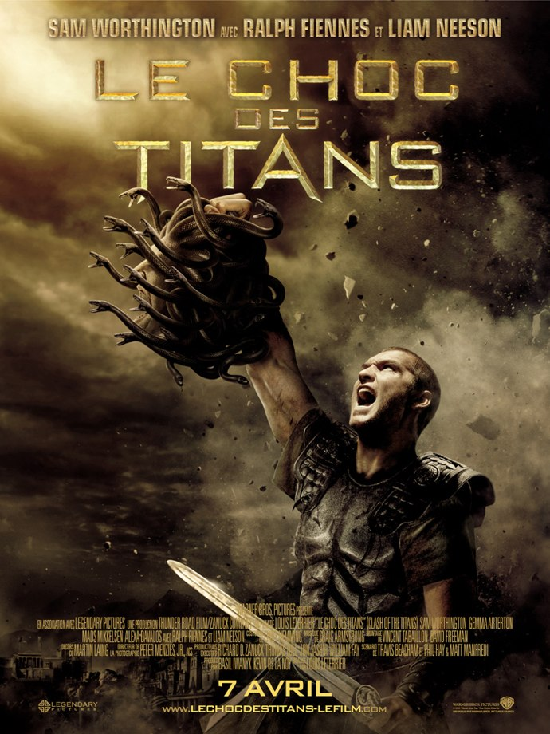
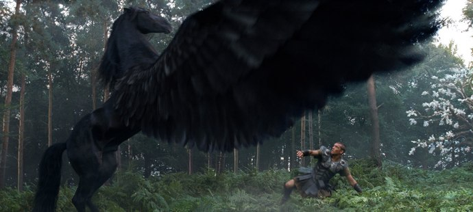

+++
type = "post"
titre = "Le choc des Titans, Louis Leterrier"
title = "Le choc des Titans, Louis Leterrier"
url = "/choc-titans-leterrier"
date = "2010-04-28T00:52:18"
Lastmod = "2013-05-31T14:18:36"
cover = "clash-titans-leterrier.jpg"
categorie = [ "À voir" ]
tag = [ "Blockbuster", "Guerre", "Mythe", "Vite oublié" ]
createur = [ "Louis Leterrier" ]
acteur = [ "Gemma Arterton", "Liam Neeson", "Ralph Fiennes", "Sam Worthington" ]
annee = [ "2010" ]
weight = 2010
pays = [ "États-Unis" ]
original = "Clash of the Titans"

+++

Je ne sais plus bien pourquoi au juste, mais je tenais à voir <em>Le choc des Titans</em>, dernier film du Français très américain Louis Leterrier. La perspective de voir un nouveau <em>300</em>, film qui m&rsquo;avait beaucoup amusé, peut-être&#8230; la curiosité aussi après avoir <a href="http://www.filmosphere.com/2010/04/interview-louis-leterrier-pour-le-choc-des-titans/">entendu le réalisateur</a> en parler devant un quatuor de blogueurs. Le plaisir à demi avoué de voir des navets, de temps en temps, certainement. Le film ne m&rsquo;a pas permis de décider, mais une chose est sûre, je l&rsquo;oublierai sans doute aussi vite que les raisons qui m&rsquo;ont poussé à le voir.

<em>Le choc des Titans</em> est le remake d&rsquo;un film de 1980 que je ne connais pas et pour faire simple, c&rsquo;est aussi le remake des mythes grecs. Enfin, au moins sur le papier, tant le film s&rsquo;éloigne d&rsquo;Homère et co. Le film retrace la vie de Persée, enfant né de l&rsquo;union de Zeus avec une mortelle, ce qui fait de lui un demi-dieu. Le mari vexé veut tuer la mère et l&rsquo;enfant en les balançant à la mer, mais c&rsquo;était sans compter sur la force de résistance du jeune Persée qui survit et est recueilli par une humble famille de pêcheurs. Quelques années plus tard, le Persée devenu grand assiste impuissant à la mort de toute sa famille par Hadès alors que les hommes se rebellent contre les Dieux et que ces derniers ont décidé de ne pas se laisser faire. La cité d&rsquo;Argos est le fer de lance de cette résistance et les Dieux veulent en faire un exemple en lançant le terrifiant kraken contre cette cité portuaire. Heureusement, notre fier héros a comme mission de décimer la bestiole et, on s&rsquo;en doute, il va réussir.

Mettons d&rsquo;emblée les choses au clair. <em>Le choc des Titans</em> n&rsquo;est PAS un film sur les mythes grecs, il ne s&rsquo;en inspire même pas vraiment. Louis Leterrier le dit très bien dans la vidéo, les mythes antiques sont suffisamment souples pour offrir de nombreuses opportunités scénaristiques. En clair, l&rsquo;Antiquité grecque et sa mythologie servent vaguement de toile de fond à un film d&rsquo;action très hollywoodien. Un blockbuster avec des hommes en toges et des Dieux qui sont aussi en toges, mais qui ont de grands pouvoirs et qui sont terrifiants. Si on ne comprend pas cela, on a du mal à se retrouver dans un mythe tellement abîmé qu&rsquo;il en devient méconnaissable. Accessoirement, on ne comprend pas bien non plus pourquoi le film se passe dans un désert plus désertique encore que le Sahara quand on pense qu&rsquo;Argos est une cité du Péloponnèse, une région certes sèche l&rsquo;été, mais quand même. Rien ne colle, on passe du désert à une sorte de gros volcan qui est en fait l&rsquo;entrée des enfers (si si, à quelques pas d&rsquo;Argos, c&rsquo;est fou comme le monde est petit).

Bref, inutile de chercher le mythe dans ce <em>Choc des Titans</em>, il a été annihilé. Fort de ce constat, que reste-t-il au film ? Des combats, et des créatures énormes. Louis Leterrier et son équipe se sont manifestement éclatés à créer des bestioles souvent énormes, des scorpions géants jusqu&rsquo;au clou du spectacle, le kraken. Le film n&rsquo;invente pas grand-chose, mais le résultat est plutôt réussi même si je trouve le kraken bien trop humanoïde à mon goût. Les effets spéciaux qui les animent sont à la hauteur et on s&rsquo;amuse à regarder le bestiaire défiler. Défiler, c&rsquo;est bien le mot, tant les séquences s&rsquo;enchaînent à une vitesse folle dans le film. Il n&rsquo;y a vraiment aucun temps mort, les combats s&rsquo;enchainent à toute allure et sont filmés aussi rapidement. L&rsquo;ensemble lasserait si le film durait plus longtemps, mais en l&rsquo;état ça n&rsquo;est pas gênant, <em>Le choc des Titans</em> étant plus court que la moyenne pour ce genre de films. Techniquement, <em>Le choc des Titans</em> est dans l&rsquo;ensemble réussit, mais contient quand même quelques fautes de goût assez frappantes, comme l&rsquo;armure étincelante de Zeus aussi ridicule que vieillotte…

Qu&rsquo;un film ait un rythme intense et qu&rsquo;il enchaîne les scènes rapidement ne pose pas de problème, c&rsquo;est même une qualité qui manque à trop de films. Mais dans ce cas, tout va sans doute un peu trop vite et le <em>Choc des Titans</em> donne l&rsquo;impression étrange de ne pas s&rsquo;intéresser à son sujet. Les scènes s&rsquo;enchaînent sans le début du commencement du souffle qui caractérise normalement les épopées. On se fiche finalement pas mal de l&rsquo;issue du conflit, de toute façon connue d&rsquo;avance, et la tragédie a déserté les plateaux de tournage. Persée a un destin, il l&rsquo;applique mécaniquement en supprimant méthodiquement les embuches une à une. Autour de lui, des hommes peuvent tomber comme des pailles, peu lui importe. Et même quand un être cher meurt, les Dieux au pouvoir immense peuvent le faire revenir. On a ainsi parfois l&rsquo;impression de voir un jeu. Les acteurs n&rsquo;apportent pas non plus de personnalité, ils sont tous assez apathiques, en particulier le héros joué par Sam Worthington (popularisé par <em>Avatar</em>) qui n&rsquo;est pas bien charismatique. Les autres personnages ont, tous sans exception, des rôles trop réduits pour que l&rsquo;idée de personnalité ait un sens.

Je ne suis pas sorti déçu de la salle, non. Mais je me suis quand même demandé pourquoi je tenais tant à y aller. <em>Le choc des Titans</em> aurait-il pu être vraiment bien ? Sans doute oui, mais à condition d&rsquo;être revenu au mythe et à la tragédie. S&rsquo;inspirer vaguement des mythes pour en sortir un matériau de blockbuster, pourquoi pas en soit, mais on obtient alors un blockbuster sans grand intérêt. Alors que la mythologie grecque pourrait offrir beaucoup plus que cela.

Peu d&rsquo;avis positifs à recenser dans la blogosphère en moyenne déçue par ce remake d&rsquo;un film jugé culte par beaucoup. <a href="http://www.filmosphere.com/2010/04/critique-le-choc-des-titans-clash-of-the-titans-2010/">Nicolas</a> l&rsquo;a trouvé pas si mauvais que ça en rappelant à raison qu&rsquo;il s&rsquo;agit d&rsquo;un blockbuster censé détendre avant tout. D&rsquo;autres, comme <a href="http://www.plan-c.fr/article-le-choc-des-titans-talon-d-achille-48356586.html">Alexandre</a> ou <a href="http://www.critikat.com/Le-Choc-des-Titans.html">Critikat</a>, critiquent l&rsquo;absence de fidélité au mythe. Leurs critiques sont justes et, je pense, fondées en partie. Néanmoins, Critikat évoque &laquo;&nbsp;l&rsquo;autodafé d&rsquo;un mythe&nbsp;&raquo;, ce que je trouve quand même pour le moins exagéré. Leurs arguments sur la perte du mythe sont intéressants (comme toujours de toute façon, leurs critiques sont toujours bonnes à lire), mais je ne vois pas pourquoi on ne pourrait pas imaginer une rébellion des humains contre les Dieux, par exemple. Dans le même esprit, je pense à la Mythologie revisitée par Dan Simmons dans <em>Illium</em> , version SF où les Dieux n&rsquo;étaient plus que des hommes ayant obtenu une technologie surpuissante. Il est vrai que Simmons détournait plus franchement le mythe : peut-être que <em>Le choc des Titans</em> aurait dû changer les noms et ne plus se référer aussi explicitement aux mythes grecs… Sur un registre plus léger, je recommande la critique de <a href="http://www.surlarouteducinema.com/archive/2010/04/12/le-choc-des-titans-de-francois-leterrier.html">Pascale</a> qui propose une relecture à mourir de rire du film et qui m&rsquo;a rappelé, au passage, que le kraken était déjà présent dans le <em>Pirate des Caraïbes</em>. Quand je disais que le monde était petit…

<h3>Vous voulez m&rsquo;aider ?<a href="#footnote_0_3243" id="identifier_0_3243" class="footnote-link footnote-identifier-link" title="&Agrave; propos de la publicit&eacute;&hellip;">1</a></h3>
<ul>
<li><a href="http://www.amazon.fr/gp/product/B003FSSMW2/ref=as_li_ss_tl?ie=UTF8&#038;tag=leblogdenic07-21&#038;linkCode=as2&#038;camp=1642&#038;creative=19458&#038;creativeASIN=B003FSSMW2">Acheter le film en Blu-Ray sur Amazon</a></li>
<li><a href="http://www.amazon.fr/gp/product/B003FSSMWC/ref=as_li_ss_tl?ie=UTF8&#038;tag=leblogdenic07-21&#038;linkCode=as2&#038;camp=1642&#038;creative=19458&#038;creativeASIN=B003FSSMWC">Acheter le film en DVD sur Amazon</a></li>
<li><a href="https://itunes.apple.com/fr/movie/le-choc-des-titans/id382166173">Acheter ou louer le film sur l&rsquo;iTunes Store</a></li>
</ul>

<ol class="footnotes"><li id="footnote_0_3243" class="footnote"><a href="http://voiretmanger.fr/soutien/">À propos de la publicité…</a> [<a href="#identifier_0_3243" class="footnote-link footnote-back-link">&#8617;</a>]</li></ol>
