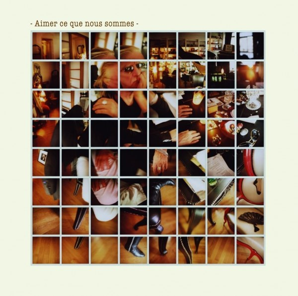
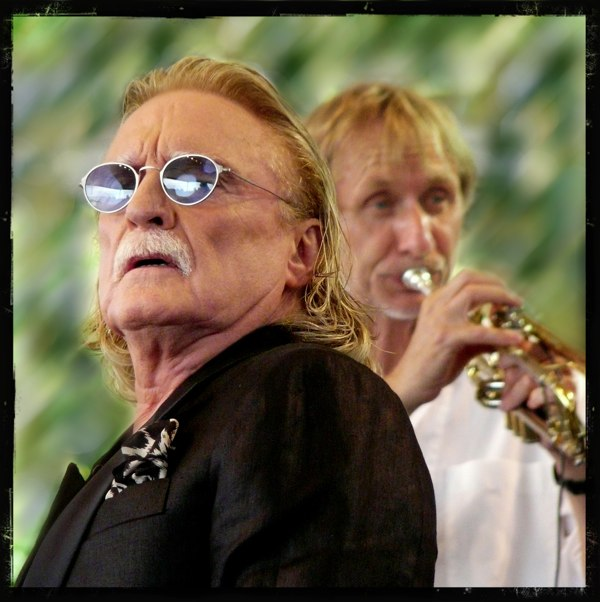

+++
type = "post"
titre = "Christophe à la Cité de la Musique (15 mars 2010)"
title = "Christophe à la Cité de la Musique (15 mars 2010)"
url = "/christophe-cite-musique-mars-2010"
date = "2010-03-16T01:57:56"
Lastmod = "2013-06-15T22:29:29"
cover = "christophe1.jpg"
categorie = [ "À voir… en live" ]
tag = [ "Chanson française", "Cité de la Musique", "Concert", "Électronique", "Mélange" ]
createur = [ "Christophe" ]
annee = [ "2010" ]
weight = 2010
pays = [ "France" ]

+++

Depuis que j&rsquo;ai découvert <em>Aimer ce que nous sommes</em>, son dernier album, je suis un grand fan de Christophe et mes <a href="http://www.lastfm.fr/user/nicolinux87">statistiques d&rsquo;écoutes</a> en témoignent largement. J&rsquo;étais curieux de voir ce qu&rsquo;un artiste aussi complexe que Christophe, créateur de tubes planétaires et intemporels en même temps que bidouilleur de sonorités pouvait donner en live. Cette dualité se retrouve sur scène : ce concert à la Cité de la Musique se composait en fait d&rsquo;au moins trois concerts différents. Un concert riche et inégalement passionnant.

<em>© designldg – <a href="http://www.flickr.com/photos/designldg/3774960714/">flickr</a></em>

Un concert à la Cité de la Musique, c&rsquo;est toujours l&rsquo;assurance d&rsquo;une prestation hors-norme, expérimentale ou au moins sous le signe de la mixité musicale. La dernière fois que j&rsquo;étais allé dans cette salle, c&rsquo;était pour assister aux mélanges sonores entre <a href="http://voiretmanger.fr/2009/04/17/truffaz-murcof-singh-cite-musique/">Truffaz, Murcof et Talvin Singh</a>. Comme par anticipation, j&rsquo;étais d&rsquo;ailleurs assis quelques rangs derrière Christophe, qui avait travaillé avec Murcof et Truffaz sur son dernier album. Je retrouve ce soir l&rsquo;artiste pour un concert mystérieusement intitulé &laquo;&nbsp;Ma barrière de Corail…&nbsp;&raquo; Un mystère que le programme distribué à l&rsquo;entrée n&rsquo;aide pas à dissiper, c&rsquo;est le moins que l&rsquo;on puisse dire. On nous promet deux parties, l&rsquo;une avec Christophe, l&rsquo;autre avec Christophe aussi, mais également Zerkalo groupe composé d&rsquo;une chanteuse et d&rsquo;une &laquo;&nbsp;vidéaste&nbsp;&raquo;. Ce qui fait normalement usage de première partie est donc ici coincé entre deux morceaux de Christophe.

Le concert commence avec un bon quart d&rsquo;heure de retard, mais toute la salle acclame chaleureusement la silhouette reconnaissable entre mille de Christophe. L&rsquo;artiste n&rsquo;est plus tout jeune, mais force est de constater qu&rsquo;il a encore de la prestance. Les lunettes de soleil fixées sur le nez — il ne les quittera symboliquement que le temps d&rsquo;un coup d&rsquo;œil sur —, il se pose sur son tabouret pour chanter. On retrouve en lui ses origines italiennes, dans sa veste ouverte, ou dans ses gestes amples. Le chanteur offre un spectacle étrange, mélange de timidité apparente et de grande assurance : la différence est flagrante entre les moments où il parle, à voix rauque et s&rsquo;excusant presque d&rsquo;être là, et où il chante, sa voix prend alors de l&rsquo;ampleur et retrouve toute sa clarté et sa force. On a vraiment le sentiment de voir un autre homme. Christophe s&rsquo;amuse à jouer son rôle de vieux chanteur bougon, quand il râle contre la &laquo;&nbsp;flotte&nbsp;&raquo; que la salle lui a préparée (et prend alors sa fiole de Jack Daniels pour s&rsquo;en verser une rasade) ou quand il explique que l&rsquo;on va gagner du temps et faire le rappel immédiatement, sans sortir de scène. Entre chaque chanson ou presque, il prend soin de nous remercier et on le sent vraiment ému d&rsquo;être là.

La première partie du concert a consisté à dérouler, linéairement je crois, le dernier album. La toute première chanson du concert m&rsquo;était inconnue et je me demande si ça n&rsquo;était pas un nouveau titre, l&rsquo;artiste ayant confirmé au cours du concert travailler actuellement au successeur d&rsquo;<em>Aimer ce que nous sommes</em>. Ce dernier est, sur disque, à la fois limpide et d&rsquo;une complexité folle, un véritable puzzle musical comme le photomontage de la pochette le laisse entendre. Cette complexité sonore est bien retranscrite sur scène, sans que le concert paraisse trop figé, ce qui est une performance. À quelques reprises néanmoins, on sent l&rsquo;effet un peu pesant des samples, surtout quand le piano est entièrement doublé sur un morceau, l&rsquo;effet est étrange. Christophe est accompagné de cinq musiciens qui composent un tapis sonore riche et très marqué par l&rsquo;usage de l&rsquo;électronique. Les percussions ne sont ainsi pas entièrement naturelles, alors que le pianiste dispose sur son piano à queue d&rsquo;une machine électronique à même de bidouiller les sons. L&rsquo;effet est très réussi je trouve, mais il est vrai que j&rsquo;aime énormément l&rsquo;album. Un grand écran accompagne plusieurs titres d&rsquo;une image globalement assez inutile, parfois belle.

Quand Christophe quitte la scène, je m&rsquo;attends à, comme indiqué sur le programme, un entracte en bonne et due forme. Mais non, le chanteur explique qu&rsquo;il va changer de veste, qu&rsquo;il nous propose en attendant une interview à distance, puis le fameux groupe qui est indiqué sur la feuille. Soit. En guise d&rsquo;interview, c&rsquo;est en fait le titre éponyme paru sur <em>Bevilacqua</em> mis en image de manière rigolote et originale, par découpage/collage d&rsquo;images parfois animées. C&rsquo;est plutôt bien vu en ce que cela met en exergue les multiples facettes de l&rsquo;artiste. C&rsquo;est aussi un hommage ironique où Christophe se moque de son propre personnage et de son image. La fin du concert sera à cet égard une belle démonstration.

Ce titre terminé, entre sur scène une femme qui se poste derrière deux Mac et lance à la fois une image sur l&rsquo;écran, et une musique. Ce soir, j&rsquo;aurais au moins appris quelque chose : le <a href="http://fr.wikipedia.org/wiki/Vidéaste">vidéaste</a> fait de la vidéo, certes, mais avec des techniques amateurs et une ambition technique ou artistique professionnelle. En l&rsquo;occurrence, on a eu des clips mettant en scène la chanteuse ou la vidéaste en question. Sur scène, la chanteuse a fait du playback sur tous les morceaux qui contenaient encore la partie voix, si bien que l&rsquo;elle aurait très bien pu ne pas chanter. Ce fut le gros souci de cette première partie du second acte, l&rsquo;artiste sur scène ne servait apparemment à rien. Diffuser les clips aurait largement suffi. Si, au moins, l&rsquo;image ou la musique était intéressantes… Côté sonore, on a erré de Kraftwerk à Laurie Anderson, en passant par les claviers Playskool. Pas de très bon goût donc.

Heureusement, Zerkalo a fini par quitter la scène (cela devenait urgent, plusieurs personnes commençaient à prendre le large) et Christophe est alors revenu, accompagné cette fois d&rsquo;un véritable orchestre de vents. L&rsquo;Ensemble Musiques Nouvelles a ainsi accompagné toute la dernière partie du concert, une partie consacrée aux tubes légendaires de Christophe mêlés de quelques titres plus récents. Cet ensemble de vents a été plutôt bien utilisé, même si je l&rsquo;ai trouvé un peu en retrait par rapport au reste. Les vieux morceaux sont souvent très retravaillés et ils passent assez bien. Même si ce ne sont pas mes titres préférés de Christophe, force est de constater que des morceaux comme &laquo;&nbsp;Les mots bleus&nbsp;&raquo;, &laquo;&nbsp;Aline&nbsp;&raquo; ou &laquo;&nbsp;Les paradis perdus&nbsp;&raquo; sont d&rsquo;une redoutable efficacité sur scène. Le public est en tout cas beaucoup plus réactif et apprécie manifestement ces vieux titres, surtout si j&rsquo;en juge à la brochette de mamies quelques rangs devant moi. L&rsquo;enthousiasme fut tel que l&rsquo;on a eu droit à cinq rappels (sans les traditionnels allers et retour de l&rsquo;artiste, donc) pour autant de classiques acclamés par une salle debout et même agglutinée auprès de la scène pour tenter d&rsquo;obtenir le sésame ultime, une signature de Christophe. Il fallait les voir, à la limite de se crêper le chignon pour obtenir un autographe. C&rsquo;est assez mignon et cela témoigne bien du très grand succès d&rsquo;un chanteur qui a réussi à écrire, il y a de cela plus de quarante ans, des morceaux vraiment indémodables. Et si l&rsquo;âge moyen était élevé, j&rsquo;ai été assez surpris de voir pas mal de jeunes.

<em>© designldg – <a href="http://www.flickr.com/photos/designldg/3775355555">flickr</a></em>

Ce concert résume bien la longue et sinueuse carrière de Christophe. Il est marqué, comme elle, par la dualité entre une tendance à faire des tubes reposant sur le rythme couplets/refrain et dans la veine pop ou rock&rsquo;n roll très classique, et une tendance plus récente à l&rsquo;expérimentation. Depuis son retour, en 1996, l&rsquo;artiste n&rsquo;a eu de cesse de bricoler des machines électroniques, enregistrer de courts samples pour les mélanger jusqu&rsquo;à obtenir un son original. Ses trois derniers albums ne sont pas vraiment évidents à aborder et requièrent de nombreuses écoutes pour bien les digérer. Sa carrière a ainsi fait un grand écart entre deux tendances, et sur scène, même si les univers s&rsquo;entrecroisent et si Christophe réussit en partie rapprocher les deux, simplifiant les titres récents et complexifiant les anciens, il reste un concert au moins bicéphale. L&rsquo;image qui clôture le concert et qui superpose deux photographies de l&rsquo;artiste est très significative de cette dualité.

Je suis très content d&rsquo;avoir pu assister à un concert de Christophe, ne serait-ce qu&rsquo;il commence à accuser de l&rsquo;âge et j&rsquo;ai appris, depuis la mort de <a href="http://voiretmanger.fr/2009/03/14/alain-bashung-adieu-merci/">Bashung</a> ou celle de <a href="http://voiretmanger.fr/2009/12/27/vic-chesnutt-la-musique-a-vif/">Vic Chesnutt</a>, à profiter au maximum des artistes que j&rsquo;apprécie tant que c&rsquo;est encore possible. Mais ce fut, en plus, une bonne expérience, un concert atypique, riche et très intéressant si l&rsquo;on oublie l&rsquo;intermède vidéaste.

Le concert de demain ce soir sera diffusé en direct et gratuitement sur Internet, à la fois sur le site de la <a href="http://www.cite-musique.fr/francais/Default.aspx">Cité de la Musique</a>, celui de la <a href="http://www.sallepleyel.fr/">salle Pleyel</a> et sur <a href="http://liveweb.arte.tv/fr/video/Christophe__en_direct_de_la_Cite_de_la_Musique/">Arte Live Web</a>. Le concert sera même disponible par la suite deux mois gratuitement. Vous n&rsquo;avez donc plus aucune excuse pour rater un excellent concert !

