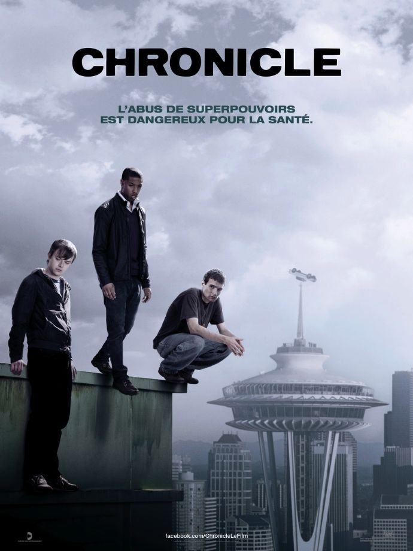
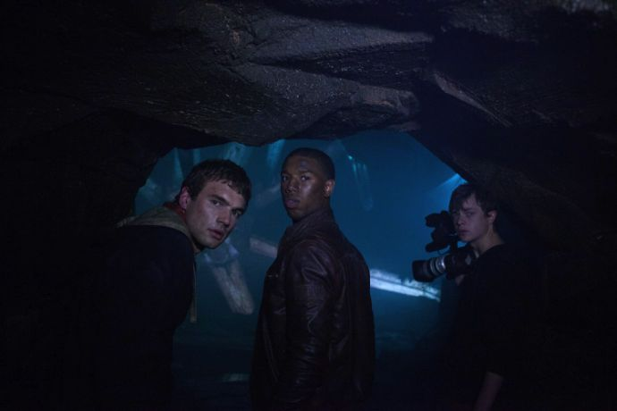
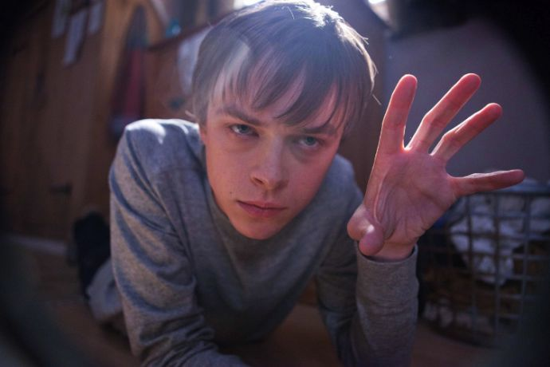

+++
type = "post"
titre = "Chronicle, Josh Trank"
title = "Chronicle, Josh Trank"
url = "/chronicle-trank"
date = "2012-02-17T23:50:47"
Lastmod = "2012-07-02T12:22:31"
cover = "josh-trank-chronicle.jpg"
categorie = [ "À voir" ]
tag = [ "Adolescence", "Drame", "Famille", "Fantastique", "Vite oublié" ]
createur = [ "Josh Trank" ]
acteur = [ "Alex Russell", "Dane DeHaan", "Michael B. Jordan" ]
annee = [ "2012" ]
weight = 2012
pays = [ "États-Unis" ]

+++

<em>Chronicle</em> s&rsquo;ajoute à la déjà longue liste de films censés avoir été tournés en caméra amateur. Le genre inventé par <em>Le Projet Blair Witch</em> a connu un franc succès au cours des années 2000, avec des résultats parfois plutôt réussis (<em>Cloverfield</em>), souvent assez médiocres (<a href="/2010/08/20/dernier-exorcisme-stamm/"><em>Le Dernier Exorcisme</em></a>). Josh Trank a choisi ce procédé pour son premier film qui parle aussi de superpouvoirs. Un pari dangereux pour un résultat très classique en demi-teinte.

Andrew n&rsquo;est pas très heureux. Ce lycéen n&rsquo;a jamais réussi à s&rsquo;intégrer, il est toujours resté à l&rsquo;écart des autres et il ne discute qu&rsquo;avec Matt, son cousin, mais encore, uniquement parce que ce dernier l&rsquo;amène et le ramène tous les jours. Son père alcoolique le bat régulièrement, sa mère est mourante. Bref, l&rsquo;ambiance n&rsquo;est pas très bonne et c&rsquo;est certainement pour s&rsquo;isoler encore plus du monde qu&rsquo;Andrew achète un jour une vieille caméra et qu&rsquo;il se met à filmer son quotidien. Il filme ainsi sa vie au lycée, les brimades de ses camarades et une énorme fête où il se rend avec son cousin. C&rsquo;est justement à l&rsquo;occasion de cette fête qu&rsquo;il découvre, avec Matt et Steve, deux beaux gosses extrêmement populaires, une mystérieuse cavité. Les trois garçons entrent et découvrent un étrange objet non identifié. Comme ils ne tardent pas à le découvrir, cet objet leur a transmis de puissants superpouvoirs. Ils s&rsquo;en amusent au début, mais au fur et à mesure qu&rsquo;ils utilisent ces pouvoirs, les problèmes commencent à arriver…

<em>Chronicle</em> est clairement séparé par la découverte du mystérieux objet qui apporte au trio d&rsquo;ados leurs superpouvoirs. Avant, le film propose de manière assez convenue une introduction à la vie assez déprimante du personnage principal. Le principe est bien connu dans ce genre de film, on le voit filmer ses premières images, justifier le fait de filmer, puis on le suit dans tous ses déplacements, au lycée ou à une fête avec son cousin. Josh Trank prend son temps pour introduire ses personnages, un peu trop peut-être : on connaît le pitch et on attend avec un peu d&rsquo;impatience il faut dire le virage fantastique. La vie lycéenne d&rsquo;Andrew et de son cousin est assez peu passionnante et en outre peu réaliste, on la regarde d&rsquo;un air distrait, en attendant mieux. L&rsquo;ambiance change du tout au tout dans <em>Chronicle</em> lors de la découverte du trou mystérieux. Le rythme augmente sensiblement, l&rsquo;excitation des personnages est communicative et le film devient plus intéressant.

L&rsquo;affiche ne laisse place à aucun doute : les superpouvoirs vont poser problème dans <em>Chronicle</em>. Leur découverte est pourtant l&rsquo;occasion de scènes légères et plutôt amusantes. Au départ, les trois personnages s&rsquo;aperçoivent qu&rsquo;ils peuvent faire placer des objets en lévitation et ils jouent avec ce pouvoir en déplaçant des chariots dans un supermarché, ou une voiture sur un parking. Plus tard, ils découvrent qu&rsquo;ils peuvent aussi voler et ils font une partie de baseball dans les nuages. C&rsquo;est encore bon enfant et Steve comme Matt souhaitent en rester là, mais Andrew n&rsquo;est pas de cet avis. Le jeune homme est profondément transformé par ces nouveaux pouvoirs. Garçon timide et complexé, il devient la star du moment lors d&rsquo;un numéro donné devant tout le lycée. Cette popularité soudaine lui monte à la tête, mais c&rsquo;est surtout le sentiment d&rsquo;être tout puissant qui chamboule son existence. Josh Trank montre bien comment Andrew utilise ces pouvoirs qu&rsquo;il maîtrise à la perfection pour se venger et se faire une place dans le monde. Tous ceux qui lui en ont voulu vont en faire les frais, que ce soit la bande de voyous de sa rue, d&rsquo;autres lycéens et surtout son père. Andrew est bien meilleur que les deux autres, il est enfin bon à quelque chose et il entend en profiter totalement. <em>Chronicle</em> commence plutôt bien dans cette direction, mais le film se termine de manière très décevante. C&rsquo;est dommage, le sous-texte homosexuel qui paraît évident pendant tout le film est en revanche totalement évacué alors qu&rsquo;il aurait pu servir à fournir un scénario plus original et plus intéressant.

Josh Trank a choisi pour son premier film l&rsquo;exercice difficile de faire croire qu&rsquo;il n&rsquo;existait pas. <em>Chronicle</em> est censé n&rsquo;être composé que d&rsquo;images amateurs ou de caméras de sécurité, mais jamais de plans conçus par un cinéaste. Ce n&rsquo;est évidemment qu&rsquo;un artifice et il est ici assez grossier. Le réalisme n&rsquo;est pas le fort de ce film, la faute avant tout à une image beaucoup trop propre. Josh Trank n&rsquo;a pas essayé de rendre son image moins nette, plus tremblante, bref faire en sorte qu&rsquo;elle semble moins professionnelle. Le résultat n&rsquo;est pas décevant pour autant, on pourrait même dire que c&rsquo;est l&rsquo;inverse qui se produit. <em>Chronicle</em> présente son mécanisme artificiel et ne le prend pas trop au sérieux, ce qui est peut-être encore la meilleure chose. De manière plutôt astucieuse, le scénario justifie la fluidité de la caméra en la faisant flotter, par lévitation, autour des personnages : un bon moyen de justifier l&rsquo;absence d&rsquo;images tremblotantes. L&rsquo;immersion est moins bonne qu&rsquo;avec un <em>Cloverfield</em> par exemple, mais cela n&rsquo;enlève rien à l&rsquo;intérêt du film.

<em>Chronicle</em> s&rsquo;avère finalement plutôt fun, mais pas autant qu&rsquo;espéré. Le principe de base est bien trouvé et la découverte de leurs superpouvoirs par les trois jeunes donne lieu à quelques scènes vraiment réussies. Malheureusement, Josh Trank ne résiste pas à l&rsquo;appel du spectaculaire et termine son film de manière assez décevante. Un bilan en demi-teinte donc, mais le film reste plaisant et sa courte durée (moins de 1h30) joue en sa faveur. Pour une séance simple et sympathique…

<h3>Vous voulez m&rsquo;aider ?<a href="#footnote_0_5789" id="identifier_0_5789" class="footnote-link footnote-identifier-link" title="&Agrave; propos de la publicit&eacute;&hellip;">1</a></h3>
<ul>
<li><a href="http://www.amazon.fr/gp/product/B007KLPXNQ/ref=as_li_ss_tl?ie=UTF8&tag=leblogdenic07-21&linkCode=as2&camp=1642&creative=19458&creativeASIN=B007KLPXNQ">Acheter le film en Blu-Ray et DVD sur Amazon</a></li>
<li><a href="http://www.amazon.fr/gp/product/B007KLPXHM/ref=as_li_ss_tl?ie=UTF8&tag=leblogdenic07-21&linkCode=as2&camp=1642&creative=19458&creativeASIN=B007KLPXHM">Acheter le film en DVD sur Amazon</a></li>
<li><a href="http://clk.tradedoubler.com/click?p=23753&a=403761&g=0&td_partnerId=2003&url=http://itunes.apple.com/fr/movie/chronicle/id515159090">Acheter ou louer le film sur l&rsquo;iTunes Store</a></li>
</ul>

<ol class="footnotes"><li id="footnote_0_5789" class="footnote"><a href="/soutien/">À propos de la publicité…</a> [<a href="#identifier_0_5789" class="footnote-link footnote-back-link">&#8617;</a>]</li></ol>
