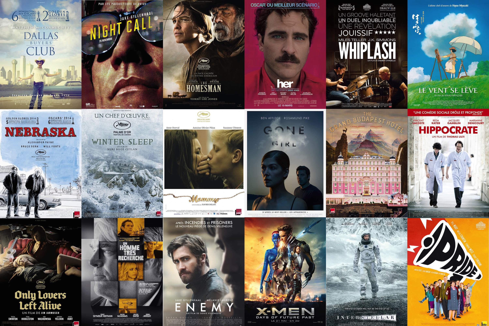

+++
titre = "Les meilleurs films de 2014"
title = "Les meilleurs films de 2014"
url = "/cinema-best-of-2014"
date = "2014-12-22T21:44:05"
Lastmod = "2014-12-28T16:39:21"
cover = "top-2014.jpg"
categorie = [ "À voir" ]
tag = [ "Top" ]
annee = [ "2014" ]
weight = 2014

+++

<a href="http://voiretmanger.fr/cinema-the-very-best-of-2009/">2009</a>, <a href="http://voiretmanger.fr/cinema-best-of-2010/">2010</a>, <a href="http://voiretmanger.fr/cinema-best-of-2011/">2011</a>, <a href="http://voiretmanger.fr/cinema-best-of-2012/">2012</a> et <a href="http://voiretmanger.fr/cinema-best-of-2013/">2013</a> : ce n&rsquo;est pas en 2014 que l&rsquo;on va rompre cette tradition du best-of de cinéma. Comme tous les ans, j&rsquo;ai choisi 18 films sans vraie raison valable<a href="#fn-12670-1" rel="footnote">1</a> et, comme toujours aussi, je les présente de manière alphabétique, sans autre forme de classement. Je ne note pas les films, ce n&rsquo;est pas dons pas une raison pour les classer à la fin de l&rsquo;année, du moins autrement que par leur titre.

Dans cette sélection, un peu de tout naturellement, avec des blockbusters qui ont rempli leur contrat en étant impressionnants et fun, mais aussi des films plus profonds sans jamais être inutilement intellectuels ou lents. La Palme d&rsquo;or 2014 est un bon exemple : certes, le film se résume à plus de trois heures dans un hôtel en Anatolie, mais on ne s&rsquo;ennuie jamais une seule minute ! Il en faut pas se fier aux apparences…

Sans plus tarder, voici la liste tant attendue !

<ul>
<li><strong><a href="http://voiretmanger.fr/boyhood-linklater/" title="Boyhood, Richard Linklater"><em>Boyhood</em></a>, de Richard Linklater</strong> : parce que ce projet de cinéma un peu fou — 12 ans de tournage pour suivre un garçon grandir — ne se limite pas à ce dispositif extraordinaire, mais donne un film émouvant qui donne le sourire, à tel point que l&rsquo;on en oublie le dispositif. </li>
<li><strong><a href="http://voiretmanger.fr/dallas-buyers-club-vallee/" title="Dallas Buyers Club, Jean-Marc Vallée"><em>Dallas Buyers Club</em></a>, de Jean-Marc Vallée</strong> : parce que l&rsquo;histoire de ce type homophobe et un peu salaud qui découvre, pour de l&rsquo;argent, un traitement efficace contre le SIDA, est une réussite totale. </li>
<li><strong><a href="http://voiretmanger.fr/gardiens-galaxie-gunn/" title="Les Gardiens de la Galaxie, James Gunn"><em>Les Gardiens de la Galaxie</em></a>, de James Gunn</strong> : parce que cette nouvelle franchise Marvel est un régal, un film spectaculaire qui n&rsquo;oublie pas d&rsquo;être drôle, bref un blockbuster fun. </li>
<li><strong><a href="http://voiretmanger.fr/gerontophilia-labruce/" title="Gerontophilia, Bruce LaBruce"><em>Gerontophilia</em></a>, de Bruce Labruce</strong> : parce que cette romance improbable entre un vieillard et un jeune homme est très touchante et que le cinéaste, habitué jusque-là au porno étrange, signe un très beau film. </li>
<li><strong><a href="http://voiretmanger.fr/gone-girl-fincher/" title="Gone Girl, David Fincher"><em>Gone Girl</em></a>, de David Fincher</strong> : parce que le cinéaste un film mystérieux, où les apparences sont systématiquement trompeuses et les personnages systématiquement menteurs. On peut difficilement en parler sans dévoiler des éléments clés de l&rsquo;intrigue, mais on peut dire que c&rsquo;est un excellent film. </li>
<li><strong><a href="http://voiretmanger.fr/grand-budapest-hotel-anderson/" title="The Grand Budapest Hotel, Wes Anderson"><em>The Grand Budapest Hotel</em></a>, de Wes Anderson</strong> : parce que le dernier film de Wes Anderson est coloré et un peu fou, à l&rsquo;image de son cinéma et parce que ce grain de folie rose est jouissif, à condition de se laisser porter sans tout comprendre…</li>
<li><strong><a href="http://voiretmanger.fr/her-jonze/" title="Her, Spike Jonze"><em>Her</em></a>, de Spike Jonze</strong> : parce que Spike Jonze parvient à renouveler une thématique pourtant très classique au cinéma et parce que son film sur l&rsquo;intelligence artificielle est d&rsquo;abord et avant tout une très belle histoire d&rsquo;amour.</li>
<li><strong><a href="http://voiretmanger.fr/hippocrate-lilti/" title="Hippocrate, Thomas Lilti"><em>Hippocrate</em></a>, de Thomas Lilti</strong> : parce que cette comédie est vraiment drôle et parce qu&rsquo;elle montre l&rsquo;envers du décor dans un hôpital avec la précision du documentaire ; un mélange réussi, pour un film vraiment réussi.</li>
<li><strong><a href="http://voiretmanger.fr/homesman-lee-jones/" title="The Homesman, Tommy Lee Jones"><em>The Homesman</em></a>, de Tommy Lee Jones</strong> : parce que ce western, très classique sur la forme, est en revanche très moderne sur le sujet et parce que le film, magnifique sur la forme, est une très belle surprise. </li>
<li><strong><a href="http://voiretmanger.fr/interstellar-nolan/" title="Interstellar, Christopher Nolan"><em>Interstellar</em></a>, de Christopher Nolan</strong> : parce que ce film qui a beaucoup fait parler de lui cette année mérite d&rsquo;être sauvé, malgré ses quelques défauts ; on lui pardonne tout face à son ambition folle qui en fait l&rsquo;un des grands moments de cinéma de 2014. </li>
<li><strong><a href="http://voiretmanger.fr/minuscule-vallee-fourmis-perdues-szabo-giraud/" title="Minuscule: la Vallée des Fourmis Perdues, Thomas Szabo et Hélène Giraud"><em>Minuscule: la Vallée des Fourmis Perdues</em></a>, de Thomas Szabo et Hélène Giraud</strong> : parce que ce film d&rsquo;animation très original qui mêle prises de vue réelles pour les décors et images de synthèse pour les personnages, parvient à mettre en scène des insectes sans les faire parler ; un film rafraichissant dans un genre trop conventionnel. </li>
<li><strong><a href="http://voiretmanger.fr/mommy-dolan/" title="Mommy, Xavier Dolan"><em>Mommy</em></a>, de Xavier Dolan</strong> : parce que le prodige canadien ne se contente pas de répéter son premier film, mais propose peut-être son œuvre la plus accessible et en même temps l&rsquo;un de ses films les plus puissants. Une réussite totale, portée par un trio d&rsquo;acteurs exceptionnels. </li>
<li><strong><a href="http://voiretmanger.fr/night-call-gilroy/" title="Night Call, Dan Gilroy"><em>Night Call</em></a>, de Dan Gilroy</strong> : parce que son sujet est méconnu et qu&rsquo;il en dit long sur notre société, et surtout parce que le personnage principal, odieux et fascinant, mérite à lui seul le détour.</li>
<li><strong><a href="http://voiretmanger.fr/only-lovers-left-alive-jarmusch/" title="Only Lovers Left Alive, Jim Jarmusch"><em>Only Lovers Left Alive</em></a>, de Jim Jarmusch</strong> : parce que cette vision des vampires ne ressemble à rien de ce que l&rsquo;on connaissait et qu&rsquo;en racontant une histoire d&rsquo;amour très intense, Jim Jarmusch offre aussi une critique cinglante de notre société. </li>
<li><strong><a href="http://voiretmanger.fr/pride-watchus/" title="Pride, Matthew Warchus"><em>Pride</em></a>, de Matthew Warchus</strong> : parce que ce pan de l&rsquo;histoire britannique mériterait d&rsquo;être mieux connu, parce que l&rsquo;histoire de ces mineurs alliés aux associations homosexuelles est touchante et souvent drôle, parce que ce combat mené il y a une trentaine d&rsquo;années ne doit pas être oublié.</li>
<li><strong><a href="http://voiretmanger.fr/timbuktu-sissako/" title="Timbuktu, Abderrahmane Sissako"><em>Timbuktu</em></a>, d&rsquo;Abderrahmane Sissako</strong> : parce que le cinéaste mauritanien a trouvé le ton juste pour parler de la montée de l&rsquo;islamisme avec un cas particulier qui touche à l&rsquo;universel grâce, notamment, à la comédie qui transparaît derrière le drame.</li>
<li><strong><a href="http://voiretmanger.fr/winter-sleep-ceylan/" title="Winter Sleep, Nuri Bilge Ceylan (Palme d’or 2014)"><em>Winter Sleep</em></a>, de Nuri Bilge Ceylan</strong> : parce que la Palme d&rsquo;or de l&rsquo;année n&rsquo;est pas un film intellectuel sans intérêt, mais un long-métrage aussi long qu&rsquo;il est passionnant, même si son synopsis peut effrayer.</li>
<li><strong><a href="http://voiretmanger.fr/whiplash-chazelle/" title="Whiplash, Damien Chazelle"><em>Whiplash</em></a>, de Damien Chazelle</strong> : parce que ce film sur l&rsquo;apprentissage, dans la douleur, d&rsquo;un batteur de jazz fait partie des plus intenses de l&rsquo;année et parce que sa bande originale est excellente.</li>
</ul>

Dix-huit films, c&rsquo;est à la fois beaucoup et si peu pour résumer une année de cinéma. J&rsquo;aurais pu choisir à la place de ma sélection : le blockbuster très réussi <a href="http://voiretmanger.fr/x-men-days-future-past-singer/" title="X-Men : Days of Future Past, Bryan Singer"><em>X-Men : Days of Future Past</em></a>, <a href="http://voiretmanger.fr/grande-aventure-lego-lord-miller/" title="La Grande Aventure Lego, Phil Lord et Chris Miller"><em>La Grande Aventure Lego</em></a> qui est vraiment très fun, la plongée passionnante dans la Pologne des années 1960 avec <a href="http://voiretmanger.fr/ida-pawlikowski/" title="Ida, Pawel Pawlikowski"><em>Ida</em></a>, le road-movie réussi de <a href="http://voiretmanger.fr/nebraska-payne/" title="Nebraska, Alexander Payne"><em>Nebraska</em></a>, le troublant thriller <a href="http://voiretmanger.fr/enemy-villeneuve/" title="Enemy, Denis Villeneuve"><em>Enemy</em></a>, <a href="http://voiretmanger.fr/deux-jours-une-nuit-dardenne/" title="Deux jours, une nuit, Jean-Pierre et Luc Dardenne"><em>Deux jours, une nuit</em></a> qui plonge dans un quotidien pas toujours agréable, tout comme <a href="http://voiretmanger.fr/bande-filles-sciamma/" title="Bande de filles, Céline Sciamma"><em>Bande de filles</em></a> dans un autre registre ou encore deux films d&rsquo;animation très différents, le spectaculaire <a href="http://voiretmanger.fr/dragons-2-deblois/" title="Dragons 2, Dean DeBlois"><em>Dragons 2</em></a> ou le touchant <a href="http://voiretmanger.fr/le-vent-se-leve-miyazaki/" title="Le vent se lève, Hayao Miyazaki"><em>Le vent se lève</em></a>, dernier film de Hayao Miyazaki.

En revanche, ce best-of ne contient résolument pas l&rsquo;affligeant (et raciste) <a href="http://voiretmanger.fr/bon-dieu-chauveron/" title="Qu’est-ce qu’on a fait au Bon Dieu ?, Philippe de Chauveron"><em>Qu’est-ce qu’on a fait au Bon Dieu ?</em></a>, ni <a href="http://voiretmanger.fr/hobbit-bataille-cinq-armees-jackson/" title="Le Hobbit : La Bataille des Cinq Armées, Peter Jackson"><em>Le Hobbit : La Bataille des Cinq Armées</em></a> qui prouve bien que Peter Jackson a besoin de J.R.R. Tolkien. Pas plus que <a href="http://voiretmanger.fr/12-years-a-slave-mcqueen/" title="12 Years A Slave, Steve McQueen"><em>12 Years A Slave</em></a>, beaucoup trop lourd pour convaincre. Et ne citons même pas le <a href="http://voiretmanger.fr/lucy-besson/" title="Lucy, Luc Besson">fameux film</a> de Luc Besson qui a fait beaucoup, beaucoup trop d&rsquo;entrées à mon goût.

<h2>La sélection de Florian</h2>

Comme l&rsquo;an dernier, Florian a aussi fait sa liste de 18 films, sans connaître ma sélection. Et comme l&rsquo;an denier, les points communs sont nombreux entre nos deux sélections, malgré quelques différences notables.

<ul>
<li><em>Dallas Buyers Club</em></li>
<li><em>Enemy</em></li>
<li><em>Gone Girl</em></li>
<li><em>The Grand Budapest Hotel</em></li>
<li><em>Her</em></li>
<li><em>Hippocrate</em></li>
<li><em>The Homesman</em></li>
<li><a href="http://voiretmanger.fr/homme-tres-recherche-corbijn/" title="Un homme très recherché, Anton Corbijn"><em>Un homme très recherché</em></a></li>
<li><em>Interstellar</em></li>
<li><em>Mommy</em></li>
<li><em>Nebraska</em></li>
<li><em>Night Call</em></li>
<li><em>Only Lovers Left Alive</em></li>
<li><em>Pride</em></li>
<li><em>Le Vent se Lève</em></li>
<li><em>X-Men : Days of Future Past</em></li>
<li><em>Winter Sleep</em></li>
<li><em>Whiplash</em></li>
</ul>

<em>Article n°1000 sur le blog !</em>

<ol>
<li id="fn-12670-1">
La seule raison, c&rsquo;est que trois rangées de six affiches, ça rendait plutôt bien pour mon image de une. Pourquoi en faudrait-il une autre ?&#160;<a href="#fnref-12670-1" rev="footnote">&#8617;</a>
</li>
</ol>

