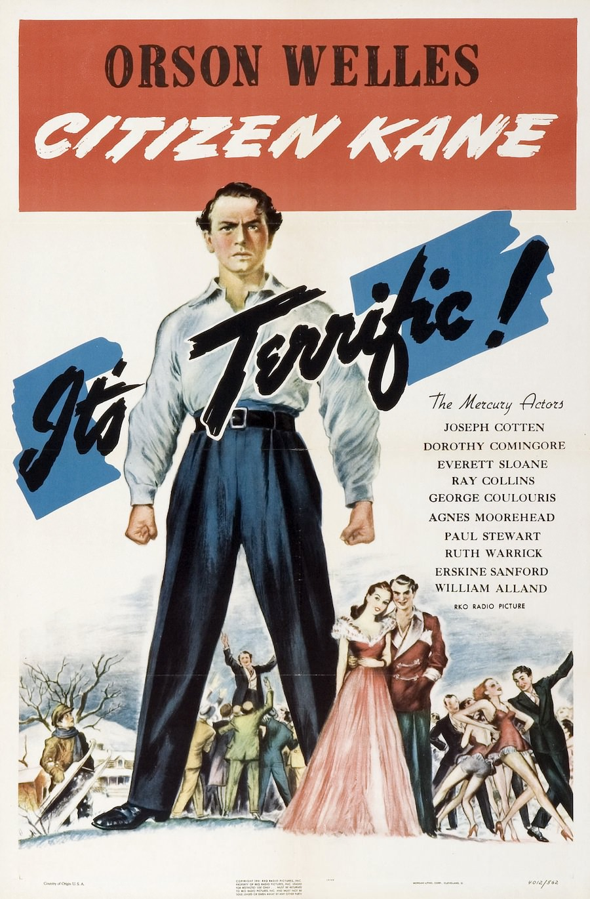
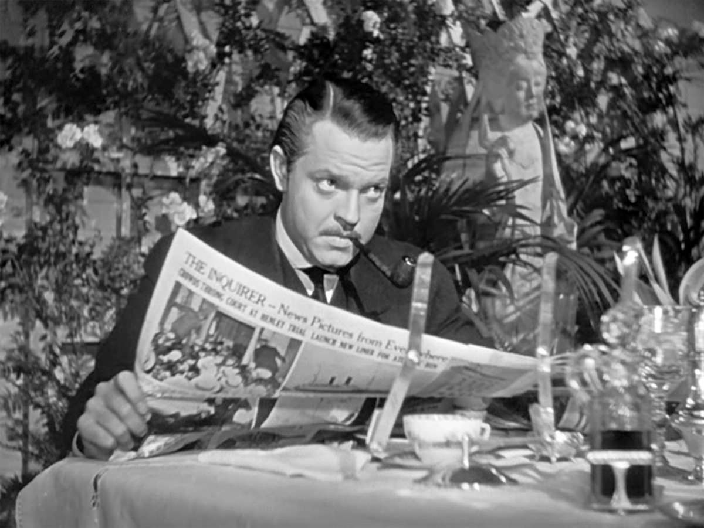
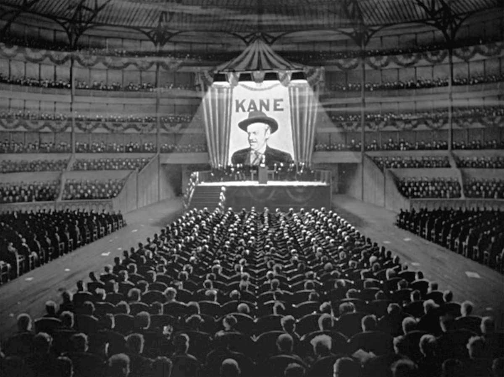

+++
type = "post"
titre = "<em>Citizen Kane</em>, Orson Welles"
title = "Citizen Kane, Orson Welles"
url = "/citizen-kane-welles"
date = "2012-08-27T10:26:44"
Lastmod = "2014-12-12T17:15:32"
cover = "welles-citizen-kane.jpg"
categorie = [ "À voir" ]
tag = [ "Amour", "Drame", "Famille", "Histoire", "Politique", "Presse", "Société" ]
createur = [ "Orson Welles" ]
acteur = [ "Orson Welles" ]
annee = [ "1941" ]
weight = 1941
pays = [ "États-Unis" ]

+++

Difficile de croire aujourd&rsquo;hui que <em>Citizen Kane</em> est le premier film d&rsquo;un réalisateur, encore plus qu&rsquo;il est sorti en 1941. C&rsquo;est après avoir réussi à convaincre à la radio l&rsquo;Amérique entière que les martiens envahissaient le pays que le puissant studio RKO donne ses clés à Orson Welles. Cet acteur est jeune — il n&rsquo;a que 21 ans quand il réussit quasiment à jeter les États-Unis dans le chaos par erreur —, mais son talent est bien perçu par Hollywood qui décide de lui faire une confiance aveugle. Trois ans plus tard, Orson Welles présente son premier film qu&rsquo;il a non seulement réalisé, mais aussi produit, écrit et même interprété puisqu&rsquo;il joue le personnage principal. Aujourd&rsquo;hui encore, <em>Citizen Kane</em> est reconnu comme l&rsquo;un des plus grands films de l&rsquo;histoire du cinéma, rien que ça. Un chef-d&rsquo;œuvre, à voir pour lui-même et pas seulement parce qu&rsquo;il est considéré comme tel.

Le film ouvre sur un panneau &laquo;&nbsp;Interdiction d&rsquo;entrer&nbsp;&raquo;, mais la caméra avance malgré tout, avant de monter pour dévoiler un immense château. À l&rsquo;intérieur, un homme affaibli vit ses dernières minutes ; quand il meurt, il lâche une boule à neige en prononçant un dernier mot, &laquo;&nbsp;Rosebud&nbsp;&raquo;. Cet homme est Charles Foster Kane, un magnat de la presse qui a connu ses heures de gloire entre les deux guerres, mais qui meurt en solitaire. <em>Citizen Kane</em> s&rsquo;attache à retracer sa vie, à travers le prisme du journalisme : le dernier mot prononcé par le mourant intrigue et un journaliste rencontre tous ceux qui l&rsquo;ont connu de son vivant pour essayer de comprendre à quoi il pouvait se rapporter. Au fil des rencontres, on découvre un Charles Kane enfant emporté loin de ses parents et pris en charge par la banque, puis le jeune homme devenu extrêmement riche qui préfère se consacrer à un journal plutôt qu&rsquo;à ses mines qui rapportent gros, on découvre aussi un homme incapable d&rsquo;aimer, marié et divorcé deux fois, incapable aussi de réaliser son plus gros désir qui est d&rsquo;être élu et faire de la politique. Un homme immensément riche qui pouvait tout s&rsquo;offrir, mais qui n&rsquo;a jamais réussi à éviter la solitude qui semblait être son indépassable destin.

Orson Welles s&rsquo;est inspiré de la vie de William Randolph Hearst, célèbre magnat de la presse qui a construit un <a href="http://fr.wikipedia.org/wiki/Hearst_Castle">château un peu fou</a> qui a inspiré celui du film. <em>Citizen Kane</em> établit ainsi le portrait d&rsquo;un homme extrêmement puissant, qui a régné par le biais de ses journaux et ses radios sur tout le pays pendant plusieurs années. Au départ pourtant, le jeune Charles n&rsquo;était pas prédestiné à cet avenir radieux. Ses deux parents étaient pauvres, mais sa mère hérite un peu par hasard d&rsquo;une mine qui s&rsquo;avère être particulièrement riche en minerais. Le jeune garçon est alors pris en charge par la banque qui gère aussi la mine et il est déjà la sixième fortune du pays à 25 ans. Comme le montre très bien Orson Welles, il ne veut pas de cette fortune, même si elle lui permet de tout s&rsquo;offrir. Sa première décision montre toutefois bien son ambivalence : plutôt que de faire prospérer ses biens et d&rsquo;en vivre confortablement, il décide de non seulement diriger son propre journal, mais en plus d&rsquo;en faire un journal plutôt de gauche. Charles Foster Kane va utiliser son journal pour dénoncer les monopoles surpuissants de l&rsquo;époque et leur collusion avec le pouvoir, alors même qu&rsquo;il participe en possédant des actions dans les entreprises concernées. <em>Citizen Kane</em> débute par un film qui retrace sa vie et qui montre qu&rsquo;à la fin, il était détesté par des groupes différents, pour des raisons opposées : les plus capitalistes en faisaient un communiste en puissance, quand la classe populaire ne le considérait pas mieux que ceux qu&rsquo;il voulait dénoncer.

Ce rapport difficile à l&rsquo;argent est doublé de ses relations compliquées avec l&rsquo;amour. Le personnage d&rsquo;Orson Welles semble incapable d&rsquo;aimer quelqu&rsquo;un, si ce n&rsquo;est lui-même, comme le résume à un moment son ami de toujours avec qui il se fâche justement à cause d&rsquo;une femme. <em>Citizen Kane</em> ne laisse aucun doute sur le premier mariage de son personnage : c&rsquo;était un mariage d&rsquo;amour et les débuts ont certainement été enjoués. Très vite toutefois, le couple se fatigue et les petits déjeuners — seul moment où mari et femme se retrouvent — deviennent de plus en plus hostiles. Le mariage finit par sauter quand Charles Foster Kane veut se présenter aux élections : son compétiteur mis à mal par les sondages sort sur la place publique la relation entretenue par Kane avec une chanteuse, ce qui lui coûte la victoire. C&rsquo;est la deuxième déception amoureuse du héros de <em>Citizen Kane</em>, il n&rsquo;a jamais réussi à être élu. Orson Welles en fait une déception plus grande encore sans doute, une déception que le deuxième mariage de son personnage ne va pas compenser. Il a beau tout faire pour sa cantatrice, jusqu&rsquo;à lui construire un opéra entier, cet amour est voué à l&rsquo;échec et toute la volonté de Charles Kane n&rsquo;y fait rien, pas plus que son immense fortune qu&rsquo;il dilapide pour construire son château et amasser des statues. La fin de <em>Citizen Kane</em> est à cet égard quasiment tragique : elle signe la fin d&rsquo;un homme totalement seul, isolé dans son immense palais et qui se laisse mourir à petit feu.

Aujourd&rsquo;hui encore, <em>Citzen Kane</em> surprend par sa modernité, à sa sortie il était révolutionnaire sur de nombreux plans. Orson Welles a opté pour une structure narrative osée pour l&rsquo;époque, mais qui reste étonnamment fluide : le film commence avec la mort de son personnage principal et la suite permet de revenir sur sa vie, par une série de flashbacks. L&rsquo;histoire de Charles Foster Kane n&rsquo;est pas racontée de manière linéaire, mais par quelques épisodes piochés ici ou là. Ce sont en fait les questions du journaliste parti en quête de sens pour &laquo;&nbsp;Rosebud&nbsp;&raquo; qui permettent de reconstituer l&rsquo;histoire de l&rsquo;homme. Celle-ci reste toutefois très parcellaire, les ellipses sont nombreuses et on ne saura pas tout, loin de là. Le cinéaste présente même le même épisode selon deux points de vue différents, comme pour mieux montrer que la réalité est complexe. <em>Citizen Kane</em> est aussi l&rsquo;occasion d&rsquo;expérimenter avec la caméra : le format carré et le noir et blanc très contrasté sont de rigueur, mais Orson Welles se permet quelques folies. Loin de se restreindre à des cadres fixes, il déplace la caméra avec fluidité dans toutes les directions, menant le spectateur où il a envie et souvent en lui faisant découvrir une scène progressivement. C&rsquo;est pour cette même raison que le jeune réalisateur multiplie les plans dotés d&rsquo;une très grande profondeur de champ : quand son personnage entre dans la chambre de sa femme qui vient de faire une tentative de suicide, on voit d&rsquo;abord au premier plan la bouteille de médicaments, puis le lit de la malade et au fond, au loin, la porte que le mari essaie de forcer. Il faudrait encore évoquer la multiplication là encore audacieuse des contre-plongées qui sont l&rsquo;occasion de plans très forts, mais tout cela s&rsquo;intègre très naturellement. <em>Citizen Kane</em> n&rsquo;est pas un simple exercice de style qui aurait sans doute mal vieilli, ces techniques sont mises au service d&rsquo;une grande histoire qui a permis au film de marquer l&rsquo;histoire du cinéma.

Certains classiques du cinéma sont intéressants pour des raisons purement techniques et s&rsquo;avèrent assez peu passionnants en dehors d&rsquo;un cadre studieux. <em>Citizen Kane</em> échappe totalement à cette catégorie et le film d&rsquo;Orson Welles passionne d&rsquo;abord par son histoire et son personnage principal. La mise en scène était révolutionnaire à l&rsquo;époque, elle est encore aujourd&rsquo;hui très moderne et peu utilisée au cinéma, mais tout cela ne serait rien sans l&rsquo;histoire de Charles Foster Kane. Un grand film, à (re)découvrir sans crainte…

<h3>Vous voulez m&rsquo;aider ?</h3>
<ul>
<li><a href="http://www.amazon.fr/gp/product/B0050GBDV4/ref=as_li_ss_tl?ie=UTF8&amp;tag=leblogdenic07-21&amp;linkCode=as2&amp;camp=1642&amp;creative=19458&amp;creativeASIN=B0050GBDV4">Acheter le film en DVD sur Amazon</a></li>
</ul>

