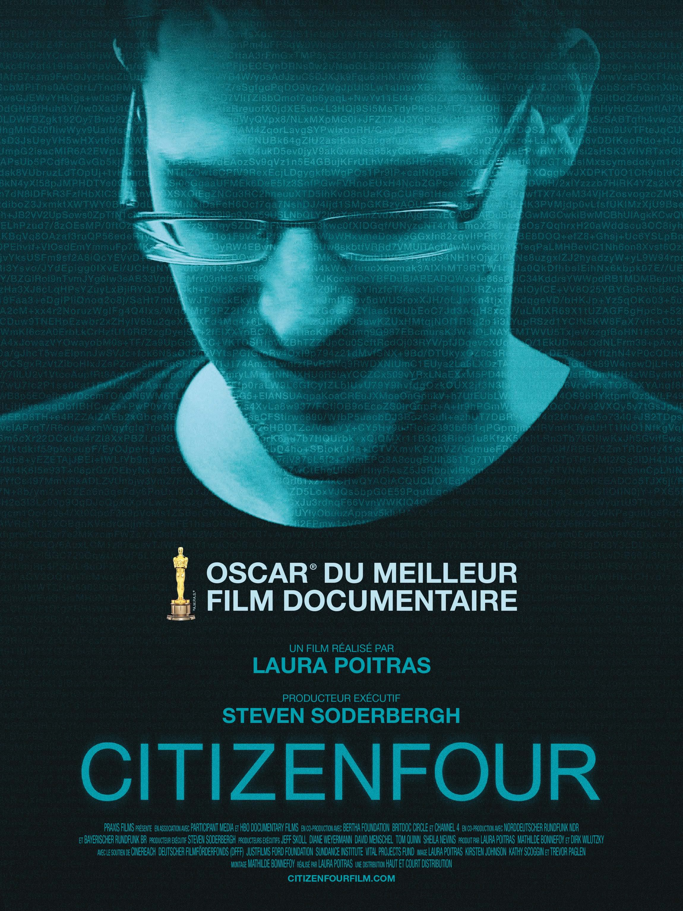
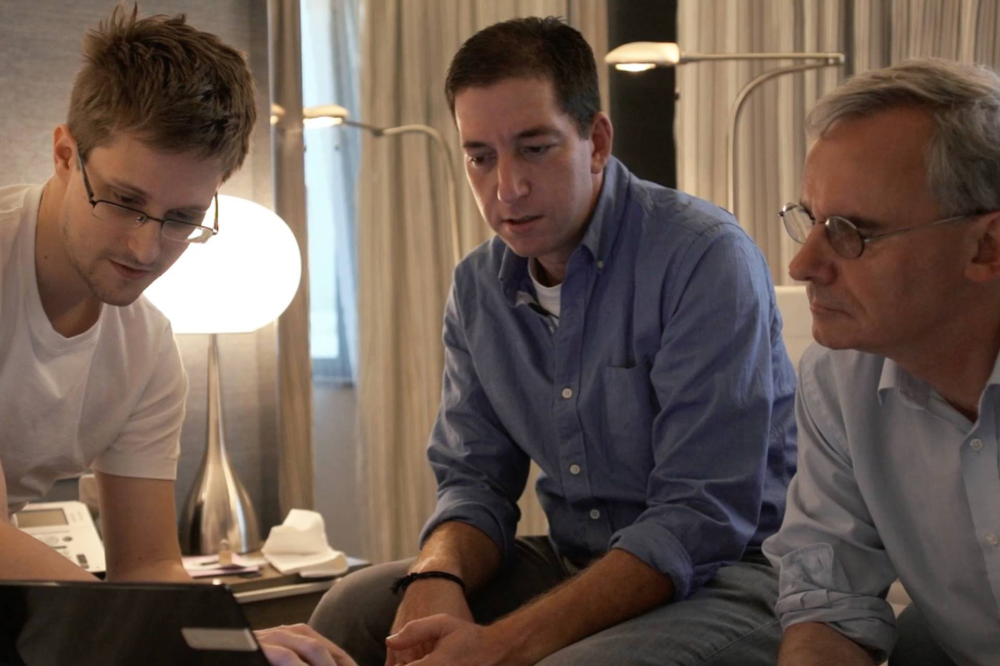
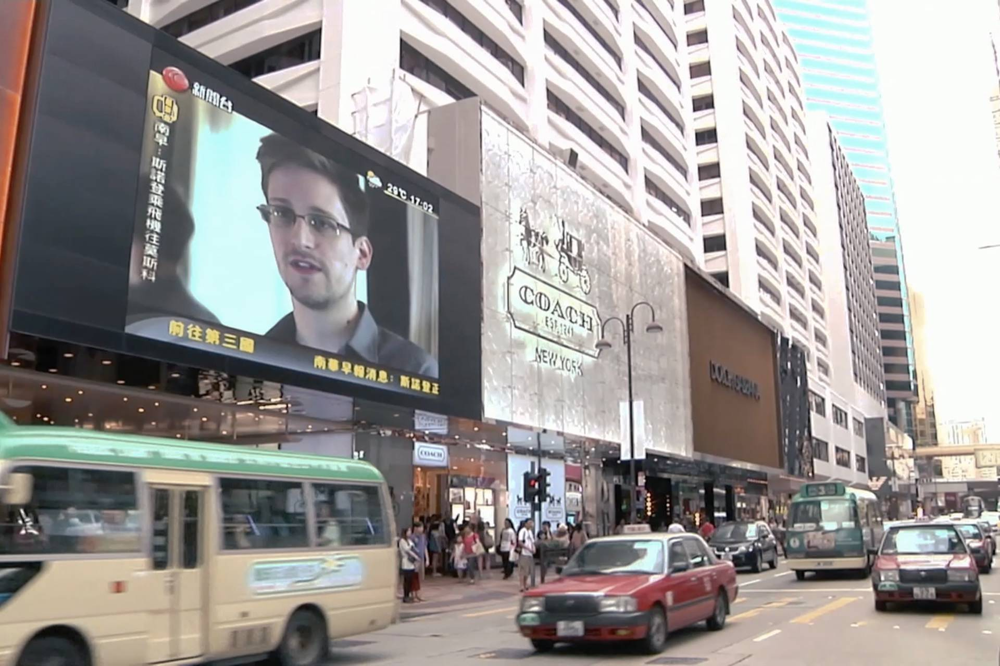
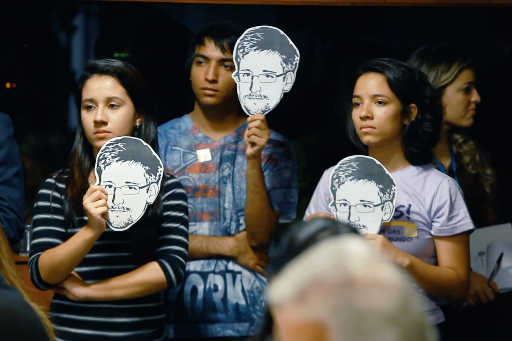

+++
type = "post"
titre = "<em>Citizenfour</em>, Laura Poitras"
title = "Citizenfour, Laura Poitras"
url = "/citizenfour-poitras"
date = "2015-03-06T22:58:00"
Lastmod = "2015-03-07T10:25:12"
cover = "edward-snowden-citizenfour.jpg"
categorie = [ "À voir" ]
tag = [ "Documentaire", "Edward Snowden", "Espionnage", "NSA", "Société", "Sorties du mois", "Thriller" ]
createur = [ "Laura Poitras" ]
annee = [ "2015" ]
weight = 2015
pays = [ "Allemagne", "États-Unis" ]

+++

<blockquote class="pull-quote">
Sache que chaque frontière franchie, chaque achat effectué, chaque appel passé, chaque antenne-relais croisée, chaque ami, chaque article écrit, chaque site web visité et chaque courriel rédigé sont entre les mains d’un système au pouvoir illimité, mais pas totalement sécurisé. Etant une cible de la NSA, tu sais le danger que représente une police secrète toute-puissante pour nos démocraties. Tu es bien placée pour raconter mon histoire.<cite class="author"> — Edward Snowden, Mail envoyé à Laura Poitras, février 2013</cite>

</blockquote>

C&rsquo;est par ces quelques mots qu&rsquo;Edward Snowden avertit Laura Poitras avant de lui envoyer les documents qui ont révélé ce qui sera probablement reconnu par l&rsquo;histoire comme le plus grand scandale du début du XIXe siècle. Cet informaticien engagé par la NSA pour gérer et améliorer le programme de surveillance que l&rsquo;agence a mis en place juste après les attentats du 11 septembre 2001 ne veut plus garder le silence. Il veut que l&rsquo;information soit enfin connue du grand public et que les citoyens américains sachent que leur gouvernement ment et viole leur vie privée depuis des années, impunément. Laura Poitras s&rsquo;était déjà fait connaître en publiant un documentaire sur la guerre en Irak, puis un deuxième sur Guantanamo. Elle était surveillée de très près par la NSA, ce qui fait dire à Edward Snowden, questionné sur son choix de journaliste, cette phrase qui fait froid dans le dos : « <em>Je ne vous ai pas choisi, vous avez été sélectionnée par la NSA</em> ». C&rsquo;est elle qui entre en premier en contact avec Edward Snowden, elle qui recevra en premier les documents issus de la NSA et c&rsquo;est elle qui filme dès le tout premier jour cette histoire extraordinaire. <em>Citizenfour</em> est le résultat, un documentaire  implacable qui prend par moment des allures de thriller. Si c&rsquo;était de la fiction, on trouverait cela exagéré, irréaliste. Mais ce n&rsquo;est que la vérité et c&rsquo;est un film à ne rater absolument sous aucun prétexte !

Laura Poitras ne passe jamais de l&rsquo;autre côté de la caméra. La journaliste se met totalement en retrait derrière son sujet, mais <em>Citizenfour</em> commence par évoquer son rôle central dans les révélations d&rsquo;Edward Snowden. Et elle le fait de manière très astucieuse, en instituant d&rsquo;entrée de jeu un climat de paranoïa qui, on le comprend vite, n&rsquo;a rien de gratuit. Mêlant lecture des mails qu&rsquo;elle a reçu d&rsquo;un mystérieux anonyme qui signait ses messages « Citizenfour » et affichage des messages chiffrés, le documentaire pose bien le contexte. Tout commence au début de l&rsquo;année 2013, quand Edward Snowden envoie un premier message à la journaliste. Il l&rsquo;informe des informations confidentielles sur la NSA qu&rsquo;il veut diffuser, mais prévient d&rsquo;entrée de jeu : il va falloir respecter de nombreuses règles de sécurité pour que l&rsquo;échange puisse se faire. Le « lanceur d&rsquo;alerte » prévient aussi que ces informations le mettront en danger autant que la journaliste et le message est dans l&rsquo;ensemble inquiétant, ce que rend très bien la mise en scène. La musique inquiétante de Nine Inch Nails<a href="#fn-13264-1" rel="footnote">1</a> ajoute encore une touche à cette ambiance stressante parfaitement restituée et on imagine que Steven Soderbergh, producteur exécutif de <em>Citizen Four</em>, n&rsquo;a pas manqué d&rsquo;aider la réalisatrice pour recréer une ambiance de thriller. De fait, on ne voit pas le sujet principal du film avant un long moment, ce qui accentue l&rsquo;effet. Laura Poitras était là dès le départ et elle a parfaitement rendu l&rsquo;effet d&rsquo;attente qui était, probablement, également le sien en attendant les documents promis par sa source anonyme.

Le cœur de <em>Citizenfour</em> est occupé par les huit jours d&rsquo;interview en continu, depuis la chambre anonyme d&rsquo;un hôtel de Hong-Kong. Très méticuleux, Edward Snowden avait en effet tout prévu, et il quitte son travail — basé à Hawaï — pour se rendre dans cette ville réputée pour sa neutralité. Il sait que ce qu&rsquo;il fait sera considéré comme une trahison et qu&rsquo;il serait jugé et emprisonné immédiatement aux États-Unis. Pour se protéger, mais aussi pour protéger les journalistes qui vont l&rsquo;interviewer, il choisit Hong-Kong et c&rsquo;est ici qu&rsquo;il va révéler ses informations à Laura Poitras, mais aussi Gleen Greenwald et un autre journaliste du <em>Guardian</em>. La documentariste a tout filmé et on découvre ainsi Edward Snowden mieux qu&rsquo;on ne l&rsquo;avait jamais connu : ce jeune homme de 29 ans correspond à l&rsquo;idée que l&rsquo;on peut se faire d&rsquo;un geek, mais on découvre surtout une personne très soignée, déterminée et méticuleuse. Il sait exactement ce qu&rsquo;il veut et ne veut pas faire et il choisit soigneusement ce qu&rsquo;il veut divulguer, autant sur lui-même que sur la NSA. <em>Citizenfour</em> peut devenir poignant quand on le voit échanger quelques mots avec sa compagne qui ne se doutait de rien et qui devient brutalement une cible de la NSA. Le film restitue bien son sacrifice en même temps que, encore une fois, sa détermination. Il faut dire que ses révélations sont absolument terrifiantes : le documentaire ne vous apprendra rien si vous avez suivi l&rsquo;affaire de près, mais il est d&rsquo;une efficacité redoutable pour présenter l&rsquo;étendue de l&rsquo;affaire.

Assez technique par moment, le film de Laura Poitras est toutefois plus centré sur Edward Snowden que ses révélations qui sont, au fond, plus souvent évoquées que détaillées. Malgré tout, on (re)découvre cette surveillance de masse qui enregistre toutes les communications, qui s&rsquo;infiltre partout et qui est redoutablement efficace. On (re)voit avec effroi ce responsable de la NSA qui ment sans la moindre gêne face aux parlementaires de son propre pays. Comment ne pas se sentir impuissant face à cette organisation qui n&rsquo;a de compte à rendre à personne, qui agit en toute liberté et qui se donne tous les droits. Et s&rsquo;il faut agir contre la loi ou la constitution, qu&rsquo;importe. <em>Citizenfour</em> montre bien que, malgré toutes les précautions prises par les principales personnes impliquées, sortir ces informations n&rsquo;est pas sans risque. Edward Snowden est toujours aujourd&rsquo;hui bloqué à Moscou, totalement dépendant d&rsquo;un régime autoritaire qui lui a offert l&rsquo;asile politique peut-être uniquement contre les États-Unis. Certes, il a retrouvé sa compagne, mais pourront-ils vieillir ensemble en paix ? Pourront-ils retourner un jour aux États-Unis ? Pour l&rsquo;heure, rien n&rsquo;est moins sûr, mais c&rsquo;est aussi le problème des journalistes. Laura Poitras se faisait constamment arrêter aux frontières américaines, elle vit désormais à Berlin où elle a pu monter en toute tranquillité son film. Comme tous les autres, Gleen Greenwald a fait l&rsquo;objet de pressions, y compris quand son compagnon a été arrêté à un aéroport. Tous les moyens, même les pires, sont bons pour faire pression sur ces hommes et ces femmes qui, courageusement, osent dénoncer les programmes de surveillance de masse. À cet égard, <em>Citizenfour</em> est aussi un incroyable plaidoyer en faveur d&rsquo;une certaine idée du journalisme et on peut espérer que le documentaire suscite des vocations.

<blockquote class="pull-quote">
Je me suis souvenu de ce qu’était Internet avant les écoutes. Il n’y a pas d’équivalent dans l’histoire de l’humanité. 
N’importe où dans le monde, des enfants pouvaient discuter d’égal à égal, en étant assurés qu’on respecte leurs idées, avec des experts à l’autre bout du monde, de n’importe quel sujet, n’importe où et à tout moment. De manière totalement libre. On a assisté à un refroidissement de ce modèle avec aujourd’hui, des gens qui s’autocensurent et plaisantent même de l’idée de finir «sur la liste» en donnant à une cause politique ou en intervenant sur un forum. Les gens s’attendent à être surveillés. Beaucoup font attention à ce qu’ils tapent dans leur moteur de recherche, car ça laisse des traces. Ça restreint les limites de leur exploration intellectuelle. Je préfère risquer l’emprisonnement ou toute autre conséquence négative, que risquer qu’on limite ma liberté intellectuelle et celle des gens autour de moi dont je me soucie autant que de moi-même. »<cite class="author"> — Edward Snowden, Interview, 4 juin 2013</cite>

</blockquote>

<em>Citizenfour</em> n&rsquo;est pas seulement un documentaire plein d&rsquo;informations passionnantes, c&rsquo;est aussi un film prenant et réussi. On disait en préambule que l&rsquo;on trouverait cela exagéré si c&rsquo;était de la fiction, mais il faut dire que Laura Poitras a su rendre son sujet aussi prenant qu&rsquo;un thriller. C&rsquo;est digne des meilleurs récits d&rsquo;espionnage et pourtant, ce n&rsquo;est que la vérité. Une vérité étonnamment proche de ce que la fiction a d&rsquo;ailleurs déjà produite — la série <a href="/person-of-interest-nolan-cbs/" title="Person of Interest, Jonathan Nolan (CBS)"><em>Person of Interest</em></a>, sortie deux ans avant les révélation d&rsquo;Edward Snowden, surprend toujours autant par sa proximité avec la réalité —, si bien que <em>Citizenfour</em> est non seulement intéressant, mais aussi divertissant. Vous auriez tort de passer à côté, d&rsquo;autant que vous êtes, vous aussi, écouté et suivi en permanence par la NSA.

<ol>
<li id="fn-13264-1">
Le film exploite des morceaux de <a href="http://ghosts.nin.com/main/home"><em>Ghosts I-IV</em></a>, l&rsquo;album instrumental publié il y a quelques années. On peut l&rsquo;écouter intégralement <a href="https://www.youtube.com/watch?v=EyKNUj-AjgA">sur YouTube</a>.&#160;<a href="#fnref-13264-1" rev="footnote">&#8617;</a>
</li>
</ol>

