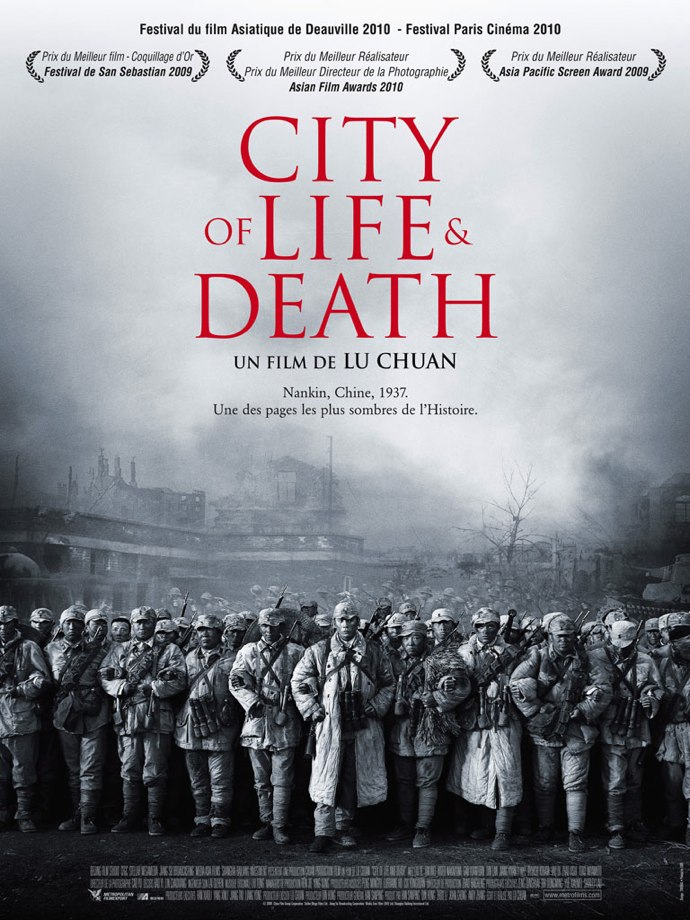
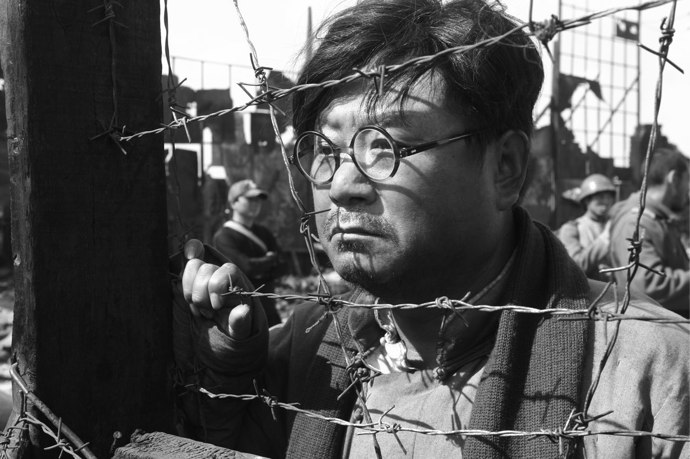
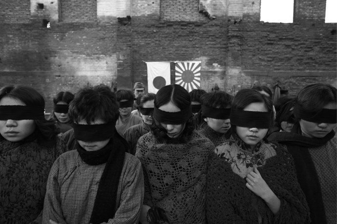

+++
type = "post"
titre = "City of Life and Death, Chuan Lu"
title = "City of Life and Death, Chuan Lu"
url = "/city-life-death-lu"
date = "2010-07-24T00:52:49"
Lastmod = "2013-03-07T09:41:35"
cover = "chuan-lu-city-of-life-and-death.jpg"
categorie = [ "À voir" ]
tag = [ "Drame", "Guerre", "Histoire", "Mémoire", "Noir et blanc" ]
createur = [ "Chuan Lu" ]
acteur = [ "Hideo Nakaizumi", "Liu Ye", "Wei Fan", "Yuanyuan Gao" ]
annee = [ "2010" ]
weight = 2010
pays = [ "Chine" ]
original = "Nanjing ! Nanjing !"

+++

<em>City of Life and Death</em> est un film chinois autorisé par le gouvernement chinois à propos du massacre de Nankin de 1937. Autant dire que parler de film politisé est encore faible : cet épisode sanglant de la guerre sino-japonaise que l&rsquo;on a tendance à oublier étant donnée sa simultanéité avec les conflits européens est toujours un élément de friction dans les relations entre le Japon et la Chine. Chuan Lu s&rsquo;est battu pour imposer une vision aussi peu caricaturale que possible et pourtant son film est attaqué des deux côtés et n&rsquo;a jamais été montré au Japon. Difficile d&rsquo;oublier le contexte politique, qui ne doit cependant pas occulter que <em>City of Life and Death</em> n&rsquo;est pas sans défauts.

Hiver 1937, l&rsquo;armée japonaise massacre entre 100 000 et 300 000 Chinois, prisonniers de guerre et civils, à Nankin. L&rsquo;événement est rentré dans l&rsquo;histoire sous le nom évocateur de « <a href="http://fr.wikipedia.org/wiki/Massacre_de_Nankin">massacre de Nankin</a> ». C&rsquo;est un événement particulièrement sombre de l&rsquo;histoire chinoise, quand les Japonais alors en train de conquérir l&rsquo;immense Empire chinois ont choisi sciemment de massacrer une ville entière. Pas n&rsquo;importe quelle ville, puisque Nankin est alors la capitale impériale : le symbole est puissant et l&rsquo;armée japonaise ne l&rsquo;oublie pas et en fait, consciemment ou inconsciemment, un symbole de sa victoire écrasante. Victoire qui ne fut pas difficile à obtenir puisque les troupes chinoises censées protéger la capitale sont évacuées de la ville quand elles ne fuient pas, si bien que les Japonais trouvent une ville pleine de civils, mais quasiment sans soldats. Les combats ne sont pas très équilibrés et la ville, largement détruite par ailleurs, est rapidement prise. Si quelques poches de résistance subsistent, ça ou là, l&rsquo;essentiel de Nankin est aux mains des Japonais. Les civils sont restés, ainsi que des prisonniers de guerre et ce sont ces populations normalement protégées par les lois internationales. L&rsquo;armée japonaise a été comme prise de furie et a massacré des milliers d&rsquo;hommes, femmes et enfants, souvent avec seulement des armes blanches faute de munitions, en même temps qu&rsquo;elle a violé des milliers de femmes et enfants. Des horreurs que l&rsquo;état-major a décidé de laisser faire, sans doute pour humilier définitivement la Chine et faire un symbole, comme Stalingrad fut un symbole dans le conflit germano-russe quelques années après.

<em>City of Life and Death</em> veut célébrer la mémoire des victimes du massacre, comme le film l&rsquo;indique explicitement en préambule. Chuan Lu pose donc sa caméra au milieu des ruines et suit quelques personnages importants dans le conflit, un officier japonais responsable d&rsquo;une grande partie des horreurs, un émissaire nazi et son secrétaire chinois, un autre officier japonais, un Chinois et son fils… Autant d&rsquo;hommes et de femmes qui sont là pour permettre au réalisateur de montrer l&rsquo;ensemble des moments forts du conflit. Le film ouvre ainsi sur la prise de la ville et sur la fuite de la majeure partie des troupes chinoises. Après la mise hors d&rsquo;état de nuire des dernières poches de résistance et les massacres de prisonniers de guerre, le film se concentre sur le camp de réfugiés improvisé au cœur de la capitale. Un camp plein de civils et de soldats blessés, protégé un temps par l&rsquo;émissaire nazi et une femme que l&rsquo;on imagine bien notable avant la guerre. Le camp est finalement attaqué par les soldats japonais, d&rsquo;abord par le viol, puis par les exécutions. Le nombre de morts côté chinois est vraiment impressionnant et montre bien la violence des affrontements. Si le nombre exact de victimes fait encore aujourd&rsquo;hui débat entre les deux puissances, il est de toute façon impressionnant par son ampleur au regard de la faible zone géographique et du temps très court.

Un film sur un massacre ne peut pas rester objectif, suffisamment éloigné des évènements pour pouvoir en juger froidement. Un parti-pris est obligatoire, et le seul qui soit imaginable est évidemment celui des victimes contre les bourreaux. C&rsquo;est d&rsquo;autant plus le cas pour un film chinois autorisé par le pouvoir à propos d&rsquo;un massacre japonais. <em>City of Life and Death</em> est pourtant présenté par son créateur comme objectif parce qu&rsquo;il montre des Japonais humains et non comme les montres que l&rsquo;historiographie chinoise a trop souvent voulu retenir. Chuan Lu a ainsi fait le choix de suivre un officier japonais dégoûté par ce qu&rsquo;il voit, incapable d&rsquo;aider ces Chinois qu&rsquo;on lui demande de massacrer, mais pris de compassion au point d&rsquo;en libérer, parfois par la mort. Ce contre-exemple japonais ne fait pas pour autant de <em>City of Life and Death</em> un film neutre, même s&rsquo;il a suffi à indigner les nationalistes chinois. Le film suit néanmoins son statut de film mémoriel et présente longuement ses victimes, avec parfois les plus grossiers effets de dramatisation. Le réalisateur multiplie les ralentis, les gros plans sur les visages tristes et enfonce encore le clou avec une musique souvent larmoyante censée attiser notre émotion. L&rsquo;effet obtenu est l&rsquo;inverse de celui désiré : à trop vouloir en faire sur le plan émotionnel, Chuan Lu finit par agacer. Le sujet est si fort qu&rsquo;il n&rsquo;avait pas besoin d&rsquo;être à ce point dramatisé : nul besoin de montrer si longuement les massacres, les cadavres sur la plage, terrible image, parlaient d&rsquo;eux-mêmes. Avait-on besoin aussi de voir un groupe de prisonniers chanter à tue-tête la gloire de la Chine avant de mourir ? Le film en fait beaucoup trop pour que l&rsquo;on pleure les victimes, montre des Japonais quand même globalement bien contents de pouvoir tuer et violer tous ces Chinois et évite toutes les questions qui fâchent côté Chine. Pourquoi le pouvoir a abandonné Nankin et ses habitants ? Finalement, n&rsquo;est-il pas, lui aussi, responsable de ce massacre en désertant la ville ? Autant de questions que l&rsquo;on aurait aimé voir posées. L&rsquo;aval des autorités chinoises est évidemment responsable de cette absence de recul sur les évènements : ce n&rsquo;est en tout cas pas une excuse recevable pour excuser les limites du film.

<em>City of Life and Death</em> est un film assez éprouvant à suivre. Doté d&rsquo;une splendide photographie noir et blanc qui lui confère un sérieux qui tend au solennel, le film de Chuan Lu propose une mise en scène elle aussi assez solennelle, parfois très forte, parfois lourde dans ses effets. Le film oscille ainsi entre très bons moments liés essentiellement à la qualité de la reconstitution historique (Chuan Lu a manifestement bénéficié d&rsquo;un budget confortable et cela se voit) qui évoque des références comme <a href="/2011/11/26/il-faut-sauver-le-soldat-ryan-spielberg/" title="Il faut sauver le soldat Ryan, Steven Spielberg"><em>Il faut sauver le soldat Ryan</em></a> ou <em>Stalingrad</em><a href="#footnote_0_3698" id="identifier_0_3698" class="footnote-link footnote-identifier-link" title="Je ne parle que de la reconstitution historique, pr&eacute;cision importante pour Stalingrad.">1</a>. <em>City of Life and Death</em> parvient à plusieurs reprises à exprimer énormément de choses avec peu de moyens, comme lorsque cet homme décide de rester et de se sacrifier pour sa femme que l&rsquo;on sait enceinte. Ces moments réussis font regretter encore plus les autres moments où Chuan Lu use de son art pour asséner un message, démultipliant les moyens (image, scénario, musique). Le film est aussi pénalisé à mon avis par sa durée : il aurait gagné à être raccourci et plus efficace.

À une époque où le <a href="http://fr.wikipedia.org/wiki/Révisionnisme_au_Japon">négationnisme et le révisionnisme</a> font rage au Japon, un film comme <em>City of Life and Death</em> semble indispensable, ne serait-ce que par son statut d&rsquo;unique film (au moins chinois) sur le sujet. Ce statut particulier explique sa position très marquée du côté du mémoriel et de la célébration des victimes contre les bourreaux japonais, même si Chuan Lu se défend d&rsquo;être dans l&rsquo;opposition caricaturale. Néanmoins, le film en fait beaucoup trop pour susciter l&rsquo;émotion du spectateur, ce qui se révèle maladroit et contre-productif. Un tel sujet aurait largement bénéficié d&rsquo;un traitement moins long et surtout moins lourdement démonstratif, à l&rsquo;image par exemple de <em>Nuit et Brouillard</em>. Cela dit, c&rsquo;est l&rsquo;occasion aussi de découvrir une histoire que l&rsquo;on connaît très mal en Occident et de rappeler que la Seconde Guerre mondiale a en fait commencé en Asie.

J&rsquo;avais lu plusieurs avis très positifs qui m&rsquo;avaient encouragé à voir <em>City of Life and Death</em>, à commencer par ceux de <a href="http://www.filmosphere.com/2010/06/critique-city-of-life-and-death-2009/">Nicolas</a> et <a href="http://www.plan-c.fr/article-the-city-of-life-and-death-de-chuan-lu-52601262.html">Alexandre</a>. Tous deux ont vu un film équilibré pour chacun des camps, ce que je ne comprends vraiment pas. Que les Japonais soient présentés comme des êtres humains, c&rsquo;est bien, mais n&rsquo;est-ce pas le minimum syndical ? Et puis ils sont peut-être humains, ils tuent des milliers d&rsquo;hommes, femmes et enfants sans faiblir, quand ils ne balancent pas simplement une petite fille par la fenêtre, juste histoire de dire… Je suis encore une fois plutôt d&rsquo;accord avec <a href="http://www.critikat.com/City-of-Life-and-Death.html"><em>Critikat</em></a>, même si je ne les suis pas vraiment sur les idées préconçues qui endormiraient les spectateurs au lieu d&rsquo;éveiller leurs consciences.

<h3>Vous voulez m&rsquo;aider ?<a href="#footnote_1_3698" id="identifier_1_3698" class="footnote-link footnote-identifier-link" title="&Agrave; propos de la publicit&eacute;&hellip;">2</a></h3>
<ul>
<li><a href="http://www.amazon.fr/gp/product/B0040UEIEA/ref=as_li_ss_tl?ie=UTF8&tag=leblogdenic07-21&linkCode=as2&camp=1642&creative=19458&creativeASIN=B0040UEIEA">Acheter le film en Blu-Ray sur Amazon</a></li>
<li><a href="http://www.amazon.fr/gp/product/B0040UEIE0/ref=as_li_ss_tl?ie=UTF8&tag=leblogdenic07-21&linkCode=as2&camp=1642&creative=19458&creativeASIN=B0040UEIE0">Acheter le film en DVD sur Amazon</a></li>
<li><a href="https://itunes.apple.com/fr/movie/city-of-life-and-death/id471675018">Acheter ou louer le film sur l&rsquo;iTunes Store</a></li>
</ul>

<ol class="footnotes"><li id="footnote_0_3698" class="footnote">Je ne parle que de la reconstitution historique, précision importante pour <em>Stalingrad</em>. [<a href="#identifier_0_3698" class="footnote-link footnote-back-link">&#8617;</a>]</li><li id="footnote_1_3698" class="footnote"><a href="/soutien/">À propos de la publicité…</a> [<a href="#identifier_1_3698" class="footnote-link footnote-back-link">&#8617;</a>]</li></ol>
