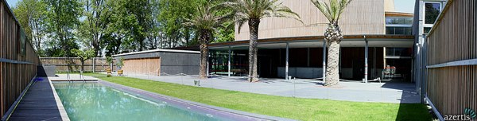
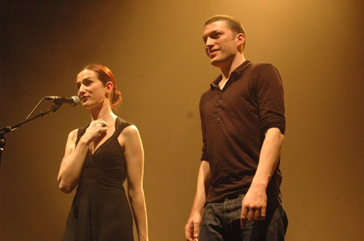
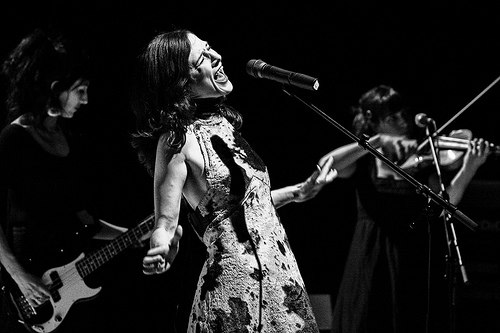
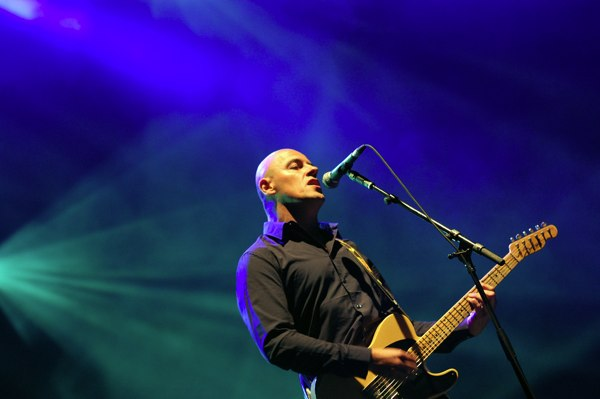
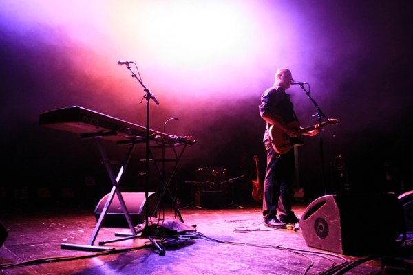

+++
type = "post"
titre = "Claire Diterzi et Dominique A au Bikini (20 novembre 2009)"
title = "Claire Diterzi et Dominique A au Bikini (20 novembre 2009)"
url = "/claire-diterzi-dominique-a-bikini"
date = "2009-11-23T23:55:28"
Lastmod = "2013-04-03T13:39:53"
cover = "dominique-a-bikini.jpg"
categorie = [ "À voir… en live" ]
tag = [ "Bikini", "Chanson française", "Concert" ]
annee = [ "2009" ]
weight = 2009
pays = [ "France" ]
lieu = [ "Bikini" ]

+++

Un concert au <a href="http://www.lebikini.com/">Bikini</a>, près de Toulouse, est fort différent des concerts parisiens. Déjà, la salle se trouve dans une zone industrielle, paumée au milieu des entreprises vides à l&rsquo;heure des concerts (pas bête pour éviter les problèmes de voisinage). Ensuite, les concerts commencent officiellement à 20h30 et plutôt aux alentours de 20h45 ; on est loin des 19h30 de plus en plus fréquents dans la capitale&#8230; Logiquement, ils se terminent plus tard, rarement avant 23h30 et en l&rsquo;occurrence à minuit et quart. Mieux vaut ne pas compter sur les transports en commun, qui sont de toute façon trop éloignés de la salle. Ici on vient en voiture, et on ne vient pas avant 20h15, juste le temps de boire une bière au bar avant d&rsquo;entrer dans la salle. C&rsquo;est aussi la seule salle que je connaisse qui dispose d&rsquo;une piscine entourée de palmiers. On n&rsquo;est clairement pas à Paris ici&#8230;

Ce soir, l&rsquo;affiche annonce Claire Diterzi et Dominique A. Il ne s&rsquo;agit pas à proprement parler d&rsquo;une première partie précédant un concert, ou alors c&rsquo;est une première partie qui dure une heure et qui voit passer des gens comme Piers Faccini&#8230; L&rsquo;idée, plutôt bonne d&rsquo;ailleurs je trouve, est de proposer deux artistes différents, mais relativement proches sur le plan musical, un peu à la manière d&rsquo;un mini-festival. Certains soirs, ce ne sont pas deux, mais trois groupes qui passent.

J&rsquo;ai déjà eu l&rsquo;occasion de <a href="http://voiretmanger.fr/2009/01/24/claire-diterzi-ou-comment-la-musique-francaise-peut-etre-bien/">dire tout le bien que je pensais de Claire Diterzi</a>. Autant casser d&rsquo;emblée tout suspense, Claire Diterzi sur scène est au moins aussi bien que Claire Diterzi sur l&rsquo;album. C&rsquo;est à la fois différent — plus léger, moins sérieux que sur album — et proche par cette ambiance si particulière formée essentiellement autour des voix.

Pour réussir à conserver la voix comme instrument à part entière, la chanteuse s&rsquo;est bien entourée puisque ce sont pas moins de cinq personnes qui l&rsquo;entourent. Parmi elles, deux choristes à temps plein (c&rsquo;est leur unique boulot) et la violoniste qui les aide parfois. On trouve aussi sur scène une guitariste/bassiste, et le seul mec de la bande (l&rsquo;étalon comme l&rsquo;appelle Claire Diterzi), le batteur debout devant sa batterie quand il ne tape pas sur des casseroles posées sur une table. L&rsquo;ensemble est très convaincant, très cohérent à la manière d&rsquo;un vrai groupe. On sentait clairement le plaisir de jouer, de chanter ensemble, et ce plaisir était communicatif.

<em>Crédit : <a href="http://www.flickr.com/photos/pirlouiiiit/439118577/">pirlouiiiit @ Flickr</a></em>

Les albums de Claire Diterzi sont assez complexes. Finement construits, leurs titres pourraient être copiés tels quels sur scène, mais heureusement ça n&rsquo;est pas le cas. Certes, on reste en terrain connu en permanence, mais les artistes se permettent quelques libertés, allongeant au gré des envies les morceaux, ou les modifiant pour notre plus grand bonheur. On peut noter pendant tout le concert une touche de folie de la part d&rsquo;un artiste qui ne se prend clairement pas au sérieux, et c&rsquo;est tant mieux pour tout le monde. Claire Diterzi se révèle coquine sur certaines chansons (la fameuse Bimbo bien sûr), et globalement s&rsquo;amuse comme une folle. Elle nous raconte plein d&rsquo;histoires drôles et on passe un très bon moment en sa compagnie.

Le point qui pouvait pêcher sur scène, à savoir la précision des voix, ne pose finalement aucun problème. Les trois chanteuses principales s&rsquo;en donnent à cœur joie, ne ménageant jamais leur voix, sans jamais défaillir. On sent le travail et l&rsquo;habitude de jouer ensemble, les chœurs sont propres, puissants, mais sans effet bouillie (le très bon son proposé par le Bikini n&rsquo;y était bien sûr pas pour rien). Non vraiment, c&rsquo;était plaisant de les écouter chanter.

<em>© Rod &#8211; <a href="http://www.le-hiboo.com/7240-claire-diterzi-folies-bergere-paris-03122008">Le HibOO</a></em>

Je connais beaucoup moins bien Dominique A. J&rsquo;ai toujours eu du mal à entrer dans l&rsquo;univers de cet artiste français à la carrière déjà longue. Classé dans les artistes littéraires, il m&rsquo;a longtemps semblé bien trop proche de la chanson française à l&rsquo;ancienne pour que je m&rsquo;y intéresse. Depuis, j&rsquo;ai découvert des artistes comme Christophe ou Manset, et je dois dire que Dominique A a indéniablement quelque chose d&rsquo;intéressant à l&rsquo;écoute. Derrière l&rsquo;apparente patine &laquo;&nbsp;chanson française&nbsp;&raquo; se cachent des sonorités inattendues, souvent électroniques, et fort intéressantes.

Sur scène, Dominique A est entouré de trois musiciens, un batteur au fond et de part et d&rsquo;autre un clavier et un homme à tout faire, claviers, guitare ou même chant. La grosse surprise musicale de ce concert fut indéniablement son côté très rock : l&rsquo;absence de basse était compensée par un volume important sur la grosse caisse, tandis que les guitares étaient fortement mises en avant. Sur certains passages, c&rsquo;était vraiment très rock, et quand on écoute les albums, on a du mal à s&rsquo;imaginer une telle puissance.

<em>Crédit : <a href="http://www.flickr.com/photos/lpritchard/3835298414/"> lpritchard@ Flickr</a></em>

Sur disque, la finesse est de mise, la voix de Dominique A se pose sur mélodies souvent fines, parfois rehaussées d&rsquo;instrumentations électroniques. Sur scène, la musique prend clairement de l&rsquo;importance sans que la voix ne change. Après tout, c&rsquo;est assez logique, mais le résultat est étonnant, il y a comme un décalage très sensible entre la voix, toujours posée, et le reste, beaucoup plus mouvementé. Ce décalage est d&rsquo;ailleurs concrétisé sur scène de manière très comique (pas sûr que ce soit un comique volontaire) par le décalage entre, à ma gauche, Thomas jeune multi-instrumentiste remuant et manifestement heureux d&rsquo;être là et, à ma droite, David, claviériste qui n&rsquo;a pas quitté sa mine façon porte de prison pendant tout le concert. À peine a-t-il esquissé un sourire en fin de concert&#8230;

Dominique A est entre les deux, comme un liant. En concert, il chante comme sur disque en gros. Cela implique deux choses : d&rsquo;une part, le chant est omniprésent ; d&rsquo;autre part, il est assez monocorde. Les périodes sans le chant sont très rares dans un concert de Dominique A. Je suppose que c&rsquo;est un aspect positif, mais j&rsquo;ai trouvé ça fatigant ; sans doute est-ce une résurgence de mon manque d&rsquo;intérêt pour la chanson. Ainsi, je n&rsquo;ai jamais écouté les paroles des chansons, certainement fort intéressantes au demeurant.

<em>Crédit : <a href="http://www.commentcertainsvivent.com/images/287.html">sAm @ Comment Certains Vivent</a></em>

Le côté monocorde est sans doute lié au concert précédent : la voix joue ici un rôle fort différent de chez Claire Diterzi. Instrument chez cette dernière, elle n&rsquo;est plus ici qu&rsquo;expression de chansons à texte. La chanteuse l&rsquo;a d&rsquo;ailleurs superbement résumé par cette petite phrase, lancée sur le ton de la plaisanterie, mais qui en disait long : &laquo;&nbsp;Les paroles, nous, on s&rsquo;en fout&nbsp;&raquo;. Je crois que tout est dit, et je suis sûr de m&rsquo;en ficher aussi complètement des paroles.

Néanmoins, je n&rsquo;ai pas passé un mauvais moment, loin de là. Le concert était assez long (deux heures), mais fort plaisant, les titres défilant à grande allure (peut être un peu trop, d&rsquo;ailleurs Dominique A n&rsquo;a pas dit grand chose à part un bref &laquo;&nbsp;Merci !&nbsp;&raquo; entre deux morceaux), évitant ainsi tout ennui. En sortant de la salle, si je préfère toujours Claire Diterzi à Dominique A, j&rsquo;ai envie de redonner une chance à la discographie de ce dernier. Et après une première écoute, il est vrai que son dernier album est agréable. Comme quoi, rien n&rsquo;est perdu&#8230;

<em>Crédit couverture : <a href="http://www.flickr.com/photos/mpix/4062855773/">mpix @ Flickr</a></em>

