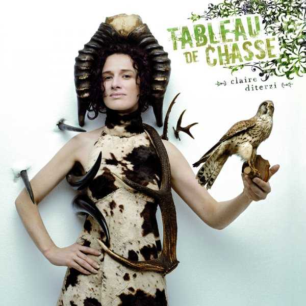

+++
type = "post"
titre = "Claire Diterzi : ou comment la musique française peut être bien&#8230;"
title = "Claire Diterzi : ou comment la musique française peut être bien&#8230;"
url = "/claire-diterzi-ou-comment-la-musique-francaise-peut-etre-bien"
date = "2009-01-24T23:25:58"
Lastmod = "2009-02-25T22:40:31"
cover = ""
categorie = [ "Musique" ]
tag = [ "Chanson française" ]
annee = [ "2008" ]
weight = 2008
pays = [ "France" ]

+++

Claire Diterzi est une découverte récente puisqu&rsquo;avant les vacances de Noël, je n&rsquo;avais jamais entendu ce nom. Encore une de ces découvertes de mon père, je me demande où il va chercher tout ça ! Eh bien je ne regrette pas d&rsquo;avoir découvert, en tout cas, ça vaut le détour. De quoi, même vous réconcilier (un peu) avec la musique française, c&rsquo;est dire !

<em>Clic : lien direct iTunes Store</em>

Pourtant, Claire Diterzi n&rsquo;est pas une nouvelle venue dans le paysage artistique français. Mais elle est une artiste atypique, inclassable et qui ne passerait sûrement pas aux NRJ Music Awards. Claire Diterzi, en effet, n&rsquo;a pas fait de la musique, en tout cas pas de musique toute seule. Elle a ainsi collaboré avec Découflé sur un spectacle de danse, mais aussi avec Anne Feinsibler pour un documentaire sur Billy The Kid (<em><a href="http://fr.wikipedia.org/wiki/Requiem_for_Billy_the_Kid">Requiem for Billy The Kid</a></em>).

Pour ce nouvel album (son quatrième et il est sorti il y a un an déjà, c&rsquo;est dire mon retard), elle a choisi d&rsquo;associer à la musique la peinture ou la sculpture. C&rsquo;est en effet accompagnée de dix chefs-d&rsquo;œuvre qu&rsquo;elle a réalisé <em>Tableau de chasse</em>. Un travail apparemment militant, puisqu&rsquo;il s&rsquo;agit rien de moins que de combattre la stupidité télévisuelle, d&rsquo;après <a href="http://www.clairediterzi.fr/">son site officiel</a>. Cela ne saute pas forcément aux oreilles au premier abord, d&rsquo;ailleurs je ne l&rsquo;avais jamais remarqué avant de me renseigner pour les besoins de ce billet. Ce qui frappe à coup sûr, c&rsquo;est l&rsquo;étrangeté des paroles : disons-le, Claire Diterzi est complètement frappée, et c&rsquo;est un compliment. On voyage dans un univers loufoque, souvent poétique, très beau en tout cas.

Mais comme d&rsquo;habitude, les paroles m&rsquo;intéressent moins que la musique. Et je dois dire que sur ce point, ce disque m&rsquo;a enchanté. Il a été réalisé apparemment à partir de trois fois rien, c&rsquo;est-à-dire en fait un ordinateur et Claire Diterzi qui a tout fait toute seule, seule avec ses tableaux donc. En écoutant l&rsquo;album, on sent le travail qui a eu derrière, un travail d&rsquo;orfèvre je dirais. Chacune des onze chansons qui composent ce court (malheureusement) album sont comme autant de micro-univers. C&rsquo;est, en effet, une musique très visuelle qui nous est proposée ici. En écrivant cela, je repense à Dionysos qui a aussi souhaité ce genre de micro-univers propre à chaque chanson. Le résultat me semble meilleur ici, cela tient sans doute à l&rsquo;expérience  de cette artiste complète.

La voix se fait ici modulable : vieillotte et tremblotante sur La Vieille Chanteuse, vive en générale, bimbo sur Quatre Pattes, ou encore multipliée pour former des chœurs virtuels. On ne peut pas s&rsquo;empêcher de penser à Björk sur certains passages, mais la comparaison s&rsquo;arrête vite (ce sont deux univers musicaux tout de même très différents). Si les nouvelles technologies sont omniprésentes (l&rsquo;ordinateur étant au centre du processus créatif), elles sont ici utilisées pour mieux mettre en valeur voix et instruments, mais aussi permettre les expérimentations les plus folles.

En effet, <em>Tableau de Chasse</em> n&rsquo;est pas un album simple à appréhender : même s&rsquo;il se laisse écouter facilement, il faut plusieurs écoutes pour le dompter. C&rsquo;est que c&rsquo;est un album complet, riche et très anticonformiste. La notion même de genre ne tient pas devant Claire Diterzi, pour mon plus grand bonheur.

Je vous recommande chaudement cet album étonnant qui fait partie de ces multiples albums, et souvent artistes, étranges, hors-normes et passionnants pour cette raison. Pour en savoir plus, j&rsquo;ai déjà évoqué <a href="http://www.clairediterzi.fr/">le site officiel, </a>mais vous avez aussi le traditionnel <a href="http://fr.wikipedia.org/wiki/Claire_Diterzi">article de Wikipedia</a>.

 

 

C&rsquo;est avec ce genre de disques et artistes que je reprends un peu confiance dans la chanson française. C&rsquo;est vrai qu&rsquo;il y a des choses très audibles, voire même très bien. J&rsquo;ai déjà dit tout le bien que je pensais de Christophe, mais je pense aussi à Manset, que je découvre avec son dernier album et qui vraiment, vaut une écoute même si l&rsquo;impression d&rsquo;un effet Nostalgie est bien présente aux premières écoutes. Plus récent, Alex Beaupain est un artiste étonnant, souvent comparé à Bashung, ce que je trouve excessif, mais enfin, il est vrai qu&rsquo;il fait des choses intéressantes.

Finalement, c&rsquo;est comme avec tout, il y a de quoi écouter, mais encore faut-il les retrouver au milieu de toute la soupe que l&rsquo;on nous vend en permanence.

Enfin bon, moi, tant que l&rsquo;on ne me forcera pas à écouter la première Dame de France (que je n&rsquo;ai jamais aimé, je ne vois pas pourquoi je devrais m&rsquo;y mettre&#8230;), ça m&rsquo;ira bien&#8230;

