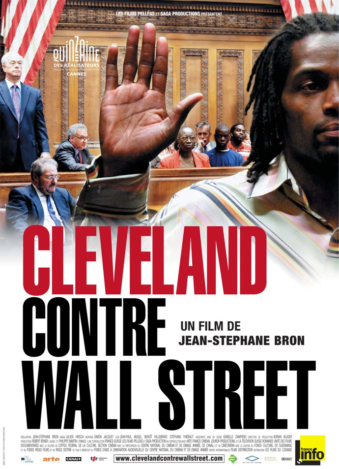
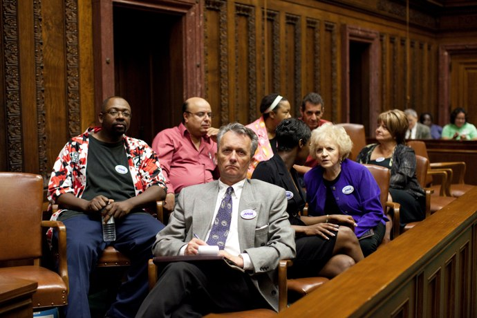
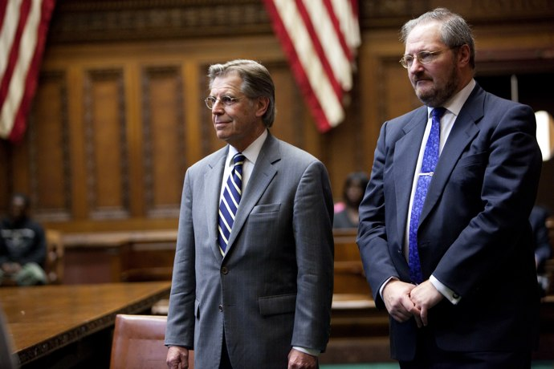
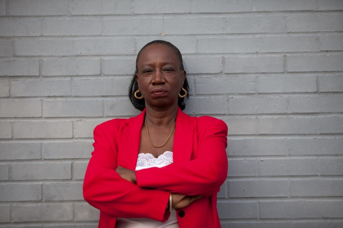

+++
type = "post"
titre = "Cleveland contre Wall Street, Jean-Stéphane Bron"
title = "Cleveland contre Wall Street, Jean-Stéphane Bron"
url = "/cleveland-wall-street-bron"
date = "2010-08-28T00:46:09"
Lastmod = "2012-05-04T00:07:05"
cover = "cleveland-contre-wall-street-bron.jpg"
categorie = [ "À voir" ]
tag = [ "Crise", "Docufiction", "Politique", "Société" ]
createur = [ "Jean-Stéphane Bron" ]
annee = [ "2010" ]
weight = 2010
pays = [ "France", "Suisse" ]

+++

<em>Cleveland contre Wall Street</em>, c&rsquo;est une idée un peu folle, mais tellement réjouissante. Cleveland, une ville sinistrée par la crise des subprimes intente un procès à Wall Street et à ses banques d&rsquo;investissement à l&rsquo;origine du système des subprimes. Le procès devait avoir lieu, mais les banques ne sont pas du genre à se laisser faire et leurs armées d&rsquo;avocats ont réussi à repousser <em>ad vitam aeternam</em> un procès qui les dérange. Jean-Stéphane Bron, documentariste suisse, a décidé que cela n&rsquo;allait pas se passer comme ça et que la ville et ses habitants méritaient leur procès. Il a donc mis en place un dispositif où tout, du juge aux jurés, en passant par les avocats et les témoins, est vrai… tout en étant parfaitement fictif au regard de la loi. L&rsquo;occasion surtout d&rsquo;expliquer de la manière la plus claire possible le mécanisme des subprimes. Un film brillant, qui évite toute pédagogie. À ne rater sous aucun prétexte.

<a href="http://www.allocine.fr/film/fichefilm_gen_cfilm=180608.html">

</a>

Début 2008, un cabinet d&rsquo;avocats de Cleveland assigne en justice 21 banques de Wall Street au nom de la ville de Cleveland. Les banques sont accusées d&rsquo;avoir sciemment contribué à l&rsquo;appauvrissement extrême d&rsquo;une large part de la population déjà défavorisée, et donc contribué aux nombreuses expulsions que la ville connaît depuis environ 5 ans. Ces banques se sont empressées de tout faire pour mettre des bâtons dans les roues d&rsquo;un tel procès qui, quelle qu&rsquo;en soit l&rsquo;issue, serait néfaste pour leur image. <em>Cleveland contre Wall Street</em> met en scène ce procès dans les règles de l&rsquo;art, comme le système juridique américain le permet. Deux avocats, l&rsquo;un représentant la ville de Cleveland, l&rsquo;autre les banques de Wall Street, s&rsquo;opposent pour convaincre un jury composé de huit citoyens américains. Pour les convaincre, ils peuvent bien sûr s&rsquo;exprimer en ouvrant et refermant le procès, mais ils font surtout appel à des témoins qu&rsquo;ils interrogent et contre-interrogent à tour de rôle. L&rsquo;idée est de fournir aux jurés tous les éléments pour leur permettre ensuite d&rsquo;en juger en âme et conscience, sans aucun parti-pris. Le juge n&rsquo;est là que comme arbitre, pour donner la parole à l&rsquo;un ou à l&rsquo;autre et veiller à ce que la procédure soit respectée. De manière très intelligente, le cinéaste a tenu à conserver cette impartialité dans son film. Évidemment, le simple fait d&rsquo;avoir imaginé mettre en place un tel procès implique d&rsquo;emblée une position tranchée en faveur des banques. Mais là où un Michael Moore aurait essayé de les tourner en ridicule, Jean-Stéphane Bron préfère leur laisser tout le loisir pour s&rsquo;exprimer, défendre leur point de vue et, peut-être, convaincre les jurés. Le documentariste précise d&rsquo;ailleurs bien qu&rsquo;il n&rsquo;y a aucun dialogue dans <em>Cleveland contre Wall Street</em> : le procès est filmé tel qu&rsquo;il aurait eu lieu en vrai, sans préparation et sans en connaître l&rsquo;issue.

L&rsquo;issue de ce procès importe peu. De toute manière, <em>Cleveland contre Wall Street</em> n&rsquo;est pas un documentaire, mais un docufiction, genre hybride qui supprime les enjeux concrets d&rsquo;entrée de jeu. Mais si ce procès n&rsquo;a aucune valeur juridique, on ne compte plus ses raisons d&rsquo;être, aussi nombreuses qu&rsquo;essentielles. Il permet d&rsquo;abord aux victimes de s&rsquo;exprimer. Parmi les témoins appelés à la barre, deux sont ainsi des pères de famille qui vont être virés de leur maison faute d&rsquo;avoir payé à temps leur crédit. Leur émotion est d&rsquo;autant plus forte qu&rsquo;elle n&rsquo;est en rien simulée et on assiste même à la mise aux enchères de la maison d&rsquo;un des témoins qui y assiste, impuissant et plus abattu que révolté. Le film déplie très bien le mécanisme qui a conduit des dizaines de milliers d&rsquo;Américains à se trouver à la rue. Des courtiers envoyés par des sociétés de crédit locales frappent aux portes des quartiers les plus pauvres de la ville. Ils vendent aux habitants de ces quartiers le rêve américain : acquérir une maison et accéder au stade ultime de l&rsquo;<em>American Dream</em> ou s&rsquo;ils en ont déjà une, effectuer des travaux, ou bien simplement se permettre des achats grâce à un crédit. Un des témoins a ainsi acheté sa maison à crédit pour 26 000 $, avant de prendre un an plus tard un second crédit en hypothéquant la maison pour 40 000 $, et un troisième quelques années après pour 71 000 $. Le crédit toujours plus important associé à des taux toujours plus extravagants le conduit finalement, lui et sa famille, à la rue, en ayant tout perdu. Fin du rêve pour lui, comme pour tant d&rsquo;autres. Ville sinistrée déjà bien avant la crise proprement dite par des taux de chômage délirants, Cleveland offre aujourd&rsquo;hui de bien sinistres paysages : les rues de certains quartiers pauvres sont désertes, et on aperçoit, ici ou là, une maison encore ouverte. Dans certaines rues, toutes les maisons ont été saisies et c&rsquo;est une dans véritable ville fantôme que la caméra de Jean-Stéphane Bron se déplace.

<em>Cleveland contre Wall Street</em> est aussi l&rsquo;occasion de suivre une magistrale leçon sur le mécanisme fort complexe des subprimes. J&rsquo;ai beau avoir déjà lu, entendu et vu sur ces objets financiers qui ont donné leur nom à une crise économique, j&rsquo;étais loin d&rsquo;avoir les idées claires en entrant dans la salle. J&rsquo;ai été vraiment bluffé par la clarté des explications, qui proviennent notamment de connaisseurs puisque défilent à la barre des témoins un courtier, un membre des think tanks néo-républicains qui a activement participé à la dérégulation du marché dans les années 1980 puis 2000 ou encore le concepteur du logiciel utilisé par les banques du monde entier pour gérer les subprimes<a href="#footnote_0_3947" id="identifier_0_3947" class="footnote-link footnote-identifier-link" title="Cet homme a un peu culpabilis&eacute; depuis la crise, et publi&eacute; un article au titre humoristique : &laquo;&nbsp;How I helped build the bomb that blew up Wall Street.&nbsp;&raquo; L&rsquo;article peut &ecirc;tre lu gratuitement, je pense que cela doit &ecirc;tre int&eacute;ressant, si vous voulez aller plus loin&hellip;">1</a>. Du point de vue des banques, c&rsquo;est la solution miracle qui permet de brasser des milliards et des milliards sans risque, du moins le pensait-on jusqu&rsquo;à la crise. Le principe est simplissime en fait : en principe, les banques ne prêtent qu&rsquo;à des personnes solvables, c&rsquo;est-à-dire des personnes capables de rembourser leur prêt. Les banques ont imaginé prêter à des clients moins solvables en échange de taux plus élevés : l&rsquo;idée est qu&rsquo;elles prenaient un risque en prêtant de l&rsquo;argent à des personnes qui pourraient avoir du mal à rembourser, et ce risque était compensé par des gains plus importants sur le prêt. Mais pour renforcer encore leur propre sécurité, les banques ont commencé à créer des packs de crédits à risque : un crédit à risque est très risqué, 1000 crédits à risque représentent finalement moins de risque puisque l&rsquo;on parie sur le fait que, en moyenne, sur les 1000, il y aura suffisamment de gains pour compenser les pertes. De manière subtile, les banques sont passées d&rsquo;un crédit instable que personne n&rsquo;aurait voulu, à des titres devenus beaucoup plus sûrs et qui pouvaient s&rsquo;échanger librement, comme n&rsquo;importe quelle action, sur les marchés financiers. Ce phénomène de la &laquo;&nbsp;titrisation&nbsp;&raquo; est génial pour tous les acteurs financiers qui prennent de l&rsquo;argent à chaque étape, depuis les courtiers qui démarchent les clients, jusqu&rsquo;aux plus grosses banques aux noms devenus célèbres, comme Lehman Brothers.

On comprend alors aisément le point de vue des milieux financiers. Comment résister à ces produits qui permettent de brasser des milliers de milliards de dollars ? D&rsquo;autant que du point de vue des marchés financiers, en bout de chaîne, ces subprimes représentent un risque supposé très réduit. On peut penser que les banques n&rsquo;ont pas bien compris le danger que ce mode de fonctionnement impliquait, ou plutôt n&rsquo;ont pas voulu voir les risques. Faire intervenir l&rsquo;homme qui a imaginé le logiciel de gestion de toutes les banques qui ont utilisé les subprimes est à cet égard très bien vu : il explique ainsi très bien comment les banques ne pouvaient qu&rsquo;adhérer à ce nouveau système qui apportait de l&rsquo;argent comme jamais, et semblait sans risque. Finalement, tant que le système a fonctionné, tout le monde était assez satisfait : les clients des subprimes cumulaient les crédits, un crédit arrivant régulièrement pour combler les précédents, et tous ces mouvements financiers basés sur pas grand-chose permettaient aux banques d&rsquo;empocher de véritables pactoles. Mais même la main invisible du marché prônée par le néo-libéral ne peut créer indéfiniment de la richesse en brassant du vide. La chute était inévitable et elle a été, et est toujours, terrible, à la hauteur des gains précédents. Dès lors, les banques ont été attaquées de toute part et leur défense est assez logique. Jouant sur les valeurs fondamentales des États-Unis, elles nient leur responsabilité en rappelant que les crédits ont été librement acceptés par des clients avides et vivant au-dessus de leurs moyens, et s&rsquo;il y a un tort, il est au moins partagé. Le penseur républicain de l&rsquo;époque Reagan et que l&rsquo;on devine très actif pendant les années Bush ajoute une couche en expliquant que c&rsquo;est la régulation à outrance des années Clinton qui est directement responsable de la crise. Il faut le voir affirmer avec un aplomb et un sérieux qui fait peur que le capitalisme, né il y a 200 ans environ, a apporté la richesse et le bonheur sur la planète entière alors que les gouvernements, qui ont environ 500 ans eux, n&rsquo;ont servi à rien si ce n&rsquo;est nuire au capitalisme. À ce niveau, ce n&rsquo;est même plus du troll…

La mécanique de défense des banques est bien huilée et s&rsquo;avère même plutôt convaincante… au moins sur le papier. Malheureusement pour elles, la confrontation à la réalité révèle d&rsquo;autres aspects qui pointent du doigt les responsabilités des banques ou autres acteurs impliqués. Le procès imaginé par Jean-Stéphane Bron démontre très bien comment seuls les quartiers les plus défavorisés de la ville ont été démarchés par les courtiers. Là encore, le témoignage d&rsquo;un ancien courtier est passionnant : ce jeune issu du &laquo;&nbsp;ghetto des ghettos&nbsp;&raquo; comme il le nomme lui-même vendait de la drogue avant de devenir courtier, une réorientation qui n&rsquo;a pas exigé de changer de clientèle. Il explique ainsi comment lui et ses collègues visaient les quartiers défavorisés pour inciter les populations à prendre des crédits sur des sommes très importantes et à des taux exorbitants. Étant payés en fonction des sommes et des taux, ils n&rsquo;hésitent pas à gonfler au-delà du raisonnable ces chiffres, quitte à falsifier les déclarations de revenus de leurs clients. Les banques, de leur côté, ne vérifient rien : elles veulent faire du chiffre et ne s&rsquo;embarrassent pas une seconde de savoir si leurs emprunteurs pourront les rembourser un jour. En fait, elles aimeraient autant qu&rsquo;ils ne puissent pas, histoire de leur vendre un nouveau crédit pour éponger l&rsquo;ancien. Les subprimes, fondamentalement, comptent sur le malheur des uns pour faire le bonheur, en tout cas la richesse, des autres. Terrifiant système où l&rsquo;on arrose des quartiers entiers de milliers de dollars pour mieux les vider ensuite et récupérer au passage un max de pognon. Argent qui a été, rappelons-le, gentiment offert par les gouvernements raillés par notre néo-truc préféré : 700 milliards de $ pour permettre aux banques de faire des subprimes un mauvais souvenir et de passer à autre chose. Pourtant, dans tous les États-Unis et même dans le monde entier, la crise fait encore des ravages…

Comment, devant un tel sujet, rester neutre ? Comment, à moins d&rsquo;être du bon côté du système, ne pas être favorable à ces familles qui ont tout perdu à cause de banques cupides qui ont su utiliser l&rsquo;ignorance de ces familles défavorisées ? Jean-Stéphane Bron a pourtant réussi à faire de <em>Cleveland contre Wall Street</em> non pas un film de propagande démagogique, mais un vrai film de procès où les deux parties sont équitablement représentées. Son film est visuellement très proche du documentaire, même si le procès est vu de plus près et de manière plus exhaustive que dans la réalité (on n&rsquo;aurait pas accès aux délibérations du jury, par exemple). La scène se passe en majeure partie dans la salle d&rsquo;audience, et pourtant on ne s&rsquo;ennuie pas une seconde. Les témoins défilent, ajoutant chacun une brique à l&rsquo;édifice et on est vraiment happé par toutes ces informations passionnantes et on ne voit à aucun moment le temps passer. Jean-Stéphane Bron a su trouver le bon équilibre entre documentaire et fiction : son procès est totalement crédible, et offre en même temps plus d&rsquo;informations qu&rsquo;un procès normal avec notamment une très belle scène de délibérations du jury. Tous ces acteurs non professionnels (quoique, un avocat est toujours un acteur) sont très justes à l&rsquo;écran et comme prévu, l&rsquo;émotion est là. Le réalisateur ne cède jamais à la facilité néanmoins, contrairement à Michael Moore qui s&rsquo;attardait un peu trop sur les larmes des victimes dans son récent <em><a href="http://voiretmanger.fr/2009/11/29/capitalism-love-story-moore/">Capitalism : A Love Story</a></em> au sujet identique.

<em>Cleveland contre Wall Street</em> est d&rsquo;abord la concrétisation d&rsquo;une idée un peu folle : offrir aux habitants de Cleveland un procès mérité contre les banques de Wall Street. Ce film offre à toutes les victimes du système représentées par quelques familles de Cleveland l&rsquo;opportunité de s&rsquo;exprimer. Mais au-delà du cas de Cleveland, le docufiction de Jean-Stéphane Bron est une démonstration aussi implacable que passionnante sur le système des subprimes. Si vous voulez tout comprendre de la crise qui nous touche depuis plusieurs années, voilà le film à ne pas rater en cette rentrée.

<h3>Vous voulez m&rsquo;aider ?<a href="#footnote_1_3947" id="identifier_1_3947" class="footnote-link footnote-identifier-link" title="&Agrave; propos de la publicit&eacute;&hellip;">2</a></h3>
<ul>
<li><a href="http://www.amazon.fr/gp/product/B004LO5EHU/ref=as_li_ss_tl?ie=UTF8&#038;tag=leblogdenic07-21&#038;linkCode=as2&#038;camp=1642&#038;creative=19458&#038;creativeASIN=B004LO5EHU">Acheter le film en DVD sur Amazon</a></li>
</ul>

<ol class="footnotes"><li id="footnote_0_3947" class="footnote">Cet homme a un peu culpabilisé depuis la crise, et publié un article au titre humoristique : &laquo;&nbsp;<em><a href="http://nymag.com/news/business/55687/">How I helped build the bomb that blew up Wall Street</a></em>.&nbsp;&raquo; L&rsquo;article peut être lu gratuitement, je pense que cela doit être intéressant, si vous voulez aller plus loin… [<a href="#identifier_0_3947" class="footnote-link footnote-back-link">&#8617;</a>]</li><li id="footnote_1_3947" class="footnote"><a href="http://voiretmanger.fr/a-propos/publicite/">À propos de la publicité…</a> [<a href="#identifier_1_3947" class="footnote-link footnote-back-link">&#8617;</a>]</li></ol>
