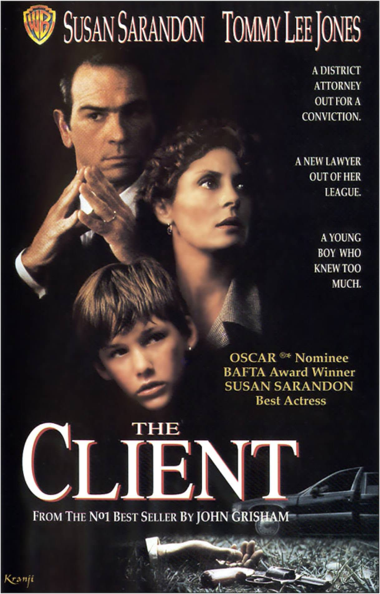
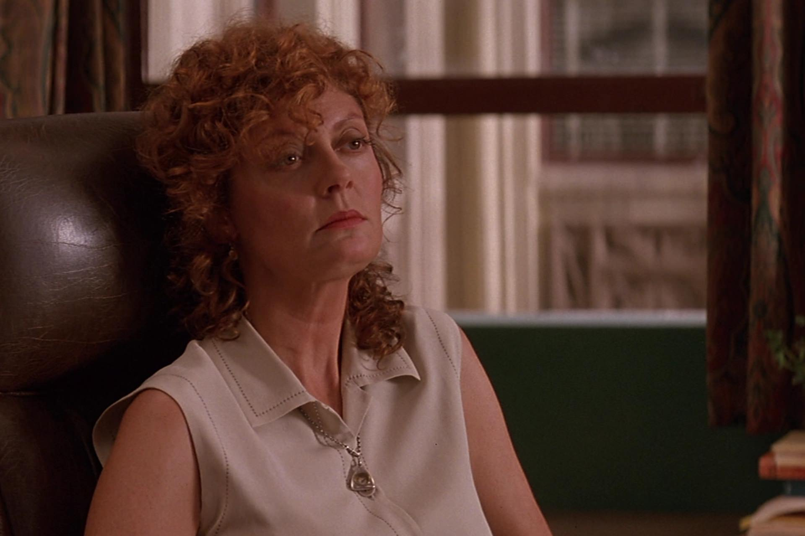

+++
type = "post"
titre = "<em>Le Client</em>, Joel Schumacher"
title = "Le Client, Joel Schumacher"
url = "/client-schumacher"
date = "2015-01-16T19:32:30"
Lastmod = "2015-01-16T19:36:45"
cover = "le-client-brad-renfro.jpg"
categorie = [ "À voir" ]
tag = [ "Adaptation littéraire", "Enfance", "Mafia", "Mort", "Procès", "Vite oublié" ]
createur = [ "Joel Schumacher" ]
acteur = [ "Brad Renfro", "Mary-Louise Parker", "Susan Sarandon", "Tommy Lee Jones" ]
annee = [ "1994" ]
weight = 1994
pays = [ "États-Unis" ]
original = "The Client"

+++

Adapté d&rsquo;un roman de John Grisham publié un an seulement avant sa sortie, <em>Le Client</em> raconte encore une fois l&rsquo;histoire de David contre Goliath, cette fois en affrontant un garçon de 11 ans à la mafia. Le long-métrage réalisé par Joel Schumacher est aussi centré autour d&rsquo;un procès, avec un conflit entre un procureur qui a beaucoup de succès et qui aime ça et une avocate qui débute dans le métier, mais qui a envie d&rsquo;en découdre. L&rsquo;ensemble est prometteur, mais gâché par une réalisation outrancière : de la musique composée par Howard Shore au jeu ridicule de la majorité des acteurs, on a du mal à se passionner pour ces personnages et ce qui leur arrive. Dommage.

<em>Le Client</em> commence autour d&rsquo;un suicide auquel assistent, par hasard, Mark Sway et son petit frère. Un avocat véreux qui travaille pour la mafia en apprend un petit peu trop sur l&rsquo;assassinat d&rsquo;un sénateur et il sait que ses jours sont comptés. Plutôt que de mourir sous la lame de son employeur, il préfère prendre les devants et veut se suicider dans sa voiture. Malheureusement, deux garçons sont là pour assister à la mort et Mark essaie courageusement, mais un peu bêtement, de sauver celui la future victime. L&rsquo;avocat le remarque, le force à entrer dans la voiture et lui raconte tout, avant de se tuer. Le garçon en sait donc lui aussi beaucoup trop et la mafia cherche alors à le tuer, lui aussi. Le scénario adapté du roman de John Grisham ne se concentre pas sur cette affaire mafieuse toutefois, puisque <em>Le Client</em> vire au film de procès quand Mark refuse de répondre à la police pour protéger sa famille. Il tombe alors sur la route de Roy Foltrigg, un procureur très médiatisé qui enquête justement sur la mort du sénateur tué par la mafia. Il sent que le témoin malgré lui en sait plus qu&rsquo;il ne veut bien lui dire et il ouvre un procès contre le garçon… qui va alors chercher un avocat pour se défendre. Il tombe sur Regina Love, avocate depuis deux ans après une cure de désintoxication qui lui a valu un divorce et une séparation avec ses enfants. Joel Schumacher concentre ainsi vite son film autour de ces trois personnages, un trio qui s&rsquo;oppose… de manière caricaturale malheureusement.

En effet, si son scénario de base est plutôt intéressant, le long-métrage souffre énormément des choix de son réalisateur. Joel Schumacher n&rsquo;est pas connu pour la finesse de sa mise en scène — il le prouvera ensuite avec les deux derniers volets de la <a href="http://voiretmanger.fr/saga/batman/">saga <em>Batman</em></a> qu&rsquo;il a réalisés — et c&rsquo;est incontestablement <em>le</em> point faible de ce film. Le cinéaste entend ne rien laisser au hasard et, plutôt que de faire un minimum confiance à l&rsquo;intelligence de ses spectateurs, il souligne et surligne tous les éléments dans <em>Le Client</em>. La moindre scène de confrontation devient une lutte à mort, avec des personnages qui deviennent vite hystériques. Heureusement, Joel Schumacher peut compter sur des acteurs suffisamment talentueux pour qu&rsquo;ils s&rsquo;en sortent malgré tout plutôt bien. Tommy Lee Jones a un rôle un petit peu trop ampoulé, mais il compose malgré tout un procureur qui n&rsquo;aime rien de plus que les caméras médiatiques assez convaincant. Ses rictus passent bien et il peut même faire sourire par moments, bref, il ne souffre pas trop des consignes du réalisateur. Même chose pour Susan Sarandon : l&rsquo;actrice en fait parfois légèrement trop, mais dans l&rsquo;ensemble, elle trouve le ton juste et parvient même à susciter un peu d&rsquo;émotion avec Mark. On n&rsquo;en dira pas autant de Brad Renfro, le jeune acteur qui incarne le personnage principal : certes, Mark a toutes les raisons d&rsquo;être énervé, mais il hurle et s&rsquo;agite vraiment trop et il manque de crédibilité. Et puis au-delà des acteurs, il y a la bande-originale composée par Howard Shore : s&rsquo;il peut faire preuve de subtilité, il signe ici une composition caricaturale qui appuie chaque scène jusqu&rsquo;à la nausée. <em>Le Client</em> a quelques passages assez forts et ils sont tous silencieux…

Deux excellents acteurs et un scénario plutôt bon ne suffisent pas à sauver <em>Le Client</em> : la réalisation, la direction d&rsquo;acteurs ou encore la musique sont bien trop lourds pour ne pas le plomber. Joel Schumacher manque de finesse et cela se sent, malheureusement : sans être totalement déplaisant, <em>Le Client</em> est un film que l&rsquo;on oubliera vite, et que l&rsquo;on peut même éviter complètement. Sauf, naturellement, si on est fan de Tommy Lee Jones.

<h3>Vous voulez <a href="http://voiretmanger.fr/soutien/">m&rsquo;aider</a> ?</h3>
<ul>
<li><a href="http://www.amazon.fr/gp/product/B00A79WLO2/ref=as_li_ss_tl?ie=UTF8&amp;tag=leblogdenic07-21&amp;linkCode=as2&amp;camp=1642&amp;creative=19458&amp;creativeASIN=B00A79WLO2">Acheter le film en Blu-ray sur Amazon</a></li>
<li><a href="http://www.amazon.fr/gp/product/B00004VYMH/ref=as_li_ss_tl?ie=UTF8&amp;tag=leblogdenic07-21&amp;linkCode=as2&amp;camp=1642&amp;creative=19458&amp;creativeASIN=B00004VYMH">Acheter le film en DVD sur Amazon</a></li>
<li><a href="https://itunes.apple.com/fr/movie/le-client/id550804941">Acheter ou louer le film sur l&rsquo;iTunes Store</a></li>
<li><a href="http://www.netflix.com/WiMovie/382840?trkid=13462100">Regarder le film sur Netflix</a></li>
</ul>

