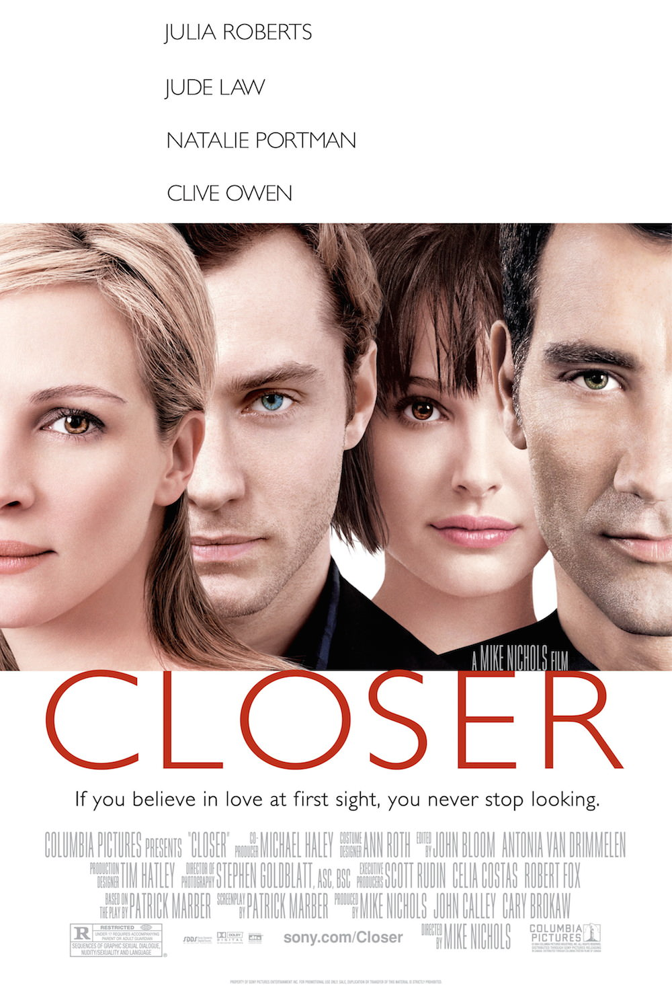
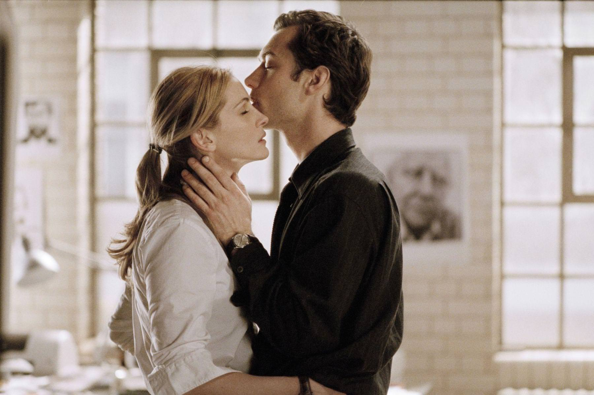
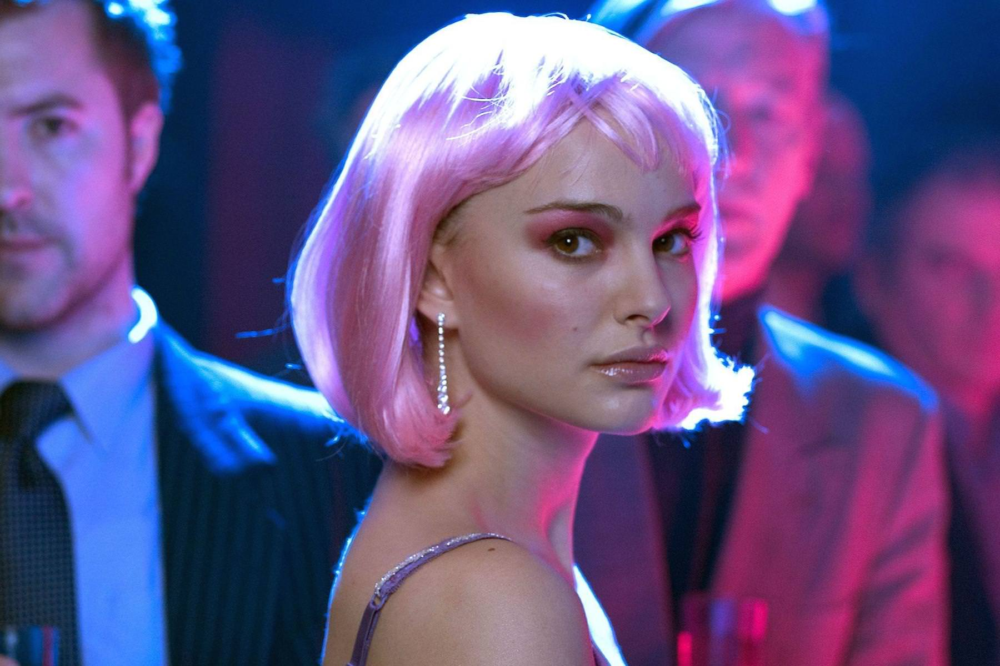

+++
type = "post"
titre = "<em>Closer, entre adultes consentants</em>, Mike Nicchols"
title = "Closer, entre adultes consentants, Mike Nicchols"
url = "/closer-entre-adultes-consentants-nicchols"
date = "2014-04-09T11:41:42"
Lastmod = "2014-04-06T11:46:06"
cover = "closer-entre-adultes-consentants-clive-owen-natalie-portman.jpg"
categorie = [ "À voir" ]
tag = [ "Adaptation théâtrale", "Amour", "Drame", "Romance", "Sexe", "Triangle amoureux" ]
createur = [ "Mike Nicchols" ]
acteur = [ "Clive Owen", "Jude Law", "Julia Roberts", "Natalie Portman" ]
annee = [ "2004" ]
weight = 2004
pays = [ "États-Unis" ]
original = "Closer"

+++

Adapté d’une pièce qui a connu un grand succès, <em>Closer, entre adultes consentants</em> se construit sur un postulat de départ assez simple, mais avec une intrigue qui se complexifie de plus en plus. Histoires d’amour entrecroisées, double triangle amoureux : Mike Nicchols dispose d’un matériau riche et de dialogues percutants, héritage de la pièce qu’il adapte. À l’écran, l’origine théâtrale s’oublie rapidement, même si la majorité des scènes se font à deux seulement, et on retient surtout un drame poignant et des couples qui se forment et se déchirent avec une intensité rare. <em>Closer, entre adultes consentants</em> revisite et réactualise le marivaudage de la grande époque, pour un résultat réjouissant.

Mike Nicchols choisit d’ouvrir son film sur la poignante musique de Damien Rice. Les paroles de « <a href="https://www.youtube.com/watch?v=5YXVMCHG-Nk"><em>The Blower&rsquo;s Daughter</em></a> » coïncident parfaitement avec la première scène de <em>Closer, entre adultes consentants</em> : Dan, journaliste et écrivant raté ne peut pas quitter Alice, jeune new-yorkaise un peu perdue à Londres, des yeux. Ils ne se quittent tellement pas des yeux que la jeune femme ne regarde pas du bon côté au moment de traverser et elle se fait percuter par un taxi. Dan l’amène à l’hôpital pour les quelques points qu’il lui faut et, au lieu d’aller à son travail qui le débecte, il va se promener avec Alice une partie de la journée, sans même savoir son nom à ce moment. Toujours porté par l’excellente musique de Damien Rice, le cinéaste parvient en quelques images à nous montrer à quel point ils sont heureux ensemble, eux qui sont si différents. Dan est très sérieux dans son costume un peu cheap, Alice est extravagante avec ses cheveux courts teints en rose bonbon. Sans transition, on retrouve Dan en train de se faire photographier pour son premier livre par Anna, une photographe professionnelle. <em>Closer, entre adultes consentants</em> joue constamment de l’ellipse, laissant passer les mois ou les années sans prévenir, pour mieux se concentrer sur les moments les plus importants. On comprend qu’Alice et Dan vivent ensemble et que ce premier livre qu’il espérait tant a été écrit sur Alice, grâce à Alice. Pourtant, aussi vite que l’on avait compris le coup de foudre de la première scène, on sent ici un malaise. Dan semble beaucoup apprécier Anna, au point de lui faire ouvertement des avances. Nouvelle ellipse de quelques mois, on retrouve le premier couple au vernissage de l’exposition d’Anna, qui s’est trouvée entre temps un petit ami avec Larry, un docteur. Pourtant, cette nouvelle rencontre éveille d’anciens sentiments et Dan essaie de séduire Anna. Tous les éléments sont en place, désormais Mike Nicchols va pouvoir jouer avec ces deux couples et toutes les interactions possibles.

On ne révèle rien en disant que <em>Closer, entre adultes consentants</em> est composé en grande partie d’adultères et de tromperies. À la base, il y a deux couples : Dan et Alice d’une part, Larry et Anna d’autre part. Recoupant ces deux couples, un double triangle amoureux se forme avec, au cœur des enjeux, Dan et Anna. Anna aime à la fois Dan et Larry et elle hésite toujours entre les deux hommes. Dan aime Alice et Anna, mais il ne parvient pas à vraiment s’engager avec une seule. Une situation classique dans le théâtre du XVIIIe siècle et c’est bien pour cette raison que le long-métrage de Mike Nicchols, ou plutôt la pièce éponyme qu’il a adapté, évoque Marivaux, ou bien encore <em>Les Liaisons dangereuses</em>, hors du théâtre. De fait, ce film est adapté d’une pièce de théâtre et cela se sent un petit peu dans la disposition des scènes qui rassemblent rarement plus de deux personnages à la fois. On pourrait également résumer le film à une série de dialogues, mais il faut surtout reconnaître que <em>Closer, entre adultes consentants</em> n’est pas une adaptation grossière et que l’on pourrait même passer à côté de cette impression si on ignore qu’il s’agit au départ d’une pièce. Les dialogues sont essentiels, certes, mais ils sont aussi très bien écrits et passionnants à suivre, d’autant qu’ils sont portés par quatre excellents acteurs. Jude Law compose un excellent écrivain raté qui ne sait pas choisir entre deux femmes, et Clive Owen est parfait en docteur un peu rustre. Julia Roberts est très bien dans son rôle de photographe qui ne sait pas choisir, mais on retiendra surtout la performance de Natalie Portman qui s’illustre, notamment, dans une scène de strip-tease assez impressionnante. Ces quatre acteurs s’en donnent à cœur joie et passent d’une scène à l’autre, mais aussi d’une époque à l’autre du coup, avec une facilité déconcertante. Le ton très cru de certains dialogues énervera peut-être certains spectateurs, mais il n’est absolument pas gratuit et trouve ainsi logiquement sa place.

Portée par les notes de Damien Rice qui ouvrent et ferment son film et surtout par quatre excellents acteurs qui donnent au texte original toute sa force, cette adaptation de <em>Closer</em> est une réussite. Mike Nicchols instille une ambiance particulière et fait de chaque confrontation un grand moment. <em>Closer, entre adultes consentants</em> ressemble à un marivaudage, mais dans une version modernisée qui prouve que les histoires du XVIIIe n’ont, au fond, pas vieilli.

<h3>Vous voulez <a href="/soutien/">m’aider</a> ?</h3>
<ul>
<li><a href="http://www.amazon.fr/gp/product/B000O76BP2/ref=as_li_ss_tl?ie=UTF8&amp;tag=leblogdenic07-21&amp;linkCode=as2&amp;camp=1642&amp;creative=19458&amp;creativeASIN=B000O76BP2">Acheter le film en Blu-ray sur Amazon</a></li>
<li><a href="http://www.amazon.fr/gp/product/B000A3X4KU/ref=as_li_ss_tl?ie=UTF8&amp;tag=leblogdenic07-21&amp;linkCode=as2&amp;camp=1642&amp;creative=19458&amp;creativeASIN=B000A3X4KU">Acheter le film en DVD sur Amazon</a></li>
<li><a href="https://itunes.apple.com/fr/movie/closer-entre-adultes-consentants/id373051015">Acheter ou louer le film sur l’iTunes Store</a></li>
</ul>

