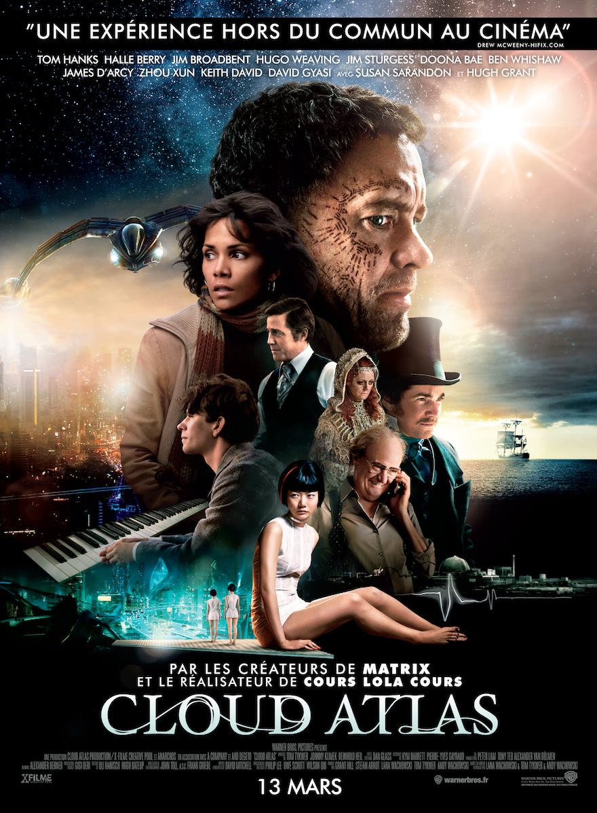
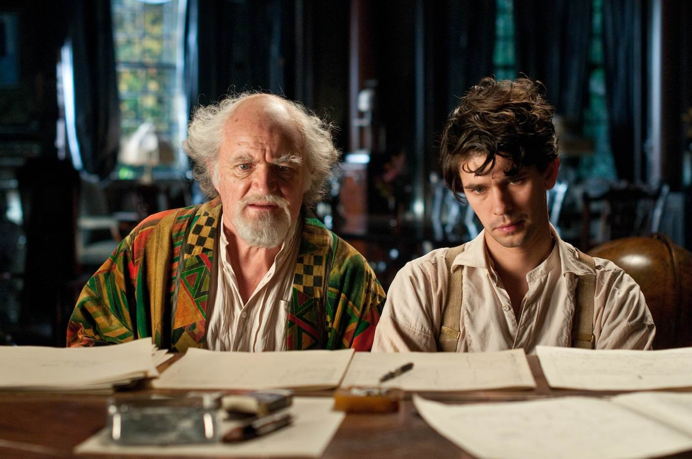
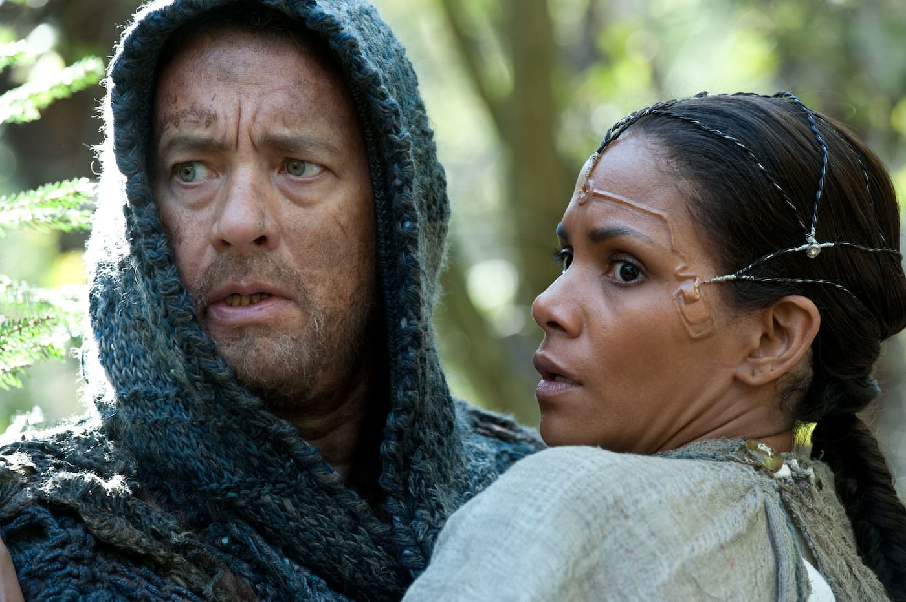
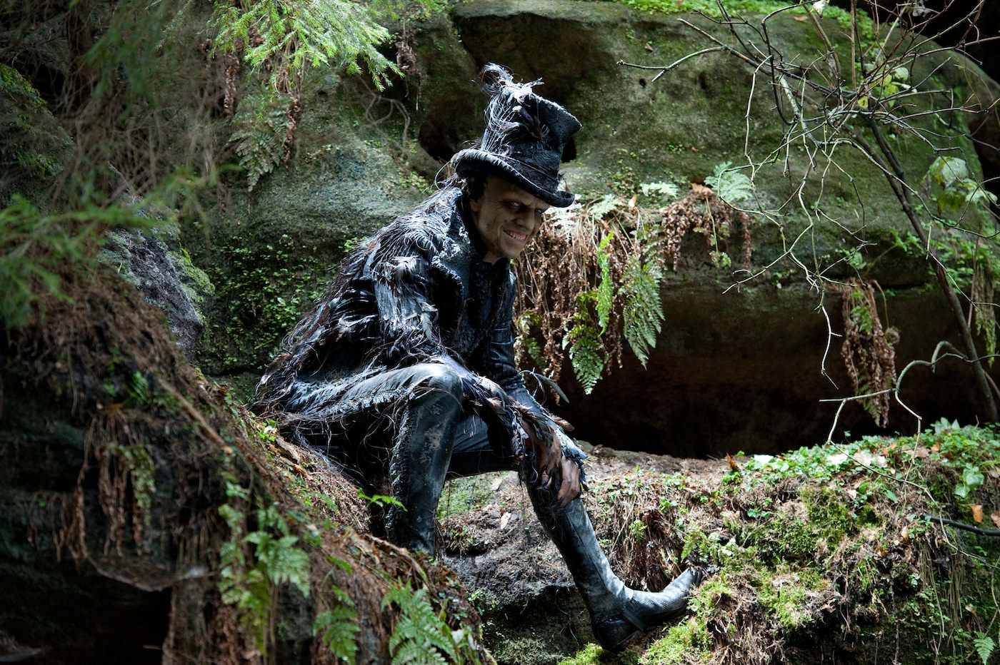

+++
type = "post"
titre = "<em>Cloud Atlas</em>, Lana et Andy Wachowski et Tom Tykwer"
title = "Cloud Atlas, Lana et Andy Wachowski et Tom Tykwer"
url = "/cloud-atlas-wachowski-tykwer"
date = "2013-03-12T01:39:11"
Lastmod = "2013-12-31T17:23:25"
cover = "cloud-atlas-doona-bae-waschowski-tykwer.jpg"
categorie = [ "À voir" ]
tag = [ "Apocalypse", "Blockbuster", "Clonage", "Drame", "Dystopie", "Film choral", "Humour", "Musique", "Science-Fiction", "Société", "Thriller" ]
createur = [ "Andy et Lana Wachowski", "Tom Tykwer" ]
acteur = [ "Bae Doona", "Ben Whishaw", "Halle Berry", "Hugh Grant", "Hugo Weaving", "Jim Broadbent", "Jim Sturgess", "Keith David", "Tom Hanks" ]
annee = [ "2013" ]
weight = 2013
pays = [ "États-Unis" ]

+++

L’affiche prend le soin de prévenir : « <em>Une expérience hors du commun</em> ». C’est bien le moins que l’on puisse se dire quand, sortant de la salle déboussolé, on pense à ce que l’on vient de vivre pendant 2h45 qui passent en un éclair. Avec une ambition folle qui suffit à donner le vertige, Lana et Andy Wachowski ainsi que Tom Tykwer ont réalisé <em>Cloud Atlas</em>, une œuvre plus qu’étonnante où s’entremêlent six histoires totalement différentes en apparence et situées dans des univers spatio-temporels qui n’ont rien de commun. Il a de quoi fuir devant l’ampleur du projet, mais <em>Cloud Atlas</em> est un film extrêmement complexe par sa structure, mais très simple à suivre et à comprendre. Un projet fou, un long-métrage un peu fou aussi, mais un résultat si plaisant que vous ne voulez le rater sous aucun prétexte… 

<small><em>Mieux vaut regarder</em> Cloud Atlas <em>en salle sans rien à lire à son sujet, et revenir après seulement à la suite…</em></small>

<em>Cloud Atlas</em> commence par envoyer six bribes de ses histoires parallèles, une manière de plonger, dès les premières minutes, le spectateur dans ce qui fait la plus grosse originalité du long-métrage. Andy et Lana Wachowski épaulés par Tom Twyker mettent en scène non pas un, mais six films différents et réunis en une seule œuvre. Les personnages sont différents, mais aussi les lieux et même les époques. On découvre ainsi à la suite et sans aucun préambule les histoires d’Adam Ewing, un avocat qui traverse l’océan Pacifique au milieu du XIXe siècle ; de Robert Frobisher, un musicien sans le sou qui aide un compositeur à écrire son œuvre dans les années 1930 ; de Luisa Rey, journaliste sur les traces d’un scandale autour d’une centrale nucléaire dans les années 1970 ; de Timothy Cavendish, éditeur contemporain qui fuit ses créanciers ; de Sonmi -451, une serveuse clonée dans le Séoul du XXIIe siècle et enfin de Zachary, habitant d’une île du Pacifique dans un monde post-apocalyptique. En apparence, ces histoires n’ont absolument rien en commun et cette première séquence introductive qui les fait alterner rapidement est troublante et déboussole facilement. Les personnages se multiplient, mais on retrouve pourtant les mêmes têtes connues… <em>Cloud Atlas</em> commence d’emblée par nous faire perdre la tête. Inutile de paniquer néanmoins, cela ne dure qu’un temps et cette première approche est certainement nécessaire pour accepter la suite. 

Ces histoires en apparence toutes différentes ont pourtant un lien entre elles. De manière très astucieuse, les trois réalisateurs forment peu à peu ces liens, sans jamais en donner trop d’un coup. <em>Cloud Atlas</em> alterne entre les six récits qui avancent parallèlement vers ce qui semble être un climax à chaque histoire. On sent très vite que tout le film et surtout toutes ses composantes tendent vers un même but, mais la bonne idée de Lana et Andy Wachowski et de Tom Tykwer est de ne pas dire vers quoi avant la dernière partie de leur film. Au contraire, ils commencent par esquisser de fausses pistes. Puisqu’il y a une partie futuriste et une autre au-delà, post-apocalyptique, le scandale nucléaire des années 1970 ne pourrait-il pas être lié à une catastrophe qui conduirait à l’apocalypse ? Une hypothèse séduisante un temps, mais qui ne tient pas longtemps, car si <em>Cloud Atlas</em> est un film de science-fiction, ce n’est pas qu’un film de science-fiction. C’est bien cette richesse qui fait toute sa force et le message est finalement beaucoup plus simple que prévu. Il est en fait si simple qu’on ne comprend pas avant la dernière demi-heure, quand tout devient brutalement plus clair. Les spectateurs les plus perspicaces auront peut-être compris avant, mais qu’importe : <em>Cloud Atlas</em> parvient très bien à avancé masqué et à nous divertir de ses histoires pour mieux nous perdre. 

De l’intensité du thriller quand la journaliste Luisa Rey se fait tirer dessus par le tueur à gages envoyé par l’entreprise sur laquelle elle enquête, au drame de la disparition totale du village de Zachary, en passant par l’humour grinçant de la maison de retraite où son frère a enfermé Timothy, l’éditeur endetté. <em>Cloud Atlas</em> avance ainsi, hésitant perpétuellement entre les genres, ou plutôt passant d’un extrême à l’autre en une seconde, à la faveur d’un montage extrêmement rythmé. Toute la partie dans la maison de retraite est à mourir de rire, alors que la séquence dans le XXIIe siècle est plus proche de la tragédie avec cette dystopie qui fait froid dans le dos et cette histoire de serveuse clonée qui découvre l’horreur de l’envers du décor. Cannibalisme, esclavage, homophobie, hommes d’affaires véreux… chaque époque a ses démons qui se répondent et même si l’on rit franchement dans <em>Cloud Atlas</em>, le film reste globalement plutôt sérieux et ne tombe jamais complètement dans la farce. Quand le frère et la sœur Wachoswki et Tom Tykwer intègrent une séquence humoristique, c’est pour mieux créer une rupture avec celle qui suivra, dramatique ou du moins oppressante. 

Dans tous les cas, l’ensemble reste vertigineux, d’autant que <em>Cloud Atlas</em> ne semble jamais forcé. Bien au contraire, le film avance avec un naturel confondant et on se demande nécessairement, la séance terminée, comment on a pu voir une œuvre aussi riche et foisonnante et n’être jamais perdu. Les histoires ne se valent pas toutes évidemment et certaines fonctionnent mieux que d’autres, avec un point d’orgue pour celle du XXIIe siècle, mais aussi celle de Zachary dans un futur plus éloigné encore. Même si certains récits passionnent moins, ce n’est pas gênant, tant le montage les fait alterner rapidement et surtout avec une sensation étrange de légèreté. Le plus frappant avec <em>Cloud Atlas</em>, ce n’est peut-être pas sa construction complexe autour de ces six histoires parallèles, mais plutôt son unité. Loin de n’être qu’un film à sketches comme on en voit parfois, mais où les sketches auraient été répartis un peu au hasard pendant 2h45 pour constituer un nouveau long-métrage, la dernière réalisation de Lana et Andy Wachowski et Tom Tykwer semble toujours parfaitement logique et même naturelle. Avant même que l’on sache très bien pourquoi, les six histoires semblent s’emboiter comme si elles avaient un sens ensemble, même si ce sens reste longtemps obscur. C’est une sensation très forte à mettre au crédit d’une œuvre parfaitement maîtrisée. 

Avec autant de personnages différents, les Wachowski et Tom Tykwer ont réuni autour une belle bande d’acteurs. De fait, les noms s’accumulent sur l’affiche, même si, particularité supplémentaire, ils tiennent tous plusieurs rôles et pour les principaux, ils tiennent un rôle dans chacune des histoires qui compose <em>Cloud Atlas</em>. Parmi eux, Tom Hanks est de tous les tableaux : il interprète Zachary et il a ainsi droit à la première place dans ce récit, mais on le retrouve aussi comme scientifique dans les années 1970, auteur à l’époque contemporaine, docteur maléfique sur le navire du XIXe siècle ou même à la gestion d’un hôtel dans les années 1930. Son visage familier, plus ou moins maquillé, ajoute une unité supplémentaire au film et il en va de même pour tous les acteurs. Halle Berry est également présente dans six rôles différents, et certains acteurs ou actrices se sont totalement travestis, y compris pour changer de sexe. Cela ne fonctionne pas toujours — Doona Bae en Occidentale du XIXe siècle n’est pas crédible —, mais ce mécanisme répété sur toute la durée de <em>Cloud Atlas</em> ajoute encore une touche de mystère et nous force à rester attentifs. Certains sont méconnaissables — Hugh Grant risque bien de créer quelques surprises, tout comme Hugo Weaving — et l’ensemble ressemble à un vaste jeu, comme en témoigne, au début du générique final, le défilé organisé par les trois réalisateurs pour donner la solution, en quelque sorte. 

Pour venir à bout d’un projet si ambitieux, il a fallu de nombreux acteurs et même plusieurs réalisateurs. Ils sont trois à travailler ensemble, même si officiellement ils se sont réparti équitablement les six histoires. On a d’un côté le frère et la sœur, Lana et Andy Wachowski, un duo que l’on connaît bien depuis la <a href="http://voiretmanger.fr/2011/01/02/trilogie-matrix-wachowski/" title="La trilogie Matrix, Andy et Larry Wachowski - À voir et à manger">trilogie <em>Matrix</em></a> et qui se sont certainement régalés ici avec la séquence du XXIIe siècle qui retrouve même certains éléments de cette trilogie, dont quelques scènes d’action réussies. Avec eux, Tom Tykwer qui s’est fait connaître récemment pour <em>Le Parfum</em>, beaucoup moins pour <a href="http://voiretmanger.fr/2010/12/15/drei-tykwer/" title="Drei, Tom Tykwer - À voir et à manger"><em>Drei</em></a>, un cinéaste difficile à cerner qui change d’un genre à l’autre au grès des films… À l’écran, difficile, sinon impossible, de déceler deux styles différents : <em>Cloud Atlas</em> ne semble avoir été réalisé que par une seule personne et même si les séquences ne se ressemblent pas, elles s’assemblent parfaitement. Le montage — saluons ici le travail d’Alexander Berner — fait beaucoup dans cette unité ressentie, mais on imagine le travail nécessaire en amont et la préparation pour ce monstre de cinéma. La musique, un point essentiel dans l’un des récits de <em>Cloud Atlas</em>, a été composée bien avant le tournage et cette <a href="http://www.amazon.fr/gp/product/B009OCR1X4/ref=as_li_ss_tl?ie=UTF8&tag=leblogdenic07-21&linkCode=as2&camp=1642&creative=19458&creativeASIN=B009OCR1X4">bande originale</a> fonctionne extrêmement bien et ajoute beaucoup au film. 

Un tel film avait objectivement des raisons de faire peur, mais à condition de se laisser porter, le résultat est tout simplement bluffant. <em>Cloud Atlas</em> nous emporte pendant 2h45 dans un tourbillon d’histoires parfaitement enchevêtrées, on n’est jamais perdu, mais toujours émerveillé et un peu abasourdi par un tel projet et une telle maîtrise. Andy et Lana Wachowski et Tom Tykwer ont composé un objet filmique difficile à identifier, mais un très beau moment de cinéma, à ne rater sous aucun prétexte. 

<h3>Vous voulez m&rsquo;aider ?<a href="#footnote_0_8817" id="identifier_0_8817" class="footnote-link footnote-identifier-link" title="&Agrave; propos de la publicit&eacute;&hellip;">1</a></h3>
<ul>
<li><a href="http://www.amazon.fr/gp/product/B00C76HRRO/ref=as_li_ss_tl?ie=UTF8&tag=leblogdenic07-21&linkCode=as2&camp=1642&creative=19458&creativeASIN=B00C76HRRO">Acheter le film en Blu-Ray et DVD sur Amazon</a></li>
<li><a href="http://www.amazon.fr/gp/product/B00C76HRFQ/ref=as_li_ss_tl?ie=UTF8&tag=leblogdenic07-21&linkCode=as2&camp=1642&creative=19458&creativeASIN=B00C76HRFQ">Acheter le film en DVD sur Amazon</a></li>
<li><a href="">Acheter ou louer le film sur l&rsquo;iTunes Store</a></li>
</ul>

<ol class="footnotes"><li id="footnote_0_8817" class="footnote"><a href="http://voiretmanger.fr/soutien/">À propos de la publicité…</a> [<a href="#identifier_0_8817" class="footnote-link footnote-back-link">&#8617;</a>]</li></ol>
